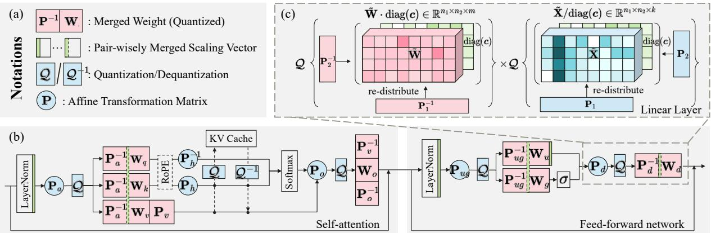
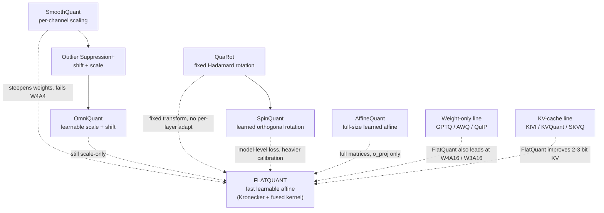
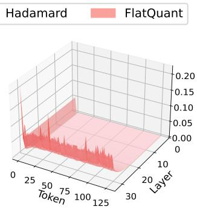
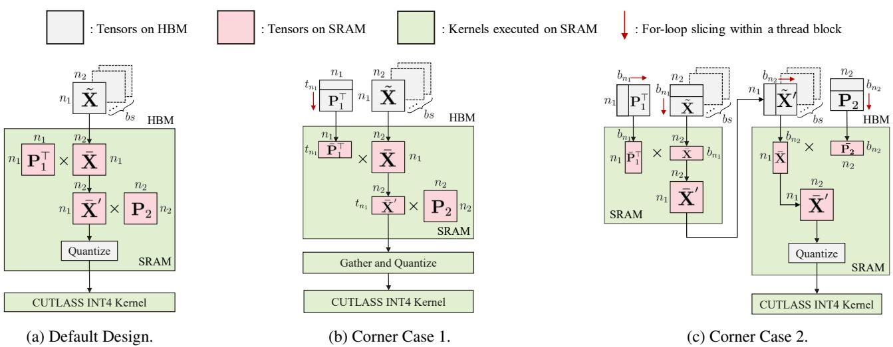
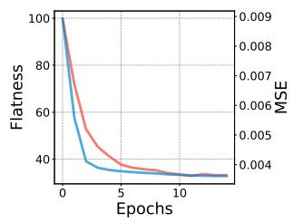
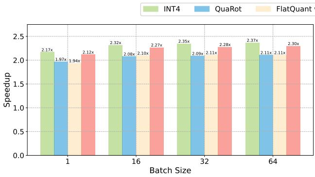
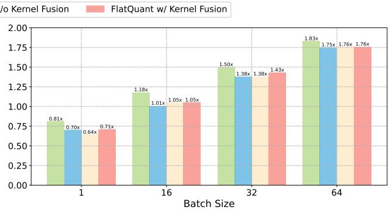

# FlatQuant: Fast Learnable Affine Quantization

**Paper:** FlatQuant: Flatness Matters for LLM Quantization
**Authors:** Yuxuan Sun, Ruikang Liu, Haoli Bai, Han Bao, Kang Zhao, Yuening Li, Jiaxin Hu, Xianzhi Yu, Lu Hou, Chun Yuan, Xin Jiang, Wulong Liu, Jun Yao
**arXiv:** [2410.09426v4 (10 Aug 2025)](https://arxiv.org/abs/2410.09426) · Code: [github.com/ruikangliu/FlatQuant](https://github.com/ruikangliu/FlatQuant)

**Related pages:** [Quantization hub](../index.md) · [NVFP4: Blackwell 4-Bit Floating Point](../nvfp4.md) · [MiniMax M2 GQA W4A4 Quantization Path](../../../frameworks/vllm/minimax-gqa-w4a4-quantization-path.md) · [vLLM Ascend Architecture](../../../frameworks/vllm-ascend/architecture.md)

## TL;DR

**What:** FlatQuant is a post-training quantization method that learns a fast, per-layer affine transformation to flatten weight and activation distributions before low-bit quantization.
**How:** It factors the transformation as a [Kronecker product](../../../terms/kronecker-product.md) of two small matrices, adds per-channel scaling and learnable clipping, calibrates with a block-wise MSE objective, and fuses transform + quantization into a single Triton kernel feeding an INT4 CUTLASS GEMM.
**The number:** W4A4 with plain round-to-nearest drops less than 1% accuracy on LLaMA-3-70B (0.94% on six zero-shot QA tasks), with up to 2.3× prefill and 1.7× decoding speedup over FP16.

## The Big Picture

*Source: [FlatQuant paper, Figure 3](https://arxiv.org/abs/2410.09426). ① Each linear layer learns an invertible affine transform P — factorized as P1⊗P2 — plus per-channel scaling diag(c) and sigmoid-mapped clipping thresholds. ② In a LLaMA layer, the online transformation and quantization (blue) run at every linear input, while merged parameters (red) and merged scaling vectors (green) are absorbed into weights offline so they cost nothing at runtime. ③ For the down projection, diag(c) over the transformed input is merged into the up-projection weight, leaving only the small Kronecker factors online.*

## Why This Exists

Imagine quantizing LLaMA-3-8B to W4A4 with plain round-to-nearest (RTN). WikiText-2 perplexity explodes to **1266.60** — the model is effectively destroyed. The culprit is distribution shape: activations contain a handful of enormous outlier channels, and "pivot tokens" at the start of a sequence carry massive outliers. With equally spaced 4-bit points, the scale must cover the outliers, so ordinary values collapse onto a few usable levels and the quantization error spikes at the first tokens, then propagates layer by layer.

Existing pre-quantization transforms only partially fix this:

- **Per-channel scaling** (SmoothQuant) balances outliers between weights and activations, but it *steepens the weight envelope* — at W4A4 it still fails (210.19 PPL on LLaMA-3-8B).
- **Hadamard rotation** (QuaRot) redistributes outliers across channels, but it uses the *same fixed transform for every layer*, so residual outliers remain and error still compounds.

FlatQuant's bet: **let each layer learn its own affine transformation that actually flattens the distribution**, instead of applying a fixed recipe.

## The Landscape

*Editable source: [flatquant-landscape.mmd](./assets/flatquant-landscape.mmd). The tree reads: the **scaling family** (diagonal, cheap, but cannot flatten weights), the **rotation family** (orthogonal, effective but not layer-adaptive), and the **affine family** (most expressive, but unaffordable at full size until FlatQuant's Kronecker trick). The weight-only and KV-cache lines are orthogonal siblings that FlatQuant also improves.*

## The Core Idea

Quantization error comes from uneven distributions, not from quantization itself. FlatQuant learns, for every linear layer, an invertible affine transformation **P** that flattens the weight and activation distributions *before* quantization, and it makes that transformation cheap enough to run online by factoring it into a Kronecker product of two small matrices. Because the inverse transformation is absorbed into the offline-transformed weights, only the small matrices touch the data at inference — and the whole online path (transform, then quantize) is fused into a single memory-bound kernel.

## Symbol Map

FlatQuant's notation centers on one linear layer, `Y = X Wᵀ`, and the transform P applied before quantization. Superscript `ᵀ` is the transpose; subscripts name where in the Transformer block each transform lives; `X̃`/`W̃` are 3-D reshapes used to apply the Kronecker product.

| Symbol | Human name | Shape / scope | Plain meaning |
|---|---|---|---|
| `X`, `W`, `Y` | activation, weight, output | per linear layer | The layer computation `Y = X Wᵀ` that gets quantized |
| `Q(·)` | quantizer | per tensor | Projects values onto b-bit integer points with step size `s` |
| `P` | learned affine transform | `n×n`, per layer | Invertible matrix that flattens X and W before quantization |
| `P1`, `P2` | Kronecker factors | `n1×n1`, `n2×n2` | Small matrices with `P = P1 ⊗ P2`, `n = n1·n2` |
| `X̃`, `W̃` | reshaped tensors | `k×n1×n2`, `m×n1×n2` | 3-D views that let P act as `P1ᵀ ×1 X̃ ×2 P2` |
| `diag(c)` | per-channel scaling | `n`, per layer | Learnable vector balancing outliers between W and X |
| `α_w`, `α_a` | learnable clipping thresholds | scalar per tensor | Sigmoid-mapped clip levels for weight and activation |
| `Θ` | learnable parameter set | per block | `Θ = {P, c, α_a, α_w}` optimized during calibration |
| `F_l`, `F̂_l` | original / quantized block | per Transformer block | Objective: minimize `‖F_l(X) − F̂_l(X; Θ)‖²` |
| `P_a`, `P_o`, `P_h`, `P_v` | attention transforms | per layer | q/k/v-proj input, o-proj input, key cache, value cache |
| `P_ug`, `P_d` | FFN transforms | per layer | Up/gate input, down-projection input |

## Deep Dive

### The flatness target

**What it does:** Defines "flat" as the property quantization wants: channel magnitudes that are uniform (low kurtosis), plus a quantization-error landscape that does not spike or compound.

**Why it matters:** "Why This Exists" showed that outlier-heavy distributions waste 4-bit levels and spike error at pivot tokens — flatness is precisely the missing property that both prior families only partially deliver.

**How it works:** The paper measures two things. (1) *Weights and activations:* per-channel magnitudes (Frobenius norms) sorted descending should form a horizontal envelope, not a steep curve. (2) *Error landscape:* the mean-squared-error surface across Transformer layers × sequence positions. Figure 2 shows per-channel scaling and Hadamard still spike at pivot tokens and grow across layers; FlatQuant's surface is flat in both directions.

*Source: [FlatQuant paper, Figure 2d](https://arxiv.org/abs/2410.09426). Each surface is divided by FLATQUANT's MSE so values above 1 (red) mean more error than FlatQuant. Per-channel scaling and Hadamard show visible error ridges at early tokens and deeper layers; FlatQuant is the reference at every (layer, token).*

**The intuition:** A flat distribution needs no wasted quantization levels, so the same 4 bits carry far more information.

**A concrete example:** Revisit the LLaMA-3-8B W4A4 case. RTN alone gives PPL 1266.60; once FlatQuant's learned transform flattens the channels, the same RTN quantizer drops to 6.98 — the quantizer never changed, only the distribution feeding it.

**Remember:** Flatness is the *design goal* of FlatQuant, not a side effect.

### Learning the affine transformation

**What it does:** Solves, for each linear layer, for the invertible matrix P that minimizes reconstruction error after quantization.

**Why it matters:** Per-layer learning is what fixes the fixed-transform blind spot of Hadamard rotation (QuaRot) and the diagonal-only limits of per-channel scaling.

**How it works:** FlatQuant targets

$$P^{*} = \arg\min_{P} \left\| Y - Q(XP)\, Q(P^{-1} W^{\top}) \right\|_F^2$$

The transformed weight `P⁻¹Wᵀ` is precomputed offline, so only `XP` runs online. Inverting P is the numerical crux: a direct FP16 inverse leaves off-diagonal `PP⁻¹` errors around `1e-3`, which hurts early training. FlatQuant instead factorizes `P = U Σ Vᵀ` via SVD (orthogonal U, V parameterized by the Cayley map) so `P⁻¹ = V Σ⁻¹ Uᵀ` and the residual drops to `1e-6`, which makes automatic mixed precision (AMP) safe — halving calibration time and memory versus FP32 with nearly identical quality.

**The intuition:** The inverse is folded into the weights before deployment, so the expensive half of the transform disappears at inference.

**A concrete example:** In the LLaMA-3-8B calibration, AMP+SVD reaches 6.98 PPL / 71.23 QA in 0.9 h on ~27.5 GiB, while FP32 direct inversion gets 6.95 / 71.35 in 2.2 h on ~35.4 GiB — AMP+SVD is the default because it is 2.4× cheaper at effectively the same accuracy.

**Remember:** SVD + AMP make the affine transform trainable in hours, not days.

### Kronecker factorization

**What it does:** Replaces the `n×n` matrix P with a Kronecker product `P1 ⊗ P2` of two much smaller matrices.

**Why it matters:** A full P would double per-layer matmul cost, memory traffic, and storage — the exact reason AffineQuant could only afford transforms on a few layers.

**How it works:** Using the vectorization identity `vec(V)(P1 ⊗ P2) = vec(P1ᵀ V P2)`, the transformed computation becomes

$$Q(XP)\,Q(P^{-1}W^{\top}) = Q\left(P_1^{\top} \times_1 \tilde{X} \times_2 P_2\right) \times Q\left(P_1^{-1} \times_1 \tilde{W} \times_2 (P_2^{-1})^{\top}\right)^{\top}$$

where `×_i` contracts the i-th axis of the reshaped tensors. Memory drops by up to `n/2` and compute by up to `√n/2` when `n1 = n2 = √n`. Factor sizes are chosen to minimize `n1 + n2` subject to `n1·n2 = n` (e.g. `(64, 128)` for hidden size 8192). The paper shows PPL is nearly insensitive to factor choice, while speedup peaks at balanced factors — irregular access patterns hurt once `n2` grows past `√n`.

**The intuition:** One big transform is overkill — two small ones that act from each side of the reshaped tensor do the same job for a fraction of the cost.

**A concrete example:** For LLaMA-2-7B (hidden 4096, FFN 11008), all online transforms together are only 2.61% of the FP16 model's FLOPs and add ~3.41 MB of parameters.

**Remember:** This is the systems trick that makes learned affine transforms practical: `O(d²)` storage/cost becomes `O(d)`.

### Per-channel scaling and learnable clipping

**What it does:** Two additive learnable components — a scaling vector `diag(c)` and sigmoid-mapped clipping thresholds `α_w`, `α_a` — that clean up what the transform leaves behind.

**Why it matters:** The ablation shows each contributes: scaling alone adds 0.55 PPL improvement and clipping adds 0.84 on top of the transform.

**How it works:** `diag(c)` is learned before the transform and merged pairwise into the preceding LayerNorm or linear weights, so it costs nothing online. Clipping thresholds live in `(0,1)` after a sigmoid and are trained jointly with P and c. Critically, clipping must come *after* the transformation: the transform redistributes outliers across channels, and only then can clipping remove the residual extremes without destroying information (the inverse transform recovers scale later). Clipping before transformation (RTN-style) gives marginal gains — consistent with prior findings that early activation clipping fails against severe outliers.

**The intuition:** Transform first to spread the outliers, then clip the leftovers — order matters.

**A concrete example:** On LLaMA-3-8B, "LCT before transformation" scores 68.62 QA vs 69.87 for QuaRot-style fixed thresholds vs **71.23** for LCT after transformation — the full FlatQuant pipeline.

**Remember:** Learnable clipping is only effective when it runs on top of the flattened distribution.

### Block-wise calibration

**What it does:** Optimizes `Θ = {P, c, α_a, α_w}` per Transformer block against a lightweight MSE objective on a small calibration set.

**Why it matters:** This is what keeps the whole method "post-training" — hours of calibration instead of retraining, and no label data.

**How it works:** For each block, FlatQuant minimizes `‖F_l(X) − F̂_l(X; Θ)‖²_F`, comparing the full-precision block output to the quantized block's output. Defaults: 128 WikiText-2 sentences × 2048 tokens, 15 epochs, batch size 4, AdamW with cosine decay (lr 5e-3, clipping lr 5e-2), random initialization of P (robust to init). Calibration is stable across WikiText-2, C4, and Pile (PPL 6.98–7.04), and runs in ~1–6 hours on a single GPU across the LLaMA family.

**The intuition:** Fitting block outputs on a few hundred tokens is enough because the method learns an equivalent *transformation*, not new weights.

**A concrete example:** LLaMA-3-8B calibrates in 0.9 h; LLaMA-3-70B in 5.94 h. Weight-only calibration is even shorter (0.70 h for 3-8B) because fewer transforms are involved.

**Remember:** The paper's headline RTN results need no GPTQ — calibration cost is measured in hours on one GPU.

### Transformer integration

**What it does:** Places transforms at each linear input and at the KV cache, per layer, and eliminates most of their runtime cost by merging.

**Why it matters:** A method that works on one linear layer must stay cheap across a whole Transformer block or the accuracy gains never reach deployment.

**How it works:** Six transforms per LLaMA-like block: `P_a` (q/k/v-proj input), `P_o` (o-proj input), `P_h` (key cache, per head), `P_v` (value cache, per head), `P_ug` (FFN up/gate input), `P_d` (down-proj input). Only the large hidden-size transforms (`P_a`, `P_o`, `P_ug`, `P_d`) are Kronecker-decomposed; `P_h`/`P_v` keep full per-head shape because head dims are small. `P_o` and `P_v` are fused (inspired by QuaRot) with no accuracy loss, and `P_d`'s per-channel scaling is merged into the up-projection weight. FlatQuant *preserves LayerNorm* — unlike QuaRot/SpinQuant, which rewrite it as RMSNorm and merge rotations — so each layer can learn a different transform after normalization.

**The intuition:** Place transforms where the outliers are, then absorb everything mergeable into weights so only ~5 small online transforms remain.

**A concrete example:** Per-layer overhead profiling shows all five online transforms cost just 0.07× end-to-end slowdown, versus 0.26× for QuaRot's three Hadamard transforms — the Kronecker factorization pays off per-transform.

**Remember:** Merging is how six transforms become ~five cheap online ones with zero extra per-layer parameters beyond the small factors.

### The fused kernel

**What it does:** Merges the online affine transform and quantization into one Triton kernel, followed by an INT4 CUTLASS GEMM.

**Why it matters:** Both the Kronecker transform and quantization are memory-bound; without fusion, intermediate activations round-trip through HBM and launch overhead multiplies.

**How it works:** The kernel loads the entire `P1` and `P2` into SRAM. Each thread block slices a tiling block `X̄` of the reshaped activation, computes `P1 X̄ P2`, and quantizes on the fly — all intermediates stay in SRAM until the final quantized tile is written to global memory. For huge hidden sizes that overflow SRAM (e.g. `n > 28762` with `n1, n2 > 128` on an RTX 3090), two revised designs tile the non-reduction dimension of `P1`, or split into a two-stage `P1` then `P2` pass. Fusion alone delivers 1.5–3× prefill and 1.2–4× decoding speedup versus unfused transforms.

*Source: [FlatQuant paper, Figure 8](https://arxiv.org/abs/2410.09426). (a) The default design keeps P1, P2, the activation tile, and the transformed intermediate in SRAM and writes only the quantized result. (b) When `n` and `n1` are huge, P1's non-reduction dimension is tiled and quantization runs in a second fused kernel. (c) When both factors are huge, the transform splits into two stages with an intermediate trip to global memory.*

**The intuition:** Fusing a memory-bound transform with a memory-bound quantizer hides both costs behind one pass.

**A concrete example:** On LLaMA-2-7B (bs 64, seq 2048), fused FlatQuant reaches 2.30× prefill / 1.76× decoding vs FP16 — and even *unfused* it matches QuaRot, because the Kronecker factors are so small.

**Remember:** Only the quantized result ever touches global memory; the transform is invisible to the memory system.

### Flatness emerges from training

**What it does:** Closes the loop between the calibration objective and the flatness claim by measuring both during training.

**Why it matters:** It is the paper's direct evidence that "flatness matters" — that the MSE objective discovers flat distributions rather than some other shortcut.

**How it works:** Flatness is measured as the Euclidean distance between each channel-magnitude vector and an idealized perfectly-flat vector with the same L2 norm. During calibration, as the block-MSE loss decreases, this distance shrinks across blocks (Figure 7).

*Source: [FlatQuant paper, Figure 7a](https://arxiv.org/abs/2410.09426). As calibration progresses, the training objective decreases and the channel-magnitude distribution of the 7th Transformer block becomes visibly flatter — flatness is what the objective learns.*

**The intuition:** Minimizing quantization error and maximizing flatness are two views of the same gradient.

**A concrete example:** Figure 7's 7th-block panel starts with a steep envelope and ends nearly horizontal by the end of calibration — the same trajectory the PPL numbers follow.

**Remember:** Flatness is measurable, and FlatQuant's training provably moves that metric.

## Putting It Together

Trace one Transformer block at inference after calibration:

1. **Offline (calibration):** for each block, learn `Θ = {P, c, α_a, α_w}` by minimizing block-output MSE on 128 WikiText-2 sentences; invert P via SVD; fold `P⁻¹` into transformed weights; merge `diag(c)` into preceding LayerNorm/linear weights where possible.
2. **Deploy:** each layer keeps only its small factors `P1`, `P2` (plus per-head `P_h`/`P_v`); `P_o` and `P_v` are fused; `P_d`'s scaling lives in the up-projection weight.
3. **Forward:** the fused Triton kernel loads `P1`, `P2` into SRAM, reshapes X into `X̃`, computes `P1ᵀ X̃ P2`, quantizes on the fly, and writes only the INT4 activation tile to global memory.
4. **GEMM:** the INT4 CUTLASS kernel multiplies the quantized activation by the pre-transformed INT4 weight.
5. **KV cache:** keys and values are transformed per head and quantized (FlashInfer) before storage, so the cache itself is low-bit.
6. **Result:** the block output equals the FP16 output plus a small, flattened quantization error that does not compound across layers.

## What This Buys You

### The headline claim

FlatQuant achieves **less than 1% accuracy drop with simple round-to-nearest W4A4** on LLaMA-3-70B (0.94% QA drop; the paper's abstract reports surpassing SpinQuant by 7.5% on this benchmark), while accelerating prefill up to 2.3× and decoding up to 1.7× versus FP16 — from a few hours of single-GPU calibration.

### How we know: language modeling

WikiText-2 perplexity, W4A4 with RTN weights (Table 1):

| Model | FP16 | SmoothQuant | QuaRot | SpinQuant | FlatQuant |
|---|---:|---:|---:|---:|---:|
| LLaMA-2-7B | 5.47 | 83.12 | 8.56 | 6.14 | 5.79 |
| LLaMA-2-70B | 3.32 | 26.01 | 4.14 | 3.82 | 3.55 |
| LLaMA-3-8B | 6.14 | 210.19 | 10.60 | 7.96 | 6.98 |
| LLaMA-3-70B | 2.86 | 9.60 | 55.44 | 7.58 | 3.78 |

### How we know: zero-shot QA

Six-task average, W4A4 (Table 2):

| Model | FP16 | SpinQuant RTN | FlatQuant RTN |
|---|---:|---:|---:|
| LLaMA-2-7B | 69.79 | 63.52 | 67.96 |
| LLaMA-2-70B | 77.05 | 75.09 | 76.62 |
| LLaMA-3-8B | 73.23 | 66.98 | 71.23 |
| LLaMA-3-70B | 79.95 | 65.66 | 79.01 |

### How we know: latency

*Source: [FlatQuant paper, Figure 4](https://arxiv.org/abs/2410.09426). Left: prefill speedup (seq 2048); right: decoding speedup (256 tokens). With kernel fusion, FlatQuant reaches 2.30× prefill and 1.76× decoding at batch size 64, approaching vanilla INT4 while far exceeding QuaRot.*

LLaMA-3-8B across context lengths (Tables 21–22):

| Stage (batch) | Length | INT4 | QuaRot | FlatQuant |
|---|---:|---:|---:|---:|
| Prefill (bs 1) | 2048 | 2.16× | 1.97× | 2.12× |
| Prefill (bs 1) | 16384 | 1.83× | 1.72× | 1.80× |
| Decode (bs 64) | KV 256 | 1.38× | 1.09× | 1.24× |
| Decode (bs 64) | KV 2048 | 1.78× | 1.72× | 1.76× |

### How we know: beyond dense W4A4

- **Weight-only** (LLaMA-3-8B W4A16): FlatQuant-RTN 6.54 beats RTN (8.70), GPTQ (7.00), AWQ (7.10), and matches QuIP (6.50); at W3A16 it leads clearly (7.78 vs QuIP 7.50).
- **KV-cache-only** (LLaMA-2-7B): at 2-bit K+V, FlatQuant 6.66 PPL vs QuaRot 9.23 — the low-bit advantage is largest where QuaRot degrades fastest.
- **Extreme low-bit** (LLaMA-3-8B W3A3KV3): FlatQuant 10.82 PPL vs QuaRot's 686.54; the paper still recommends 4-bit as the practical balance.
- **Mixed precision:** upgrading the top-5 layers and all down projections to W8A8 pushes QA from 71.23 to 72.18 — FlatQuant composes with layer-wise heterogeneous bit-widths.
- **"Train one, get more":** transforms learned for W4A4KV4 transfer directly to weight-only or KV-only settings with no re-calibration.
- **MoE at scale:** DeepSeek-V3-Base W4A4 keeps C-Eval 89.59 / MMLU 86.32 vs FP8 baselines; DeepSeek-R1 W4A4 scores AIME 73.3.

### The mechanism behind the numbers

The numbers follow directly from the design. Flat distributions keep quantization error small at every layer, so error does not compound — which is why the gap to FP16 stays under 1% on LLaMA-3-70B while QuaRot's fixed Hadamard leaves pivot-token spikes. Because FlatQuant's transforms are Kronecker factors, RTN results already match GPTQ-quality results, so deployments can skip GPTQ calibration entirely. And because the online path is one fused, memory-bound kernel, the speedup tracks how memory-bound the layer is — which is why prefill (matmul-heavy, transform overhead amortized over long sequences) wins most.

### ⚠️ How to read these numbers

- **The speedups are batch-size dependent.** At batch size < 16, decoding is slower than FP16 (less than 1×) because quantization overhead outweighs the KV-cache memory savings. The headline 2.3×/1.76× are at batch 64.
- **The "7.5% over SpinQuant" and "0.94% drop" come from different columns.** The 0.94% is the QA average gap to FP16; the 7.5% is the abstract's summary of beating SpinQuant — don't treat them as the same comparison.
- **The large-table wins are on RTN W4A4; the GPTQ column of Table 1 is close but not identical.** FlatQuant-RTN is the deployment-relevant row because GPTQ is unnecessary.
- **The speedup charts (Figure 4) are LLaMA-2-7B on an RTX 3090**; LLaMA-3-8B numbers (Tables 21–22) are slightly lower but keep the same ranking.

## Where It Breaks

| Failure mode | When it happens | Impact |
|---|---|---|
| Small-batch decoding | Batch size < 16 | Quantization overhead dominates KV-cache savings; speedup drops below 1× |
| Very long contexts | Prefill length → 16k+ | Speedup decays (2.12× at 2048 → 1.80× at 16384) though still > QuaRot |
| Extreme low-bit | W3A3KV3 | Quality drops substantially versus W4A4, even though it far exceeds QuaRot at the same bits |
| Calibration mismatch | Deployment distribution differs from WikiText-2/C4/Pile | Learned transforms may not generalize; robustness tested only across those three datasets |
| FP4-era hardware | MXFP4/NVFP4-native accelerators | FlatQuant targets INT4 only; the paper explicitly leaves newer FP4 formats unexplored |
| Kernel dependency | No Triton/CUTLASS INT4 path on the target accelerator | Latency benefits require the fused kernel; unfused FlatQuant is only parity with QuaRot |
| SRAM overflow | `n > 28762` with `n1, n2 > 128` (RTX 3090) | Falls back to tiled/two-stage kernel designs with extra global-memory traffic |
| AMP numerical issues | Certain models or very low bits | FP32 training may be required, doubling calibration time and +28% memory |

## One Thing to Remember

FlatQuant's claim is distilled in its own title: **flatness matters for LLM quantization**. Learnable per-layer affine transformations — made affordable by a Kronecker factorization and made invisible by a fused kernel — flatten weights, activations, and the quantization-error landscape itself, turning round-to-nearest W4A4 into a <1%-drop, 2.3×-faster recipe that needs only hours of calibration. If you remember one thing, remember that the quantizer never got smarter; the distribution got flatter.

## Go Deeper

- **Read:** [FlatQuant paper (arXiv:2410.09426)](https://arxiv.org/abs/2410.09426)
- **Build on:** [QuaRot](https://arxiv.org/abs/2404.00456), [SpinQuant](https://arxiv.org/abs/2405.16406), [AffineQuant](https://arxiv.org/abs/2403.12544) — the direct baselines; [NVFP4: Blackwell 4-Bit Floating Point](../nvfp4.md) — the FP4 direction FlatQuant leaves open
- **Understand the context:** [Quantization hub](../index.md), [MiniMax M2 GQA W4A4 Quantization Path](../../../frameworks/vllm/minimax-gqa-w4a4-quantization-path.md) (FlatQuant W4A4 deployed on Ascend NPUs), [vLLM Ascend Architecture](../../../frameworks/vllm-ascend/architecture.md), terms for [KV Cache](../../../terms/kv-cache.md), [GEMM](../../../terms/gemm.md), and [Global Memory](../../../terms/global-memory.md)
- **Reproduce:** [github.com/ruikangliu/FlatQuant](https://github.com/ruikangliu/FlatQuant)
