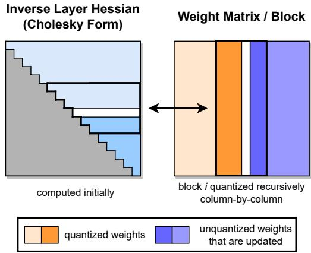
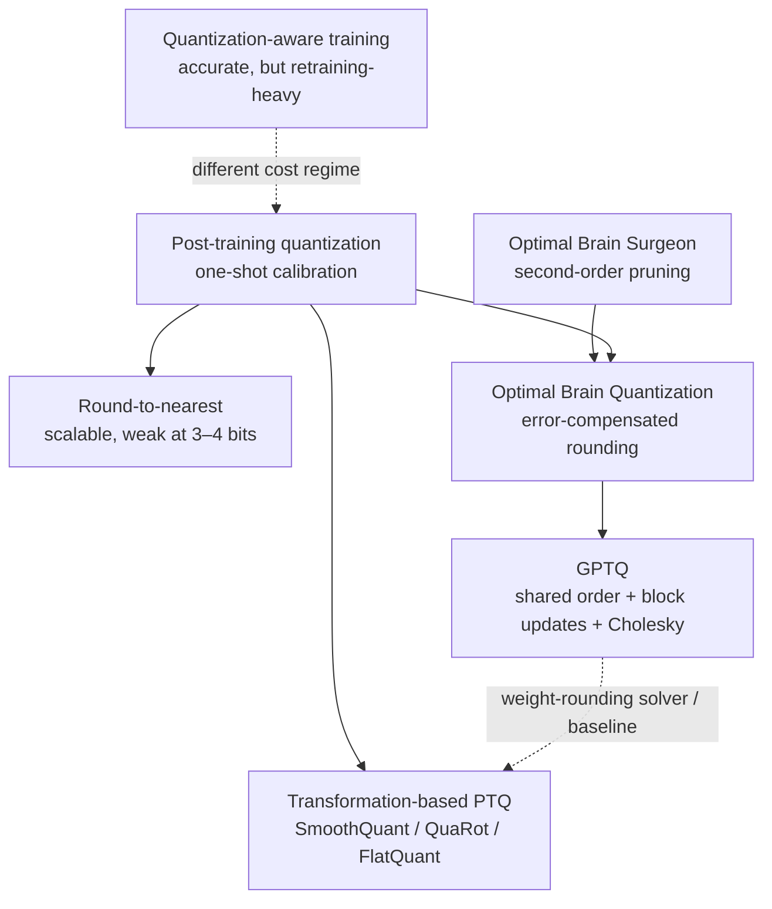

# GPTQ: Second-Order Weight Quantization at LLM Scale

**Paper:** GPTQ: Accurate Post-Training Quantization for Generative Pre-trained Transformers  
**Authors:** Elias Frantar, Saleh Ashkboos, Torsten Hoefler, Dan Alistarh  
**arXiv:** [2210.17323v2 (22 Mar 2023)](https://arxiv.org/abs/2210.17323v2)

**Related pages:** [Quantization hub](../index.md) · [FlatQuant](../flatquant/index.md) · [NVFP4](../nvfp4.md)

## TL;DR

**What:** [GPTQ](../../../terms/gptq.md) is a one-shot [post-training quantization](../../../terms/post-training-quantization.md) algorithm that compresses large language-model weights to 3–4 bits without retraining.  
**How:** It uses activation-derived second-order information to compensate each rounding error, while a common column order, lazy 128-column updates, and a Cholesky reformulation make the procedure fast and numerically stable.  
**The number:** The paper quantizes OPT-175B in 4.2 hours on one A100, then runs its 3-bit form on one 80 GB A100 at 71 ms/token versus 230 ms/token for FP16 on five A100s.

## The Big Picture

*Source: [GPTQ paper, Figure 2](../../../../raw/hardware/gptq-accurate-post-training-quantization--arxiv-2210.17323v2.pdf). ① The inverse layer Hessian is factorized once into the rows GPTQ will need. ② Every weight row follows the same column order. ③ A block is quantized column by column; accumulated error updates the still-unquantized columns after the block completes.*

The figure's key message is that **GPTQ shares expensive curvature information across all output rows**. It preserves the error-correction idea of Optimal Brain Quantization (OBQ) without repeating the inverse-Hessian maintenance separately for every weight.

## Why This Exists

Consider OPT-175B. Its FP16 weights require roughly **326 GB**, so even inference needs several GPUs. Simply rounding every weight to its nearest 3-bit value would fit more easily, but the paper reports catastrophic WikiText-2 perplexity: RTN rises from 8.34 to roughly 7,300. Accurate second-order methods could compensate rounding errors, but OBQ's row-specific greedy order gives a layer with `d_row × d_col` weights an impractical `O(d_row · d_col³)` cost.

The deployment problem is therefore two-sided: **naive rounding is fast but destroys low-bit accuracy; accurate correction is too slow at LLM scale**. GPTQ must retain OBQ-like correction while turning its work into GPU-friendly matrix operations.

## The Landscape

*Editable source: [gptq-landscape.mmd](./assets/gptq-landscape.mmd). GPTQ is the scalable descendant of OBQ's second-order correction line. Transformation-based methods such as FlatQuant address a different source of error—weight and activation distribution shape—and may use GPTQ as a rounding solver or comparison baseline.*

## The Core Idea

When one weight is rounded, do not accept its output error blindly: **slightly adjust the weights that remain in full precision so the layer continues producing nearly the same outputs on calibration examples**. GPTQ makes this practical by forcing every output row to quantize columns in the same order, collecting many small corrections before applying one large update, and precomputing the stable correction directions once.

## Symbol Map

Subscripts identify rows, columns, or the set `F` of weights that are still full precision. A hat marks quantized weights, and `−1` denotes an inverse. The page uses only the symbols needed to follow the correction mechanism.

| Symbol | Human name | Shape / scope | Plain meaning |
|---|---|---|---|
| `W` | full-precision weight matrix | one linear layer | Weights being quantized |
| `X` | calibration activations | input features × sampled tokens | Representative inputs used to measure layer-output error |
| `Ŵ` or `Q` | quantized weight matrix | same shape as `W` | Low-bit output of GPTQ |
| `H = 2XXᵀ` | layer Hessian approximation | input features × input features | Curvature of the layer reconstruction loss, derived only from activations |
| `H⁻¹` | inverse-Hessian information | input features × input features | Tells GPTQ how a rounding error should be redistributed |
| `B` | update block size | 128 columns in the paper | Number of columns processed before one global update |
| `E` | block error matrix | output rows × `B` | Normalized rounding errors accumulated inside the current block |

## Deep Dive

### One shared column order removes row-wise repetition

**What it does:** GPTQ quantizes the same input column next across every output row instead of choosing a separate greedy weight order per row.

**Why it matters:** In the OPT-175B example, row-specific OBQ bookkeeping is the part that makes accurate correction infeasible.

**How it works:** The Hessian depends on `X`, not on a particular row of `W`. When every row follows the same column order, every row has the same remaining-column set `F` and can reuse the same `H_F⁻¹`. This changes the layer cost from `O(d_row · d_col³)` to `O(max(d_row · d_col², d_col³))`, a reduction by `min(d_row, d_col)`.

**The intuition:** Choose one good-enough route through the columns so thousands of rows can share the map.

**A concrete example:** For an OPT-175B projection, GPTQ processes column 0 for all output rows, then column 1, rather than maintaining thousands of different greedy sequences.

**Remember:**

- **The approximation is ordering, not error compensation:** GPTQ keeps second-order corrections but gives up OBQ's per-row greedy choice.

### Lazy block updates turn memory traffic into matrix work

**What it does:** GPTQ accumulates corrections inside a block of 128 columns and applies one global update to later columns.

**Why it matters:** Updating a huge matrix after every rounded column performs few arithmetic operations per memory access and underuses the GPU.

**How it works:** A column's rounding decision depends only on corrections that have reached that column. GPTQ therefore updates the active block immediately, stores normalized errors in `E`, and waits until the block is complete before applying `E` to all remaining columns with a matrix multiplication.

**The intuition:** Keep a tab of small corrections, then settle them in one bulk transaction.

**A concrete example:** Columns 0–127 of the OPT projection are resolved locally; only then does one batched operation update columns 128 onward.

**Remember:**

- **Lazy updates change execution efficiency, not the intended correction result.**

### Cholesky rows prevent correction drift

**What it does:** GPTQ precomputes the needed inverse-Hessian rows through a Cholesky factorization instead of repeatedly downdating the inverse.

**Why it matters:** On billion-parameter models, accumulated numerical error can make the maintained inverse indefinite and send compensation updates in damaging directions.

**How it works:** GPTQ adds damping equal to 1% of the average Hessian diagonal, inverts the damped Hessian, and uses a Cholesky form that exposes the correction row needed at each column. The factorization is performed once using optimized numerical kernels.

**The intuition:** Compute a stable correction schedule once instead of repeatedly editing a fragile inverse.

**A concrete example:** The OPT-175B layer consumes successive Cholesky rows as columns are quantized, avoiding thousands of error-accumulating inverse updates.

**Remember:**

- **Cholesky is both a stability device and an implementation speedup.**

### Dynamic dequantization converts smaller weights into lower latency

**What it does:** A custom kernel reads packed low-bit weights, dequantizes them on demand, and multiplies them by FP16 activations.

**Why it matters:** Fitting OPT-175B on one GPU is useful, but interactive generation also needs lower time per token.

**How it works:** Batch-1 autoregressive decoding is dominated by reading the weight matrix for matrix-vector products. Packed 3-bit weights reduce high-bandwidth-memory traffic enough that the extra dequantization arithmetic is worthwhile; activations remain FP16.

**The intuition:** During decode, moving fewer bytes matters more than avoiding a little unpacking work.

**A concrete example:** The paper's 3-bit OPT-175B occupies about 63 GB, with roughly 9 GB more for the maximum 2,048-token [KV cache](../../../terms/kv-cache.md), and generates at 71 ms/token on one A100.

**Remember:**

- **The reported speedup comes from reduced memory movement, not faster low-bit multiplication.**

## Putting It Together

One OPT-175B linear layer moves through the following states during calibration and deployment:

| Step | Actor | Input state | Action | Output state |
|---:|---|---|---|---|
| 1 | Calibration pass | 128 random C4 segments of 2,048 tokens | Collect layer inputs `X` while loading one Transformer block at a time | Activation samples for the current layer |
| 2 | Curvature setup | `X` and FP16 `W` | Form `H = 2XXᵀ`, add damping, invert, and take the Cholesky form | Stable correction rows |
| 3 | Inner block loop | Next 128 full-precision columns | Quantize each column across all rows and accumulate normalized errors in `E` | Quantized block plus pending correction |
| 4 | Global update | `E` and later FP16 columns | Apply one batched correction to all unquantized columns | Next columns adjusted to preserve layer outputs |
| 5 | Model progression | Quantized Transformer block | Run the block again so the next block sees activations from the partially quantized model | Calibration inputs reflecting accumulated quantization |
| 6 | Decode kernel | Packed 3-bit weights and one FP16 activation vector | Read, dequantize, and multiply on demand | Next-token hidden state with reduced weight traffic |

## What This Buys You

### The headline claim

**GPTQ makes 3–4-bit weight-only quantization accurate and operational at 175B scale**, a regime where direct rounding fails and earlier second-order methods are too slow.

### How we know: accuracy at 175B scale

Lower WikiText-2 perplexity is better. These values are reported in the paper's Table 5.

| Method | Bits | OPT-175B | BLOOM-176B |
|---|---:|---:|---:|
| FP16 baseline | 16 | 8.34 | 8.11 |
| RTN | 4 | 10.54 | 8.37 |
| GPTQ | 4 | **8.37** | **8.21** |
| RTN | 3 | ~7,300 | 571 |
| GPTQ, group size 128 | ~3.15 | **8.45** | **8.26** |

### How we know: quantization and decode cost

| Question | Hardware and workload | Baseline | GPTQ result |
|---|---|---:|---:|
| Quantize OPT-175B | 1× A100 80 GB | — | 4.2 hours |
| Quantize BLOOM-176B | 1× A100 80 GB | — | 3.8 hours |
| Decode OPT-175B | A100, batch 1, 128 generated tokens | 230 ms/token, FP16 on 5 GPUs | **71 ms/token, 3-bit on 1 GPU (3.24×)** |
| Decode OPT-175B | A6000, batch 1, 128 generated tokens | 589 ms/token, FP16 on 8 GPUs | **130 ms/token, 3-bit on 2 GPUs (4.53×)** |

### The mechanism behind the numbers

At 4 bits, second-order compensation almost closes the perplexity gap to FP16, while RTN can still be fragile—especially for OPT. At 3 bits, error compensation becomes decisive: direct rounding collapses, whereas finer 128-weight groups give GPTQ more local scales and bring both 175B models close to baseline. Decode improves because each token reuses the entire model but performs matrix-vector operations with little weight reuse, so compressed weight reads attack the dominant bandwidth cost.

### ⚠️ How to read these numbers

The latency comparisons are **end-to-end configurations with different GPU counts**, not a same-device low-bit arithmetic benchmark. GPTQ's custom kernel dynamically reconstructs weights and reduces memory traffic; the paper explicitly says it does not reduce the multiplication count. The C4 evaluation is also not fully zero-shot because C4 supplies the calibration segments.

## Where It Breaks

| Failure mode | When it happens | Impact |
|---|---|---|
| Weight-only scope | Activations dominate memory, bandwidth, or accuracy sensitivity | GPTQ alone does not quantize them; an orthogonal activation method is needed |
| No low-bit compute reduction | Workload is compute-bound rather than weight-bandwidth-bound | Packed weights may save memory without reproducing the reported decode speedup |
| Calibration mismatch | Deployment activations differ sharply from the 128 random C4 segments | The activation-derived Hessian may compensate the wrong directions; this is an inference beyond the paper's measured domains |
| Evidence tied to older model families | Applying the 2023 results directly to architectures unlike OPT and BLOOM | Accuracy and outlier behavior must be revalidated rather than assumed |
| Extreme bit widths need grouping | Pushing toward 2 bits without smaller quantization groups | Perplexity rises sharply; group scales and zero points also reduce effective compression |
| Kernel and hardware dependence | The packed format lacks an optimized kernel on the target accelerator | Storage savings remain, but latency may regress due to unpacking overhead |

## One Thing to Remember

**GPTQ makes second-order correction shareable.** It accepts one common column order so every output row can reuse the same activation-derived curvature, batches corrections so GPUs can process them efficiently, and stabilizes the whole sequence with Cholesky—turning an accurate small-model quantizer into a practical LLM-scale weight compressor.

## Go Deeper

- **Read:** [GPTQ paper](https://arxiv.org/abs/2210.17323v2) and the [local PDF](../../../../raw/hardware/gptq-accurate-post-training-quantization--arxiv-2210.17323v2.pdf)
- **Build on:** [FlatQuant](../flatquant/index.md) for learnable distribution flattening and W4A4 quantization
- **Understand the context:** [Post-Training Quantization](../../../terms/post-training-quantization.md), [GPTQ glossary entry](../../../terms/gptq.md), and the [Quantization hub](../index.md)
- **Reproduce:** [IST-DASLab/gptq](https://github.com/IST-DASLab/gptq) (the implementation linked by the paper)
