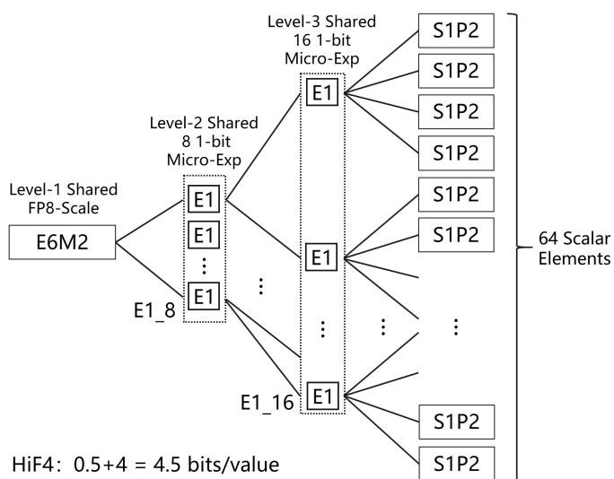
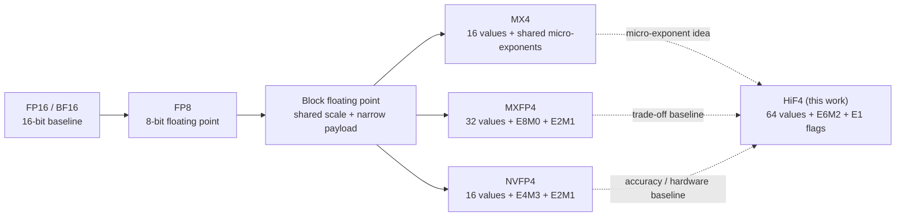
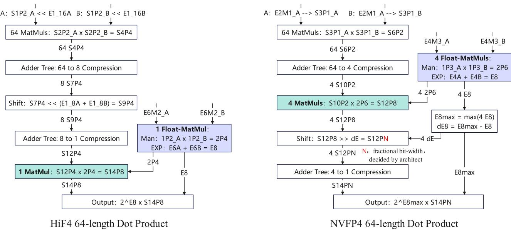
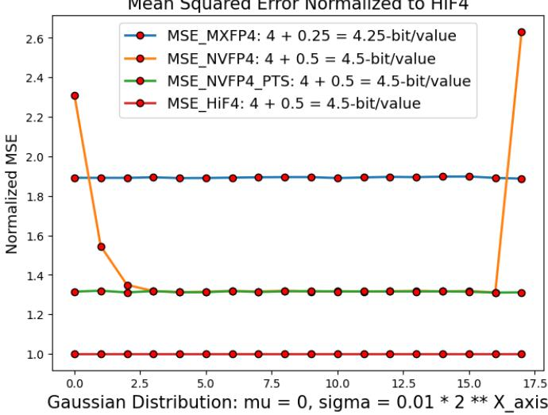

# HiFloat4 (HiF4): 4-Bit Block Floating Point for LLM Inference

**Paper:** HiFloat4 Format for Language Model Inference  
**Authors:** Yuanyong Luo, Jing Huang, Yu Cheng, Ziwei Yu, Kaihua Zhang, Kehong Hong, Xinda Ma, Xin Wang, Anping Tong, Guipeng Hu, Yun Xu, Mehran Taghian, Peng Wu, Guanglin Li, Yunke Peng, Tianchi Hu, Minqi Chen, Michael Bi Mi, Hu Liu, Xiping Zhou, Junsong Wang, Qiang Lin, and Heng Liao (Huawei)  
**arXiv:** [2602.11287v1 (11 Feb 2026)](https://arxiv.org/abs/2602.11287v1)

**Related pages:** [Quantization hub](../index.md) · [MX Formats](../microscaling-mx-formats/index.md) · [NVFP4](../nvfp4.md) · [GPTQ](../gptq/index.md) · [FlatQuant](../flatquant/index.md) · [QuaRot](../quarot/index.md)

## TL;DR

**What:** [HiFloat4 (HiF4)](../../../terms/hif4.md) is a [block floating point](../../../terms/block-floating-point.md) format that stores 64 four-bit S1P2 values with 32 bits of shared scaling metadata, averaging 4.5 bits per value.  
**How:** A wide E6M2 base scale plus 8- and 16-way one-bit micro-exponents preserves both inter-group range and local variation while leaving the dot product mostly integer arithmetic.  
**The number:** On the paper's reported workloads, HiF4 has normalized Gaussian MSE 1.0 versus 1.32 for NVFP4 and 1.89 for MXFP4, while direct-cast means reach 86.42 on DeepSeek-V3.1 and 81.80 on LongCat.

## The Big Picture

*Source: [HiF4 paper, Figure 2](../../../../raw/hardware/hif4-format-for-language-model-inference--arxiv-2602.11287v1.pdf). ① One E6M2 scale supplies the shared global magnitude. ② Eight E1_8 flags add a one-bit power-of-two adjustment to groups of eight values. ③ Sixteen E1_16 flags refine groups of four values. ④ The 64 S1P2 payloads plus 32 metadata bits cost 4.5 bits per value.*

The figure's teaching point is **where HiF4 spends its metadata**: the payload keeps a three-bit significand, while the shared hierarchy supplies the exponent variation that a four-bit scalar cannot carry alone.

## Why This Exists

Imagine a 64-value [inner product](../../../terms/inner-product.md) inside a linear layer. One local region contains small but important values, another contains an outlier, and the tensor as a whole spans a much wider range. A single power-of-two scale either wastes the four-bit payload's range or lets the outlier erase the smaller values. A small floating-point scale can fit the local range more closely, but it adds floating-point work to every short block and may need an additional per-tensor scaling pass.

The paper's concrete stress case is Mistral-7B. Direct-cast NVFP4 falls to a 32.66 mean across eight tasks, including 0.0 on PiQA, while direct-cast HiF4 reaches 72.23 and remains stable. **HiF4 exists to make the same 4.5-bit storage budget cover more range with a payload and datapath that still look close to integer arithmetic.** We reuse this Mistral example in the mechanism and results sections.

## The Landscape

*Editable source: [hif4-landscape.mmd](./assets/hif4-landscape.mmd). The solid path is a synthesized precision lineage; dashed edges mark the prior designs HiF4 compares against or reuses conceptually. The paper's original Figure 1 is a format comparison, while this tree answers the knowledge-base question of how the designs relate.*

## The Core Idea

HiF4 uses **shared exponent structure to protect a richer four-bit payload**. Every group gets one wide base scale, then cheap one-bit local adjustments, so each stored value retains the S1P2/E1M2 payload's three-bit significand instead of spending a payload bit on a per-element exponent. At runtime, the local adjustments can be absorbed as shifts before the 64 products are reduced, leaving only the shared base scales for late floating-point handling.

## Symbol Map

The paper uses `E` and `M` for exponent and mantissa fields. In `SXPY`, `S` is the sign-bit count, `X` is the integer-bit count before the binary point, and `Y` is the fractional-bit count after it. The `_8` and `_16` suffixes identify the number of shared micro-exponents; superscripts `(A)` and `(B)` identify the two operands of a dot product.

| Symbol | Human name | Shape / scope | Plain meaning |
|---|---|---|---|
| `E6M2` | global base scale | 8 bits per 64-value unit | Unsigned FP8 scale with a six-bit exponent and two-bit mantissa; supplies inter-group range. |
| `E1_8` | level-2 micro-exponents | 8 one-bit flags | One flag per eight payload values; each flag contributes a factor of 1 or 2. |
| `E1_16` | level-3 micro-exponents | 16 one-bit flags | One flag per four payload values; refines the local range after `E1_8`. |
| `S1P2_i` | signed four-bit payload | 64 values per unit | Sign-magnitude element with one integer bit and two fractional bits; equivalent to E1M2. |
| `V_i` | represented value | one reconstructed scalar | Product of the base scale, local power-of-two factors, and the S1P2 payload. |
| `Vmax` | global peak magnitude | one per 64-value unit | Maximum absolute BF16 input used to select the base scale. |
| `E6M2_REC` | reciprocal base scale | BF16 conversion value | Hardware-friendly reciprocal of `E6M2`, used while generating flags and payloads. |
| `HiGPTQ` | HiF4-aware PTQ variant | model/layer calibration pass | The paper's lightly modified GPTQ-style post-training quantizer for HiF4. |

| Field | Count | Coverage |
|---|---:|---|
| E6M2 base scale | 1 × 8 bits | All 64 values |
| E1_8 micro-exponents | 8 × 1 bit | Eight values per flag |
| E1_16 micro-exponents | 16 × 1 bit | Four values per flag |
| S1P2 payload | 64 × 4 bits | One payload per value |
| Total | 288 bits | 4.5 bits/value |

## Deep Dive

### The 4.5-bit budget favors a richer payload

**What it does:** HiF4 chooses a three-bit-significand S1P2 payload and amortizes exponent variation across 64 values instead of using an E2M1 payload with finer per-element exponent metadata.

**Why it matters:** In the Mistral-7B example, a format that cannot represent the tensor's range can fail catastrophically even when its nominal storage cost matches HiF4.

**How it works:** The paper compares the main design points as follows.

| Aspect | HiF4 | MXFP4 | NVFP4 |
|---|---:|---:|---:|
| Values per shared unit | 64 | 32 | 16 |
| Four-bit payload | S1P2 / E1M2 | E2M1 | E2M1 |
| Payload significand | 3 bits | 2 bits | 2 bits |
| Scaling metadata | E6M2 + shared E1 flags | E8M0 + 2-bit micro-exponents | E4M3 scale per block |
| Storage | 4.5 bits/value | 4.25 bits/value | 4.5 bits/value |
| Local dynamic range | 4.81 binades | 3.58 binades | 3.58 binades |

HiF4 therefore spends the same average storage as NVFP4 but uses a larger group and two levels of shared one-bit flags. The paper's design claim is not that larger groups are always better; it is that **64 values are large enough to amortize metadata and small enough for the hierarchical flags to follow local variation**.

**The intuition:** Shared control bits buy back the significand precision that a per-element exponent would consume.

**A concrete example:** The Mistral-7B direct-cast comparison is exactly the kind of distribution this tradeoff targets: NVFP4's mean is 32.66, while HiF4's is 72.23 at the same reported 4.5 bits/value.

**Remember:** HiF4's first design decision is `S1P2` precision plus shared exponent variation, not a new four-bit scalar alphabet by itself.

### A wide base scale and two shared flag layers

**What it does:** The three-level hierarchy covers global and local magnitude differences with one E6M2 scale, eight E1_8 flags, and sixteen E1_16 flags.

**Why it matters:** A single group scale must either follow the largest outlier or lose the smaller values; the hierarchy lets different parts of the same 64-value unit use different power-of-two adjustments.

**How it works:** For a non-NaN base scale, the paper reconstructs each value as:

$$
V_i = E6M2 \times 2^{E1\_8[\lceil i/8 \rceil] + E1\_16[\lceil i/4 \rceil]} \times S1P2_i.
$$

The E6M2 scale normalizes the global peak toward the local structure's upper bound. An E1 flag encodes either 0 or 1, so it contributes either a factor of 1 or 2. The paper reports a 4.81-binade local range (0.25 to 7 after the base scale) and a global range of 69 binades for HiF4.

**The intuition:** E6M2 sets the camera's global zoom; each one-bit flag adjusts local exposure without carrying a full exponent.

**A concrete example:** In the same 64-value tile, a group-of-eight whose normalized peak reaches 4 receives its E1_8 flag; a group-of-four that still reaches 2 receives its E1_16 flag. Small values in neighboring groups do not force those flags on.

**Remember:** The hierarchy is shared at three scopes — 64 values, 8 values, and 4 values — rather than one scale per scalar.

### Conversion is a reduction plus cheap flag generation

**What it does:** BF16-to-HiF4 conversion discovers the range with a three-level maximum reduction, then generates fixed-width metadata and payloads through comparisons, reciprocals, and casts.

**Why it matters:** A format that saves compute during GEMM can lose its benefit if every conversion requires a slow software scaling pass. HiF4 is designed so conversion can be fused or implemented with simple hardware primitives.

**How it works:**

| Stage | Input state | Hardware-shaped action | Output state |
|---|---|---|---|
| 1. Peak discovery | 64 BF16 values | Reduce groups of 4 to 16 peaks, then 16 to 8, then 8 to `Vmax` | One global peak plus local peaks |
| 2. Base scale | `Vmax` | Multiply by BF16 `1/7`, cast to E6M2, and obtain `E6M2_REC` | One wide shared scale |
| 3. Flag generation | 8- and 16-level peaks | Multiply-compare against thresholds 4 and 2; factors are only 0.5 or 1 during normalization | `E1_8` and `E1_16` |
| 4. Payload cast | Original BF16 values plus reciprocal and flags | Apply the factors, cast to S1P2, and clamp rounded overflow | 64 four-bit payloads |

The paper proposes a four-entry lookup for the E6M2 reciprocal because only the two-bit mantissa needs lookup, plus fused multiply-compare and multiply-convert instructions. Rounding should use round-half-to-even or round-half-away-from-zero.

**The intuition:** The expensive-looking conversion is mostly a parallel max tree followed by threshold tests and a narrow cast.

**A concrete example:** For the Mistral-7B path, HiF4 can use direct conversion; NVFP4's direct-cast failure is what the paper uses to motivate an additional PTS path for NVFP4.

**Remember:** HiF4's conversion contract is part of the format design; the 4.5-bit number alone does not describe the full deployment cost.

### A 64-wide dot product stays mostly integer

*Source: [HiF4 paper, Figure 4](../../../../raw/hardware/hif4-format-for-language-model-inference--arxiv-2602.11287v1.pdf). ① HiF4 absorbs local micro-exponents into shifted S2P2 operands. ② It reduces 64 integer products through 64-to-8 and 8-to-1 trees. ③ Only the shared E6M2 factors need late floating-point handling; NVFP4 retains four floating-point scale paths.*

**What it does:** HiF4 maps one pair of 64-value units directly onto a 64-length [GEMM](../../../terms/gemm.md) processing element and postpones the shared floating-point scale until the reduction is nearly complete.

**Why it matters:** NVFP4's 16-value units require four pairs to fill the same 64-length processing element, and its floating-point scale handling leaves more multipliers and floating-point accumulation in the path.

**How it works:** The E1 flags are powers of two, so hardware can absorb them as shifts. The shifted S1P2 values become five-bit S2P2 integers; 64 products are accumulated as integers, the local exponents are restored through shifts, and one small floating-point multiplier combines the two E6M2 base scales near the end. The paper says this removes six multipliers relative to its NVFP4 64-length flow.

In the paper's hardware estimate, HiF4 occupies about one-third of NVFP4's incremental area and reduces power by about 10% when added to existing FP16/BF16 and INT8/Float8 dot-product units. These are source-reported estimates, not a public RTL or silicon measurement.

**The intuition:** Keep the 64 products in the cheap integer domain and pay for shared scale alignment once.

**A concrete example:** The same 64-value inner product needs one HiF4 pair but four NVFP4 pairs; that difference is the hardware consequence of group size before any model-level accuracy question is considered.

**Remember:** HiF4's hardware thesis is **late scale application plus one 64-wide integer reduction**, not merely smaller stored values.

### HiGPTQ adds model-aware rounding

**What it does:** HiGPTQ adapts vanilla [GPTQ](../../../terms/gptq.md) to the fine-grained HiF4 structure so calibration can compensate for rounding error after the format has chosen its representable grid.

**Why it matters:** A good numeric format reduces generic quantization error, but different layers still have different sensitivities; format design and model-aware rounding solve different parts of the problem.

**How it works:** The paper states that HiGPTQ is a tailored PTQ method based on vanilla GPTQ with minor modifications to exploit HiF4's hierarchy. It reports the resulting accuracy, but this short paper does not specify enough of the modified solver to reproduce it independently; the page therefore treats HiGPTQ as an experimental extension, not as a fully specified algorithm.

**The intuition:** HiF4 chooses the ruler; HiGPTQ decides which rounding errors are safest for this particular model.

**A concrete example:** On Qwen2.5-14B, direct-cast HiF4 reaches 76.74 mean accuracy, while HiF4+HiGPTQ reaches 77.48 versus a BF16 baseline of 77.24.

**Remember:** HiGPTQ improves the format's model fit, but it is calibration-dependent and less fully specified than the base HiF4 encoding.

## Putting It Together

Follow one 64-value BF16 tile from a linear-layer input to a HiF4 dot product. The same tile is the concrete object throughout the trace.

| Step | Actor | Input state | Action | Output state |
|---:|---|---|---|---|
| 1 | Peak-reduction tree | 64 BF16 values | Compute 16 four-value peaks, reduce them to 8, then take the global maximum | `Vmax`, 16 local peaks, and 8 intermediate peaks |
| 2 | Base-scale converter | `Vmax` | Multiply by `1/7`, convert to E6M2, and look up its BF16 reciprocal | One E6M2 base scale and `E6M2_REC` |
| 3 | Micro-exponent comparators | Local peaks plus `E6M2_REC` | Set E1_8 at threshold 4 and E1_16 at threshold 2 | 8 + 16 one-bit local flags |
| 4 | Payload converter | Original BF16 tile plus base reciprocal and flags | Apply inverse scale factors, round, clamp, and cast to S1P2 | One 4.5-bit/value HiF4 unit: 32 metadata bits + 64 payloads |
| 5 | Matrix processing element | Two HiF4 units | Shift payloads for local flags, multiply 64 integer pairs, and reduce the products | Integer partial sum with local exponent shifts applied |
| 6 | Scale epilogue | Integer partial sum plus the two E6M2 scales | Apply the remaining shared scale near the end of the tree | Reconstructed dot-product contribution to the linear layer |

The paper's LLM experiments then apply this representation to selected linear-layer tensors. Small-model experiments simulate the formats on GPU/NPU paths; the large-model experiments run vLLM with AISBench on Ascend 910B clusters. **No training trace is shown because the paper leaves HiF4 training evaluation to future work.**

## What This Buys You

### The headline claim

HiF4 is presented as a 4.5-bit/value format that improves the accuracy–hardware trade-off over the paper's NVFP4 baseline: it has lower reported quantization error, a simpler 64-length dot-product flow, and higher direct-cast inference accuracy across the tested model families.

### Quantization error and hardware cost

*Source: [HiF4 paper, Figure 3](../../../../raw/hardware/hif4-format-for-language-model-inference--arxiv-2602.11287v1.pdf). ① HiF4 is the normalized 1.0 reference. ② NVFP4 with PTS stays near 1.32 across the tested Gaussian scales. ③ Direct NVFP4 shows overflow/underflow spikes at the limits of its modeled range; MXFP4 stays near 1.89.*

| Metric | HiF4 | Paper's comparison |
|---|---:|---|
| Normalized MSE on Gaussian matrices | 1.00 | NVFP4 1.32; MXFP4 1.89 |
| Average storage | 4.5 bits/value | Same as NVFP4; more than MXFP4's 4.25 |
| Group size | 64 values | NVFP4 uses 16; MXFP4 uses 32 |
| 64-length dot-product incremental area | About one-third of NVFP4 | Source-reported hardware estimate |
| Dot-product power | About 10% lower than NVFP4 | Source-reported hardware estimate |

### LLM accuracy

The following means are the paper's headline averages: eight benchmarks for the small models and ten for DeepSeek-V3.1 and LongCat. The rows are not a single common benchmark suite, so compare within each model family.

| Model (mean accuracy, %) | BF16 | NVFP4 | NVFP4 + PTS | HiF4 | HiF4 + HiGPTQ |
|---|---:|---:|---:|---:|---:|
| LLaMA2-7B | 67.77 | 66.49 | 66.18 | 66.80 | 66.85 |
| LLaMA3-8B | 73.44 | 70.32 | 70.95 | 71.70 | 71.92 |
| Qwen2.5-14B | 77.24 | 76.20 | 76.28 | 76.74 | 77.48 |
| Mistral-7B | 73.52 | 32.66 (crash) | 72.12 | 72.23 | 72.68 |
| DeepSeek-V3.1-671B | 85.44 | 84.81 | 85.24 | 86.42 | — |
| LongCat-560B | 81.32 | 77.49 | 77.81 | 81.80 | — |

*Source: [HiF4 paper, Tables III–V](../../../../raw/hardware/hif4-format-for-language-model-inference--arxiv-2602.11287v1.pdf). The small-model experiments average three seeds on two devices; the large-model results use vLLM and AISBench on 32 or 64 Ascend 910B NPUs.*

### The mechanism behind the numbers

HiF4's accuracy advantage comes from **balancing three scales of error**: S1P2 keeps more significand precision than E2M1, the E1 flags follow local variation, and E6M2 spans a much wider global range than the paper's NVFP4 comparison model. Its hardware advantage comes from the same hierarchy: local powers of two become shifts, while floating-point scale work is deferred and reduced in count.

### ⚠️ How to read these numbers

The paper's MSE experiment uses synthetic Gaussian matrices, and its model experiments simulate the formats for the small models rather than reporting a public native HiF4 kernel. The large-model means are strong source-reported evidence for the tested setup, but they do not prove that HiF4 beats BF16 in general; the small positive differences over BF16 are benchmark averages, not a claim of universally improved model quality.

There is also a comparison-scope boundary. The paper's Table II abstracts NVFP4 with an E4M3 base-scale view and evaluates direct-cast and PTS variants, while NVIDIA's public NVFP4 recipe documents E4M3 micro-block scales plus a separate FP32 tensor scale. **Treat the paper's HiF4-versus-NVFP4 numbers as results under its stated comparison model, not as a complete replacement for the public NVFP4 hardware specification.**

## Where It Breaks

| Failure mode | When it happens | Impact |
|---|---|---|
| Distribution shift | A deployed tensor has heavier tails, different outliers, or non-Gaussian structure than the tested calibration/workload | The reported MSE ratio and accuracy ordering may change. |
| No native HiF4 kernel | Software stores 4.5-bit values but the accelerator does not implement the 64-wide shift/integer reduction path | Memory can shrink without a corresponding throughput or energy gain. |
| Conversion overhead | E6M2 reciprocal, peak reduction, flags, and payload casts are implemented as separate unfused kernels | Quantization or dequantization can erase the GEMM savings. |
| Training use | HiF4 is evaluated for inference; the conclusion explicitly leaves training experiments to future work | Inference accuracy does not establish convergence or gradient stability. |
| Calibration dependence | HiGPTQ is used without representative calibration data, or its undocumented HiF4-specific changes are reimplemented differently | Accuracy improvements may disappear or be difficult to reproduce. |
| Non-finite or degenerate ranges | A block has NaNs or no ordinary positive peak; E6M2 itself has no zero, infinity, or subnormal encoding | The paper's stated NaN behavior is not a complete deployment policy for every edge case. |
| Apples-to-oranges NVFP4 reading | The paper's simplified comparison model is treated as the full NVIDIA recipe | Area, range, and accuracy conclusions can be overgeneralized across implementations. |

> **Evidence:** The paper reports the MSE, area/power, and LLM numbers above, but it does not provide public RTL, a native HiF4 kernel, or a training result in this source.

## One Thing to Remember

**HiF4 is a bit-budget reallocation:** it uses 32 shared metadata bits across 64 values to keep a richer S1P2 payload, let local exponent flags become shifts, and postpone only the shared scale work — a design that the paper argues is simultaneously more accurate and cheaper than its NVFP4 baseline for 4-bit inference.

## Go Deeper

- **Read:** [HiFloat4 paper on arXiv](https://arxiv.org/abs/2602.11287v1) · [local PDF](../../../../raw/hardware/hif4-format-for-language-model-inference--arxiv-2602.11287v1.pdf)
- **Inspect the extraction:** [MinerU-derived Markdown](../../../../derived/pdf-markdown/hardware/hif4-format-for-language-model-inference/hif4-format-for-language-model-inference.md)
- **Understand the predecessor family:** [MX Formats](../microscaling-mx-formats/index.md) · [Microscaling](../../../terms/microscaling.md) · [Block Floating Point](../../../terms/block-floating-point.md)
- **Compare the main competitor:** [NVFP4: Blackwell 4-Bit Floating Point](../nvfp4.md) · [NVFP4 glossary term](../../../terms/nvfp4.md)
- **Understand model-aware PTQ:** [GPTQ](../gptq/index.md) · [Post-Training Quantization](../../../terms/post-training-quantization.md) · [FlatQuant](../flatquant/index.md) · [QuaRot](../quarot/index.md)
- **Reproduce:** The source describes simulated small-model formats and Ascend 910B evaluation, but includes no public HiF4 implementation or native kernel.
