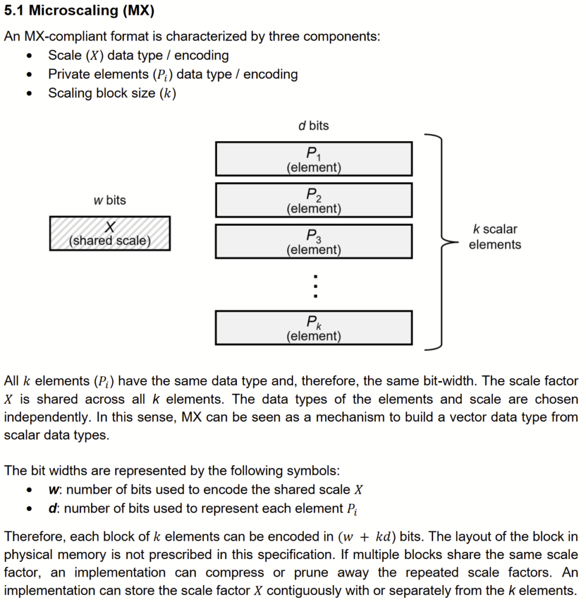
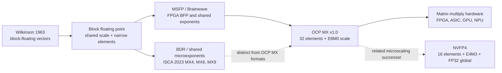

# Microscaling (MX) Formats: Block Floating Point for AI Hardware

**Source:** [FPGA.org: Microscaling (MX) Formats](https://fpga.org/category/microscaling-mx-formats/)
**Author:** Jan Gray
**Published:** 2023-11-27

**Related pages:** [Quantization](../index.md) · [NVFP4: Blackwell 4-Bit Floating Point](../nvfp4.md) · [Spatial GEMM](../../spatial-gemm.md)

## TL;DR

**What:** MX formats turn a vector block into one shared scale plus narrow private elements, reducing the storage and hardware cost of floating-point tensor math.
**How:** The OCP MX family uses 32-element blocks with an 8-bit E8M0 scale and FP4, FP6, FP8, or INT8 elements, while leaving physical layout and some dot-product details to implementations.
**The number:** An MXFP6 block is $32 \times 6 + 8 = 200$ bits, and the source cites FPGA-era Brainwave designs with as many as 96,000 narrow-precision MACs as the hardware motivation.

## The Big Picture

*Source: [FPGA.org: Microscaling (MX) Formats](https://fpga.org/category/microscaling-mx-formats/), reproducing Section 5.1 of the [OCP Microscaling Formats specification](https://www.opencompute.org/documents/ocp-microscaling-formats-mx-v1-0-spec-final-pdf). 1. One scale `X` is shared by 2. `k` same-type scalar elements `P_i`; 3. the encoded block occupies `(w + k*d)` bits, while the specification leaves its physical memory layout open.*

The important boundary is visible in the figure: MX is a vector data type assembled from a scale encoding, a private element encoding, and a block size. It is not simply "FP4" or "FP8" applied independently to every value.

## Why This Exists

Consider one vector [dot product](../../../terms/inner-product.md) implemented with ordinary floating-point elements. Each product has its own exponent, and the reduction tree must repeatedly align products before adding them. Those alignment shifters and normalization steps can dominate a narrow-precision FPGA implementation even when the multipliers themselves are small. A shared block exponent lets the datapath align many products once, while narrow element multipliers map efficiently to LUTs and DSP blocks.

The tradeoff is equally concrete: if a block contains one large value and many small values, the shared scale must cover the block range. MX exists to choose a block size and private element format that make this loss acceptable for tensor workloads while making the data movement and dot-product hardware much cheaper.

## The Landscape

*Synthesized landscape from the captured article and its cited papers. The solid path follows the article's block-floating-point lineage; the dashed edge distinguishes the ISCA 2023 shared-microexponent designs from the later OCP MX Alliance formats and relates OCP MX to the NVFP4 page.*

[Editable Mermaid source](./assets/microscaling-mx-formats-landscape.mmd)

## The Core Idea

MX amortizes exponent metadata across a small block. Instead of paying for a full exponent with every scalar, the format stores one shared scale and spends the saved bits on more element values or cheaper hardware. The same choice also changes the dot product: common scaling removes much of the per-element alignment work, but the standard must still be paired with an implementation policy for layout, multiplication, accumulation, and operations outside the dot product.

## Symbol Map

The article uses `E x M y` to mean one sign bit, `x` exponent bits, and `y` fraction bits; the notation therefore describes a total element width of `1 + x + y` bits. The word "mantissa" appears in the source, but the `M` count is the fraction field rather than the implicit leading bit.

| Symbol | Human name | Shape / scope | Plain meaning |
|---|---|---|---|
| $X$ | shared scale | one per block | Common scale or exponent encoding applied to every element in the block. |
| $P_i$ | private element | one of $k$ elements | Same-type narrow element carrying the block's per-value payload. |
| $k$ | block size | elements per block | Number of private elements sharing $X$; OCP MX uses $k=32$. |
| $w$ | scale width | bits per block | Number of bits used to encode $X$; OCP MX uses 8 bits. |
| $d$ | element width | bits per element | Number of bits used for each $P_i$; the format family selects 4, 6, or 8. |
| `E4M3` | FP8 element encoding | 8-bit scalar | One sign bit, four exponent bits, and three fraction bits. |
| `MXFP4`, `MXFP6`, `MXFP8` | MX floating-point formats | 32-element vector block | OCP MX formats whose private elements are FP4, FP6, or FP8. |
| `MXINT8` | MX integer format | 32-element vector block | OCP MX format whose private elements are signed 8-bit integers. |

Conceptually, reconstruction has the form

$$
v_i = X \cdot \operatorname{decode}(P_i)
$$

The exact product interpretation, accumulation precision, and operation order are implementation choices where the specification is intentionally incomplete.

## Deep Dive

### Shared-scale block encoding

**What it does:** Builds a vector data type from one scale encoding and $k$ same-width private elements.

**Why it matters:** The shared scale is the mechanism that trades per-element exponent storage and alignment logic for a block-level approximation.

**How it works:**

1. Choose a block size $k$, a scale encoding of width $w$, and a private element encoding of width $d$.
2. Find a scale that covers the block's value range and encode it as $X$.
3. Encode each value as a private element $P_i$ relative to $X$.
4. Store or stream the scale and the $k$ elements using any implementation-defined physical layout.

The encoded block costs $w + k d$ bits. OCP MX fixes $w=8$ and $k=32$, but the scale and element encodings remain separate choices.

**The intuition:** Pay for the ruler once, then measure a whole tray of values with it.

**A concrete example:** For MXFP6, one 8-bit scale accompanies 32 six-bit elements, so the block consumes 200 bits instead of 32 independent floating-point records with separate exponents.

**Remember:** MX is a block representation, not a single scalar precision.

### Why common exponents help FPGA dot products

**What it does:** Removes much of the exponent-alignment work from a narrow-precision multiply-accumulate pipeline.

**Why it matters:** In the source's FPGA analysis, multiplication is relatively cheap; the adder tree's alignment shifters, normalization, and extra pipeline stages are the harder resource problem.

**How it works:**

1. Decode the shared block scale once rather than aligning every product from unrelated exponents.
2. Multiply narrow element payloads with LUT- or DSP-friendly circuits.
3. Convert or align products into the chosen accumulation domain.
4. Reduce the products with a fixed-point or other implementation-selected accumulator.

The captured article connects this design to Microsoft's Brainwave architecture, which used shared-exponent MSFP/BFP variants and reported up to 96,000 MACs on a Stratix 10-280 FPGA. It also cites a 90 TOPS ms-fp8 result at 720 GFLOPS/W; those are cited historical results, not measurements performed by this repository.

**The intuition:** Shared exponents move expensive alignment out of the innermost MAC loop.

**A concrete example:** A four-term reduction whose products have unrelated exponents needs a pre-addition shifter at every merge. If the terms share a block scale, the hardware can keep the reduction in a narrower, more regular domain.

**Remember:** The hardware win comes as much from cheaper addition and alignment as from smaller multiplication.

### The OCP MX format family

**What it does:** Standardizes a small set of 32-element block formats for matrix multiplies and convolutions.

**Why it matters:** The family gives hardware and software a common target across vendors while preserving multiple accuracy and cost points.

**How it works:** Every row below uses the same 8-bit scale and 32-element block. The private element type changes the payload width and numerical behavior.

| Format | Private element encoding | Element bits $d$ | Encoded block bits $8 + 32d$ |
|---|---|---:|---:|
| `MXFP4` | `E2M1` | 4 | 136 |
| `MXFP6` | `E3M2` or `E2M3` | 6 | 200 |
| `MXFP8` | `E4M3` or `E5M2` | 8 | 264 |
| `MXINT8` | signed integer | 8 | 264 |

The source cites the accompanying whitepaper's conclusions that MXFP6 can approach FP32 inference after quantization-aware fine-tuning, and that MXFP4 weights with MXFP6 activations and gradients can train with only a minor loss penalty. Those claims depend on the cited workloads and training recipe.

**The intuition:** The block size stays fixed while the element type lets a deployment choose where to spend its bit budget.

**A concrete example:** MXFP4 saves 64 bits per block versus MXFP6, while MXFP6 retains two more bits per element for activations or gradients that are more sensitive to quantization error.

**Remember:** `MXFP4`, `MXFP6`, and `MXFP8` differ in private element encoding; the shared scale and block size stay the same.

### The specification boundary

**What it does:** Defines the common ingredients of an MX-compliant block without fixing every kernel-level decision.

**Why it matters:** A format can be widely adopted while still producing different numerical results across libraries, accelerators, or FPGA cores if their hidden implementation choices differ.

**How it works:** The specification leaves at least three important questions open, according to the captured article:

- the physical in-memory layout of the scale and elements;
- the internal and final precision of an MX dot product, plus the order of accumulation;
- the complete set of required MX operations beyond conversion and dot product.

The article treats this freedom as a portability and reproducibility risk. That is the source author's critique, not a claim that every implementation is incorrect: vendors may need room to map one logical format onto very different CPUs, GPUs, NPUs, and FPGA fabrics.

**The intuition:** OCP standardizes the shape of the envelope, but not the entire machine inside it.

**A concrete example:** Two compliant dot-product units can use different accumulator widths or reduction orders and therefore produce slightly different results for the same MX blocks.

**Remember:** MX compliance does not by itself define a canonical byte layout or bit-exact dot product.

### From FPGA BFP to co-designed AI silicon

**What it does:** Shows how the shared-scale idea moved from FPGA implementations into a broader hardware and model-design story.

**Why it matters:** MX is easier to understand as hardware-software co-design than as an isolated quantization format.

**How it works:** The article's historical path is:

1. Project Catapult established large-scale datacenter FPGA deployment experience.
2. Project Brainwave used FPGA-friendly MSFP/BFP representations, shared exponents, vector parallelism, and specialized reduction networks.
3. Later MSFP work evaluated accuracy and area/energy tradeoffs, including MSFP12 and MSFP16.
4. Commercial FPGA products added hardened or configurable block-floating-point dot-product resources.
5. The ISCA 2023 shared-microexponent work explored a related but distinct BDR design space, including MX4, MX6, and MX9.
6. Microsoft Maia 100 is cited as a later custom accelerator supporting sub-8-bit MX data types.

The article presents this as a perspective on why FPGA constraints can reveal useful ASIC and accelerator design tradeoffs. The causal interpretation is the author's synthesis; the individual projects and cited papers are the direct evidence.

**The intuition:** When the fabric makes ordinary floating point expensive, the data representation becomes part of the architecture.

**A concrete example:** A system may keep weights in MXFP4 and activations in MXFP6, so the accelerator needs an asymmetric input dot product rather than one universal element type.

**Remember:** MX is a joint choice about models, memory, arithmetic, and silicon.

### Compute-flow boundary: MX inside GEMM, wider types around it

**What it does:** Places MX where its shared-scale arithmetic is most useful while keeping wider formats for general vector operations.

**Why it matters:** Treating an MX deployment as "the whole model is 4-bit" hides the conversions and higher-precision operations that make the system usable.

**How it works:**

1. Quantize weights or activations from BF16 or FP32 into MX blocks along the relevant reduction dimension.
2. Feed the blocks to many MX vector dot products inside a [GEMM](../../../terms/gemm.md) or convolution.
3. Accumulate and return a wider result such as BF16.
4. Keep elementwise operations, softmax, and other numerically sensitive paths in BF16 or FP32 where required by the workload.

The source explicitly raises this boundary as an open design question and notes that weights and activations can use different MX representations.

**The intuition:** MX is specialized fuel for the matrix engine, not necessarily the language spoken by every layer around it.

**A concrete example:** MXFP4 weights reduce storage, MXFP6 activations preserve more dynamic information, and BF16 remains the surrounding tensor format after the dot products.

**Remember:** The conversion and accumulation path is part of the format story.

## Putting It Together

Trace one matrix-multiply tile through an MX-enabled accelerator:

1. **Choose the contract:** Select the private element type, the shared E8M0 scale, and the 32-element block size.
2. **Quantize:** Convert a BF16 or FP32 vector into one scale plus 32 private elements for each block.
3. **Move data:** Store the scale and payload in the accelerator's chosen layout; the OCP specification does not prescribe the byte order.
4. **Compute:** Decode the scale, multiply narrow elements, and accumulate each block's contribution with the implementation's chosen internal precision.
5. **Reduce:** Sum block-level dot products into the wider result expected by the matrix-multiply pipeline.
6. **Continue the model:** Run surrounding normalization, softmax, or elementwise work in BF16 or FP32 as required, then quantize the next matrix operand.
7. **Validate the deployment:** Compare accuracy and reproducibility across the exact kernels, accumulation order, and mixed-format choices used in production.

## What This Buys You

### The headline claim

MX makes sub-8-bit tensor math practical by amortizing scale metadata and exponent alignment over a block, allowing hardware to approach integer-like cost while retaining a floating-point dynamic-range mechanism.

### How we know: cited format and hardware evidence

| Evidence in the captured source | What it supports | How to read it |
|---|---|---|
| 32 elements plus one 8-bit scale | 200-bit MXFP6 block | Direct storage arithmetic from the OCP block rule. |
| Brainwave reports up to 96,000 MACs and 90 TOPS ms-fp8 | Shared-exponent FPGA datapath efficiency | Historical architecture results cited by the article, not a current benchmark. |
| MSFP12/MSFP16 area and energy comparisons | Hardware cost can fall at similar accuracy | Results depend on the cited synthesis and model settings. |
| MXFP6 and mixed MXFP4/MXFP6 training claims | Quantization-aware training can recover quality | The whitepaper's workloads and recipe define the result. |

### The mechanism behind the numbers

The gains come from several effects reinforcing one another: the scale is stored once per block, narrow products map to compact multipliers, shared exponents reduce alignment shifters in the reduction tree, and block-level quantization makes memory traffic smaller. Accuracy survives when the block size, element format, calibration, and model workload keep the shared-scale error within tolerance.

### How to read these numbers

These are historical results and source-reported claims from papers, product material, and an expert essay captured in 2026. They should establish the design rationale, not substitute for a current kernel benchmark. In particular, the open accumulation and layout choices mean that two implementations can have different performance and numerical behavior while both claiming MX compatibility.

## Where It Breaks

| Failure mode | When it happens | Impact |
|---|---|---|
| Shared-scale outlier | One element dominates the range of a 32-element block | Smaller values lose effective precision. |
| Format used outside its sweet spot | MX is applied to elementwise, softmax, or other non-GEMM operations without a suitable wider path | Accuracy or throughput can degrade; MX may not be the right representation. |
| Layout ambiguity | Software assumes a universal byte order for MX blocks | Kernels and libraries need format-specific packing and conversion logic. |
| Accumulation ambiguity | Implementations choose different internal precision or reduction order | Results can diverge across devices and libraries. |
| Mixed-format mismatch | Weights, activations, and gradients use incompatible block or element choices | The accelerator needs extra conversion or asymmetric dot-product support. |
| Historical evidence overgeneralized | Brainwave, MSFP, or whitepaper results are treated as universal guarantees | Modern models and hardware may not reproduce the cited accuracy, cost, or throughput. |

## One Thing to Remember

**MX is a block-level contract that turns floating-point tensor math into shared-scale narrow arithmetic:** one scale amortizes metadata and alignment work across 32 elements, but the deployment still has to define layout, accumulation, conversion, and the wider operations around the matrix engine.

## Go Deeper

- **Read:** [FPGA.org: Microscaling (MX) Formats](https://fpga.org/category/microscaling-mx-formats/)
- **Read the specification:** [OCP Microscaling Formats (MX) Specification v1.0](https://www.opencompute.org/documents/ocp-microscaling-formats-mx-v1-0-spec-final-pdf)
- **Read the evaluation:** [Microscaling Data Formats for Deep Learning](https://arxiv.org/abs/2310.10537)
- **Read the related design space:** [With Shared Microexponents, A Little Shifting Goes a Long Way](https://arxiv.org/abs/2302.08007)
- **Understand the newer format comparison:** [NVFP4: Blackwell 4-Bit Floating Point](../nvfp4.md)
- **Understand the hardware context:** [Spatial GEMM](../../spatial-gemm.md)
- **Reproduce:** No local reproduction; this page records the captured article and its cited results.
