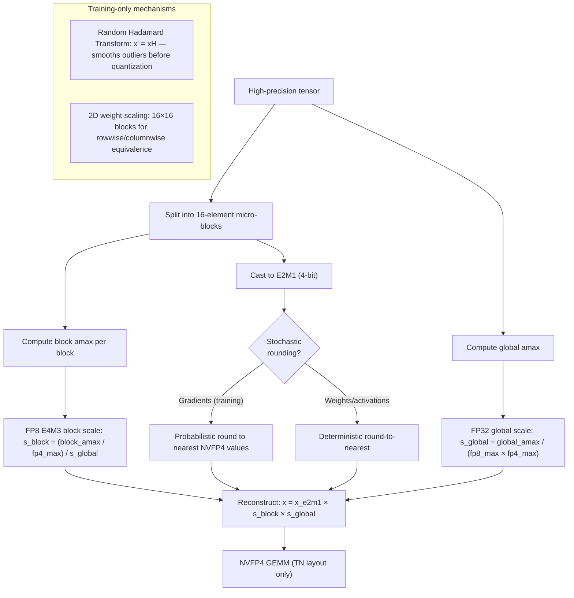
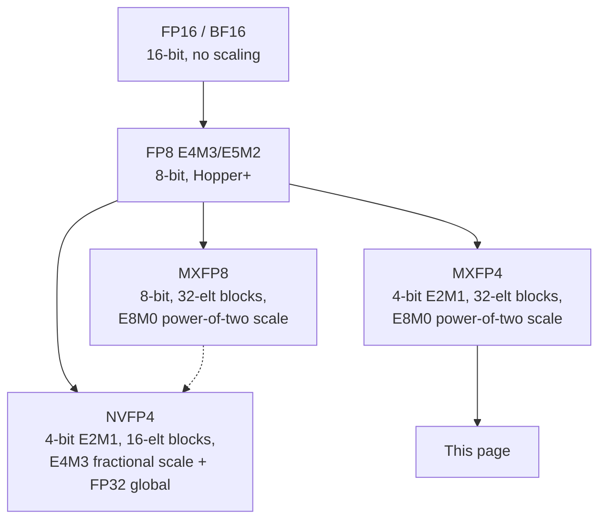

# NVFP4: Blackwell 4-Bit Floating Point

**Sources:** [Transformer Engine 2.19.0.dev0 NVFP4 documentation](https://nvidia.github.io/TransformerEngine/features/low_precision_training/nvfp4/nvfp4.html), [NVIDIA Technical Blog: Introducing NVFP4](https://developer.nvidia.com/blog/introducing-nvfp4-for-efficient-and-accurate-low-precision-inference/) (Eduardo Alvarez, 2025-06-24), and the [NVFP4 paper](https://arxiv.org/abs/2509.25149).

**Related pages:** [FlatQuant: Fast Learnable Affine Quantization](flatquant.md), [FlashAttention-4: Blackwell Attention Kernel Co-Design](../../algorithms/flashattention/flashattention-4.md)

## TL;DR

**What:** NVFP4 is NVIDIA's Blackwell-generation 4-bit floating-point format for inference and training, with a hierarchical two-level scaling scheme — FP8 E4M3 block scales per 16 elements plus an FP32 global tensor scale.
**How:** NVFP4 encodes each micro-block with fractional E4M3 scales (non-power-of-two), cuts block size from 32 to 16 versus MXFP4, and adds training-stability mechanisms: 2D weight scaling, stochastic rounding (hardware-accelerated on Blackwell), and Random Hadamard Transform for outlier smoothing.
**The number:** 3.5× smaller than FP16 and 1.8× smaller than FP8 in memory footprint, with 1 percentage point or less accuracy degradation versus FP8 on DeepSeek-R1-0528 evaluations (AIME 2024 improved by 2pp).

## The Big Picture

*① Tensor enters hierarchical quantization. ② Global FP32 scale is computed from the entire tensor's amax. ③ Tensor is split into 16-element blocks; each block gets its own FP8 E4M3 scale. ④ Values are cast to 4-bit E2M1, with optional stochastic rounding for gradients. ⑤ At dequantization time, the value is reconstructed as the product of all three layers. ⑥ Training adds Random Hadamard Transform and 2D weight scaling for stability.*

## Why This Exists

Imagine running a large language model at FP8 precision. You want to go smaller — 4 bits — to fit larger models in memory, reduce bandwidth pressure, and serve more users per GPU. But raw 4-bit FP4 E2M1 only represents 16 values (roughly ± {0, 0.5, 1, 1.5, 2, 3, 4, 6}). Most tensor values fall between those discrete levels, so naive quantization introduces substantial error that compounds across layers and degrades model outputs.

Before NVFP4, the main 4-bit option was MXFP4, which groups 32 elements and shares a power-of-two E8M0 scale. The problem: when a block contains both a large outlier and a small-but-important value, the power-of-two scale snaps to accommodate the outlier and crushes the small value to zero. Fractional scaling and smaller blocks are the answer.

NVFP4 exists because Blackwell Tensor Cores can accelerate microscaled 4-bit operations natively, making it practical to use finer-grained, higher-precision scales at 4-bit storage cost.

## The Landscape

NVFP4 is the first 4-bit recipe in Transformer Engine. It inherits the microscaling concept from MXFP formats (grouped elements sharing a scale) but makes three improvements: (1) block size halved from 32 to 16, (2) block scale upgraded from power-of-two E8M0 to fractional E4M3, and (3) a second-level FP32 global scale to keep the E4M3 block scales in a usable range.

## The Core Idea

NVFP4 is not "FP4 storage." It is **FP4 values plus FP8 block scales plus an FP32 global scale** — a three-factor reconstruction that lets the 4-bit element encoding capture only the local shape of each 16-value block, while the FP8 scale handles the block's magnitude and the FP32 scale aligns the entire tensor to the representable range. The FP8 scale is the key innovation: it is fractional (non-power-of-two), so it can fit the block's actual distribution rather than snapping to the nearest $2^n$.

## Symbol Map

| Symbol | Human name | Precision | Plain meaning |
|---|---|---|---|
| `x_e2m1` | NVFP4 element value | E2M1 (4-bit) | The stored 4-bit value in each tensor position, range approx. −6 to +6 |
| `s_block` | Block scale factor | FP8 E4M3 | Scale shared by each block of 16 consecutive elements; stored alongside data |
| `s_global` | Global scale factor | FP32 | Single scale per tensor; computed from the tensor's global amax |
| `global_amax` | Global absolute maximum | — | `max(abs(x))` across the entire tensor |
| `block_amax` | Block absolute maximum | — | `max(abs(x))` across one 16-element micro-block |
| `fp8_max` | FP8 E4M3 max | constant (448.0) | Maximum representable value in FP8 E4M3 |
| `fp4_max` | NVFP4 E2M1 max | constant (6.0) | Maximum representable value in NVFP4 |

**Reconstruction formula:**

$$x = x_{e2m1} \times s_{block} \times s_{global}$$

## Deep Dive

### Two-Level Hierarchical Scaling

**What it does:** Decomposes quantization into three factors: a 4-bit element, a per-16-element FP8 scale, and a per-tensor FP32 scale.

**Why it matters:** A single global scale cannot handle a tensor where different regions have different magnitudes. A per-block scale alone cannot handle tensors whose overall range exceeds what FP8 can encode. Two-level scaling solves both.

**How it works:**

1. Compute the global scale from the full tensor:
   $$s_{global} = \frac{global\_amax}{fp8\_max \times fp4\_max}$$
2. For each 16-element block, compute the local scale:
   $$s_{block} = \frac{block\_amax / fp4\_max}{s_{global}}$$
3. Store `s_block` in FP8 E4M3 and `x_e2m1` in 4-bit.

The global scale "normalizes" the tensor so that each block's `block_amax` stays within the representable range of the E4M3 × E2M1 product. The block scale then fine-tunes each group of 16 values.

**The intuition:** Think of the global scale as zooming the entire photograph so it fits on screen, and the block scales as adjusting local contrast in each 16×1 pixel strip.

**A concrete example:** A transformer activation tensor has channel 0 at magnitude ~100 and channel 63 at magnitude ~0.01. Without two-level scaling, a single scale would either overflow channel 0 or underflow channel 63 to zero. The global scale sets the overall range, and each block's scale independently adjusts to its local magnitude.

**Remember:** The FP8 E4M3 block scale is what makes NVFP4 different from MXFP4 — it is **fractional, not power-of-two**.

### Fractional Scaling vs. Power-of-Two (E4M3 vs. E8M0)

**What it does:** Stores block scales in FP8 E4M3 instead of MXFP4's E8M0, enabling non-power-of-two scale values.

**Why it matters:** Power-of-two scales can only double or halve. If the ideal scale for a block is 3.7, E8M0 snaps to 2 or 4, introducing significant error for values near the block maximum. E4M3 can pick 3.75, reducing the quantization error for the block as a whole.

**How it works:**

| Scale format | Possible values (example) | Strengths |
|---|---|---|
| E8M0 (MXFP4) | …, 1, 2, 4, 8, … | Simpler compute, no extra per-tensor scale needed |
| E4M3 (NVFP4) | 0.5, 0.625, 0.75, 0.875, 1, 1.25, 1.5, 1.75, 2, … | Finer fit, lower mean squared error per block |

The NVIDIA blog reports MSE of 0.08 for E4M3 encoding of scales versus 0.72 for E8M0 on an example distribution.

**The intuition:** E8M0 is like measuring with a ruler that only has inch marks. E4M3 is like a ruler with millimeter marks. For a 16-value block, the finer ruler almost always wins.

**Remember:** E8M0 still has its place — it is simpler and adequate for less scale-sensitive tensors. NVFP4 trades the extra complexity of E4M3 + FP32 global scale for higher accuracy.

### Micro-Block Size: 16 vs. 32

**What it does:** Shares each block scale across 16 elements instead of MXFP4's 32.

**Why it matters:** Halving the block size doubles the number of scale factors, letting each scale adapt to a narrower data distribution. Large tensors mix large and small values; narrower blocks reduce the chance that one outlier dominates a block's scale at the expense of smaller values.

**The intuition:** If one value in a 32-element block is 100× larger than the rest, that outlier sets the scale and the other 31 values are crushed toward zero. In a 16-element block, there are half as many victims per outlier.

### 2D Weight Scaling

**What it does:** Applies scaling to 16×16 weight blocks instead of 1D 16-element strips.

**Why it matters:** Weights participate in both rowwise and columnwise [GEMM](../../terms/gemm.md) operands. 2D scaling ensures that the rowwise-quantized and columnwise-quantized views of a weight tensor produce numerically equivalent results — no mismatch between the forward and backward quantization paths.

**How it works:** By default, Transformer Engine uses 2D scaling for weights and 1D scaling for activations and gradients. Set `disable_2d_quantization=True` to force 1D for weights too. The NVFP4 paper provides the detailed derivation.

### Stochastic Rounding

**What it does:** When casting scaled values to 4-bit NVFP4, probabilistically rounds to one of the two nearest representable values rather than always rounding to nearest.

**Why it matters:** Deterministic rounding introduces systematic bias in gradient accumulation during training. Stochastic rounding makes the expected value of the quantized tensor equal to the original, eliminating this bias over many steps.

**How it works:** If the scaled value is 60% of the way from representable value $v_1$ to $v_2$, there is a 60% chance of rounding to $v_2$ and a 40% chance of $v_1$. This is hardware-accelerated via native Blackwell GPU instructions.

- Enabled **only for gradients** by default.
- Disable with `disable_stochastic_rounding=True`.

**Remember:** Stochastic rounding is a training-only mechanism — inference does not need it.

### Random Hadamard Transform

**What it does:** Applies an orthogonal rotation $x' = xH$ to the tensor **before quantization**, where $H = \frac{1}{\sqrt{d}} S_d H_d$ is a product of a diagonal sign matrix and a Hadamard matrix.

**Why it matters:** Outliers — values far from the tensor's mean — are hard to quantize because they stretch the block's dynamic range. RHT rotates the tensor to spread outliers across dimensions, smoothing the distribution and reducing quantization error. It is applied specifically to the operands of the wgrad GEMM (weight-gradient computation), which is the most quantization-sensitive step in training.

**How it works:**

- $H$ is a $16 \times 16$ matrix (tile size $d = 16$) combining a Hadamard matrix $H_d$ (entries $\pm 1$) and a diagonal sign matrix $S_d$ (entries $\pm 1$).
- The sign vector is fixed — computed once at initialization and cached.
- RHT supports BF16 inputs and gradients only.
- The transform is applied in tiles along the last dimension: an $m \times k$ tensor is reshaped to $(mk/d) \times d$ and multiplied by $H$.

**The intuition:** Rotating the coordinate system so that no single dimension carries a spike makes every dimension roughly equally easy to quantize. It is like tilting a tall, narrow histogram into a lower, wider one.

**A concrete example:** Without RHT, the wgrad GEMM sees activation column 7 with value 500 and columns 0-6 with values ~1. The block containing column 7 has its scale dominated by 500, crushing columns 0-6. With RHT, that 500 is spread across all 16 dimensions in the block, so every quantized value carries roughly equal weight.

**Remember:** RHT is applied to the wgrad GEMM operands only — not to all tensors. It is disabled by default only in the sense that you must opt out with `disable_rht=True`.

### GEMM Layout and Columnwise Transpose

**What it does:** NVFP4 GEMM supports only the **TN layout** (transposed A, normal B). Columnwise tensors are stored in transposed layout so that a single rowwise swizzle kernel handles both rowwise and columnwise cases.

**Why it matters:** Unlike MXFP8 which supports TN, NT, and NN layouts, NVFP4's single-layout constraint simplifies the GEMM kernel while the transposed storage trick avoids needing separate columnwise swizzle code.

**Layout summary:**

| Quantization direction | Data layout | Scale shape |
|---|---|---|
| Rowwise | `[A, B]` | `[A, B/16]` |
| Columnwise | `[B, A]` (transposed) | `[B, A/16]` |

Scale tensors are padded for hardware alignment: first dimension to a multiple of 128, second dimension to a multiple of 4.

### Distributed Training

**What it does:** Handles NVFP4 quantization in multi-GPU settings with sequence parallelism and tensor parallelism.

**Why it matters:** Block scales are local (each GPU computes its own), but the global scale must be consistent across GPUs for gathered tensors.

**How it works:**

- **Block scales** (`s_block`): No synchronization needed — each is local to its 16-element block on its GPU.
- **Global scale** (`s_global`): For gathered tensors (e.g., input and gradient in [sequence parallelism](../../terms/sequence-parallelism.md)), an amax [all-reduce](../../terms/all-reduce.md) computes `max(amax_1, amax_2, …)` before quantization.
- **Quantized [all-gather](../../terms/all-gather.md):** Supported — all nodes use the same `s_global`, computed from the synchronized global amax. This is automatically enabled for column-parallel and row-parallel linear layers.

### Swizzling

Block scaling factors are swizzled before GEMM operations (similar to MXFP8). Key differences from MXFP8 swizzling:

| Property | MXFP8 | NVFP4 |
|---|---|---|
| Block size | 32 | 16 |
| Scale format | E8M0 | FP8 E4M3 |
| Columnwise swizzle | Separate kernel | Same rowwise kernel (thanks to transposed layout) |

## Putting It Together

A training forward pass with NVFP4:

① **Pre-quantization:** If training and this is a wgrad operand, apply RHT: $x' = xH$ (BF16 only).

② **Global scale:** Compute `s_global` from the full tensor's amax. If distributed, synchronize amax across GPUs first.

③ **Block scaling:** Split tensor into 16-element blocks. For each block: compute `block_amax`, then `s_block = (block_amax / 6.0) / s_global`. Store `s_block` in FP8 E4M3.

④ **Element casting:** Cast each value to E2M1 (4-bit). For weights, use 2D 16×16 blocks; for activations/gradients, use 1D 16-element strips. If casting gradients, apply stochastic rounding.

⑤ **Swizzle:** Swizzle the block scales for GEMM.

⑥ **GEMM:** Execute NVFP4 GEMM (TN layout only). Columnwise tensors are stored transposed.

⑦ **Reconstruction:** At dequantization, $x = x_{e2m1} \times s_{block} \times s_{global}$.

⑧ **Post-GEMM:** If training, the backward pass uses the same quantized weights and applies RHT + stochastic rounding to gradient operands.

## What This Buys You

### The headline claim

NVFP4 achieves near-FP8 model accuracy at ~1.8× smaller memory footprint, with DeepSeek-R1-0528 showing ≤1 percentage point degradation across seven evaluations and AIME 2024 improving by 2pp.

### How we know: DeepSeek-R1-0528 PTQ results

| Evaluation | FP8 | NVFP4 (PTQ) | Δ |
|---|---|---|---|
| MMLU-PRO | 85% | 84% | −1pp |
| GPQA Diamond | 81% | 80% | −1pp |
| HLE | 15% | 14% | −1pp |
| LIVECODEBENCH | 77% | 76% | −1pp |
| SCICODE | 40% | 40% | 0pp |
| Math-500 | 98% | 98% | 0pp |
| AIME 2024 | 89% | 91% | **+2pp** |

### Memory

NVIDIA reports one 4-bit value plus one FP8 scale per 16 values (about 4.5 bits per element), plus one FP32 global scale per tensor. This yields approximately:

| Baseline | NVFP4 reduction |
|---|---|
| FP16 | ~3.5× smaller |
| FP8 | ~1.8× smaller |

On a GB300 NVL72 rack-scale system (40 TB total memory), this enables larger models and larger batch sizes for test-time scaling workloads.

### Energy efficiency

NVIDIA reports up to 50× better energy efficiency (Joules per token) for Blackwell Ultra versus Hopper H100 on GPT-MoE-1.8T, driven by FP4 precision and architectural improvements.

### The mechanism behind the numbers

NVFP4's accuracy retention comes from three factors working together: (1) fractional E4M3 scales reduce per-block quantization error, (2) 16-element blocks halve the chance of an outlier dominating a block, and (3) the FP32 global scale prevents E4M3's limited range from clipping the tensor. The AIME 2024 improvement is interesting — it suggests that NVFP4's post-training quantization may act as a mild regularizer, slightly improving certain reasoning tasks.

### ⚠️ How to read these numbers

The DeepSeek-R1-0528 results are from post-training quantization (PTQ), not quantization-aware training (QAT). PTQ is the simplest path — apply quantization to a pre-trained model — and represents a lower bound on accuracy. QAT or training from scratch in NVFP4 may yield even better results. The results also reflect a single model family; sensitivity varies by architecture and domain.

## Where It Breaks

| Failure mode | When it happens | Impact |
|---|---|---|
| Outlier-dominated blocks | A single extreme value in a 16-element block | Block scale stretches to accommodate the outlier; all other values lose precision |
| E4M3 range saturation | Tensor amax is so large that even after global scaling, block scales hit FP8 E4M3 max (448) | Block scales clip; values near block maxima are distorted |
| RHT dimension mismatch | Non-BF16 inputs to RHT (FP16 or FP8) | RHT is unsupported; quantization proceeds without outlier smoothing, degrading wgrad accuracy |
| 2D quantization disabled on weights | `disable_2d_quantization=True` without understanding rowwise/columnwise mismatch | Slight numerical inconsistency between forward and backward weight representations |
| Stochastic rounding disabled during training | `disable_stochastic_rounding=True` during training | Systematic gradient bias accumulates, potentially slowing convergence or degrading final accuracy |
| TP-only without SP amax sync | Tensor-parallel deployment without sequence-parallel amax synchronization | Global scales differ across GPUs for gathered tensors; reconstruction is inconsistent |
| Blackwell-only hardware | Deployment on Hopper or older GPUs | NVFP4 GEMM is Blackwell-specific; falls back to FP8 or errors out |
| TN-only GEMM constraint | Code that expects NT or NN GEMM layouts | Must restructure matrix multiplies; not a drop-in replacement for MXFP8 in all pipelines |

## One Thing to Remember

**NVFP4's key distinction from MXFP4 is fractional scaling via FP8 E4M3 block scales on 16-element blocks** — smaller blocks with non-power-of-two scales reduce quantization error, and the hierarchical FP32 global scale adds another layer of dynamic-range precision, all accelerated natively on Blackwell Tensor Cores.

## Go Deeper

- **Read:** [NVFP4 paper](https://arxiv.org/abs/2509.25149) for the full derivation and experimental results
- **Read:** [Transformer Engine NVFP4 documentation](https://nvidia.github.io/TransformerEngine/features/low_precision_training/nvfp4/nvfp4.html) for the latest API and recipe options
- **Read:** [NVIDIA blog: Introducing NVFP4](https://developer.nvidia.com/blog/introducing-nvfp4-for-efficient-and-accurate-low-precision-inference/) for the inference narrative and deployment ecosystem
- **Understand related formats:** [FlatQuant: Fast Learnable Affine Quantization](flatquant.md)
- **Understand the hardware context:** [FlashAttention-4: Blackwell Attention Kernel Co-Design](../../algorithms/flashattention/flashattention-4.md)
- **Deploy:** TensorRT Model Optimizer, LLM Compressor, TensorRT-LLM, vLLM (early NVFP4 support), SGLang (upcoming), Hugging Face prequantized checkpoints

## Practical Takeaways

- Use NVFP4 when Blackwell hardware is available and memory bandwidth or model footprint is the bottleneck.
- Prefer NVFP4 over MXFP4 when accuracy sensitivity makes fractional scaling and 16-element blocks worth the extra scale overhead.
- Treat Transformer Engine's NVFP4 as a **recipe** — scaling, stochastic rounding, RHT, 2D weight quantization, layout constraints, and distributed-training behavior — not merely an E2M1 storage type.
- For inference, start with PTQ via TensorRT Model Optimizer or LLM Compressor; prequantized Hugging Face checkpoints are available for popular models.
- For training, enable 2D weight quantization and RHT (both defaults); consider disabling stochastic rounding only if gradient noise is tolerable.
- Plan for TN-only GEMM layout — factor this into model code that currently uses MXFP8 with NT or NN layouts.
