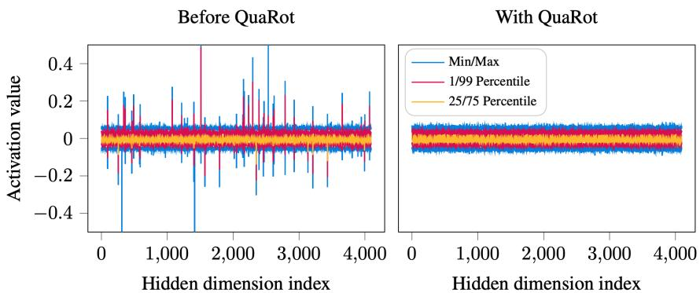
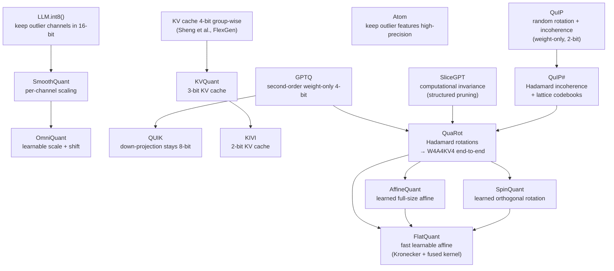
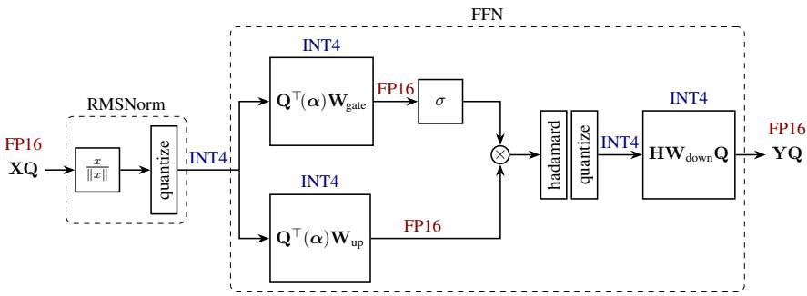
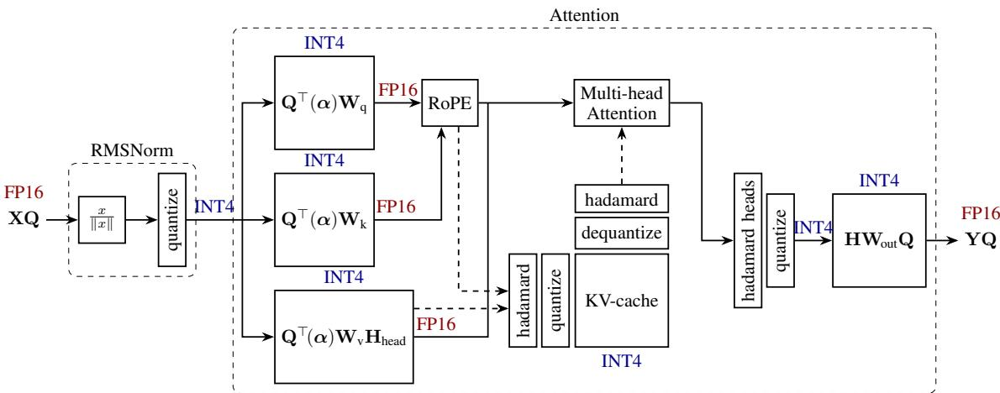

# QuaRot: Outlier-Free 4-Bit Inference in Rotated LLMs

**Paper:** QuaRot: Outlier-Free 4-Bit Inference in Rotated LLMs
**Authors:** Saleh Ashkboos (ETH Zurich), Maximilian L. Croci (Microsoft Research), Bo Li (ETH Zurich), Martin Jaggi (EPFL), Torsten Hoefler (ETH Zurich), Amirkeivan Mohtashami (EPFL), Pashmina Cameron (Microsoft), Dan Alistarh (IST Austria & NeuralMagic), James Hensman (Microsoft Research)
**arXiv:** [2404.00456v2](https://arxiv.org/abs/2404.00456) · Code: [github.com/spcl/QuaRot](https://github.com/spcl/QuaRot)

**Related pages:** [Quantization hub](../index.md) · [GPTQ](../gptq/index.md) · [FlatQuant](../flatquant/index.md) · [NVFP4](../nvfp4.md) · [Kronecker Product](../../../algorithms/kronecker-product.md)

## TL;DR

**What:** QuaRot is a [post-training quantization](../../../terms/post-training-quantization.md) scheme that for the first time quantizes **all** weights, activations, and the [KV cache](../../../terms/kv-cache.md) of an LLM to 4 bits end-to-end — with no channels held back in higher precision.
**How:** It uses the computational-invariance trick from SliceGPT to fuse randomized [Hadamard transforms](../../../terms/hadamard-transform.md) into the weight matrices offline (free at runtime), plus a handful of cheap online Hadamard rotations inside the FFN and attention blocks, so outlier features disappear without changing the model's output.
**The number:** A 4-bit LLAMA2-70B keeps 99% of zero-shot accuracy (≤ 0.47 WikiText-2 perplexity loss), with up to 3.33× prefill speedup and 3.89× decode memory saving on an RTX 3090.

## The Big Picture

*Source: [QuaRot paper, Figure 1](https://arxiv.org/abs/2404.00456). ① The raw model's FFN-input activations (left) are dominated by a handful of outlier channels — a 4-bit grid's scale must cover them, collapsing ordinary values onto a few usable levels. ② After QuaRot's Hadamard rotation (right), the same information is spread evenly across all channels. ③ With outliers gone, a uniform 4-bit grid quantizes every tensor accurately.*

## Why This Exists

Try to quantize LLAMA2-7B activations to 4 bits with plain round-to-nearest. WikiText-2 perplexity explodes from a baseline of **5.47 to over 80** — the model is effectively destroyed. The culprit is the distribution above: activations carry a handful of enormous outlier channels. A symmetric 4-bit grid has only 8 positive levels, so the scale must span the outliers; every ordinary value collapses onto one or two grid points, and the error compounds through the layers.

Prior work patches around the outliers instead of removing them:

- **SmoothQuant** rescales outliers from activations into weights with per-channel factors — but this steepens the weight envelope, and at 4-bit W4A4 it still fails (83.12 PPL on 7B).
- **Atom** and **QUIK** identify outlier channels offline and keep them in higher precision — accurate, but they need complex mixed-precision kernels and still carry extra 8/16-bit features.
- **KV-cache quantizers** (KVQuant, KIVI) show keys and values have their own outliers, requiring feature-wise quantization or non-uniform grids.

QuaRot's bet: **don't manage outliers — rotate them away.** A rotation redistributes each tensor's magnitude across all coordinates, so no single channel dominates, and a plain uniform 4-bit grid suddenly works everywhere.

## The Landscape

*Editable source: [quarot-landscape.mmd](./assets/quarot-landscape.mmd). QuaRot is the union of three lineages: QuIP#'s Hadamard incoherence for weights, SliceGPT's computational invariance, and GPTQ as its weight quantizer. Follow-ups (SpinQuant, AffineQuant, FlatQuant) replace the fixed Hadamard with learned rotations/affine transforms.*

## The Core Idea

**Rotate the model so outliers vanish, then quantize everything with plain grids.** Orthogonal rotations never change what a transformer computes — they can be absorbed into the weights for free — but they completely change how the numbers are distributed: outlier mass spreads evenly across all coordinates. QuaRot applies exactly the rotations needed to make every weight matrix, every activation, and every cached key/value easy to quantize, using just 1½ online Hadamard transforms per transformer layer.

## Symbol Map

QuaRot's notation: `H` always denotes a [Hadamard matrix](../../../terms/hadamard-transform.md) (entries $\pm 1$, scaled to be orthogonal); `Q` is the global randomized Hadamard applied to the hidden state; `Pos` is positional encoding (RoPE); `diag(α)` is the RMSNorm scale vector. Rotations are "fused" into a weight matrix when they are multiplied into the weight offline, versus "online" when applied to activations during the forward pass.

| Symbol | Human name | Shape / scope | Plain meaning |
|---|---|---|---|
| $\mathbf{Q}$ | global rotation | hidden-dim × hidden-dim | Randomized Hadamard fused around each block so inter-block activations are rotated. |
| $\mathbf{H}$, $\mathbf{H}_{d_h}$ | Hadamard matrix | head-dim or hidden-dim | Norm-preserving $\pm 1$ rotation used online or fused into weights. |
| $\tilde{\mathbf{H}} = \mathbf{H}\operatorname{diag}(s)$ | randomized Hadamard | hidden-dim | Hadamard with random sign flips; still orthogonal. |
| $\operatorname{diag}(\boldsymbol{\alpha})$ | RMSNorm scale | hidden-dim diagonal | Absorbed into adjacent weights so rotations commute through normalization. |
| $\mathbf{W}_ {up},\mathbf{W}_ {gate},\mathbf{W}_ {down}$ | FFN projections | hidden × 4·hidden, 4·hidden × hidden | Gated FFN weight matrices (LLAMA-style). |
| $\mathbf{W}_ q,\mathbf{W}_ k,\mathbf{W}_ v,\mathbf{W}_ {out}$ | attention projections | per-head | Query/key/value/output projection matrices. |
| $\mathbf{I} \otimes \mathbf{H}_{d_h}$ | head-wise rotation | Kronecker-structured | Rotates each head independently via one Kronecker multiply. |
| $\operatorname{Pos}(\cdot)$ | positional encoding | RoPE | Applied to Q and K after projection; prevents fusing rotations into $\mathbf{W}_q,\mathbf{W}_k$. |
| $\mathbf{P}_h$ | attention scores | seq × seq per head | Softmaxed QKᵀ for head h. |

## Deep Dive

### Fusing rotations into weights (Stage 1a)

**What it does:** Multiplies every block-boundary weight matrix by the orthogonal matrix $\mathbf{Q}$ (or $\mathbf{Q}^\top$) offline, so the activations flowing between blocks become rotated — and outlier-free — with zero runtime cost.

**Why it matters:** This is what makes QuaRot cheaper than QuIP/QuIP#, which require two online Hadamard transforms per weight matrix. QuaRot needs just **1½ online transforms per layer** because most rotations are baked into the weights.

**How it works:** The computational-invariance theorem (from [SliceGPT](https://arxiv.org/abs/2401.15024)) says: if a weight matrix appears on the input side of a block (e.g. $\mathbf{W}_ {gate}$, $\mathbf{W}_ {up}$, $\mathbf{W}_ q,\mathbf{W}_ k,\mathbf{W}_ v$), multiply it on the left by $\mathbf{Q}$, and cancel this by multiplying the block's output matrix ($\mathbf{W}_ {down}$, $\mathbf{W}_ {out}$) on the right by $\mathbf{Q}^\top$. This works because RMSNorm commutes with rotations:

$$
\operatorname{RMSNorm}(\mathbf{X}) = \operatorname{RMSNorm}(\mathbf{X}\mathbf{Q}^\top)\mathbf{Q}.
$$

So the RMSNorm scale $\operatorname{diag}(\alpha)$ is first absorbed into the adjacent weights; then $\mathbf{W}_k \leftarrow \mathbf{Q}^\top \operatorname{diag}(\alpha)\mathbf{W}_k$ (and similarly for the other input-side matrices). The modified weights are less incoherent — the same effect QuIP# achieves — but with no runtime processing.

**The intuition:** Sliding a rotation "through" a transformer block is like changing the coordinate system of every tensor at once — the math is identical, only the numbers look different.

**A concrete example:** Take LLAMA2-7B's tenth-layer FFN input. Before processing (Figure 1 left), a few channels peak near the outlier range while most sit near zero. After $\mathbf{X} \leftarrow \mathbf{X}\mathbf{Q}$ is fused through the block (Figure 1 right), every channel carries a similar share of the mass — a uniform 4-bit grid now captures all of it.

**Remember:** The global rotation $\mathbf{Q}$ is free at inference time because it is absorbed into the weights offline.

### Rotating FFN activations (Stage 1b)

**What it does:** Inserts one online [Hadamard transform](../../../terms/hadamard-transform.md) inside the FFN, immediately before the down-projection, so the down-projection's input activation is outlier-free.

*Source: [QuaRot paper, Figure 3](https://arxiv.org/abs/2404.00456). ① The hidden state X arrives rotated by Q; the global rotation is canceled by absorbing Qᵀ into the first two weight matrices offline. ② All weights are stored in INT4 and activations just before each weight are quantized per-token to INT4; the TensorCore GEMM accumulates in INT32 before casting back to FP16. ③ One online Hadamard runs in FP16 before the down-projection, whose weight absorbs H, producing a rotated output YQ.*

**Why it matters:** The down-projection multiplies the (very wide) up/gate outputs by $\mathbf{W}_ {down}$; its input activation is where outlier concentration would otherwise destroy 4-bit accuracy. The rotation is reversed by fusing $\mathbf{H}$ into $\mathbf{W}_ {down}$.

**How it works:** The down-projection weight becomes $\mathbf{H}\mathbf{W}_{down}\mathbf{Q}$ (the global $\mathbf{Q}$ on the right, the new $\mathbf{H}$ on the left). At runtime: activations arrive already rotated by $\mathbf{Q}$, the online Hadamard $\mathbf{H}$ is applied once (fast Walsh-Hadamard, ~$O(d\log d)$), and then the quantized matmul runs against the fused weight. The online transform adds at most **7% overhead**.

**The intuition:** One small rotation inside the block fixes the one activation that the offline fusion couldn't reach.

**A concrete example:** Continuing the LLAMA2-7B layer-10 trace: after $\mathbf{W}_ {up}$/$\mathbf{W}_ {gate}$ produce the 4×-wide activation, its rows still have outliers; the online $\mathbf{H}$ redistributes them, then the INT4 down-projection GEMM runs with clean inputs.

**Remember:** 1½ online transforms per layer = one in the FFN (down-projection), plus half from the attention module below.

### Rotating attention values (Stage 1c)

**What it does:** Rotates value vectors head-wise so the KV-cache values become quantizable, using a Kronecker-structured Hadamard $\mathbf{I} \otimes \mathbf{H}_{d_h}$.

*Source: [QuaRot paper, Figure 6](https://arxiv.org/abs/2404.00456). ① The RMSNorm scaling α is absorbed into the input weight matrices and the hidden state is rotated by Q as in the FFN block. ② Value vectors are rotated head-wise (fused into W_v / W_out), while keys and queries are rotated online after RoPE so the cached K and V can be stored quantized. ③ Colored labels show the bit-width of each flow; dashed lines show the flow to and from the 4-bit KV cache.*

**Why it matters:** The value projection is exactly like the FFN: $\mathbf{W}_ v$ feeds the head outputs and $\mathbf{W}_ {out}$ consumes them, so the same fuse-and-cancel trick applies — but now per head, because attention concatenates heads.

**How it works:** Attention output can be written as $\mathbf{Y} = \sum_ h \mathbf{P}_ h \mathbf{X}\mathbf{W}_ v^{(h)}\mathbf{W}_ {out}^{(h)}$. Because $\mathbf{W}_ v^{(h)}$ and $\mathbf{W}_ {out}^{(h)}$ are multiplied together within each head, we can multiply $\mathbf{W}_ v^{(h)}$ on the right by $\mathbf{H}_ {d_ h}$ and $\mathbf{W}_ {out}^{(h)}$ on the left by the same matrix — the product is unchanged. Since heads are concatenated in the weight representation, this is a single Kronecker multiply:

$$
\mathbf{W}_v \leftarrow \mathbf{W}_v(\mathbf{I}\otimes\mathbf{H}_{d_h}), \qquad
\mathbf{W}_{out} \leftarrow (\mathbf{I}\otimes\mathbf{H}_{d_h})\mathbf{W}_{out}.
$$

To complete a full Hadamard shared across heads, QuaRot additionally applies $(\mathbf{H}_ {n_ h}\otimes\mathbf{I})$ to $\mathbf{W}_ {out}$ and inserts an online "Hadamard heads" block computing $\mathbf{Z} \leftarrow \mathbf{Z}(\mathbf{H}_ {n_ h}\otimes\mathbf{I})$ — cheap via a reshape plus Walsh-Hadamard. This works when head count $n_ h$ and head dim $d_ h$ are both powers of two, using the identity $\mathbf{H}_ {n_ h\times d_ h} = (\mathbf{I}\otimes\mathbf{H}_ {d_ h})(\mathbf{H}_ {n_ h}\otimes\mathbf{I})$.

**The intuition:** Attention's concat-and-project structure means one Kronecker rotation "per head" is really one structured rotation over the whole tensor.

**A concrete example:** LLAMA2-7B has 32 heads × 128-dim; $\mathbf{I}\otimes\mathbf{H}_{128}$ rotates each head's value vectors identically, and the online heads block spreads mass across the 32 heads — after both, cached values quantize cleanly to 4-bit.

**Remember:** Value rotation is **fully offline** (fused into $\mathbf{W}_ v$ and $\mathbf{W}_ {out}$); only the cross-head block is online.

### Rotating keys (Stage 1d)

**What it does:** Rotates query and key vectors online, head-wise, so the cached keys — which have their own outliers — become quantizable without touching the RoPE positional encoding.

**Why it matters:** Keys and queries interact through the softmax scores $\mathbf{P}_h$, so rotating both by the same matrix leaves $\mathbf{P}_h$ unchanged. Unlike values, RoPE (`Pos`) is applied **after** the key projection, so the rotation cannot be fused into $\mathbf{W}_k$ — it must be online.

**How it works:** QuaRot applies $(\mathbf{I}\otimes\mathbf{H}_{d_h})$ to the post-RoPE queries and keys:

$$
\mathbf{Q} \leftarrow \operatorname{Pos}(\mathbf{X}\mathbf{W}_q)(\mathbf{I}\otimes\mathbf{H}_{d_h}), \qquad
\mathbf{K} \leftarrow \operatorname{Pos}(\mathbf{X}\mathbf{W}_k)(\mathbf{I}\otimes\mathbf{H}_{d_h}).
$$

Both are rotated identically, so the attention scores are unchanged. QuaRot chooses **Post-RoPE caching**: rotate each key after RoPE before storing it in the cache, so at decode time only the single new query token needs a Hadamard transform (a Pre-RoPE scheme would rotate every cached key per step instead).

**The intuition:** Rotate both sides of a dot product and the dot product doesn't change — so keys can be cached already-rotated and already-quantized.

**A concrete example:** At decode step 2048, one query vector gets one Hadamard transform, then attends over 2047 cached 4-bit keys; because both were rotated with the same $\mathbf{I}\otimes\mathbf{H}_{d_h}$, the scores are identical to FP16.

**Remember:** Key rotation is the **only** rotation that must happen online per token — and Post-RoPE caching keeps it to a single vector per step.

### Quantizing everything (Stage 2)

**What it does:** After the rotations, quantizes weights with [GPTQ](../../../terms/gptq.md) (or plain round-to-nearest), activations per-token symmetric, and the KV cache asymmetric with group size 128.

**Why it matters:** The rotations make quantization trivial — a plain uniform grid suffices — which is exactly why QuaRot needs no mixed-precision kernels and no calibration for the 6/8-bit cases.

**How it works:** Weights use per-column symmetric 4-bit with a clipping ratio found by a linear search over squared error (GPTQ). Activations use per-token symmetric quantization: each token row is divided by $\max \lvert x \rvert / 7$ (7 = largest INT4 value) then rounded; GEMM runs on TensorCores in INT32, then is cast and scaled back to FP16. The KV cache uses asymmetric quantization with group size 128 and clipping ratio 0.95. Quantized attention keeps queries in FP16 and reuses FlashAttention's online softmax; the cache is dequantized on load and the dot product runs in FP16.

**The intuition:** Rotation moved the difficulty out of the numbers; the quantizer is now just a straightforward `scale → round → store`.

**A concrete example:** The same LLAMA2-7B layer: its INT4 weights are loaded once, each incoming activation row is scaled/rounded on the fly, the INT32 GEMM result is cast back to FP16, and the rotated-then-quantized keys/values are stored in the 4-bit cache — all with plain per-token/per-group grids.

**Remember:** QuaRot is agnostic to the weight quantizer — GPTQ by default, but round-to-nearest alone is already lossless at 6 and 8 bits.

## Putting It Together

One LLAMA2-7B transformer layer, one token, full pipeline:

| Step | Actor | Input state | Action | Output state |
|---:|---|---|---|---|
| 1 | RMSNorm | hidden $\mathbf{X}$ (already rotated by global $\mathbf{Q}$) | normalize, scale $\alpha$ absorbed into weights | normalized $\mathbf{X}$ |
| 2 | $\mathbf{W}_ {gate}$, $\mathbf{W}_ {up}$ | FP16 $\mathbf{X}$ | quantize per-token → INT4, INT4 GEMM (fused $\mathbf{Q}^\top$ weights) | FP16 gate/up signals, outlier-free |
| 3 | activation (SiLU) | gate × up | elementwise gate | FP16 activation |
| 4 | online Hadamard $\mathbf{H}$ | wide activation | fast Walsh-Hadamard | rotated activation |
| 5 | $\mathbf{W}_{down}$ | rotated activation | quantize → INT4, INT4 GEMM (fused $\mathbf{H}\mathbf{W}_{down}\mathbf{Q}$) | FP16 output $\mathbf{YQ}$, rotated |
| 6 | attention Q/K/V | $\mathbf{X}$ | per-token quantize, INT4 GEMMs; online $(\mathbf{I}\otimes\mathbf{H}_{d_h})$ on Q, K after RoPE | rotated Q, rotated K, rotated V |
| 7 | KV cache | — | asymmetric-quantize K,V (group 128) and store | 4-bit cached K,V |
| 8 | attention output | rotated Q × cached K,V | quantized FlashAttention (online softmax), dequantize on load | FP16 head outputs |
| 9 | "Hadamard heads" block + $\mathbf{W}_ {out}$ | head outputs | online $(\mathbf{H}_ {n_ h}\otimes\mathbf{I})$, then INT4 GEMM (fused $\mathbf{H}\mathbf{W}_ {out}$) | FP16 block output, rotated by $\mathbf{Q}$ |

The block output is again rotated by the same $\mathbf{Q}$ that the next block's fused weights expect — so the invariant "all inter-block activations are rotated" holds layer after layer, and every GEMM along the way runs in 4 bits.

## What This Buys You

### The headline claim

QuaRot is the first end-to-end **W4A4KV4** scheme: all weights, activations, and KV cache in 4 bits, with at most 0.47 WikiText-2 perplexity loss and 99% zero-shot accuracy retention on LLAMA2-70B — no outlier features kept in higher precision.

### How we know: WikiText-2 perplexity (lower is better)

| Method | Weight quant. | #outlier features | LLAMA2-7B | LLAMA2-13B | LLAMA2-70B |
|---|---|---|---:|---:|---:|
| Baseline (FP16) | — | — | 5.47 | 4.88 | 3.32 |
| SmoothQuant (W4A4) | RTN | 0 | 83.12 | 35.88 | — |
| OmniQuant | RTN | 0 | 14.26 | 12.30 | — |
| QUIK-4B | GPTQ | 256 | 8.87 | 7.78 | 6.91 |
| **QuaRot** | GPTQ | 0 | 6.10 | 5.40 | **3.79** |
| Atom-128G | GPTQ-128G | 128 | 6.03 | 5.26 | — |
| **QuaRot-128G** | GPTQ-128G | 0 | **5.93** | **5.26** | **3.61** |

*Source: [QuaRot paper, Table 1](https://arxiv.org/abs/2404.00456). QuaRot matches or beats every prior W4A4 method with zero outlier features; with group-wise 128 quantization it ties Atom on 13B and beats it on 7B.*

### The mechanism behind the numbers

The perplexity gaps trace directly to outlier handling. SmoothQuant and OmniQuant still face residual outliers (83 and 14 PPL at 7B), while QUIK and Atom pay for keeping 128–256 outlier features in higher precision — extra memory traffic and complex kernels. QuaRot removes the outliers entirely, so the plain per-token grid captures the full distribution; on 70B, where outlier structure is relatively milder, the gap to FP16 shrinks to just 0.47 PPL.

### Performance: prefill speedup and decode memory

*Source: [QuaRot paper, Figure 4](https://arxiv.org/abs/2404.00456). ① Prefill (compute-bound): 1.97×–2.16× speedup on LLAMA2-7B, up to 3.33× on LLAMA2-70B at batch 64; speedup grows with batch size because GEMMs become the bottleneck. ② Decode (memory-bound): at least 3.63× peak memory saving; 3.75× on 7B at long sequences and 3.89× on 70B (whose GQA cache is smaller).*

### ⚠️ How to read these numbers

- **Speedups are per-block, not end-to-end:** the paper benchmarks a single transformer block because the full 70B model does not fit on their GPU cluster at large batch sizes; whole-model savings should be *larger* as constant-size overheads shrink.
- **Decode *memory* saving ≠ decode *speed*:** the 4-bit cache is actually *slower* than FP16 at small batch sizes (≤ 8) — quantization overhead exceeds the I/O savings; speedup appears only at larger batches or longer sequences.
- **"Lossless 6/8-bit" means with RTN only:** no calibration data or GPTQ is needed for 6/8-bit, but the paper's headline 4-bit numbers still use GPTQ for weights.

## Where It Breaks

| Failure mode | When it happens | Impact |
|---|---|---|
| Head count or head dim not a power of two | Models where $n_ h$ or $d_ h \neq 2^n$ | The cross-head identity $\mathbf{H}_ {n_ h\times d_ h} = (\mathbf{I}\otimes\mathbf{H}_ {d_ h})(\mathbf{H}_ {n_ h}\otimes\mathbf{I})$ no longer holds; the full attention rotation can't be composed as designed. |
| Hidden dim without a Hadamard matrix | $d \neq 2^n$ and no known Hadamard of size $m$ exists | Must fall back to $H_d = H_{2^n}\otimes H_m$ with a known $m$, costing $O(d(m+n))$ instead of $O(d\log d)$. |
| RMSNorm re-scaling not absorbed | Non-gated MLPs or norms with hard-coded scale | The commutation `RMSNorm(X) = RMSNorm(XQᵀ)Q` breaks; QuaRot assumes scales are absorbable into adjacent weights. |
| Small-batch decode | Batch size ≤ 8 | 4-bit KV cache is slower than FP16; the I/O reduction is outweighed by quantization overhead. |
| Fixed, data-independent rotation | Any model where a fixed Hadamard leaves residual outliers | Later methods (SpinQuant, AffineQuant, FlatQuant) learn the rotation/affine per layer and beat QuaRot's accuracy at the same bit width. |
| Residual stream and embeddings | QuaRot quantizes block inputs/outputs but not the residual path or embeddings | Residuals still run in FP16; a follow-up direction the paper itself flags. |
| MoE architectures | Mixture-of-experts models | The paper's modifications target dense transformer blocks; extending to MoE is left as future work. |
| Full-model large-batch validation | Batch sizes where 70B exceeds one GPU | Reported prefill speedups are single-block measurements, not whole-model end-to-end numbers. |

## One Thing to Remember

**Rotate first, then quantize.** QuaRot's entire trick is that a rotation never changes what a transformer computes — it only changes how the numbers look — so fusing a randomized Hadamard into the weights and applying a couple of cheap online transforms makes every activation, key, and value outlier-free. Once the outliers are gone, a plain uniform 4-bit grid is all you need, which is why QuaRot was the first method to quantize weights, activations, and KV cache to 4 bits end-to-end without holding anything back.

## Go Deeper

- **Read:** [QuaRot paper (arXiv 2404.00456)](https://arxiv.org/abs/2404.00456)
- **Build on:** [FlatQuant](../flatquant/index.md) (learned affine, the in-repo follow-up that replaces fixed Hadamard) · SpinQuant (learned orthogonal rotation) · AffineQuant (learned affine) · QuIP# (Hadamard incoherence for weight-only quantization)
- **Understand the context:** [GPTQ](../gptq/index.md) (the weight quantizer) · [NVFP4](../nvfp4.md) (FP4 alternative with its own Random Hadamard Transform) · [Kronecker Product](../../../algorithms/kronecker-product.md) (how large Hadamard matrices are built) · [Post-Training Quantization (term)](../../../terms/post-training-quantization.md) · [Hadamard Transform (term)](../../../terms/hadamard-transform.md)
- **Reproduce:** [github.com/spcl/QuaRot](https://github.com/spcl/QuaRot)
