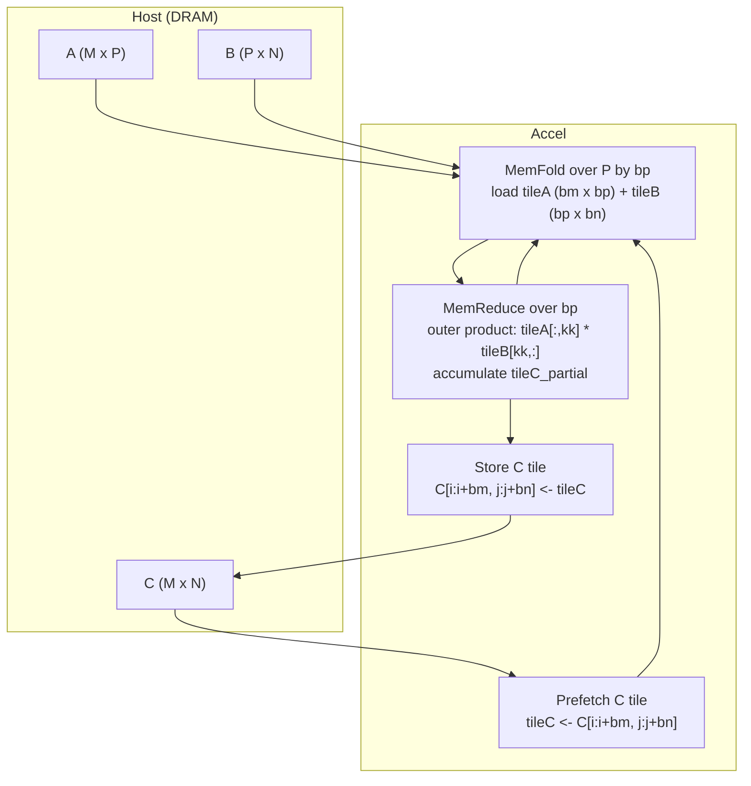

# Spatial GEMM: Blocked Outer-Product Matrix Multiply

**Source:** [General Matrix Multiply (GeMM) — Spatial](https://spatial-lang.org/gemm/) (captured 2026-08-04)

**Related pages:** [General Matrix Multiply (GEMM)](../terms/gemm.md), [Outer Product](../terms/outer-product.md), [Matrix Tiling](../terms/matrix-tiling.md), [Memory Banking](../terms/memory-banking.md), [Systolic Array](../terms/systolic-array.md), [Global Memory](../terms/global-memory.md)

## TL;DR

**What:** The Spatial tutorial builds a working GEMM app for reconfigurable hardware (FPGA) using output tiling plus outer-product accumulation, then shows how compiler-chosen memory banking keeps parallel accesses conflict-free.

**How:** `Foreach(M by bm, N by bn)` steps over output tiles of C; a `MemFold` over the shared dimension loads A/B tiles and accumulates; a `MemReduce` inside computes each rank-1 outer product; a triple-buffered pipeline overlaps prefetch, compute, and store. A multi-dimensional banking pass assigns SRAM banks so every parallel access in a cycle is conflict-free.

**The trade-off space:** The tutorial frames GEMM as "many ways to break up the computation" — [blocking](../terms/matrix-tiling.md), [inner products](../terms/inner-product.md), [outer products](../terms/outer-product.md), and [systolic arrays](../terms/systolic-array.md) — and demonstrates one concrete point in that space.

## What This Tutorial Shows

GEMM ($C = A \times B$) is the canonical example for teaching a spatial compiler because it has a rich design space and every choice shows up in the generated hardware. The Spatial version implements:

- **Output tiling:** the outermost loops `Foreach(M by bm, N by bn)` walk tiles of C, scanning horizontally to minimize DRAM transactions.
- **Prefetch + accumulate:** `tileC` is prefetched from DRAM, then a `MemFold(tileC)(P by bp)` accumulates over $k$-chunks so the first iteration does not overwrite the prefetched C.
- **Outer-product inner loop:** for each $k$, the innermost `Foreach(bm, bn)` computes `tileA(ii,kk) * tileB(kk,jj)` — the exhaustive pairwise multiplication of a column of A with a row of B — and `MemReduce` sums the partial tiles.
- **Triple buffering:** `tileC` is viewed as a triple-buffered memory so load, compute, and store stages of the coarse-grain pipeline overlap.

The app keeps parallelization factors (`op`, `mp`, `ip`) at 1 in the basic version, then raises `mp = 2` and `ip = 4` to show what happens to memory banking.

*Synthesized from the captured tutorial (not a source figure). ① The outermost loop selects an output tile of C and prefetches it into SRAM. ② A MemFold over the shared dimension loads the matching A and B tiles in parallel. ③ A MemReduce accumulates outer products of `tileA` columns and `tileB` rows into a partial tile. ④ The accumulated tile is stored back to DRAM, and the triple-buffered pipeline overlaps all three stages.*

## The GEMM Decomposition Space

The tutorial's framing is that GEMM is a family of decompositions, not one loop nest:

- **[Matrix tiling](../terms/matrix-tiling.md)** splits the loops into on-chip-sized blocks; this is the tutorial's top-level strategy.
- **[Outer-product](../terms/outer-product.md) accumulation** (chosen here) computes each $k$-step as a full $bm \times bn$ block of independent multiplications.
- **[Inner-product](../terms/inner-product.md) accumulation** (left as an exercise) computes each output element as a full reduction over $k$.
- **[Systolic arrays](../terms/systolic-array.md)** (later tutorials) replace the loop nest with a spatial dataflow of processing elements.

Each choice changes the generated hardware's parallelism, data reuse, and DRAM traffic.

## Multi-Dimensional Banking

The second half of the tutorial is about [memory banking](../terms/memory-banking.md). When a parallelized loop reads several elements of `tileB` in one cycle, the SRAM must serve them all — so the compiler analyzes the access pattern and chooses a bank assignment with no collisions. The tutorial's banking pass follows Wang et al.'s generalized memory partitioning, with a refinement: it first attempts a flat (N-dimensional to 1-dimensional) banking and only falls back to **hierarchical** banking when flat banking fails or is too resource-expensive. Changing the parallelization (`mp`, `ip`, and the `tileB` writer's `par 8`) invalidates a scheme and forces the compiler to pick another — which is why bank selection is a compile-time search, not a fixed layout.

## Where It Breaks

| Failure mode | When it happens | Impact |
|---|---|---|
| Bank conflicts | A parallel access pattern has no conflict-free flat scheme | Compiler falls back to hierarchical banking, adding multiplexer logic and area |
| Unused bank capacity | Padding to bank boundaries leaves SRAM slots empty | Higher memory cost per tile; may force smaller tiles |
| Parallelization vs. memory | Raising `mp`/`ip`/writer-parallelism | The previous banking scheme becomes invalid; the compiler re-banks |
| Triple-buffer overflow | Tile size exceeds available SRAM | Pipeline stalls; the design cannot overlap load/compute/store |
| Non-tiled matrices | No blocking for small sizes | Memory-bound execution; DRAM traffic dominates |

## Go Deeper

- **Terms:** [GEMM](../terms/gemm.md), [Matrix Tiling](../terms/matrix-tiling.md), [Outer Product](../terms/outer-product.md), [Inner Product](../terms/inner-product.md), [Systolic Array](../terms/systolic-array.md), [Memory Banking](../terms/memory-banking.md), [Global Memory](../terms/global-memory.md)
- **Related hardware pages:** [Global Memory](../terms/global-memory.md) — the off-chip pool that tiling moves data between; [NVFP4: Blackwell 4-Bit Floating Point](quantization/nvfp4.md) — a production GEMM layout on GPU tensor cores.
- **Reproduce:** The raw snapshot is `raw/hardware/spatial-gemm--web-2026-08-04-5ae8cd1f3ba2.html`; the extracted text is `derived/web-markdown/hardware/spatial-gemm--web-2026-08-04-5ae8cd1f3ba2.md`. Full Spatial apps live in the [Spatial test suite](https://github.com/stanford-ppl/spatial/tree/master/test/spatial/tests).
