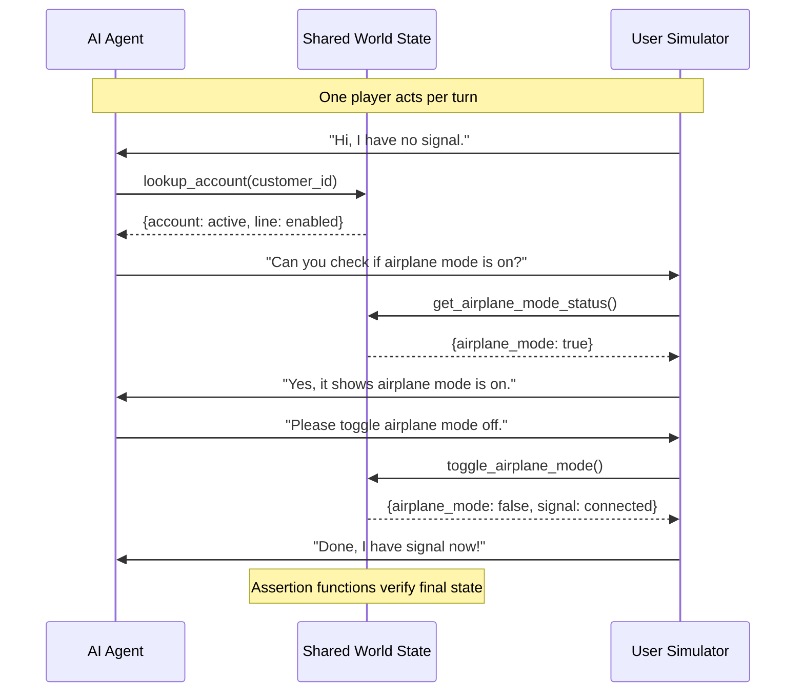
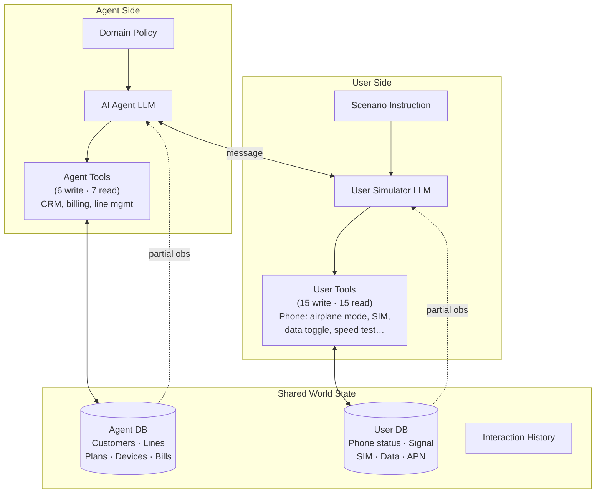
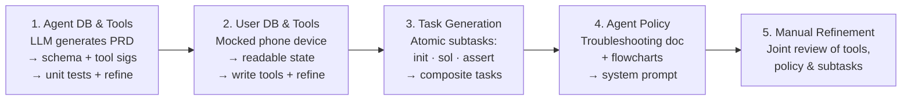
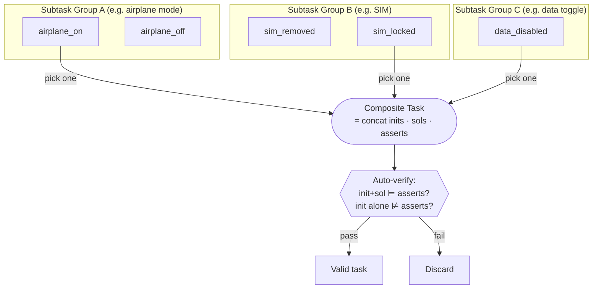
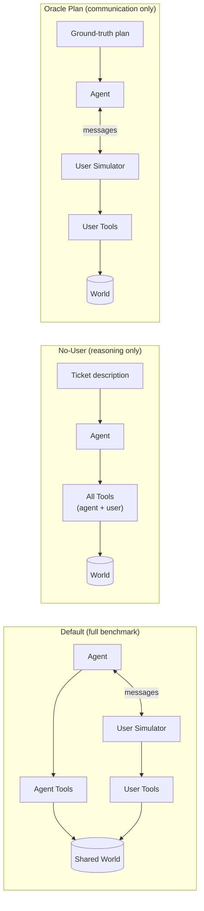

# τ²-Bench: Mechanism and Design

τ²-Bench (Barres et al., 2025) is a benchmark for evaluating conversational AI agents in a **dual-control environment** — one where both the agent and the simulated user can take tool-based actions to modify a shared world state. It extends the earlier τ-bench by giving the user meaningful agency rather than limiting them to a passive information provider.

## Core Problem It Addresses

Existing benchmarks (τ-bench, ToolSandbox, FlowBench) are **single-control**: only the AI agent can call tools; the user only speaks. Real-world customer support is different — a user must actively perform steps (toggle airplane mode, reseat a SIM card, check a status bar) guided by the agent. τ²-Bench models this asymmetric collaboration.

## Formal Model: Dec-POMDP

Dual-control interactions are formalised as a **Decentralised Partially Observable Markov Decision Process** (Dec-POMDP), defined by a tuple $(S, \{A_i\}, \{O_i\}, T, R, \mathcal{U}, M)$:

| Component | Meaning |
|---|---|
| $S$ | Global state = world databases ⊗ interaction history |
| $A_i$ | Action space for player $i$ — either a tool call or a natural-language message |
| $O_i$ | Observations for player $i$ — tool returns or the other player's message |
| $T$ | Transition function: $(S, A) \to (S', O)$ |
| $R$ | Reward $R: S \to [0,1]$ — binary task success verified against assertion functions |
| $\mathcal{U}$ | Instruction space — scenario instructions for the user; domain policy for the agent |
| $M$ | Message space — all possible natural-language exchanges |

Only one player acts per turn. The global state updates after every tool call; messages update only the history component.

### Turn-by-Turn Interaction Loop

## Environment Architecture

The agent sees CRM-style data; the user sees phone-device-style data. Neither has full visibility of the other's database, creating genuine partial observability.

## Domain: Telecom

The primary new domain models a telecom technical-support interaction. Key statistics:

| | retail | airline | telecom |
|---|---|---|---|
| Agent tools | 7 write, 6 read | 6 write, 6 read | 6 write, 7 read |
| User tools | — | — | 15 write, 15 read |
| Tasks (sampled) | 115 | 50 | 114 (full: 2285) |

**Three user intents** form a difficulty hierarchy:

1. `service_issue` — no signal, SIM or airplane mode problems (mean 2.3 solution actions)
2. `mobile_data_issue` — data unavailable or slow (mean 4.3 actions)
3. `mms_issue` — picture/video messaging broken (mean 6.0 actions; requires service + data prerequisites)

## Five-Stage Domain Construction

**Stage 1 — Agent database and tools.** An LLM generates a Product Requirements Document (PRD) specifying the CRM schema (customers, lines, plans, devices, bills) and agent tool signatures. Implementations and unit tests are generated then manually refined until all tests pass.

**Stage 2 — User database and tools.** Similarly, a mocked phone device is defined with readable state (signal strength, SIM status, airplane mode, data toggle…) and write tools (toggle, reseat, reset APN…). Same generate-test-refine loop.

**Stage 3 — Programmatic task creation.** Each atomic subtask $t$ is a triple $(\{f^{\text{init}}\}, \{f^{\text{sol}}\}, \{f^{\text{assert}}\})$:

- **Initialization functions** — set the broken initial state (e.g., `set_airplane_mode(True)`)
- **Solution functions** — the ordered sequence of tool calls that fix it (e.g., `toggle_airplane_mode()`)
- **Assertion functions** — conditions on the final world state that confirm success (e.g., `assert_service_status("connected")`)

Atomic subtasks are grouped into mutually-exclusive groups. A **composite task** picks at most one subtask per group and concatenates their function lists. Correctness is verified automatically: running init then solution must satisfy all assertions; running init alone must not. The telecom domain has 15 atomic subtask groups yielding 2285 valid composite tasks; 114 are sampled for a balanced distribution.

**Stage 4 — Domain-specific agent policy.** LLMs generate a detailed troubleshooting policy document (with optional workflow flowcharts) that the agent receives in its system prompt.

**Stage 5 — Manual refinement.** Tools, policy, and subtasks are jointly reviewed and fixed.

## User Simulator Design

The user simulator is an LLM agent given:

- A **scenario instruction** (reason for call, known/unknown info, task-specific behaviour rules)
- The **user tool set** (identical to what a real user would operate)

Key constraints that improve reliability over τ-bench's retail/airline simulators:

- User tools return **human-readable outputs only** — no raw JSON that could be misinterpreted as agent-side data.
- The simulator is instructed to call a tool only when the agent explicitly requests it, and to ask for clarification rather than guess.
- If the agent asks for multiple actions at once, the simulator states it can only do one at a time.
- Environment state constrains what tool calls can return, making fabrication harder.

Result: telecom user simulator error rate 16% (6% critical) vs. retail 40% (12%) and airline 47% (13%).

## Task Evaluation Criteria

Tasks can specify any subset of five verification methods:

| Method | How it works |
|---|---|
| **DB check** | Compare final agent-side database values to expected values |
| **Status assertion** | Run predefined assertion functions on final world state $S_{\text{world}}$ |
| **Natural language assertion** | LLM-judge check on the conversation history |
| **Communication info check** | Verify specific facts were communicated by the agent |
| **Action matching** | Confirm every required solution function appears in the trajectory |

The telecom domain uses **status assertions only**.

## Evaluation Metrics

The paper uses the **pass^k** metric from τ-bench: the fraction of $k$ independent runs on which all tasks succeed. This captures consistency, not just peak performance.

## Ablation: Separating Reasoning from Communication

Three evaluation modes isolate different failure sources:

| Mode | Setup | Purpose |
|---|---|---|
| **Default** | Agent + user simulator; dual-control | Full benchmark |
| **No-User** | Agent controls all tools; gets a ticket describing the problem | Isolates pure reasoning capability |
| **Oracle Plan** | Agent given the full ground-truth tool sequence; must guide user to execute it | Isolates communication / coordination capability |

Key finding: shifting from No-User to Default causes ~18–25% pass^1 drop, confirming that guiding an active user is the dominant bottleneck beyond reasoning.

## Key Empirical Results

Pass^1 on the telecom domain (Default mode):

| Model | pass^1 |
|---|---|
| claude-3.7-sonnet | 49% |
| o4-mini | 42% |
| gpt-4.1 | 34% |
| gpt-4.1-mini | ~44% |

- Performance degrades sharply past 7 required actions in Default mode, approaching 0%.
- No-User mode outperforms Default for all task lengths, but the gap narrows for very long tasks.
- Harder issue types (`mms_issue`) show near-zero pass^4 for most models, indicating low reliability.
- Agent performs best with the **Easy** user persona, worst with **None** (no persona), which is often on par with or below **Hard**.

## Persona System

Each telecom task is randomly assigned one of three user personas:

- **None** — no persona given to the simulator.
- **Easy** — office administrator; average technical skill; patient and communicative.
- **Hard** — 64-year-old retired librarian; limited technical knowledge; gets flustered easily; needs constant reassurance.

## Limitations

- Does not model the **expert-novice gap**: the agent never needs to adapt its explanations to the user's mental model.
- Domain expansion still requires significant human expertise.
- The tool-augmented user simulator approach has not yet been applied to the existing retail and airline domains.

## Related Pages

- [Knowledge Base Introduction](../README.md)
