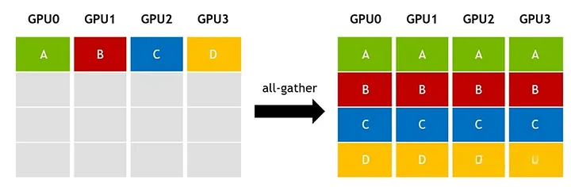

# All-Gather

**All-Gather** is a many-to-many collective communication primitive in which each rank contributes one shard of data and every rank receives the full concatenated result.

## Why It Exists

Distributed training frequently splits activations, parameters, or optimizer state across ranks to save memory and bandwidth. But some steps still need a full view of that tensor on every participating device. All-gather exists for that moment: each rank contributes its shard, and everyone receives the identical reconstructed tensor.

The Medium source explains all-gather as the conceptual composition of **gather + broadcast**: first collect every shard, then redistribute the whole tensor to all ranks. That mental model is useful when deciding whether you truly need full replication, or whether a cheaper reduce-scatter or point-to-point exchange would suffice.

## How It Works

For $t$ ranks, each holding one shard of size $s$, all-gather proceeds as:

1. Each rank $i$ holds shard $i$ of the tensor (equally sized).
2. After the collective, every rank holds the concatenation of all $t$ shards — a tensor with $t \times s$ total logical size.

In practice, libraries such as NCCL implement this with topology-aware algorithms such as rings or trees, but the observable contract is simple: everyone ends with the same full tensor.

*Source: [In-Depth Understanding of AI Distributed Training Communication Primitives](https://naddod.medium.com/in-depth-understanding-of-ai-distributed-training-communication-primitives-eb3b5fcc1f07). The article visualizes all-gather as a full collection step whose end state is identical on every GPU.*

### The Split/All-Gather Pattern at Pipeline Boundaries

When tensor parallelism and pipeline parallelism are composed, activations at pipeline boundaries are often replicated across all $t$ tensor-parallel ranks inside a node. The naive approach sends the full tensor $t$ times over the slower inter-node link. The optimized pattern instead:

1. **Split (sender side):** The activation tensor is divided into $t$ shards. Each tensor-parallel rank sends only its shard over IB to the corresponding rank at the next pipeline stage.
2. **All-gather (receiver side):** The $t$ receiving ranks perform an intra-node all-gather over NVLink to reconstruct the full tensor.

This reduces cross-node traffic from redundant full copies to one shard per rank, then reconstructs the tensor locally with a fast intra-node all-gather.

## Why Sequence Parallelism Avoids This Cost

Sequence parallelism splits the input sequence into chunks across GPUs at the start. Activations are thus **already split** along the sequence dimension — there is no replication to undo. When a sequence-parallel model is combined with pipeline parallelism, activations pass between pipeline stages as pre-split chunks, with no need for an extra split/all-gather step. This is one reason sequence parallelism achieves better throughput when composed with pipeline parallelism than tensor parallelism does.

## Common Confusions

- **All-gather vs. [all-reduce](all-reduce.md):** All-reduce sums tensors element-wise and delivers the sum; all-gather concatenates shards and delivers the full tensor. All-reduce preserves element count; all-gather increases it by $t \times$.
- **All-gather vs. scatter/gather:** Scatter distributes different shards to different ranks; gather collects them onto one rank. All-gather generalizes that idea so every rank finishes with the full result.
- **Split/all-gather vs. scatter/gather (Megatron-LM optimization):** These are the same pattern described from different angles. "Scatter/gather" is Megatron-LM's name for the pipeline-boundary optimization; "split/all-gather" is the same two-step process: split the tensor, send shards, all-gather to reconstruct.

## Where It Appears

- [Megatron-LM: GPU-Cluster Training Parallelism](../training/parallelism/megatron-lm/index.md) — The scatter/gather optimization uses split + all-gather at pipeline boundaries, yielding up to 11% throughput improvement.
- [Sequence Parallelism: Splitting Sequences Across GPUs](../training/parallelism/sequence-parallelism/index.md) — Sequence parallelism avoids the split/all-gather cost entirely because activations are already chunked along the sequence dimension.
- [NVFP4](../hardware/quantization/nvfp4.md) — Uses all-gather to assemble quantized tensor shards in distributed training.
- [vLLM Architecture and Code Organization Overview](../frameworks/vllm/vllm-overview.md) — A top-down code-reading map of the vLLM repository at commit a0c092ee72c0: how the V1 serving engine, model executor, config.
- [vLLM-Ascend Architecture: How the Ascend NPU Port Integrates with vLLM](../frameworks/vllm-ascend/architecture.md) — A code-reading tour of how vllm-ascend maps onto vLLM's six-layer stack and extends upstream vLLM for Ascend NPU execution.
- [vLLM-Ascend Kimi K3 MoE Forward Insight](../frameworks/vllm-ascend/kimi-k3-moe-forward.md) — Fresh code-reading insight for how the latest vllm-ascend routed-MoE substrate would execute a Kimi K3-style forward pass.
- [Kimi K3: Open 3T-Class Frontier Model](../training/kimi/kimi-k3/index.md) — Kimi K3 is a 2.8T-parameter native multimodal MoE model with 104B active parameters, hybrid KDA/MLA attention, 1M-token context.
- [Context Parallelism for Scalable Million-Token Inference](../algorithms/context-parallelism/index.md) — Uses ring send/recv instead of an all-gather of the full context for exact prefill and decode attention.

## Related Terms

- [Scatter/Gather](scatter-gather.md) — Megatron-LM's name for the split/all-gather pipeline-boundary optimization.
- [Microbatch](microbatch.md) — More microbatches mean more pipeline boundary crossings, making split/all-gather more impactful.
- [Sequence Parallelism](sequence-parallelism.md) — Orthogonal parallelism dimension that avoids the need for split/all-gather at pipeline boundaries.
