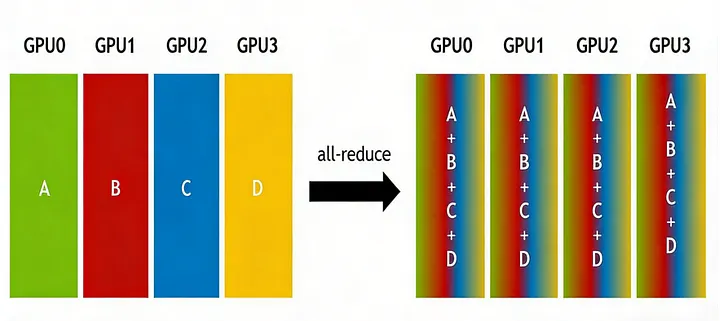

# All-Reduce

**All-Reduce** is a many-to-many collective communication primitive that applies the same reduction operation to equally shaped tensors across ranks and returns the identical reduced tensor to every rank.

## Why It Exists

Distributed training constantly needs to merge partial work from many accelerators. When each data-parallel replica computes a gradient, those gradients must be combined before the optimizer step. When tensor parallelism splits a matrix multiply, the partial outputs must be aggregated before the next layer can proceed. All-reduce exists because both situations require the same result on every participating rank.

The Medium article frames all-reduce as either **reduce + broadcast** or **reduce-scatter + all-gather**. That decomposition is useful operationally: if the next step only needs a shard of the reduced tensor, reduce-scatter may be cheaper than materializing the full all-reduced tensor everywhere.

## How It Works

Given $t$ ranks, each holding a tensor of the same shape, all-reduce computes:

$$\text{result} = \sum_{i=0}^{t-1} \text{tensor}_i$$

and delivers `result` to every rank. The dominant implementation is the **ring all-reduce**: ranks are arranged in a logical ring, each rank sends its data to the next rank while receiving from the previous, and partial sums accumulate as data circulates. After $2(t-1)$ steps, every rank has the full sum.

The bandwidth cost is $2 \cdot \frac{t-1}{t} \cdot \text{size}$ — nearly independent of $t$ for large $t$, meaning the cost is dominated by the tensor size, not the number of ranks.

*Source: [In-Depth Understanding of AI Distributed Training Communication Primitives](https://naddod.medium.com/in-depth-understanding-of-ai-distributed-training-communication-primitives-eb3b5fcc1f07). The article visualizes all-reduce as a cluster-wide reduction whose reduced output is delivered back to every GPU.*

## Where All-Reduce Appears in Training

| Parallelism | What gets all-reduced | Frequency |
|---|---|---|
| Data parallelism | Gradients | Once per batch |
| Tensor parallelism | MLP output (after column-parallel linear), attention output (after row-parallel linear) | Every forward + backward pass per layer |
| Pipeline parallelism | None directly (uses P2P send/recv) | — |

Tensor parallelism's all-reduces are the most expensive because they happen **every layer, every forward and backward pass**. This is why tensor parallelism is kept within a single node (NVLink): moving those all-reduces across slower inter-node links (InfiniBand) would cripple throughput.

## Why Sequence Parallelism Avoids Them

Sequence parallelism has **zero all-reduces in MLP blocks**. Each device computes its chunk's MLP independently because the linear layers operate on each token in isolation — no cross-token aggregation is needed. The only communication is ring P2P in the attention block (circulating $K$ and $V$). This is the structural reason sequence parallelism achieves better throughput when composed with pipeline parallelism: it removes the frequent all-reduces that tensor parallelism pays.

## Common Confusions

- **All-reduce vs. all-gather:** All-reduce sums tensors element-wise; all-gather concatenates shards. All-reduce preserves element count; all-gather increases it by $t \times$.
- **All-reduce vs. reduce:** Reduce sums across ranks but delivers the result to only one rank. All-reduce delivers it to everyone.
- **All-reduce vs. reduce-scatter:** Reduce-scatter performs the reduction but leaves each rank with only one shard of the reduced result. All-reduce = reduce-scatter followed by all-gather.

## Where It Appears

- [Megatron-LM: GPU-Cluster Training Parallelism](../training/parallelism/megatron-lm/index.md) — Tensor parallelism creates frequent all-reduces inside each Transformer layer; keeping them within a DGX node over NVLink is a core design constraint.
- [Sequence Parallelism: Splitting Sequences Across GPUs](../training/parallelism/sequence-parallelism/index.md) — Sequence parallelism avoids all-reduces in MLP blocks entirely because each chunk's linear layers operate independently.
- [vLLM: PagedAttention Serving Framework](../frameworks/vllm/vllm-framework.md) — Workers synchronize intermediate results through all-reduce in tensor-parallel inference.
- [LLaMA: Open and Efficient Foundation Language Models](../training/foundation-models/llama.md) — LLaMA overlaps all-reduce communication with computation to hide gradient-synchronization latency.
- [NVFP4](../hardware/quantization/nvfp4.md) — Uses all-reduce for distributed amax and scale statistics.
- [vLLM Architecture and Code Organization Overview](../frameworks/vllm/vllm-overview.md) — A top-down code-reading map of the vLLM repository at commit a0c092ee72c0: how the V1 serving engine, model executor, config.
- [vLLM-Ascend Architecture: How the Ascend NPU Port Integrates with vLLM](../frameworks/vllm-ascend/architecture.md) — A code-reading tour of how vllm-ascend maps onto vLLM's six-layer stack and extends upstream vLLM for Ascend NPU execution.
- [GPipe: Micro-Batch Pipeline Parallelism](../training/parallelism/gpipe/index.md) — GPipe introduces synchronous micro-batch pipeline parallelism with re-materialization, achieving near-linear speedup when.

## Related Terms

- [All-Gather](all-gather.md) — The gather counterpart; all-reduce sums, all-gather concatenates.
- [Scatter/Gather](scatter-gather.md) — Pipeline optimization that avoids redundant cross-node sends; relies on intra-node all-gather.
- [Sequence Parallelism](sequence-parallelism.md) — Avoids all-reduces in MLP blocks by splitting along the sequence dimension instead of hidden/head dimensions.
