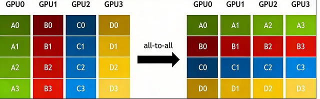

# All-to-All

**All-to-All** is a many-to-many collective communication primitive in which each rank scatters a distinct shard to every other rank while simultaneously gathering a distinct shard from every other rank, effectively performing a distributed data transpose.

## Why It Exists

When model parallelism distributes tensors across ranks along one dimension, subsequent operations may need those tensors redistributed along a different dimension. Without all-to-all, such redistribution would require multiple scatter or gather steps stitched together. All-to-all performs this redistribution in a single collective, amortizing latency and bandwidth overhead into one coordinated exchange.

As the Medium source describes it, all-to-all is an extension of [all-gather](all-gather.md): in all-gather every rank receives the **same** complete tensor, while in all-to-all every rank receives a **different** slice. This distinction makes all-to-all the natural collective for transposition workloads.

## How It Works

For $r$ ranks, each starting with an $r \times s$ tensor, all-to-all proceeds as:

1. Each rank $i$ partitions its data into $r$ shards, each of size $s$.
2. Rank $i$ sends shard $j$ to rank $j$, for all $j$.
3. After the collective, rank $i$ holds the concatenation of shard $i$ from every rank — a tensor with $r \times s$ total size, but now logically transposed.

*Source: [In-Depth Understanding of AI Distributed Training Communication Primitives](https://naddod.medium.com/in-depth-understanding-of-ai-distributed-training-communication-primitives-eb3b5fcc1f07). The diagram visualizes all-to-all as a transpose: each GPU sends different data to each peer and receives different data from each peer.*

In NCCL, all-to-all is implemented as a collective primitive alongside the other common patterns, using topology-aware algorithms to minimize cross-node traffic on the specific interconnect.

## Common Confusions

- **All-to-all vs. [all-gather](all-gather.md):** All-gather replicates one concatenated result everywhere; all-to-all gives each rank a *different* concatenated result. All-gather is a duplication; all-to-all is a transpose.
- **All-to-all vs. scatter:** Scatter is one-to-many from a single root; all-to-all is many-to-many where every rank is both a scatter source and a gather destination.
- **All-to-all vs. point-to-point send/recv:** A full all-to-all pattern *can* be built from $r(r-1)$ pairwise messages, but the collective primitive fuses those exchanges into one optimized operation with lower latency.

## Where It Appears

- [Megatron-LM: GPU-Cluster Training Parallelism](../training/parallelism/megatron-lm/index.md) — All-to-all is used to switch between data-parallel and model-parallel tensor layouts when transitioning between pipeline stages or attention heads.

## Related Terms

- [All-Gather](all-gather.md) — The replication counterpart; all-to-all is its transposition-based extension.
- Reduce-Scatter — The reverse of all-gather; reduces data first, then scatters different shards.
- [All-Reduce](all-reduce.md) — Reduces data element-wise across ranks instead of rearranging slices.
