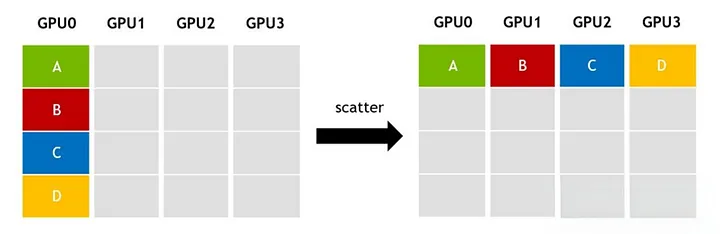

# Scatter/Gather

**Scatter/Gather** is a pipeline-boundary communication optimization that reduces redundant cross-node activation transfers by sending different shards across the slow link and reconstructing the full tensor on the destination side.

## Why It Exists

The generic primitives behind this optimization are the same ones described in the Medium article: **scatter** sends different shards to different ranks, while **gather** or **all-gather** reconstructs the larger tensor later. In a pipeline-parallel setup with tensor parallelism, that decomposition matters because inter-node links are slower than intra-node links. Without scatter/gather, the same full activation can cross the slow link once per tensor-parallel rank.

## How It Works

1. **Scatter (sender side):** The activation tensor is split into $t$ equal chunks. Each tensor-parallel rank sends only one chunk over the inter-node link to the corresponding rank in the next pipeline stage.

2. **Gather (receiver side):** The receiving ranks reconstruct the tensor locally. In Megatron-LM this is commonly an intra-node all-gather over the faster link inside the node.

This reduces the cross-node payload from $b \cdot s \cdot h$ (full tensor, $t$ redundant copies) to $\frac{b \cdot s \cdot h}{t}$ (one shard per rank).

*Source: [In-Depth Understanding of AI Distributed Training Communication Primitives](https://naddod.medium.com/in-depth-understanding-of-ai-distributed-training-communication-primitives-eb3b5fcc1f07). The article's scatter figure shows the sender-side half of the optimization: different shards go to different GPUs instead of broadcasting the same full tensor to all of them.*

## Impact

Megatron-LM reports up to **11% throughput improvement** for communication-intensive schedules (large batch sizes with interleaved 1F1B). The optimization is especially important for the interleaved schedule, which increases pipeline communication frequency — without scatter/gather, the redundant cross-node traffic would cancel out the interleaving benefit.

## Where It Appears

- [Megatron-LM: GPU-Cluster Training Parallelism](../training/parallelism/megatron-lm/index.md) — Introduced as part of the PTD-P training system; Section 5.7 shows the 11% throughput gain on GPT-3 175B.
- The technique is accelerator-agnostic and applies to any distributed training system where intra-node bandwidth (NVLink) vastly exceeds inter-node bandwidth (InfiniBand).

## Related Terms

- [All-Gather](all-gather.md) — The NCCL collective that reconstructs the full tensor on the receiving side of scatter/gather.
- [Microbatch](microbatch.md) — Smaller microbatches increase communication frequency, making scatter/gather more important.
