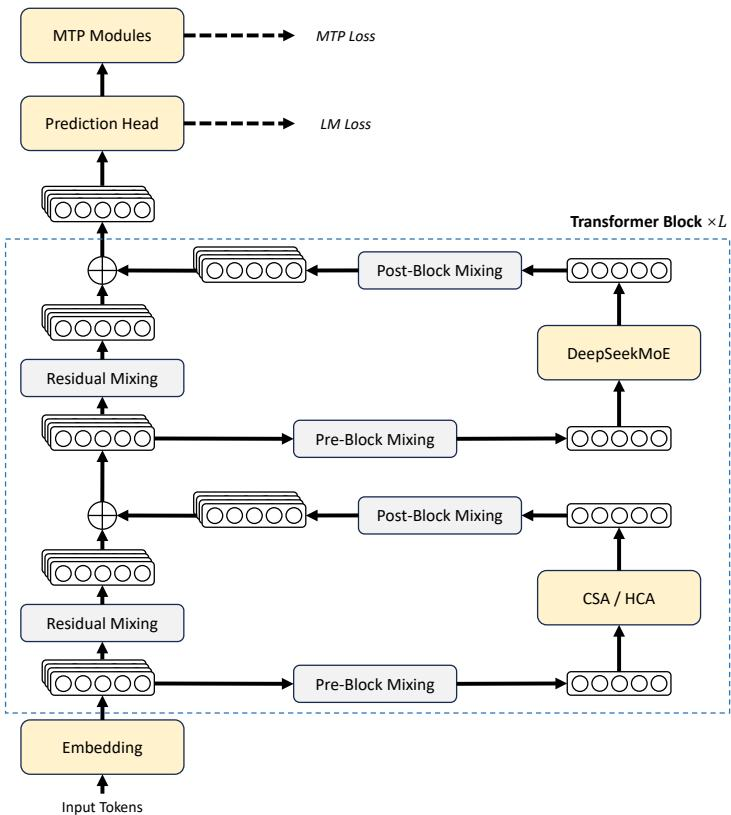
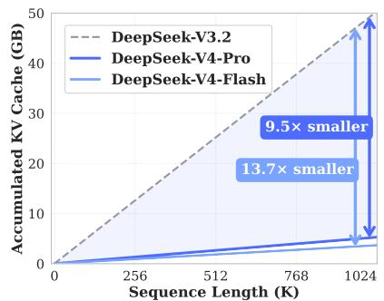
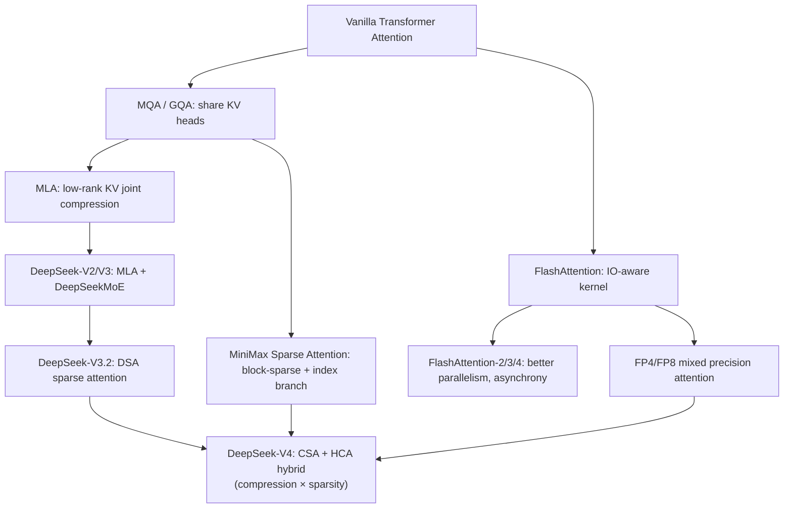
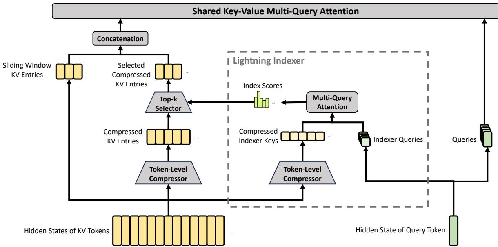
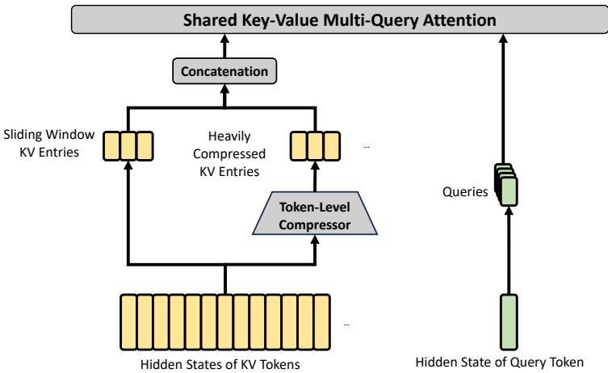
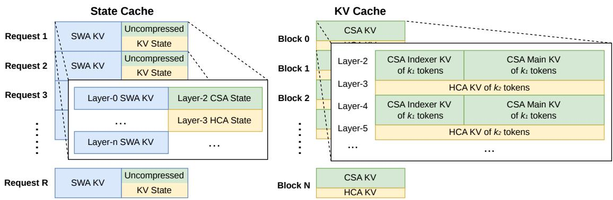

# DeepSeek-V4: Million-Token Context via Hybrid Compressed Attention

**Paper:** DeepSeek-V4: Towards Highly Efficient Million-Token Context Intelligence
**Authors:** DeepSeek-AI
**arXiv:** Technical report, July 2026

**Related pages:** [DeepSeek-V2 MLA](../../algorithms/deepseek-v2-mla.md), [DeepSeek-V3.2 Sparse Attention](../../algorithms/deepseek-v3.2/index.md), [MiniMax Sparse Attention](../minimax-sparse-attention/index.md), [FlashAttention series](../../algorithms/flashattention.md), [Megatron-LM](../megatron-lm/)

## TL;DR

**What:** DeepSeek-V4 is a family of Mixture-of-Experts LLMs — Pro (1.6T/49B activated) and Flash (284B/13B activated) — that natively support million-token contexts through a novel hybrid attention architecture.

**How:** Compressed Sparse Attention (CSA) compresses KV cache by 4× and applies sparse top-k selection; Heavily Compressed Attention (HCA) compresses by 128× with dense attention. Interleaving them across layers, plus Muon optimizer and manifold-constrained hyper-connections, yields dramatic efficiency gains.

**The number:** At 1M-token context, DeepSeek-V4-Pro uses only 27% of DeepSeek-V3.2's single-token inference FLOPs and 10% of its KV cache size. DeepSeek-V4-Flash uses 10% FLOPs and 7% KV cache.

## The Big Picture

*① DeepSeekMoE layers with shared + routed experts, Hash routing for early layers. ② Hybrid attention: interleaved CSA and HCA layers. ③ mHC replaces standard residual connections between blocks. ④ Muon optimizer (with hybrid Newton-Schulz iterations) replaces AdamW for most parameters. ⑤ Multi-Token Prediction (MTP) retained from V3.*

*Left: benchmark performance of DeepSeek-V4-Pro-Max vs. counterparts. Right: inference FLOPs and KV cache size vs. DeepSeek-V3.2 — V4-Pro achieves 27% FLOPs and 10% KV cache at 1M tokens.*

## Why This Exists

Consider a standard LLM processing a 1-million-token context. With BF16 GQA8 (head dim 128) — a common configuration — each new token's attention query must attend to 1M KV entries per layer, costing ~256 GB of KV cache and enormous FLOPs. Even DeepSeek-V3.2's sparse attention struggles: at 1M context, it still needs substantial compute and cache. This makes practical deployment of ultra-long-context models economically infeasible.

Three problems compound:

1. **Quadratic attention FLOPs** dominate at long contexts, making token generation painfully slow.
2. **KV cache memory** grows linearly with sequence length, exhausting GPU HBM.
3. **Training stability** degrades with deeper, wider models, causing loss spikes that simple rollbacks can't permanently fix.

DeepSeek-V4 tackles all three jointly: compressed attention crushes FLOPs and KV cache, mHC stabilizes deep signal propagation, and Muon accelerates convergence.

## The Landscape

DeepSeek-V4 sits at the convergence of three evolutionary lines: (1) KV compression (MQA → MLA), (2) sparse attention (DSA, MSA), and (3) low-precision attention (FP8/FP4). Its key novelty is combining compression *and* sparsity in a hybrid, interleaved architecture — CSA layers compress lightly and select sparsely, while HCA layers compress aggressively and attend densely.

## The Core Idea

Instead of choosing between dense attention (accurate but expensive), sparse attention (cheaper but risks missing important tokens), or KV compression (lossy but compact), DeepSeek-V4 interleaves them: CSA layers compress KV cache by 4× then select top-k blocks via a learned indexer, preserving fine-grained relevance; HCA layers compress by 128× and attend to everything, providing global context. Together with sliding-window branches for local dependencies, this gives the model both a "microscope" (recent tokens) and a "telescope" (compressed distant context) — all while keeping FLOPs and KV cache at fractions of V3.2 levels.

## Symbol Map

CSA uses two KV series ($C^a$, $C^b$) with overlapping windows for compression; HCA uses a single series. Compression rates are $m$ for CSA and $m'$ for HCA.

| Symbol | Human name | Shape / scope | Plain meaning |
|---|---|---|---|
| $m$ | CSA compression rate | per-CSA-layer | Number of tokens compressed into one KV entry (4 in V4) |
| $m'$ | HCA compression rate | per-HCA-layer | Number of tokens compressed into one KV entry (128 in V4) |
| $C^a, C^b$ | KV entry series (a, b) | $n \times c$ | Two KV series for CSA; $C^b$ overlaps with adjacent blocks |
| $Z^a, Z^b$ | compression weights | $n \times c$ | Learned weights determining how each token contributes to compressed entries |
| $C^{\text{Comp}}$ | compressed KV entries | $\frac{n}{m} \times c$ | Output of CSA/HCA compression, fed to core attention |
| $K^{\text{IComp}}$ | compressed indexer keys | $\frac{n}{m} \times c^I$ | Lower-dimensional keys used for sparse block selection |
| $c_t^Q$ | latent query vector | per token, $d_c$ | Shared compressed query representation for both indexer and core attention |
| $n_h$ | query heads | per layer | Number of MQA query heads (64 Flash, 128 Pro) |
| $n_h^I$ | indexer heads | per layer | Number of indexer query heads for sparse selection (64) |
| $n_{\text{win}}$ | sliding window size | per layer | Number of uncompressed recent KV entries (128) |

## Deep Dive

### Compressed Sparse Attention (CSA)

**What it does:** CSA compresses every $m$ tokens into one KV entry, then applies DeepSeek Sparse Attention (DSA) to select only the top-k compressed entries for core attention.

**Why it matters:** Naive compression loses fine-grained relevance between a query and specific tokens. CSA adds a learned Lightning Indexer that scores each compressed block against the query, selecting only the most relevant blocks — preserving accuracy while reducing the effective KV length by 4×, then further by the top-k ratio.

**How it works:**

1. **Dual-series KV compression:** Two independent KV series $C^a$ and $C^b$ are produced from input hidden states. Each compressed entry $C_i^{\text{Comp}}$ is a weighted sum of 2$m$ entries — $m$ from $C^a$ at positions $[mi, m(i+1)-1]$ and $m$ from $C^b$ at positions $[m(i-1), mi-1]$. The overlapping $C^b$ indices mean each compressed block shares information with its neighbor, softening the compression boundary.

2. **Lightning Indexer:** A separate compressed indexer key $K^{\text{IComp}}$ is produced (smaller head dim $c^I$). For each query token, indexer queries $\mathbf{q}_t^I$ are generated from a shared latent vector $\mathbf{c}_t^Q$. Per-block index scores $I_{t,s}$ aggregate over indexer heads with learned head weights.

3. **Top-k selection:** Only the top-k scoring compressed blocks participate in core attention. This is the sparse attention step — similar to DSA but operating on compressed blocks.

4. **Core attention with shared KV MQA:** The selected compressed entries serve as both keys and values in a Multi-Query Attention. All query heads share the same KV entries (MQA), but each head has its own query vector.

5. **Grouped output projection:** The $n_h$ output heads are split into $g$ groups, each projected to a smaller intermediate dimension $d_g$, then concatenated and projected to the full hidden size. This avoids the quadratic cost of projecting $c \cdot n_h$ dimensions directly.

*① Input hidden states generate two KV series and compression weights. ② Every $m$ tokens compress into one entry via softmax-weighted sum, with overlapping $C^b$ windows. ③ Compressed indexer keys enable sparse block selection. ④ Selected blocks feed MQA-style core attention with sliding-window KV entries. ⑤ Grouped output projection reduces parameter count.*

**The intuition:** Think of reading a 10,000-page book. CSA is like summarizing every 4 pages into one paragraph (compression), then using a table of contents (indexer) to decide which summaries matter for answering your current question (sparse selection).

**A concrete example:** Processing a 1M-token legal document. Without compression, the attention module must store 1M KV entries per CSA layer and compute 1M attention scores per query. With CSA ($m=4$, top-$k$=512 for Flash, 1024 for Pro), the KV cache shrinks to ~250K entries, and each query only attends to 512-1024 of them. The sliding window branch ensures the model still sees the most recent 128 tokens at full fidelity.

**Remember:** CSA is "compress then select" — compression creates the candidates, the indexer picks which ones matter.

### Heavily Compressed Attention (HCA)

**What it does:** HCA compresses every $m'$ tokens ($m'=128$, far larger than CSA's $m=4$) into a single KV entry, then applies dense attention over all compressed entries.

**Why it matters:** At extreme sequence lengths, even CSA's 4× compression leaves too many entries. HCA provides a second tier of compression that captures global, coarse-grained context at negligible cost — each HCA layer has only $\frac{n}{128}$ KV entries.

**How it works:**

1. **Single-series aggressive compression:** Unlike CSA's overlapping dual-series approach, HCA uses a single KV series $C$ and compresses every $m'$ consecutive tokens into one entry via softmax-weighted sum. No overlap — each block is independent.

2. **No sparse selection:** HCA performs dense attention over all compressed entries. Since there are only $\frac{n}{128}$ of them, the FLOPs are manageable even without sparsity.

3. **Identical downstream mechanics:** HCA uses the same MQA, low-rank query projection, and grouped output projection as CSA. It also includes the sliding window branch for local dependencies.

*① Single KV series with compression weights. ② Every $m'$ tokens compress into one entry (no overlap). ③ Dense MQA-style attention over all compressed entries, plus sliding-window KV entries. ④ Grouped output projection.*

**The intuition:** CSA is the "detailed summary" — you still have many entries but attend only to relevant ones. HCA is the "chapter outline" — you see everything at a very coarse grain.

**A concrete example:** In the same 1M-token legal document, an HCA layer produces only ~7,800 compressed entries. The model can attend to *all* of them densely, giving it global awareness of the entire document structure. Paired with CSA layers that zoom in on specific sections, this creates a two-scale attention system.

**Remember:** HCA trades per-token granularity for global coverage — it sees everything coarsely, while CSA sees selected things finely.

### Hybrid Attention Configuration

**What it does:** CSA and HCA layers are interleaved across the Transformer stack, with the first two layers using special configurations.

**Why it matters:** Different layers capture different abstraction levels. Early layers benefit from local attention, mid layers mix global (HCA) and selective (CSA) views, and alternating them ensures the model has both fine-grained and coarse-grained context at every depth.

**How it works (Flash / Pro):**

- **Layers 1-2:** Pure sliding window (Flash) or HCA (Pro)
- **Layers 3+:** Interleaved CSA and HCA
- Both models use $n_{\text{win}}=128$ for the sliding window branch

**Remember:** The hybrid interleaving is what makes the architecture work — CSA alone would miss global patterns, HCA alone would lose detail; together they form a multi-resolution attention pyramid.

### Manifold-Constrained Hyper-Connections (mHC)

**What it does:** mHC expands the residual stream width to $n_{\text{hc}} \times d$ (where $n_{\text{hc}}=4$) and constrains the residual transformation matrix $B_l$ to the manifold of doubly stochastic matrices, preventing signal explosion or vanishing in deep stacks.

**Why it matters:** Standard residual connections can accumulate numerical instability across 43-61 layers. mHC's doubly stochastic constraint ensures $\|B_l\|_2 \leq 1$, making the residual transformation non-expansive — signals neither explode nor vanish during forward and backward passes. Both V4 models use $n_{\text{hc}}=4$.

**How it works:**

1. **Expand:** Residual state is widened from $\mathbb{R}^d$ to $\mathbb{R}^{n_{\text{hc}} \times d}$.
2. **Dynamic parameterization:** Input mapping $A_l$, residual mapping $B_l$, and output mapping $C_l$ are generated from both learnable static biases and input-dependent dynamic components.
3. **Constrain:** $B_l$ is projected onto the Birkhoff polytope (doubly stochastic matrices) via 20 Sinkhorn-Knopp iterations. $A_l$ and $C_l$ are constrained to $[0, 2]$ via Sigmoid.
4. **Update:** $X_{l+1} = B_l X_l + C_l \mathcal{F}_l(A_l X_l)$ where $\mathcal{F}_l$ is the layer operation (MoE or attention).

**The intuition:** Standard residuals are like a single pipe carrying signal between layers. If the pipe's diameter can change unpredictably (unconstrained $B_l$), signal can explode or vanish. mHC uses 4 parallel pipes (the expanded stream) whose flow rates are constrained to sum to exactly 1 (doubly stochastic), guaranteeing stable propagation through arbitrarily deep stacks.

**Remember:** mHC is not about adding capacity — it's about *stabilizing* signal flow through deep networks with minimal overhead (6.7% wall-time increase).

### Muon Optimizer

**What it does:** Muon replaces AdamW for most parameters, using Newton-Schulz iterations to orthogonalize the momentum-accumulated gradient matrix before applying updates. This removes the need for per-parameter adaptive learning rates that AdamW maintains.

**Why it matters:** Muon converges faster and requires less tuning than AdamW. For trillion-parameter MoE models, faster convergence directly translates to fewer training tokens and lower cost.

**How it works:**

1. Accumulate momentum $M_t = \mu M_{t-1} + G_t$ (with Nesterov trick)
2. Orthogonalize: Apply 10 hybrid Newton-Schulz iterations — 8 steps with aggressive coefficients $(3.4445, -4.7750, 2.0315)$ for rapid convergence, then 2 steps with $(2, -1.5, 0.5)$ for precision
3. Rescale update RMS to match AdamW learning rate
4. Apply weight decay and update

**The intuition:** AdamW maintains per-parameter learning rates (memory-intensive for large models). Muon instead says: "just make the update matrix orthogonal, then scale it globally." The Newton-Schulz iterations approximately compute $M(M^T M)^{-1/2}$, which is the optimal orthogonal approximation to $M$.

**Remember:** Muon uses hybrid Newton-Schulz (fast-then-precise), and DeepSeek-V4 can skip QK-Clip because its architecture already applies RMSNorm to attention queries and KV entries, preventing exploding logits.

### Training Stability: Anticipatory Routing and SwiGLU Clamping

**What it does:** Two practical techniques prevent loss spikes in trillion-parameter MoE training.

**Why it matters:** Training V4 encountered instability where MoE routing amplified outliers, creating feedback loops that caused loss spikes. Simple rollbacks didn't prevent recurrence.

**Anticipatory Routing:** At step $t$, use network parameters $\theta_t$ for features but routing indices from $\theta_{t-\Delta t}$. This decouples the feedback loop between backbone and routing updates. Activated dynamically — only when a spike is detected — with ~20% wall-time overhead during activation.

**SwiGLU Clamping:** Clamp the linear component of SwiGLU to $[-10, 10]$ and cap the gate component at 10. Empirically eliminates outliers without hurting performance.

**Remember:** Anticipatory Routing breaks the routing-feedback cycle; SwiGLU Clamping prevents individual activations from going pathological.

### KV Cache Management

**What it does:** A heterogeneous KV cache design separates classical attention cache (CSA/HCA compressed entries) from state cache (SWA + uncompressed tail tokens), with on-disk storage for shared-prefix reuse.

**Why it matters:** Hybrid attention produces multiple KV entry types with different sizes, update rules, and eviction policies. PagedAttention can't handle this diversity natively.

**How it works:** See the KV cache layout diagram.

*The KV cache is split: a state cache for SWA and uncompressed tail tokens (pre-allocated per sequence), and a classical KV cache for CSA/HCA compressed entries. Each classical cache block covers $\text{lcm}(m, m')$ original tokens.*

**On-disk KV cache storage:** For CSA/HCA, compressed entries are stored to disk and reused for shared prefixes. For SWA (8× larger volume), three strategies offer trade-offs: Full SWA Caching, Periodic Checkpointing, and Zero SWA Caching (recompute last $n_{\text{win}} \cdot L$ tokens using cached CSA/HCA entries).

**Remember:** The heterogeneous cache design is the engineering counterpart to the architectural innovation — without it, the hybrid attention's efficiency gains can't be realized in deployment.

## Putting It Together

A query token at position 500,000 in a 1M-token context, in a CSA layer:

1. **KV compression:** The past 500K tokens have been compressed into ~125K CSA entries ($m=4$).
2. **Lightning Indexer:** The token's latent query $\mathbf{c}_t^Q$ generates indexer queries — scores each compressed block, producing $I_{t,s}$.
3. **Top-k selection:** The top 1024 (Pro) or 512 (Flash) compressed blocks are selected.
4. **Core attention:** MQA over these 1024 compressed entries plus 128 sliding-window entries — total ~1152 KV entries to attend to (vs. 500K without compression/sparsity).
5. **Output projection:** Grouped projection reduces the $n_h \cdot c$ dimensional output efficiently.
6. **Residual update:** mHC mixes this attention output with the expanded residual stream via constrained $A_l, B_l, C_l$ mappings.

Result: Attention FLOPs are dominated by ~1152 entries instead of 500K. KV cache stores ~125K entries per CSA layer instead of 500K. And the model still has both global awareness (via HCA layers) and local fidelity (via sliding windows).

## What This Buys You

### The headline claim

DeepSeek-V4-Pro-Max redefines SOTA for open models, closing the gap with frontier proprietary models (Gemini 3.1-Pro, GPT-5.4) on reasoning while achieving dramatic efficiency gains at long contexts.

### How we know: evidence summary

| Category | V4-Pro-Max vs. Best Open | V4-Pro-Max vs. Best Closed |
|---|---|---|
| Knowledge (SimpleQA) | +20 pts over K2.6/GLM | Trails Gemini 3.1-Pro |
| Reasoning (Codeforces) | First open model matching GPT-5.4 | On par (3206 vs 3168) |
| Reasoning (HLE) | Marginal lead over open | Trails Gemini 3.1-Pro |
| Agent (SWE-Verified, TerminalBench) | On par with K2.6, GLM-5.1 | Trails Opus 4.5/4.6 |
| Long-Context (MRCR 1M) | N/A (only V4 evaluated) | Beats Gemini-3.1-Pro (83.5 vs 76.3) |
| 1M-token FLOPs | 27% of V3.2 (Pro) / 10% (Flash) | — |
| 1M-token KV cache | 10% of V3.2 (Pro) / 7% (Flash) | — |

### The mechanism behind the numbers

The efficiency gains come from the hybrid attention's combined effect: CSA gives 4× KV compression × top-k sparsity; HCA gives 128× KV compression. The interleaving means roughly half the layers get each benefit. Additional gains from FP8/FP4 mixed precision and the smaller attention top-k vs. V3.2.

The performance gains come from: Muon's faster convergence on 32-33T tokens, mHC's improved signal propagation enabling deeper/wider models, refined data quality, and the specialist-then-OPD post-training pipeline.

### ⚠️ How to read these numbers

The 27% FLOPs figure is measured in *equivalent FP8 FLOPs*. The FP4 × FP8 operations currently have the same peak throughput as FP8 × FP8 on existing hardware, but theoretically offer 1.33× more efficiency on future hardware. So the real-world speedup depends on hardware support for FP4 compute.

## Where It Breaks

| Failure mode | When it happens | Impact |
|---|---|---|
| Compression boundary artifacts | Tokens near block boundaries in CSA get $C^b$ from the *previous* block, not the current one | Boundary tokens may have less accurate KV representation |
| Top-k misses critical context | Indexer fails to select a compressed block containing needle-in-haystack information | Retrieval failure, especially beyond 128K context where performance degrades |
| Training instability without both mitigations | Only using Anticipatory Routing or SwiGLU Clamping alone | Loss spikes may recur; the paper found both techniques together are more robust than either alone |
| OPD mode collapse | Student learns to produce only high-probability tokens from one teacher, ignoring others | Loss of specialist diversity; the paper mitigates with full-vocabulary KL loss |
| SWA recomputation cost | Zero SWA Caching strategy requires recomputing $n_{\text{win}} \cdot L$ tokens per prefix hit | Higher prefilling latency for shared-prefix scenarios |
| Architecture complexity | The model uses CSA, HCA, mHC, Muon, hash routing, MTP — many interacting components | Harder to debug, ablate, and replicate; the paper acknowledges this and plans simplification |
| FP4 QK indexer recall | 99.7% recall means 0.3% of KV entries are missed by the indexer | Minor accuracy loss in sparse selection, acceptable trade-off for 2× top-k speedup |

## One Thing to Remember

DeepSeek-V4 **crushes the long-context efficiency barrier through interleaved compression and sparsity** — CSA layers compress then select (detailed zoom), HCA layers compress then attend globally (wide panorama), and together with Muon, mHC, and FP4 precision they make million-token contexts not just possible but practical, at 10-27% the cost of the prior state of the art.

## Go Deeper

- [DeepSeek-V4 open-source implementation](https://github.com/deepseek-ai/DeepSeek-V4)
- [Model checkpoints on HuggingFace](https://huggingface.co/collections/deepseek-ai/deepseek-v4)
- [DeepSeek-V3 Technical Report](https://arxiv.org/abs/2412.19437)
- [DeepSeek-V3.2 (DSA) Technical Report](https://arxiv.org/abs/2506.06494)
- [MiniMax Sparse Attention](../minimax-sparse-attention/index.md) — A different sparse attention approach with an index branch and block-sparse KV selection
- [Muon Optimizer (Jordan et al., 2024)](https://github.com/KellerJordan/Muon)
- [Manifold-Constrained Hyper-Connections (Xie et al., 2026)](https://arxiv.org/abs/2606.04201)
- [TileLang DSL (Wang et al., 2026)](https://arxiv.org/abs/2601.06823)
