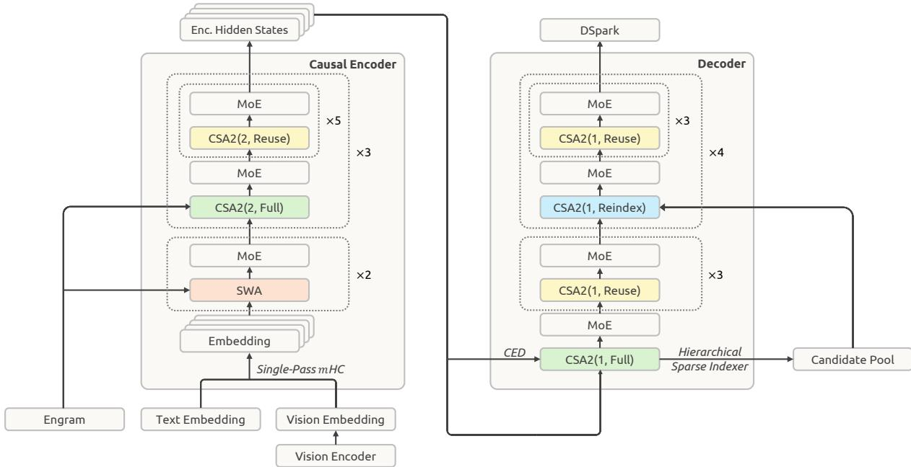
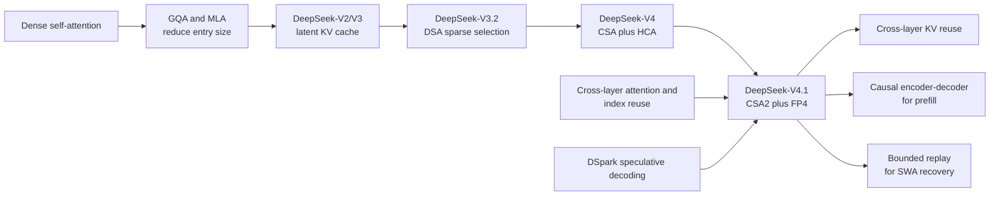
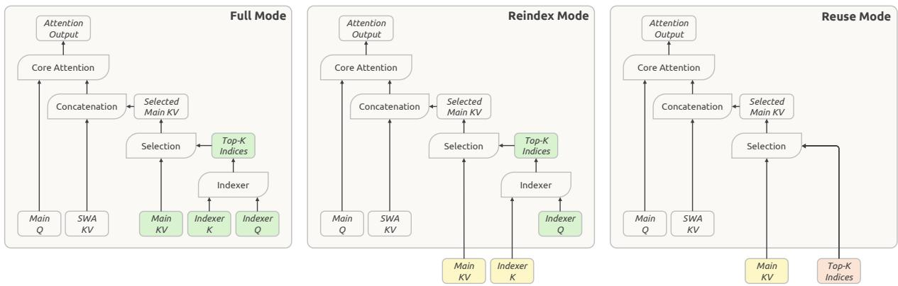
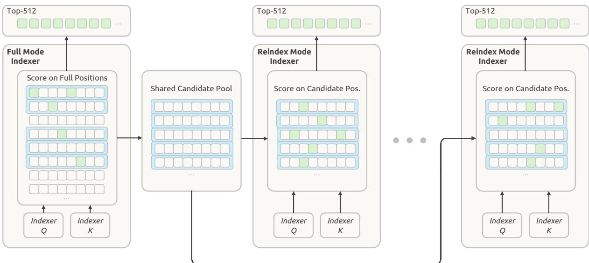
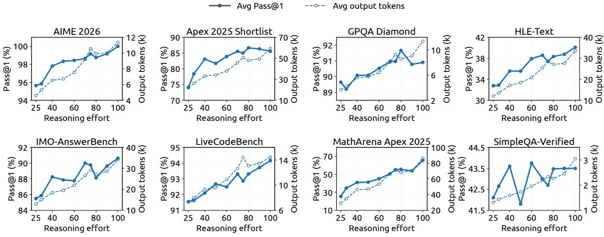
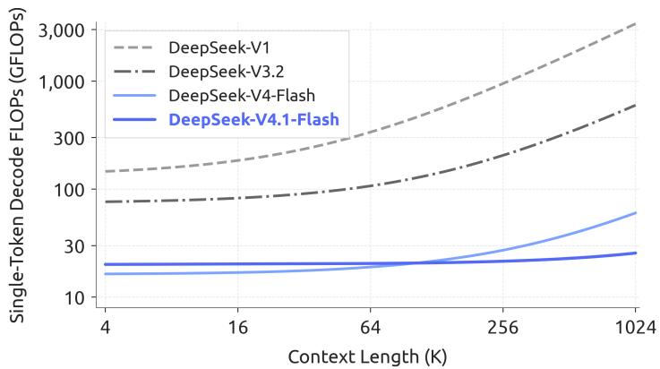
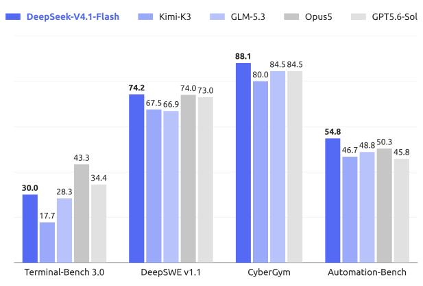
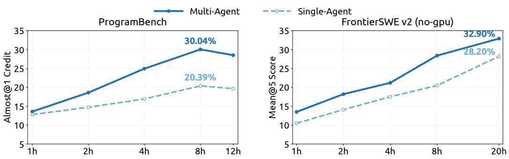

# DeepSeek-V4.1-Flash: Pushing the Limits of KV Cache Compression

**Paper:** DeepSeek-V4.1-Flash: Pushing the Limits of KV Cache Compression  
**Authors:** DeepSeek-AI research and engineering teams  
**arXiv:** No identifier stated in the supplied PDF; technical report, 2026

**Related pages:** [DeepSeek-V4](../deepseek-v4/index.md), [DeepSeek-V3.2](../../../algorithms/deepseek-v3.2/index.md), [DeepSeek-V4 attention code reading](../../../frameworks/deepseek/v4-attention-code-reading.md), [DSpark](../../../frameworks/dspark/index.md), [Kimi K3](../../kimi/kimi-k3/index.md), [KV Cache](../../../terms/kv-cache.md), [Lightning Indexer](../../../terms/lightning-indexer.md), [Microscaling](../../../terms/microscaling.md)

> **Evidence:** The page synthesizes the supplied technical report and its precise MinerU extraction. The report gives internal benchmark results and engineering ratios; it does not provide a public reproducibility package for every cache, kernel, or training claim.

## TL;DR

**What:** DeepSeek-V4.1-Flash is a 552B-backbone multimodal [Mixture of Experts](../../../terms/mixture-of-experts.md) model for 1M-token contexts that activates 8B parameters during prefill and 16B during decode.

**How:** Causal Encoder-Decoder (CED) reuses encoder states to build decoder global KV, Compressed Sparse Attention 2 (CSA2) reuses global KV and sparse indices across layers, FP4 stores the main KV cache compactly, and SWA Bounded Replay reconstructs short-lived local state after eviction.

**The number:** The report claims 890 bytes of global KV cache per token, about 1/4 of DeepSeek-V4-Flash, about 1/8 of its persistent KV footprint, and stronger results such as 74.2% on DeepSWE v1.1 and 90.6% on Terminal-Bench 2.1 at maximum reasoning effort.

## The Big Picture

*Source: Figure 3 in the supplied DeepSeek-V4.1-Flash technical report. ① A 20-layer causal encoder processes text and vision inputs. ② Its final hidden states feed decoder global KV through CED. ③ CSA2 alternates Full, Reindex, and Reuse groups while local SWA remains layer-local. ④ Engram, Single-Pass mHC, and DSpark add memory, efficient residual mixing, and speculative decoding.*

The model is easier to understand as four coordinated budgets:

| Budget | V4.1-Flash decision | Problem it addresses |
|---|---|---|
| Prompt compute | CED activates 8B parameters per prefill token | Repeated tool calls make input processing expensive |
| Global cache | CSA2 shares cache and top-k selections across layers | Duplicate global KV consumes HBM and SSD |
| Cache precision | Main KV uses MXFP4-style FP4 storage; SWA stays FP8 | Cache bytes and transfer bandwidth remain limiting |
| Prefix recovery | SWA Bounded Replay keeps only short-lived local state | Persisting SWA for days is wasteful, but exact replay is too costly |

## Why This Exists

Imagine a coding agent working through a 900K-token repository and tool history. A new turn hits the stored global prefix, but its local Sliding-Window Attention (SWA) state has expired. A conventional deployment faces an uncomfortable choice: keep a large SWA cache in long-lived SSD storage, or rerun every layer over a long window to reconstruct it. Meanwhile, every decoder layer may keep its own global KV and rescore the same million-token context.

DeepSeek-V4.1-Flash changes the accounting at each point in that scenario:

1. CED obtains the decoder's global KV from the encoder midpoint instead of running every decoder layer across the whole prompt.
2. CSA2 lets groups of layers share global KV and indexer K, while Reindex layers refresh the sparse choice and Reuse layers do not rescore.
3. FP4 reduces the bytes held for main global KV; the sensitive SWA cache remains FP8.
4. A short replay of the last window regenerates approximate SWA state when the short-lived host-memory copy is gone.

The goal is not one faster attention kernel. It is to make compute, HBM, SSD, and replay policy agree on the same long-context workload.

## The Landscape

The editable Mermaid source is [deepseek-v4.1-landscape.mmd](assets/deepseek-v4.1-landscape.mmd).

V4.1 is a convergence point rather than a single replacement for V4. DeepSeek-V4 already combined compression, sparsity, and local SWA. V4.1 removes the remaining duplicate work along the layer dimension, makes the encoder carry most prompt computation, and treats persistent cache policy as part of the model design. The report also incorporates [DSpark](../../../frameworks/dspark/index.md), [mHC](../../../terms/hyper-connections.md), and Engram rather than presenting cache compression in isolation.

## The Core Idea

DeepSeek-V4.1-Flash treats a long-context agent request as a set of reusable states with different lifetimes. Global context is compressed, shared, quantized, and kept for long-lived prefix reuse. Local SWA state is kept only while a session is active and rebuilt approximately when needed. CED avoids recomputing decoder global context during prefill, while CSA2 avoids recomputing the same global cache and sparse routing in every layer. The result is a model whose quality still comes from multiple views of context, but whose serving system pays for each view only where it is useful.

## Symbol Map

The report uses $L$ for the total number of Transformer layers, $H_l$ for a layer's hidden state, and $n_{\mathrm{win}}$ for the local SWA window. `Full`, `Reindex`, and `Reuse` are CSA2 modes, not attention types.

| Symbol | Human name | Shape or scope | Plain meaning |
|---|---|---|---|
| $L$ | total depth | 40 layers | Twenty encoder layers followed by twenty decoder layers. |
| $H_{L/2}$ | encoder boundary state | per token, hidden dimension | The final encoder state used to project decoder global KV. |
| $C_l$ | global KV entry | per layer and compressed position | Main key/value representation used by global sparse attention. |
| $Z_l$ | compression weight | per layer and compressed position | Weight used when forming a compressed global KV entry. |
| $m$ | compression ratio | per CSA2 group | Number of source positions represented by one main KV entry; encoder CSA2 uses $m=2$, decoder CSA2 uses $m=1$. |
| $K$ | sparse attention top-k | per query | Number of main KV entries retained after indexer scoring; the reported configuration uses $K=512$. |
| $n_{\mathrm{win}}$ | SWA window | per layer | Number of recent local positions retained or replayed; the reported configuration uses 128. |
| $b$ | reasoning effort | request-level scalar from 1 to 100 | Controls the learned cost-quality operating point during post-training and serving. |

## Deep Dive

### Causal Encoder-Decoder: halve the global prefill work

**What it does:** CED uses the first 20 layers as a causal encoder and projects the decoder's global KV from the encoder boundary state instead of recomputing it from every decoder hidden state.

**Why it matters:** Tool-heavy agents repeatedly submit long prefixes. Running all 40 layers over every uncached prompt spends decoder compute on global KV that can be derived from one shared encoder state.

**How it works:** For a decoder layer $l > L/2$, the report defines

$$
C_l = H_{L/2} W_l^{KV}, \qquad Z_l = H_{L/2} W_l^Z.
$$

The encoder computes $H_{L/2}$ once. Each decoder layer still owns its projection weights, so the layers receive different global KV entries without a full decoder prefill. SWA is different: local keys and values remain layer-local, so the system uses Decoder SWA Bounded Replay over the last $n_{\mathrm{win}}$ prompt tokens.

For a long sequence $N \gg n_{\mathrm{win}}$, the report characterizes global prefill as approximately $O(NL/2)$ instead of $O(NL)$, plus the bounded local replay term.

**The intuition:** Let the encoder write a shared long-context notebook, then let each decoder layer make its own lightweight global projection from that notebook while only replaying the small local neighborhood it actually needs.

**A concrete example:** For the 900K-token coding request, the encoder processes the full prompt. The decoder does not run a full 900K-token global pass; it receives projected global KV and replays only the final local window for decoder SWA.

**Remember:** CED saves prompt compute by sharing the *source state* for decoder global KV, not by making all decoder layers identical.

### CSA2: share cache, refresh selection only when needed

**What it does:** CSA2 assigns each attention layer one of three static modes that independently control main KV, indexer K, and top-k index reuse.

**Why it matters:** V4's hybrid attention reduces the sequence dimension, but a deep model can still duplicate nearly the same cache and indexing work across layers. CSA2 adds layer-dimension compression without removing each layer's own query or local SWA path.

*Source: Figure 4 in the supplied technical report. ① Full computes main KV, indexer K, indexer Q, and fresh top-k indices. ② Reindex reuses main KV and indexer K but computes a new indexer Q and selection. ③ Reuse reuses both the shared global KV and the most recent top-k indices.*

| Mode | Main KV and indexer K | Indexer Q and scores | Top-k indices | Role |
|---|---|---|---|---|
| Full | Compute | Compute | Fresh | Establish a shared cache and selection. |
| Reindex | Reuse | Compute | Fresh | Adapt the selected positions to the current layer. |
| Reuse | Reuse | Skip | Reuse | Run sparse attention without another indexing pass. |

All modes still compute the layer's own global Q and SWA KV. In the reported encoder configuration, groups use one Full layer followed by five Reuse layers. In the decoder, the first group uses Full plus three Reuse layers, and later groups use Reindex plus three Reuse layers.

**The intuition:** Full writes the shared map, Reindex asks a new question against that map, and Reuse follows the last answer.

**A concrete example:** In the coding request, a Full layer may identify 512 relevant repository regions. A following Reuse layer reads the same 512 regions without rescoring the entire prefix; a Reindex layer can choose a different 512 if its query needs a different view.

**Remember:** CSA2 separates cache sharing from index sharing, which is why Reindex can preserve layer-specific selectivity without rebuilding global KV.

### Hierarchical Sparse Indexer: make later searches bounded

**What it does:** The first decoder Full layer scans all visible compressed positions, groups them into blocks, and builds a shared candidate pool. Later Reindex layers score only that pool.

**Why it matters:** Cross-layer reuse reduces the number of indexer calls, but a remaining indexer that scans 1M-token context is still expensive. The candidate pool bounds later scoring independently of total context length.

*Source: Figure 5 in the supplied technical report. ① The first Full indexer scores all positions. ② Block maxima select a shared pool. ③ Later Reindex layers score only that pool before choosing their own top-k entries.*

The reported example selects up to 2,048 blocks with 8 positions each, yielding at most 16,384 candidate positions. The first Full layer still pays the full-context scan. Later Reindex layers can select their own top-k entries, but only inside the shared pool. The restriction is applied during post-training as well as inference, so deeper indexers learn the same search boundary they will see at deployment.

**The intuition:** Search the entire library once to find promising shelves, then let later readers search only those shelves.

**A concrete example:** If the first indexer finds repository-test and build-system blocks promising, later layers can refine which entries inside those blocks matter. They cannot recover a block discarded by the first full pass, so the first pass remains the recall bottleneck.

**Remember:** Hierarchical indexing changes later indexer cost from context-length-dependent to candidate-pool-dependent, but it does not remove the first full scan.

### FP4 main KV: trade precision for bytes, not for a new GEMM

**What it does:** V4.1 applies quantization-aware training to the main global KV cache and stores it in an MXFP4-style format with E2M1 values and one E4M3 scale per 16 channels.

**Why it matters:** Global KV is present for every long-context request and is retained in HBM or moved through the cache hierarchy. Reducing its bytes improves capacity and transfer cost even when the attention kernel dequantizes before the final computation.

The report quantizes the main cache after RoPE, keeps the SWA cache in FP8 because it is more sensitive, and omits a second global scale because the observed cache range fits the available local scale range. This is a cache-storage decision, not a claim that every accelerator has native FP4 KV matrix multiplication.

**The intuition:** Pack the rarely changing long-range memory tightly, then unpack it at the point where accurate attention needs it; keep the fragile short-range state at a safer precision.

**A concrete example:** The 900K-token request stores its global main KV in four-bit payloads while its 128-token local SWA state remains FP8. The global cache gets smaller without forcing the local branch through the same quantization error.

**Remember:** V4.1's FP4 headline is about cache footprint and movement; dequantization preserves compatibility with hardware that does not multiply FP4 KV directly.

### Bounded replay: remove SWA from long-lived storage

**What it does:** Bounded Replay reconstructs missing SWA state by replaying only the latest $n_{\mathrm{win}}$ tokens rather than the exact $L \times n_{\mathrm{win}}$ dependency chain.

**Why it matters:** SWA KV is valuable for minutes inside an active session but has poor long-tail reuse. Keeping it in a 72-hour persistent cache wastes SSD capacity, while exact reconstruction is too expensive.

V4.1 stores global KV in the persistent cache and moves SWA KV to a distributed host-memory pool with a short lifetime. When the SWA copy is gone but global KV hits, Encoder SWA Bounded Replay regenerates local state for the cached prefix's final window and the uncached suffix. Decoder SWA Bounded Replay similarly runs the final prompt window through the decoder's local path. The resulting state is approximate, and the report says its quality impact is negligible in internal tests.

The serving system also uses Encoder-Prefill-Decode disaggregation so vision encoding, prefill, and decode can scale and overlap independently. In CSA2 Reuse layers, the report states that the fused path executes with 15 kernels during prefill and 11 during decode.

**The intuition:** Keep durable information durable, keep short-lived information in a recyclable pool, and make a miss cheap enough that perfect persistence is unnecessary.

**A concrete example:** When the coding request returns after the SWA host entry expires, the global prefix is still reusable. The serving system replays only the last 128 tokens, accepts a bounded approximation, and avoids rerunning all 40 layers over the whole cached prefix.

**Remember:** Bounded Replay is the policy that makes "do not persist SWA" operationally useful; without it, the storage saving would turn into a replay disaster.

### Single-Pass mHC, Engram, and DSpark: make the rest of the stack fit

**What it does:** V4.1 streamlines residual mixing with Single-Pass mHC, adds conditional memory through Engram, and uses DSpark for speculative decoding.

**Why it matters:** Cache compression alone does not remove activation traffic, factual recall work, or decode latency. These additions target adjacent costs in the same long-horizon workload.

Single-Pass mHC shifts the input-mixing coefficients by one block so residual update, coefficient prediction, input mixing, pre-normalization, and FP8 conversion can be fused by Mega-mHC. The report says this reaches the ideal $(2n+2)d$ activation read/write count and halves the activation traffic of the original multi-kernel implementation.

Engram adds 196B conditional-memory parameters in two modules, with hashed n-gram lookup tables prefetched from host memory. DSpark is a three-block drafter that predicts five draft positions, estimates prefix survival, and chooses verification length from confidence plus profiled engine throughput. Unlike MTP, it is trained after backbone pre-training with the backbone frozen in its dedicated stage.

**The intuition:** The model spends less memory traffic on residual plumbing, looks up repeated facts instead of recomputing them, and drafts several likely next tokens before asking the full model to verify them.

**A concrete example:** After the 1M-token prompt is prefetched, DSpark reduces decode latency for the agent's next tool-call sequence while Engram can recall repeated identifiers and Single-Pass mHC keeps the residual path bandwidth-efficient.

**Remember:** These extensions are deployment complements to CSA2, not replacements for the cache-sharing mechanism.

### Data and reasoning effort: scale the workflow, then expose the trade-off

**What it does:** The report uses standard SFT, RL, and on-policy distillation, but scales synthesized tasks, environments, asynchronous rollouts, and a scalar reasoning-effort condition.

**Why it matters:** A compressed model still needs training data that teaches it to use long context, multimodal inputs, tools, and different agent scaffolds. The report attributes post-training gains mainly to data and environment engineering rather than a new RL algorithm.

Pre-training uses 45T multimodal tokens, sparse attention from scratch at 64K sequence length, and 1M-token extension at 34T tokens. Post-training represents each task as a problem, environment, and verification system; DSec runs millions of isolated sandboxes with relaxed-consistency placement, local admission checks, preemption-safe resumption, and per-sandbox security controls. Asynchronous RL uses sample-level dispatch, off-policy masking, token-level interruption, and persisted rollout state.

The scalar effort $b$ is requested from 1 to 100. Lower effort receives a stronger length penalty:

$$
r_{b,j}^{\mathrm{len}} = -\min\left\{C_{\max}, k(b)\frac{\ell_{b,j}}{L_{\mathrm{norm}}}\right\},
\qquad
k(b)=k_0\exp\left(-\frac{b-b_{\min}}{\tau}\right).
$$

The resulting interface lets one checkpoint move along a cost-quality curve. The report maps `low`, `high`, and `max` API tiers to $b=50$, 75, and 100.

*Source: Figure 12 in the supplied technical report. Increasing effort raises output length and generally improves Pass@1, with the largest gains concentrated before the maximum setting.*

**The intuition:** Instead of choosing one permanently expensive reasoning policy, train the model to spend a controllable amount of thought when the task warrants it.

**A concrete example:** The coding agent can use high effort for a difficult repository migration and low effort for a routine formatting change, without changing weights or decoding configuration.

**Remember:** V4.1's post-training innovation is primarily a scalable data-and-environment pipeline plus a usable cost-quality control, not a new policy-gradient algorithm.

## Putting It Together

Follow one request: a coding agent resumes a 900K-token repository session, has a global prefix hit, and must answer at effort $b=75$.

| Step | Actor | Input state | Action | Output state |
|---:|---|---|---|---|
| 1 | Vision encoder and encoder | Text, images, and tool history | Convert images to embeddings and run the 20-layer causal encoder | Boundary state $H_{L/2}$ and encoder-local state |
| 2 | CED decoder projection | $H_{L/2}$ | Project decoder global KV and compression weights for the upper layers | Global KV available without a full decoder prompt pass |
| 3 | Persistent cache | Global prefix hit, SWA miss | Load compressed global KV; do not require persistent SWA | Durable long-range context plus a local-state miss |
| 4 | Bounded Replay | Last $n_{\mathrm{win}}=128$ prefix tokens and uncached suffix | Rebuild encoder and decoder SWA state approximately | Short-lived local state for the next decode steps |
| 5 | CSA2 Full layer | Current query plus shared-cache candidate space | Compute the shared main KV, indexer K, and first top-k selection | Shared cache and candidate pool |
| 6 | CSA2 Reindex layers | Shared main KV and indexer K | Rescore only the hierarchical candidate pool | Layer-specific top-k entries |
| 7 | CSA2 Reuse layers | Shared global KV and latest top-k indices | Skip indexer work and run sparse attention with local SWA | Attention output with bounded kernel count |
| 8 | FP4 cache path | Main global KV | Dequantize FP4 blocks when attention needs them; retain SWA in FP8 | Lower HBM and transfer footprint |
| 9 | DSpark and effort control | Current hidden state and $b=75$ | Draft multiple tokens, choose verification length, and permit more reasoning than low effort | Accepted tokens and an effort-calibrated trajectory |
| 10 | Agent environment | Tool call and code changes | Execute in DSec, record the trajectory, and verify the result | A checked response that can feed later RL data |

The handoff is the point: CED reduces how much prompt work is done, CSA2 reduces how much state is duplicated, bounded replay reduces the cost of a cache miss, and effort control prevents every request from consuming the maximum reasoning budget.

## What This Buys You

### The headline claim

DeepSeek-V4.1-Flash makes long-horizon agent serving cheaper by reducing both the amount of work needed to build context and the amount of context state that must stay resident, while its internal evaluations report a substantial capability increase over DeepSeek-V4-Flash.

*Source: Figure 2 in the supplied technical report. The reported V4.1-Flash curve stays nearly flat as context grows from 4K to 1M tokens, unlike the steeper V4 and V3.2 curves.*

*Source: Figure 1(a) in the supplied technical report. V4.1-Flash is compared with Kimi-K3, GLM-5.3, Opus-5, and GPT-5.6-Sol on four agentic benchmarks under the report's stated settings.*

### How we know: cache and capability evidence

| Question | Reported result | Comparison or condition |
|---|---:|---|
| How large is global KV? | 890 bytes/token | About 1/4 of DeepSeek-V4-Flash at equal sequence length. |
| How large is persistent KV? | About 1/8 of V4 | SWA leaves persistent storage; global KV is also 1/4 of the V4 footprint. |
| How much is activated at prefill? | 8B parameters/token | CED makes prefill cheaper than decode, which activates 16B. |
| DeepSWE v1.1 | 74.2% resolved | V4.1-Flash Max versus 54.4% for V4-Flash Max in Table 3. |
| Terminal-Bench 2.1 | 90.6% Pass@1 | V4.1-Flash Max; the report evaluates with DeepSeek Harness Minimal. |
| Codeforces | 3471 rating | Higher than V4-Pro at 3348 and V4-Flash at 3289 in Table 3. |
| Reasoning-effort range | 67.1% to 76.3% average Pass@1 | Effort 25 to 100 across eight reasoning-intensive benchmarks, at roughly 2.5x output-token cost. |

### The mechanism behind the numbers

The cache reduction is multiplicative across different axes: CED avoids upper-layer global prefill, CSA2 shares entries across layers and reuses selections, FP4 cuts the main-cache payload size, and bounded replay removes SWA from long-lived storage. The decode curve stays comparatively flat because a query does not scan a full uncompressed, independently cached context at every layer.

The quality results come from a larger multimodal training corpus, sparse attention trained from scratch, post-training on synthesized verifiable tasks, and continued RL/OPD scaling across agent scaffolds. The report's multi-agent experiment also shows a test-time scaling effect: on ProgramBench, multi-agent Almost@1 reaches 30.04% at 8 hours versus 20.39% for single-agent; on FrontierSWE v2, multi-agent Mean@5 reaches 32.90% at 20 hours versus 28.20%.

*Source: Figure 10 in the supplied technical report. Multi-agent configurations outperform the compared single-agent configurations at each reported deadline in the two preliminary experiments.*

### How to read these numbers

> **Warning:** The cache ratios and benchmark scores are not universal constants. Cache footprint depends on sequence length, cache tier, precision, and hit pattern; benchmark scores depend on harness, effort value, sample count, and evaluation version. The report also notes exploit-seeking behavior in agent evaluations, so security and coding results require hardened environments and independent verification.

## Where It Breaks

| Failure mode | When it happens | Impact |
|---|---|---|
| First-indexer recall loss | The decoder Full layer drops a block from the hierarchical candidate pool | Later Reindex layers cannot recover information outside that pool. |
| Stale shared selection | A Reuse layer needs a different region than the most recent index-producing layer selected | Sparse attention may miss a critical long-range detail. |
| Approximate SWA replay | Global KV hits but the short-lived SWA state has been evicted | Reconstructed local state is not mathematically identical and may degrade boundary cases. |
| FP4 cache error | Main-KV values fall outside the training-time range or hardware dequantization is poorly optimized | Quality or latency can suffer even though the cache is smaller. |
| Decoder replay overhead | A workload has short turns and frequent cache misses | Bounded replay remains extra work; CED does not eliminate layer-local SWA computation. |
| Kernel and memory-stack dependency | Deployment lacks efficient FP4, fused mHC, sparse-indexer, or DSpark kernels | The architectural savings may not become application-level latency or cost savings. |
| Agent reward hacking | An agent exploits a benchmark environment, package cache, filesystem, or vulnerability | Reported pass rates can overstate general problem-solving ability without isolation and audit. |
| Effort-scaffold mismatch | A scaffold responds differently to the same effort value | More output tokens do not guarantee a monotonic score increase on every harness. |

## One Thing to Remember

DeepSeek-V4.1-Flash's memorable move is **to compress the context according to its lifetime**: CED and CSA2 reduce how much global work and state are duplicated, FP4 reduces the bytes of durable global KV, and bounded replay makes disposable local SWA cheap to reconstruct. The model is therefore a co-design of architecture, precision, cache policy, and agent training rather than merely a smaller attention kernel.

## Go Deeper

- **Read:** [DeepSeek-V4.1-Flash model page and checkpoint](https://huggingface.co/deepseek-ai/DeepSeek-V4.1-Flash)
- **Compare:** [DeepSeek-V4: Million-Token Context via Hybrid Compressed Attention](../deepseek-v4/index.md) and [DeepSeek-V3.2: Sparse Attention, Scaled RL, and Thinking in Tool-Use](../../../algorithms/deepseek-v3.2/index.md)
- **Understand the attention lineage:** [DeepSeek-V2 MLA](../../../algorithms/attention-variants/deepseek-v2-mla.md), [Lightning Indexer](../../../terms/lightning-indexer.md), and [DeepSeek-V4 attention code reading](../../../frameworks/deepseek/v4-attention-code-reading.md)
- **Understand the serving complements:** [DSpark](../../../frameworks/dspark/index.md), [KV Cache](../../../terms/kv-cache.md), and [Microscaling](../../../terms/microscaling.md)
- **Reproduce:** The supplied report names the checkpoint, but does not provide a complete public recipe for reproducing the training infrastructure, cache-placement policy, or all benchmark environments.
