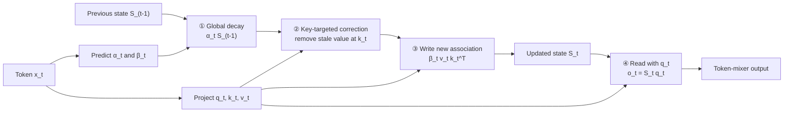
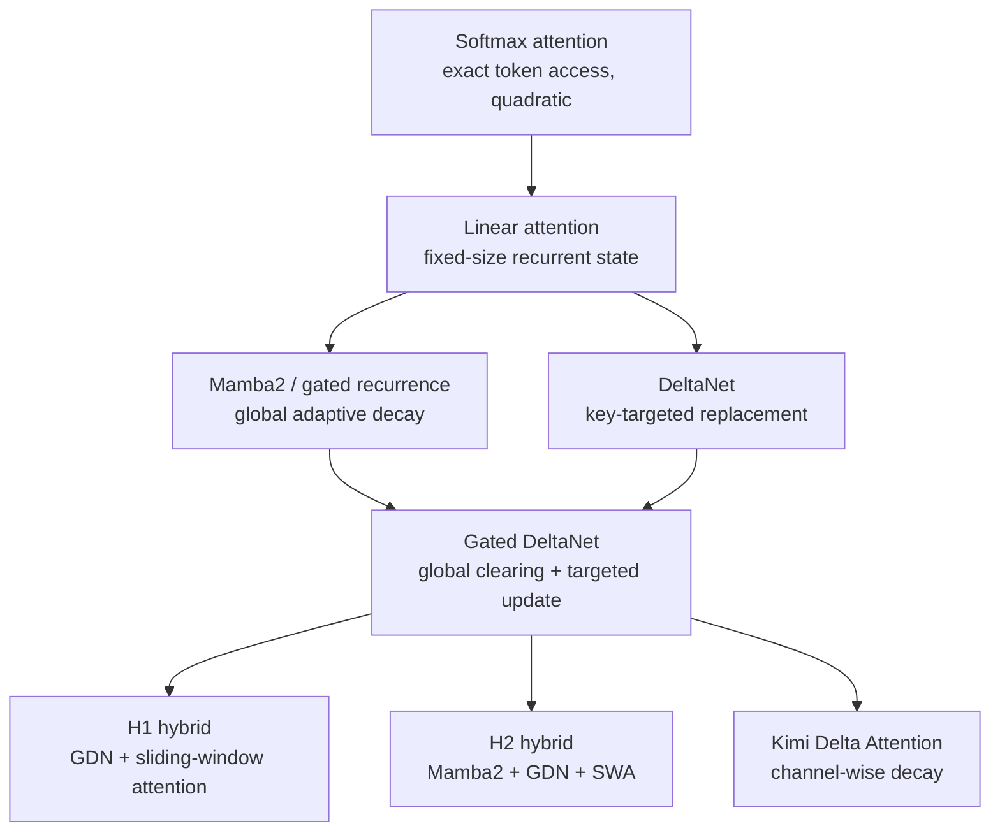
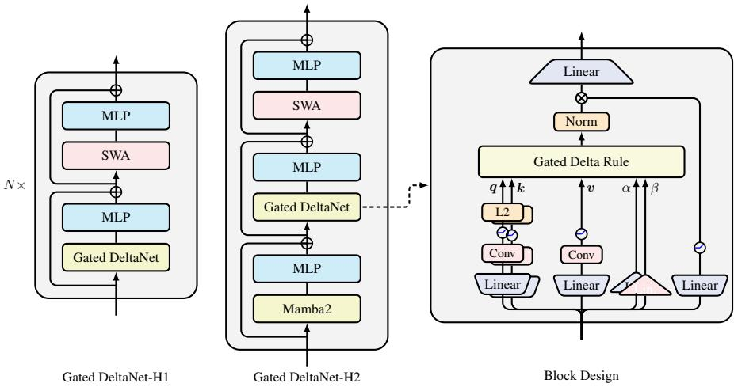

# Gated Delta Networks: Improving Mamba2 with Delta Rule

**Paper:** Gated Delta Networks: Improving Mamba2 with Delta Rule  
**Authors:** Songlin Yang, Jan Kautz, Ali Hatamizadeh  
**arXiv:** [2412.06464](https://arxiv.org/abs/2412.06464) (December 2024)

**Related pages:** [Kimi Linear](../../kimi/kimi-linear/index.md), [Transformers Are RNNs: Linear Attention](../../../algorithms/linear-attention/index.md), [Linear Attention term](../../../terms/linear-attention.md), [SWAT](../swat-sliding-window-attention/index.md)

## TL;DR

**What:** Gated DeltaNet gives a fixed-size recurrent memory both a fast global reset and a precise key-specific rewrite operation.

**How:** It multiplies DeltaNet's key-targeted transition by Mamba2-style data-dependent decay, then extends the WY/UT chunkwise formulation so training remains matrix-multiplication friendly.

**The number:** At 1.3B parameters and 100B training tokens, pure Gated DeltaNet reaches 55.32 average commonsense accuracy versus Mamba2's 54.89 and DeltaNet's 52.14; the H1 hybrid reaches 56.40.

## The Big Picture

*① The gate can rapidly weaken the whole old state. ② The delta term corrects only the association addressed by the current key. ③ The new key–value pair is written. ④ The query reads the updated fixed-size state.*

*Editable source: [gated-delta-memory-flow.mmd](assets/gated-delta-memory-flow.mmd).*

**The novelty is control at two scales:** global forgetting handles context changes, while targeted correction prevents one new association from needlessly erasing unrelated memories.

## Why This Exists

Imagine a long document containing many employee–office pairs. Midway through, the document switches to a new company and assigns employee `A17` a new office. A Mamba2-like scalar decay can clear the old company quickly, but it weakens every still-useful association together. DeltaNet can precisely replace the value bound to `A17`, but when thousands of irrelevant old pairs accumulate, its fixed-size state suffers collisions because it cannot clear them quickly.

**The memory needs both a room-wide dimmer and a key-specific eraser.** Gated DeltaNet supplies both without returning to a growing token cache.

## The Landscape

*Mamba2 and DeltaNet solve different halves of fixed-state memory management. Gated DeltaNet joins those branches; later hybrids add explicit local attention, while Kimi Linear refines the scalar decay into channel-wise decay.*

*Editable source: [gated-delta-landscape.mmd](assets/gated-delta-landscape.mmd).*

## The Core Idea

**Forget broadly only when necessary, then edit narrowly.** A recurrent state inevitably mixes many associations into limited capacity. Scalar gating decides how much of the whole past remains relevant; the delta update decides which content addressed by the current key should be corrected. Their composition is more useful than either operation alone.

## Symbol Map

Lowercase bold letters are per-token vectors; $\mathbf S_t$ is the matrix-valued recurrent state. Subscript $t$ denotes sequence position, while $[c]$ denotes a training chunk.

| Symbol | Human name | Shape / scope | Plain meaning |
|---|---|---|---|
| $\mathbf S_t$ | memory state | $d_v \times d_k$ | Fixed-size table of key–value associations after token $t$. |
| $\mathbf q_t,\mathbf k_t,\mathbf v_t$ | query, key, value | per token/head | Read address, write address, and content. |
| $\alpha_t$ | decay gate | scalar per token/head | Fraction of the old state retained; near zero enables rapid clearing. |
| $\beta_t$ | write strength | scalar per token/head | Strength of the key-targeted correction and new write. |
| $C$ | chunk size | training scope | Number of tokens processed together by the parallel algorithm. |
| $\Gamma_{[c]}$ | decay mask | $C \times C$ | Pairwise cumulative decay factors inside a chunk. |

## Deep Dive

### Global Decay Clears Saturated Memory

**What it does:** Multiplies the prior state by a learned scalar $\alpha_t \in (0,1)$.

**Why it matters:** In the employee–office document, the company switch makes many old associations irrelevant at once; correcting them one key at a time is too slow.

**How it works:** If $\alpha_t$ is near one, most of the state survives. If it falls near zero, the model performs a soft reset before writing the new association. Unlike a permanent exponential decay schedule, the gate depends on the current token.

**The intuition:** Use one control to decide whether the current context still belongs to the same memory regime.

**A concrete example:** At the “New company records” boundary, the model can sharply reduce stale company-A associations before reading company-B records.

**Remember:** $\alpha_t$ controls **how much of all memory survives**, not which individual key changes.

### The Delta Rule Rewrites One Association

**What it does:** Corrects the old value predicted at the current key before writing the new value.

**Why it matters:** If only `A17` changes office, globally decaying every employee record wastes useful memory.

**How it works:** The [delta rule](../../../terms/delta-rule.md) update can be read as one online gradient step:

$$
\mathbf S_t =
\alpha_t\mathbf S_{t-1}
\mathbin{+}\beta_t\left(\mathbf v_t-\alpha_t\mathbf S_{t-1}\mathbf k_t\right)\mathbf k_t^T.
$$

The update follows a three-stage **predict → measure → correct** cycle:

| Stage | Operation | Role |
|---|---|---|
| ① **Predict** | $\underset{t}{\hat{\mathbf v}} = \alpha_t \underset{t-1}{\mathbf S} \mathbf k_t$ | Key→value lookup: retrieve whatever value the memory currently stores at $\mathbf k_t$ |
| ② **Measure** | $\mathbf e_t = \mathbf v_t - \hat{\mathbf v}_t$ | Compute how far the stored value is from the desired value |
| ③ **Correct** | $\mathbf S_t = \alpha_t \mathbf S_{t-1} + \beta_t \mathbf e_t \mathbf k_t^T$ | Write only the error back, associated with the same key |

**Why is the update targeted?** When the corrected state is queried with an
arbitrary key $\mathbf q$, the correction is scaled by the similarity
$\mathbf k_t^T \mathbf q$:

$$
\mathbf S_t\mathbf q
=
\alpha_t\mathbf S_{t-1}\mathbf q
\mathbin{+}
\beta_t\mathbf e_t\;
(\mathbf k_t^T\mathbf q).
$$

| Query–key relationship | $\mathbf k_t^T \mathbf q$ | Effect |
|---|---|---|
| $\mathbf q = \mathbf k_t$ (same key) | $1$ (if normalized) | Full correction applied |
| $\mathbf q \perp \mathbf k_t$ (orthogonal) | $0$ | No side effect |
| $\mathbf q$ similar to $\mathbf k_t$ | partial | Partial correction (possible interference) |

In the idealized case $\beta_t = 1$ and $\lVert\mathbf k_t\rVert = 1$,
reading the same key after the update confirms exact replacement:

$$
\mathbf S_t\mathbf k_t
=
\hat{\mathbf v}_t
\mathbin{+}
(\mathbf v_t - \hat{\mathbf v}_t) \cdot 1
=
\mathbf v_t.
$$

> **In short:** read what is stored at this key, calculate how wrong it is,
> and write that error back at the same key — a content-addressed replace,
> not a blind accumulate.

**The intuition:** Predict the value already stored at this address, then write only the correction.

**A concrete example:** When `A17 → Room 512` supersedes `A17 → Room 204`, the update targets `A17` while leaving other employee keys mostly intact.

**Remember:** The delta component performs **content-addressed correction**, not simple accumulation.

### Chunkwise WY Training Recovers GPU Parallelism

**What it does:** Groups sequential transition products into chunks expressed through dense matrix operations.

**Why it matters:** A useful recurrence is not practical for pretraining if every token forces a serial GPU kernel.

**How it works:** The transition $\alpha_t(\mathbf I-\beta_t\mathbf k_t\mathbf k_t^T)$ is a decayed identity-minus-rank-one matrix. The paper extends DeltaNet's WY/UT representation with cumulative decay factors, computing transformed keys and values inside each chunk. Chunks pass only their boundary state forward; work within a chunk becomes [matmul](../../../terms/gemm.md)-heavy and tensor-core friendly.

**The intuition:** Preserve sequential meaning at chunk boundaries while batching the algebra inside each chunk.

**A concrete example:** The 4K-token employee document can be split into blocks: each block processes its local corrections in parallel, then hands one final memory matrix to the next block.

**Remember:** Chunking changes the execution schedule, **not the recurrence being modeled**.

### Hybrid Layers Restore Explicit Local Access

**What it does:** Interleaves Gated DeltaNet with sliding-window attention (H1), or with Mamba2 and sliding-window attention (H2).

**Why it matters:** Fixed-size summaries remain weak at exact local shifts, comparisons, and dense retrieval.

**How it works:** The recurrent layers carry compressed long-range state, while a 2K-token sliding window preserves direct pairwise access nearby. The authors' block also uses short convolution, SiLU, L2-normalized queries/keys, output normalization, and an output gate.

*The paper's architecture figure: pure Gated DeltaNet replaces attention with its recurrent token mixer; H1 and H2 interleave that mixer with SWA and, for H2, Mamba2.*

**The intuition:** Let recurrence summarize the distant past and attention handle the nearby details it should not compress.

**A concrete example:** The recurrent state carries older employee records, while SWA directly compares the current `A17` update with nearby qualifiers and formatting.

**Remember:** The strongest aggregate results come from **hybrids**, not proof that fixed-state recurrence replaces attention everywhere.

## Putting It Together

1. Project the current token into query, key, value, decay gate, and write strength.
2. Decay the incoming state according to whether the context still looks relevant.
3. Read the decayed state's current prediction at the new key.
4. Form the prediction error and write its key-aligned correction.
5. Query the updated state to produce the token-mixer output.
6. During training, perform these operations chunkwise with decay-aware WY/UT transforms.
7. In H1/H2, route periodic layers through sliding-window attention for explicit local comparisons.

## What This Buys You

### The headline claim

**Among like-sized recurrent baselines, Gated DeltaNet consistently improves language modeling, retrieval, length extrapolation, and LongBench; hybridization raises quality further.**

### How we know: 1.3B models trained on 100B tokens

| Model | WikiText ppl ↓ | Commonsense avg ↑ | Real-world retrieval avg ↑ | LongBench avg ↑ |
|---|---:|---:|---:|---:|
| Mamba2 | 16.56 | 54.89 | 29.8 | 13.5 |
| DeltaNet | 17.71 | 52.14 | 26.2 | 13.6 |
| Gated DeltaNet | **16.42** | **55.32** | **30.6** | **16.6** |
| Transformer++ | 18.53 | 52.25 | 37.0 | 11.0 |
| Gated DeltaNet-H1 | 16.07 | **56.40** | 39.0 | 17.8 |
| Gated DeltaNet-H2 | **15.91** | 56.18 | **40.1** | **18.4** |

### The mechanism behind the numbers

S-NIAH isolates the complement: DeltaNet retains a simple needle well because it avoids global decay, but degrades when realistic distractors saturate memory; Mamba2 filters distractors but loses older exact values. Gated DeltaNet lands between those failure modes. SWA then removes some local-detail burden from the recurrent state, explaining the hybrids' larger retrieval gains.

### ⚠️ How to read these numbers

The table compares pretraining architectures under the paper's controlled recipe, not instruction-tuned production models. The pure recurrent model still trails attention/hybrid systems on real-world retrieval, and the paper reports Gated DeltaNet as roughly 2–3K tokens/s slower than Mamba2 on one H100, despite being close to DeltaNet throughput.

## Where It Breaks

| Failure mode | When it happens | Impact |
|---|---|---|
| Fixed-state collisions | Relevant associations exceed the matrix state's effective capacity | Exact retrieval degrades even with better forgetting. |
| Global gate is too coarse | Some dimensions should be forgotten while others retained | Scalar $\alpha_t$ erases useful and useless content together; later [KDA](../../../terms/kimi-delta-attention.md) targets this limitation. |
| Delta correction aliases keys | Different items map to similar key directions | Updating one association can disturb another. |
| Recurrence loses local detail | A task needs exact nearby comparison, copying, or positional shifts | Pure Gated DeltaNet can underperform a hybrid with SWA. |
| Throughput trails simpler transitions | Hardware or sequence length favors Mamba2's more restricted state transition | Expressiveness costs roughly 2–3K tokens/s in the reported H100 comparison. |
| Evidence is pretraining-scale specific | Models, data, kernels, or instruction tuning differ from the 1.3B/100B setup | Reported rankings may not transfer unchanged. |

## One Thing to Remember

**Gated DeltaNet gives recurrent memory a dimmer switch and an addressable eraser.** Mamba2-style decay clears a stale context quickly; the delta rule repairs one key–value association without indiscriminately weakening the rest. Chunkwise algebra makes that richer recurrence trainable, while hybrid attention remains the practical escape hatch for exact local access.

## Go Deeper

- **Read:** [arXiv 2412.06464](https://arxiv.org/abs/2412.06464)
- **Build on:** [Kimi Linear](../../kimi/kimi-linear/index.md) extends scalar decay to channel-wise Kimi Delta Attention.
- **Understand the context:** [Linear Attention](../../../algorithms/linear-attention/index.md) explains the fixed-state foundation; [SWAT](../swat-sliding-window-attention/index.md) provides a contrasting local-attention route.
- **Reproduce:** [NVlabs/GatedDeltaNet](https://github.com/NVlabs/GatedDeltaNet)
