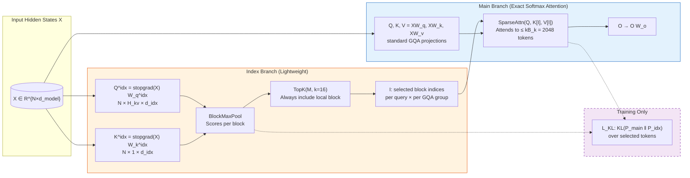
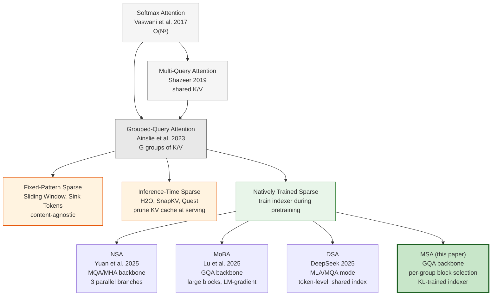

# MiniMax Sparse Attention (MSA)

**Paper:** MiniMax Sparse Attention
**Authors:** Xunhao Lai, Weiqi Xu, Yufeng Yang, Qiaorui Chen, Yang Xu, Lunbin Zeng, Xiaolong Li, Haohai Sun, Haichao Zhu, Vito Zhang, Jinkai Hu, Jiayao Li, Rui Gao, Zekun Li, Songquan Zhu, Jingkai Zhou, Pengyu Zhao (MiniMax, PKU, NVIDIA, ZJU, HUST, NJU, HDU)
**Published:** 2026
**Code:** [github.com/MiniMax-AI/MSA](https://github.com/MiniMax-AI/MSA)
**Model:** [MiniMax-M3 on HuggingFace](https://huggingface.co/MiniMaxAI/MiniMax-M3)

**Related pages:** [Grouped-Query Attention](../../../algorithms/attention-variants/grouped-query-attention/index.md), [DeepSeek-V3.2 DSA](../../../algorithms/deepseek-v3.2/index.md), [FlashAttention](../../../algorithms/flashattention/flashattention.md)

## TL;DR

**What:** MSA is a blockwise sparse attention mechanism that replaces dense GQA attention with a two-branch architecture: a lightweight Index Branch selects which KV blocks to attend to, and the Main Branch performs exact softmax attention over only those blocks.

**How:** Per GQA group, an Index Branch scores KV blocks via dot-product max-pooling and selects the top-$k$ blocks ($k=16$, $B_k=128$), always retaining the local block; a KL-divergence loss aligns the Index Branch with the Main Branch's attention distribution.

**The number:** At 1M context on a 109B MoE model, MSA achieves 28.4× per-token attention FLOPs reduction versus GQA, translating to 14.2× prefill and 7.6× decode wall-clock speedup on H800 while matching GQA on downstream benchmarks.

## The Big Picture

*① Input hidden states go through standard GQA Q/K/V projections for the Main Branch and separate lightweight Q^idx/K^idx projections for the Index Branch. ② The Index Branch computes block-level scores via max-pooling over token-level dot products, selects top-k blocks (always including the local block), producing per-query-per-group block indices. ③ The Main Branch performs exact softmax attention restricted to the selected blocks (≤2048 tokens). ④ During training only, a KL loss aligns the Index Branch distribution with the Main Branch's teacher distribution over the selected tokens.*

## Why This Exists

Consider a 109B-parameter LLM deployed for an agentic coding task. The agent needs to maintain context across hundreds of tool calls, repository files, and conversation turns — easily exceeding 100K tokens, with 1M-token contexts becoming the norm.

With standard GQA, **every attention layer attends to every previous token.** At 1M context with 64 query heads and head dimension 128, the per-layer per-token attention cost is $2 \times 64 \times 128 \times (10^6)^2 \approx 1.6 \times 10^{13}$ FLOPs — that is **16 teraFLOPs per token per layer.** For a 41-layer model generating 1000 output tokens, this is $41 \times 1000 \times 1.6 \times 10^{13} \approx 6.6 \times 10^{17}$ FLOPs just for attention.

**The problem:** This quadratic cost makes deployment at ultra-long contexts economically infeasible. Even if the hardware can handle it, the latency per token becomes unacceptable for interactive use.

**What MSA does differently:** Rather than attending to the full 1M-token context, MSA's Index Branch selects only $k \times B_k = 16 \times 128 = 2048$ key-value tokens per query. The Main Branch then computes exact softmax attention over exactly those 2048 tokens — a fixed budget regardless of total context length. The FLOPs drop from $\Theta(N^2)$ to $\Theta(N^2 \cdot d_{\text{idx}}/d_h)$ for indexing plus $\Theta(k B_k)$ for attention.

## The Landscape

MSA sits at the intersection of two design axes: **(1) native sparse training** (indexer learned during pretraining, not applied post-hoc) and **(2) per-GQA-group independent selection with block granularity.** Unlike DSA (token-level, shared across all query heads), MSA gives each GQA group its own top-k selection at block granularity. Unlike MoBA (LM-gradient-only training), MSA uses a dedicated KL loss that directly aligns the indexer to the Main Branch attention pattern.

### MSA vs. DSA: Head-to-Head

Both papers independently arrived at a 2048-token attention budget, but their architectures diverge dramatically because they target different backbones.

| Dimension | **DSA** (DeepSeek-V3.2) | **MSA** (this paper) |
|---|---|---|
| **Backbone** | MLA in MQA mode — all query heads share 1 KV latent per token | GQA — query heads partitioned into groups (16:1), each group has own KV |
| **Selection granularity** | Token-level — selects individual KV latent vectors | Block-level — selects 128-token blocks, max-pools per-block scores |
| **Selection scope** | Token-shared — all query heads per token share one set of selected KV entries | Per-GQA-group — each group independently selects its own top-k blocks |
| **Indexer design** | Multi-head ReLU with learned head weights $w_{t,j}^I$, FP8 | One index query per group + one shared index key head, simple dot-product |
| **Selection budget** | $k = 2048$ tokens | $k = 16$ blocks × $B_k = 128$ = 2048 tokens |
| **Training routes** | CPT only: dense warmup → sparse from MLA checkpoint | PT (from scratch) and CPT (from GQA checkpoint), both with indexer warmup |
| **Forced local** | Not specified | Always include local block (reserves 1 of 16 slots) |
| **Kernel design** | Deferred to open-source release | Fully described: exp-free TopK heap, KV-outer sparse attention, pre-scheduled chunking |
| **Model scale** | ~685B MoE | ~109B MoE |

**Why the designs differ.** DSA's token-level, token-shared approach is natural given MLA's MQA mode — there's one KV latent per token shared across all heads, so selection must be at token level. MSA's block-level, per-group approach exploits GQA's group structure: each group already has its own KV projection, so giving each group independent top-k selections adds expressivity at low cost, and block granularity ($B_k=128$) fills a $128 \times 128$ tensor-core MMA tile.

**The practical trade-off.** DSA's token-level selection can be more precise — a critical token in an otherwise low-scoring block can still be selected individually. MSA's block-level selection is coarser but maps more efficiently to GPU tensor cores, achieving a higher fraction of theoretical FLOPs savings as actual wall-clock speedup. The key engineering insight: **block granularity + KV-outer iteration → $5.3\times$ higher arithmetic intensity than Q-outer iteration**, which is what turns sparse attention's theoretical FLOP reduction into real speed.

## The Core Idea

Instead of fighting the quadratic cost of attention with approximate kernels or fixed sparse patterns, MSA learns to *route* attention — a tiny, separately-trained Index Branch decides which parts of the context each query should attend to, and the Main Branch computes exact softmax attention over just those parts. The Index Branch costs almost nothing (a single $W_q^{\text{idx}}$ and $W_k^{\text{idx}}$ per layer), and the KL loss ensures its routing decisions stay aligned with what the Main Branch would have chosen if given the full context.

## Symbol Map

MSA uses superscripts to distinguish branches and selects at block granularity within GQA groups.

| Symbol | Human name | Shape / scope | Plain meaning |
|---|---|---|---|
| $N$ | sequence length | scalar | Number of tokens in the sequence. |
| $d_{\text{model}}$ | model dimension | scalar | Hidden size of the Transformer (3072 in experiments). |
| $d_h$ | head dimension | scalar | Dimension per attention head (128 in experiments). |
| $d_{\text{idx}}$ | index head dimension | scalar | Dimension of Index Branch heads (smaller than $d_h$). |
| $H_q$ | query heads | scalar | Number of query heads (64 in experiments). |
| $H_{kv}$ | KV heads | scalar | Number of key-value heads (4 in experiments). |
| $G = H_q / H_{kv}$ | GQA ratio | scalar | Query heads per KV head (16 in experiments). |
| $\mathcal{H}_r$ | group-r query heads | set of head indices | The $G$ query heads served by the $r$-th KV head. |
| $B_k$ | block size | scalar | Tokens per KV block (128 in experiments). |
| $k$ | selection budget | scalar | Number of blocks selected per query per group (16). |
| $B = \lceil N/B_k \rceil$ | block count | scalar | Total number of KV blocks. |
| $\mathcal{B}_b$ | block $b$ | set of token indices | The tokens in block $b$: $\{(b-1)B_k+1, \dots, \min(b B_k, N)\}$. |
| $Q^{\text{idx}}, K^{\text{idx}}$ | index query/key | $N \times H_{kv} \times d_{\text{idx}}$, $N \times 1 \times d_{\text{idx}}$ | Index Branch projections for scoring blocks. |
| $M_{i,b}^{\text{idx},(r)}$ | block score | per-query, per-group, per-block | Max-pooled index score for query $i$, group $r$, block $b$. |
| $\mathcal{I}_i^{(r)}$ | selected block set | set of $k$ block indices | Blocks chosen by TopK for query $i$, group $r$ (always includes local block). |
| $P^{\text{idx}}, P$ | index/main distributions | over selected tokens | Softmax distributions used in KL loss. |

**Task-specific table — branches at a glance:**

| Aspect | Index Branch | Main Branch |
|---|---|---|
| Projections | $W_q^{\text{idx}}$ ($H_{kv} \times d_{\text{idx}}$), $W_k^{\text{idx}}$ ($1 \times d_{\text{idx}}$) | $W_q, W_k, W_v, W_o$ (standard GQA) |
| Input | $\text{stopgrad}(X)$ | $X$ |
| Output | Block indices $\mathcal{I}$ | Attention output $O$ |
| Training signal | $\mathcal{L}_{\text{KL}}$ (auxiliary) | $\mathcal{L}_{\text{LM}}$ (primary) |
| Gradient flow | Updates only $W_q^{\text{idx}}, W_k^{\text{idx}}$ | No gradient from $\mathcal{L}_{\text{KL}}$ |

## Deep Dive

### Index Branch Architecture

**What it does:** For each query position and each GQA group, selects $k$ KV blocks to attend to.

**Why it matters:** This is the entire source of sparsity — the quality of these selections determines whether MSA matches full attention.

**How it works:**

1. **Project:** $Q^{\text{idx}} = \text{stopgrad}(X) W_q^{\text{idx}}$ produces $H_{kv}$ index query heads. $K^{\text{idx}} = \text{stopgrad}(X) W_k^{\text{idx}}$ produces a single shared index key head (broadcast to all groups).
2. **Score:** For query $i$, group $r$, and each key position $j \leq i$: $S_{i,j}^{\text{idx},(r)} = Q_i^{(r)} \cdot K_j^{\text{idx}} / \sqrt{d_{\text{idx}}}$.
3. **Max-pool to blocks:** $M_{i,b}^{\text{idx},(r)} = \max_{j \in \underset{b}{\mathcal{B}}, j \leq i} \underset{i,j}{S}^{\text{idx},(r)}$. A block's score is its highest-scoring token.
4. **Select:** $\underset{i}{\mathcal{I}}^{(r)} = \underset{b}{\text{TopK}}(\underset{i,\cdot}{M}^{\text{idx},(r)}, k)$, always including the local block.

**The intuition:** The Index Branch is a "lens" that looks at the full context through a low-resolution view (one head shared across groups, smaller $d_{\text{idx}}$) and identifies which blocks are worth the Main Branch's expensive high-resolution attention.

**A concrete example:** At a 1M-token context with $B_k=128$, there are 7812 blocks. The Index Branch scores all 7812 blocks, selects the top 16 (plus local = 17 total, though the paper says k=16 including local), and the Main Branch attends to at most $16 \times 128 = 2048$ tokens — a 488× reduction in attended context.

**Remember:** The Index Branch uses `stopgrad` on its input, so $\mathcal{L}_{\text{KL}}$ updates only $W_q^{\text{idx}}$ and $W_k^{\text{idx}}$, not the backbone.

---

### KL Alignment Loss

**What it does:** Trains the Index Branch to select blocks whose attention patterns match what the Main Branch would have produced.

**Why it matters:** TopK selection is non-differentiable, so the LM loss cannot train the indexer directly. The KL loss provides a clean, separate learning signal.

**How it works:**

1. For each query $i$ and group $r$, compute the Index Branch softmax distribution $P^{\text{idx}}$ over the selected tokens: $P_{i,j}^{\text{idx},(r)} = \underset{j \in \underset{i,\text{tok}}{\mathcal{I}}^{(r)}}{\text{softmax}}(S_{i,j}^{\text{idx},(r)})$.
2. Compute the Main Branch teacher distribution $P$ by averaging per-head softmax distributions over the same tokens: $P_{i,j}^{(r)} = \frac{1}{G}\sum_{\ell \in \underset{r}{\mathcal{H}}} \underset{j \in \underset{i,\text{tok}}{\mathcal{I}}^{(r)}}{\text{softmax}}(\underset{i,j}{S}^{(\ell)})$.
3. $\underset{\text{KL}}{\mathcal{L}} = \frac{1}{N \underset{kv}{H}} \sum_i \sum_r D_{\text{KL}}(\text{stopgrad}(P_{i,\cdot}^{(r)}) \| P_{i,\cdot}^{\text{idx},(r)})$.

**The intuition:** The Index Branch learns to mimic the Main Branch's attention preferences — "you should have paid attention to these tokens, so learn to select blocks containing them."

**Remember:** The KL loss is computed only over the *selected* tokens, not the full context — it teaches the indexer which blocks matter *conditional on the blocks already selected.*

---

### Training Stability Mechanisms

**What it does:** Three mechanisms prevent degenerate sparse-attention behavior during training.

**Why it matters:** Sparse attention can collapse if the indexer sends queries to irrelevant blocks early in training, or if the loss signal creates feedback loops between branches.

**How it works:**

| Mechanism | What it does | Why it's needed |
|---|---|---|
| **Gradient Detach** | $\text{stopgrad}(X)$ on Index Branch input; $\text{stopgrad}(P)$ on KL teacher | Prevents $\mathcal{L}_{\text{KL}}$ from affecting the backbone through $X$ or the Main Branch projections |
| **Indexer Warmup** | First ~40B tokens run full attention; indexer trains with $\mathcal{L}_{\text{KL}}$ before sparse mode activates | Gives the indexer a chance to learn meaningful scores before its selections control Main Branch routing |
| **Forced Local Block** | The block containing query position $i$ is always in $\mathcal{I}_i^{(r)}$ | Prevents degenerate selections that exclude the query's immediate neighborhood, which would destabilize training |

**The intuition:** These mechanisms are "training wheels" — they ensure the sparse attention doesn't collapse before it learns to route properly. The warmup is like letting a student practice before putting them in charge.

**Remember:** The forced local block occupies one of the $k$ slots, leaving $k-1$ slots for the Index Branch to fill — a small fixed cost for guaranteed local context.

---

### Exp-Free TopK Kernel

**What it does:** A specialized GPU kernel for selecting top-$k$ blocks without computing softmax.

**Why it matters:** TopK is on the critical path of every attention layer. A slow TopK would eat into the speedup from sparse attention.

**How it works:**

1. **Skip softmax:** Since $\text{softmax}$ is order-preserving ($s_i \leq s_j \iff \text{softmax}(s)_i \leq \text{softmax}(s)_j$), the kernel passes raw scores directly to selection, bypassing `exp`, `sum`, and `max` operations.
2. **Per-thread register heap:** Each of a warp's 32 lanes streams a $1/32$ stride of the input row, maintaining a $k$-element min-heap in shared memory with root cached in register. Insertions use deferred writes to avoid bank conflicts.
3. **Shuffle merge:** A $k$-round warp shuffle combines the 32 local TopK results.

**The intuition:** For small $k$ (16), maintaining a running heap is faster than sorting the full array or using radix selection (which amortizes better for large $k$).

**A concrete example:** At $N=128$K ($B=1024$ blocks), the kernel achieves 779 μs vs. 3970 μs for `torch.topk` — a 5.1× speedup.

**Remember:** The small-$k$ regime ($k=16$) is the sweet spot for heap-based selection; at $k=32$ the advantage drops to 2.7× vs. torch.

---

### KV-Outer Sparse Attention

**What it does:** A forward kernel that iterates KV blocks on the outer loop, gathering queries that selected each block.

**Why it matters:** Under Q-outer iteration (standard for dense attention), sparse patterns scatter queries across different KV subsets, defeating tensor-core utilization. KV-outer iteration groups queries by shared KV operands.

**How it works:**

| Step | What happens |
|---|---|
| 1. Reverse index | From the TopK selection, build a mapping: KV block → which queries selected it |
| 2. Persistent grid | Launch CTAs over (kv_block, kv_head) tiles |
| 3. Query gather | For each tile, load the gathered query positions via TMA copies, dispatched across warp lanes |
| 4. Query concatenation | Pack $\lceil 128/G \rceil$ query positions together to fill a $128 \times 128$ score MMA |
| 5. Pre-scheduled chunking | Split hot KV blocks (selected by many queries) across multiple CTAs, preassigning slots in $\mathbf{O}_{\text{buf}}$ |
| 6. Two-phase forward | Attention kernel writes partial outputs to $\mathbf{O}_{\text{buf}}$; combine kernel reads and normalizes via split-K logsumexp merge |

**IO analysis:** Q-outer has $\text{FLOPs}/\text{IO} \approx G$ (16 in experiments). KV-outer has $\text{FLOPs}/\text{IO} \approx \frac{2}{3}B_k \approx 85$ — a 5.3× improvement in arithmetic intensity.

**The intuition:** In dense attention, every query attends to every KV, so Q-outer works. In sparse attention, queries attend to different KV subsets. KV-outer groups the work by what's shared (the KV operands), not by what's different (the queries).

**Remember:** The two-phase forward (attention + combine) is necessary because KV-outer produces per-query partials across multiple CTAs; the combine kernel performs the split-K reduction with a final logsumexp normalization.

---

### Sparse KL Loss Optimization

**What it does:** Fuses the auxiliary LSE (log-sum-exp) computation into the forward pass and uses dynamic load balancing in the backward pass.

**Why it matters:** The KL loss is an auxiliary objective — it should not become a bottleneck. Fusing LSE emission into the main attention forward eliminates a separate kernel launch.

**How it works:**

- **LSE fusion:** The attention forward kernel emits $\underset{\text{main}}{\text{LSE}}$ and $\underset{\text{idx}}{\text{LSE}}$ directly to [global memory](../../../terms/global-memory.md), so the KL loss backward kernel can load them without a dedicated KL forward pass.
- **Dynamic load balancing:** A persistent grid with atomic work claiming handles variable per-tile work under data-dependent sparsity and variable-length sequences.

**The intuition:** The KL loss's forward pass is a "free rider" on the attention computation — it gets the logsumexp values it needs without extra compute.

**Remember:** Without LSE fusion, the KL loss would require a separate forward kernel, adding overhead to every training step.

## Putting It Together

Here is a complete forward pass through one MSA layer at training time, for a single query at position $i$:

1. **Input:** Hidden states $X$ arrive at the MSA layer. The backbone computes $Q = XW_q$, $K = XW_k$, $V = XW_v$ (standard GQA with $H_q=64$, $H_{kv}=4$). In parallel, the Index Branch computes $Q^{\text{idx}} = \text{stopgrad}(X)W_q^{\text{idx}}$ and $K^{\text{idx}} = \text{stopgrad}(X)W_k^{\text{idx}}$.

2. **Index scoring:** For query $i$ and each of the 4 GQA groups, the Index Branch computes dot-product scores against all causal key positions, then max-pools to block level: $M_{i,b}^{\text{idx},(r)} = \max_{j \in \underset{b}{\mathcal{B}}, j \leq i} \underset{i,j}{S}^{\text{idx},(r)}$.

3. **Block selection:** For each group $r$, $\text{TopK}$ selects $k=16$ blocks. The local block (containing position $i$) is always included. The result is $\mathcal{I}_i^{(r)}$, a set of 16 block indices per group.

4. **Sparse attention:** For each query head $h$ in group $r$, the Main Branch gathers the causally visible tokens from the selected blocks ($\leq 2048$ tokens), computes scaled dot-product attention, and produces the output. The kernel uses KV-outer iteration for arithmetic intensity.

5. **KL loss computation:** Over the selected tokens, the Index Branch softmax $P^{\text{idx}}$ is compared to the group-averaged Main Branch softmax $P$ via KL divergence. Both distributions are computed only over $\mathcal{I}_{i,\text{tok}}^{(r)}$, the tokens in the selected blocks.

6. **Output:** $O W_o$ produces the layer output. $\underset{\text{KL}}{\mathcal{L}}$ is accumulated for the training loop's total loss $\mathcal{L} = \underset{\text{LM}}{\mathcal{L}} + \lambda \sum_{\text{layers}} \mathcal{L}_{\text{KL}}$.

## What This Buys You

### The headline claim

MSA matches GQA's pretraining quality on a 109B MoE model with native multimodal training while reducing attention FLOPs by 28.4× and achieving 14.2× prefill and 7.6× decode wall-clock speedup at 1M context.

### How we know: benchmark results

**Pretraining evaluation (3T tokens, 109B MoE):**

| Group | Benchmark | Full GQA | MSA-PT | MSA-CPT |
|---|---|---|---|---|
| General | MMLU | 67.0 | 67.2 | 66.8 |
| Math | GSM8K | 76.2 | 77.7 | 73.7 |
| Code | HumanEval | 61.0 | 64.0 | 57.9 |
| Retrieval | RULER-8K | 79.8 | 84.2 | 77.2 |
| Long Context | HELMET-128K | 46.53 | — | 45.93 |

**Efficiency at 1M context (64 Q heads, 4 KV heads, d_h=128, B_k=128, k=16):**

| Metric | GQA | MSA | Reduction |
|---|---|---|---|
| Per-token attention FLOPs | baseline | — | **28.4×** |
| Prefill wall-clock time | baseline | — | **14.2×** faster |
| Decode wall-clock time | baseline | — | **7.6×** faster |

### The mechanism behind the numbers

- **MSA-PT (from scratch) sometimes beats full attention** on math and retrieval (GSM8K: +1.5, RULER-8K: +4.4). Native sparse pretraining may act as a regularizer, forcing the model to learn more robust attention patterns rather than relying on the full context.
- **MSA-CPT (continued pretraining) is the conservative route.** It preserves more of the dense checkpoint's behavior, with smaller gaps to full attention on most metrics.
- **The FLOPs-to-speedup gap** (28.4× FLOPs → 14.2× prefill speedup) reflects the overhead of index construction, TopK selection, query gathering, and load balancing. The decode speedup (7.6×) is smaller because decoding is memory-bandwidth-bound even with sparse attention at moderate batch sizes.
- **Long-context capability is preserved under extreme budget.** At 128K context, MSA-CPT is within −0.60 of full attention on HELMET overall while attending to only 2048 tokens per query — a 62.5× reduction in attended context.

### ⚠️ How to read these numbers

- MSA does not claim to *improve* quality. The result is **parity with full GQA at dramatically lower cost.**
- The speedup numbers are at 1M context with $B_k=128, k=16$. At shorter contexts (e.g., 8K), the overhead of the Index Branch dominates and the speedup is smaller.
- MSA-CPT starts from a pretrained GQA checkpoint. If no such checkpoint exists, MSA-PT is the only option.
- The paper tests one architecture (41-layer MoE, 109B total, 6B active). Scaling behavior to different model sizes or architectures is not reported.

## Where It Breaks

| Failure mode | When it happens | Impact |
|---|---|---|
| **Long-context retrieval gap** | Rerank/RAG subtasks on HELMET-128K | MSA-CPT trails Full by −2.10 on rerank/RAG; the sparse budget may miss relevant documents spread across the context |
| **Decode speedup limited** | Small batch sizes, short contexts | Decoding is memory-bandwidth-bound; 7.6× speedup requires enough concurrent requests to amortize KV-outer overhead |
| **CPT quality variance** | Continued pretraining from dense checkpoint | MSA-CPT shows wider benchmark variance (e.g., HumanEval: −3.1 vs. Full), reflecting the distribution shift when switching to sparse attention mid-training |
| **Indexer quality depends on KL** | If KL weight is too low or warmup is too short | The Index Branch may select suboptimal blocks, degrading attention quality without the LM loss providing a corrective signal |
| **GQA-architecture lock-in** | Non-GQA backbones (MHA, MLA without MQA mode) | MSA assumes GQA's group structure; adapting to pure MHA (no KV sharing) or MLA requires architectural changes |
| **Hot-block load imbalance** | Early KV blocks selected by most queries | Without pre-scheduled chunking, a single block selected by all queries becomes a serial bottleneck |
| **Fixed k limits flexibility** | Tasks requiring variable attention span | The fixed $k=16$ budget may be too tight for tasks requiring broad context integration or too loose for simple lookups |

## One Thing to Remember

**MSA proves that you can cut attention FLOPs by 28× at 1M context without losing model quality — if you learn which parts of the context to attend to, rather than attending everywhere or guessing with fixed patterns.** The key insight is that an ultra-lightweight, separately-trained indexer can make routing decisions that are good enough for exact softmax attention to work on a tiny fraction of the context.

## Go Deeper

- [MSA inference kernel on GitHub](https://github.com/MiniMax-AI/MSA): Open-source implementation of the exp-free TopK and KV-outer sparse attention kernels.
- [MiniMax-M3 model on HuggingFace](https://huggingface.co/MiniMaxAI/MiniMax-M3): Production-grade natively multimodal model powered by MSA.
- [Grouped-Query Attention](../../../algorithms/attention-variants/grouped-query-attention/index.md): The GQA backbone MSA is built on — understand the group structure first.
- [DeepSeek-V3.2 DSA](../../../algorithms/deepseek-v3.2/index.md): Compare with DSA's token-level, shared-index approach to sparse attention on MLA.
- [FlashAttention](../../../algorithms/flashattention/flashattention.md): The IO-aware attention kernel lineage that MSA's KV-outer kernel builds upon.

## Assets

- [MSA Architecture Overview](assets/msa-architecture-overview.jpg) — Figure 1 from the paper: Index Branch (left) with block scoring and TopK, Main Branch (right) with block-sparse attention, and the KL loss alignment pathway.
- [MSA Training LM Loss](assets/msa-training-lm-loss.jpg) — Figure 2a: LM loss curves for Full Attention vs. MSA-PT over 3T training tokens, showing near-identical optimization dynamics.
- [MSA CPT KL Loss](assets/msa-cpt-kl-loss.jpg) — Figure 3a: KL loss during MSA-CPT, showing rapid reduction during warmup and stable low values during sparse continued pretraining.
- [MSA FLOPs Reduction](assets/msa-flops-reduction.jpg) — Figure 4 (left): Theoretical per-token attention FLOPs for GQA vs. MSA across context lengths, reaching 28.4× at 1M tokens.
