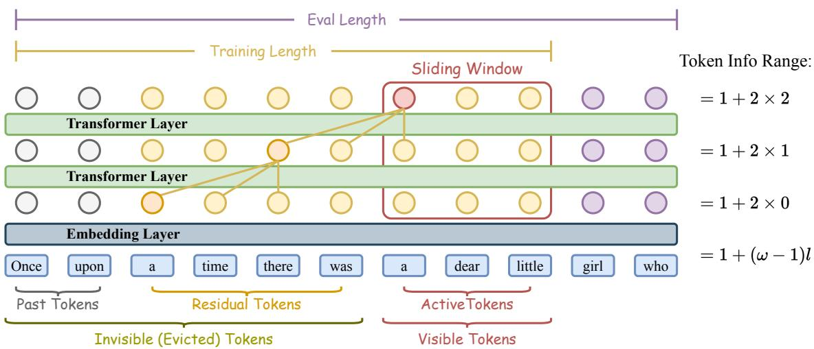
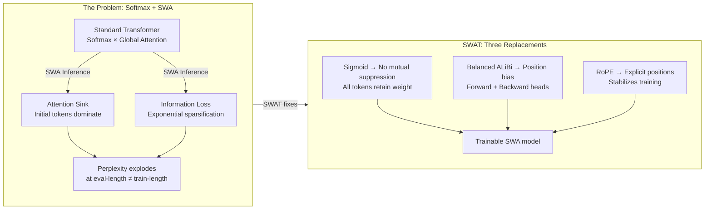
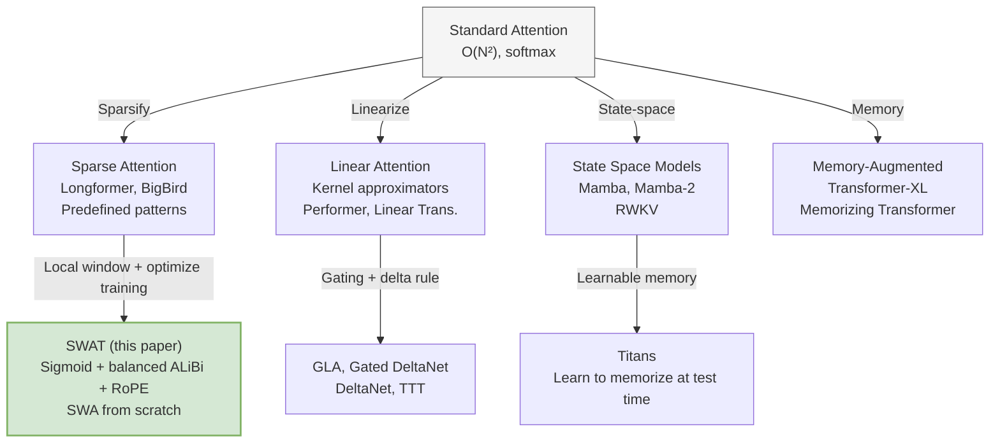
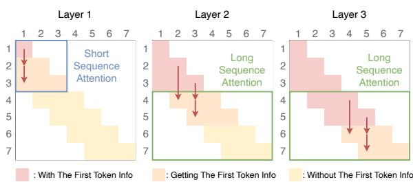
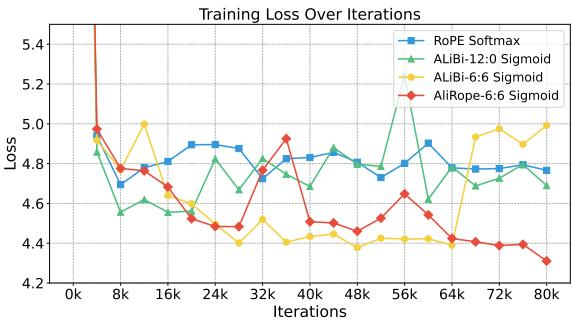

# SWAT: Sliding Window Attention Training

**Paper:** Sliding Window Attention Training for Efficient Large Language Models
**Authors:** Zichuan Fu, Wentao Song, Yejing Wang, Xian Wu, Yefeng Zheng, Yingying Zhang, Derong Xu, Xuetao Wei, Tong Xu, Xiangyu Zhao (City University of Hong Kong, Xi'an Jiaotong University, Tencent YouTu Lab, Westlake University, USTC, SUSTech)
**Published:** 2025

**Related pages:** [MiniMax Sparse Attention](../minimax-sparse-attention/index.md), [DeepSeek-V3.2 DSA](../../../algorithms/deepseek-v3.2/index.md), [Transformer](../../../algorithms/foundations/transformer.md), [Grouped-Query Attention](../../../algorithms/attention-variants/grouped-query-attention/index.md), [Multi-Query Attention](../../../algorithms/attention-variants/multi-query-attention.md)

## TL;DR

**What:** SWAT is a training paradigm that replaces softmax with sigmoid in attention and adds balanced bidirectional ALiBi + RoPE, enabling transformers to be trained from scratch with sliding window attention (SWA) and deployed with linear $O(N\omega)$ inference.

**How:** Sigmoid eliminates the mutual suppression of softmax, allowing each token to retain dense attention weights and compress historical information; balanced ALiBi (half heads forward-looking, half backward-looking) provides position-dependent differentiation; RoPE adds explicit positional encoding for training stability.

**The number:** SWAT (340M params, 15B tokens) achieves 46.88% average accuracy on 8 commonsense reasoning benchmarks, surpassing Transformer++ (42.92%) and all linear recurrent baselines including Titans (46.17%), Gated DeltaNet (45.42%), and Mamba (43.59%).

## The Big Picture

*① At layer $l$, each token attends to at most $\omega$ neighbors. ② Active tokens (red) are inside the current window. ③ Residual tokens (adjacent to the window) contribute information through $\omega-1$ hop transitions per layer. ④ After $L$ layers, the theoretical receptive field is $1+(\omega-1)\cdot L$. ⑤ SWAT trains the model to compress information across these transitions, unlike vanilla Transformers that rely on global attention.*

## Why This Exists

Take Llama-2-7B and run SWA inference with a window of 1,024. The perplexity on PG-19 climbs steadily as evaluation length grows — because the model was trained with full softmax attention, anchoring its positional understanding to initial tokens. When those tokens slide out of the window, the model loses its anchor.

The root cause is twofold:

1. **Attention sink:** Softmax normalization creates a variance cascade — the first token's embedding has dramatically higher variance, pulling most attention mass toward it. Without the first token in the window, the model's attention distribution collapses.
2. **Exponential sparsification:** `[1.5, 5.0, 2.4, 0.5, 1.3]` softmaxes to `[0.03, 0.88, 0.07, 0.01, 0.02]` — 88% mass on one token. In SWA, discarded tokens carry no residual influence because softmax already zeroed them out.

Existing solutions (Mamba, [linear attention](../../../terms/linear-attention.md), SSMs) fix efficiency but abandon the Transformer architecture. SWAT asks: can we keep the Transformer and train it to work with sliding windows from day one?

## The Landscape

SWAT sits in the sparse attention lineage but attacks a different bottleneck: not which tokens to attend to, but how to train the model so that sliding windows work. While Longformer applies SWA at inference to pretrained models, SWAT trains with SWA from scratch, replacing softmax with sigmoid to fundamentally change how information propagates through the window stack.

## The Core Idea

Standard softmax attention is a *routing* mechanism — it selects which tokens matter and suppresses the rest. For full-context Transformers, this is a feature: it creates sharp focus. For sliding windows, it's a bug: tokens outside the window are mathematically zeroed, leaving no residual information to carry forward.

SWAT replaces softmax with sigmoid. Sigmoid treats each attention score independently — a score of 5.0 gets $\sigma(5.0) \approx 0.993$, and a score of 1.5 gets $\sigma(1.5) \approx 0.818$. No token is artificially suppressed. The cost is that attention weights become dense, but balanced ALiBi provides the discrimination softmax used to provide, while RoPE supplies the explicit positional encoding that softmax's variance-based implicit positioning used to handle.

The result: a Transformer that learns to *compress* information across sliding windows rather than *route* attention to the globally most relevant tokens.

## Symbol Map

| Symbol | Human name | Scope | Plain meaning |
|---|---|---|---|
| $\omega$ | window size | per-layer constant | Number of adjacent tokens each position attends to. |
| $L$ | depth | model constant | Number of Transformer layers; receptive field = $1+(\omega-1)\cdot L$. |
| $\sigma(\cdot)$ | sigmoid | per-score | Independent activation replacing softmax; $\sigma(x) = 1/(1+e^{-x})$. |
| $s_k$ | ALiBi slope | per-head | Position bias coefficient; negative for forward-looking heads, positive for backward-looking. |
| $R_{\Theta,m}^d$ | RoPE rotation matrix | per-position, per-head | Rotary Position Embedding applied at position $m$ with dimension $d$. |
| $m, n$ | position indices | per-token | Current query position $m$, key position $n$; $m - n < \omega$. |

## Deep Dive

### The Attention Sink Diagnosis

**What it does:** Empirically demonstrates that softmax attention's variance propagation causes the attention sink — the first token's embedding has significantly higher variance, monopolizing attention mass.

**Why it matters:** Without understanding *why* SWA inference fails on pretrained LLMs, you can't design a training fix. This diagnosis is the paper's foundation.

**How it works:** The paper analyzes Qwen2-7B's attention patterns across layers. Two key observations: (a) token embedding variance correlates strongly with attention weight magnitude — higher variance → higher attention; (b) the first token consistently has the highest variance across all layers, creating an implicit absolute position signal even in models with RoPE.

**The intuition:** Softmax's exponential amplifies variance differences into attention dominance. The first token wins not because of its content but because its embedding variance is inflated by the causal mask's asymmetric information flow.

**A concrete example:** In Qwen2-7B's middle layers, the first token's embedding variance is ~3× that of position 100. After softmax, this translates to the first token capturing 60-80% of the attention budget — tokens 100+ω fall out of the window and the model collapses.

**Remember:** Attention sink is not about token content — it's about variance propagation through softmax normalization.

### Sigmoid: Dense Attention Without Suppression

**What it does:** Replaces softmax's mutual-exclusion normalization with per-score independent sigmoid activation.

**Why it matters:** In SWA, evicted tokens' information must persist through residual propagation. Softmax's sparsification kills that information prematurely; sigmoid preserves it.

**How it works:**

$$
\text{Attention}(Q, K, V) = \sigma\left(\frac{QK^T}{\sqrt{d}}\right) V
$$

Unlike softmax, which normalizes across the entire key dimension (forcing scores to sum to 1), sigmoid applies element-wise: $\sigma(x) = 1/(1+e^{-x})$. Each token independently decides its relevance. A token with score 5.0 contributes ~0.993 weight; a token with score 1.5 contributes ~0.818. Both matter — no zeroing.

*SWA training enables two learning paradigms: short-sequence (window > sequence, global attention) and long-sequence (window < sequence, compression across residual hops). At each layer, the current token's hidden state absorbs information from $\omega-1$ neighboring tokens through sigmoid-weighted residual propagation.*

**The intuition:** Softmax is a pie-dividing contest (100% shared across tokens). Sigmoid is independent voting (each token votes its own confidence). For SWA, you need votes, not pie.

**A concrete example:** A token 100 positions ago that contributes key factual context gets $\sigma(3.2) \approx 0.96$ weight under sigmoid — its information enters the current hidden state with nearly full strength. Under softmax, a more recent token with a slightly higher raw score would suppress it to near-zero.

**Remember:** Sigmoid alone hurts vanilla Transformers (perplexity jumps from ~5.5 to ~10.6) — but combined with balanced ALiBi and RoPE under SWA training, it becomes the enabler.

### Balanced ALiBi: Bidirectional Temporal Specialization

**What it does:** Extends ALiBi's unidirectional negative slopes to a bidirectional scheme — half the attention heads use negative slopes (forward-looking, recent-biased), half use positive slopes (backward-looking, history-biased).

**Why it matters:** Sigmoid attention is dense but undirected — all tokens look alike. Balanced ALiBi gives heads specialized temporal roles: recent tokens for local fluency, past tokens for long-range comprehension.

**How it works:**

$$
\text{Attention}(Q, K, V)_m = \sum_{n=m-\omega+1}^m \sigma\left(\frac{(R_{\Theta,m}^d q_m)^T (R_{\Theta,n}^d k_n)}{\sqrt{d_k}} + s_k \cdot (m-n)\right) v_n
$$

For $h$ heads, slopes follow a geometric sequence in both directions:

- Forward-looking heads ($h/2$): $s_k = -2^{-k}$
- Backward-looking heads ($h/2$): $s_k = +2^{-k}$

Negative slopes favor small $(m-n)$ (recent tokens); positive slopes favor large $(m-n)$ (distant tokens within the window). The geometric spacing gives each head a different temporal scale.

**The intuition:** Think of a newsroom: some reporters cover breaking news (forward-looking, recent context), others cover investigative background (backward-looking, historical context). Balanced ALiBi staffs both.

**A concrete example:** On BoolQ (yes/no QA requiring historical context), the balanced SWAT (-+) achieves 62.11% accuracy vs. 60.55% for the purely forward-looking SWAT (-). The backward-looking heads carry factual context from earlier in the passage.

**Remember:** ALiBi alone provides weak positional signals (training loss diverges in later stages); it needs RoPE for stability.

### RoPE: Stabilizing Sigmoid Attention Training

**What it does:** Adds Rotary Position Embedding to the sigmoid-based attention, providing explicit relative position encoding that stabilizes training.

**Why it matters:** Sigmoid removes the implicit positional signal that softmax's variance propagation provided. Without explicit positions, sigmoid attention training becomes unstable — the loss oscillates in later training stages. RoPE restores the position signal through an orthogonal mechanism.

**How it works:** Standard RoPE is applied to queries and keys before the dot product: $(R_{\Theta,m}^d q_m)^T (R_{\Theta,n}^d k_n)$. The rotation encodes relative position $(m-n)$ directly in the [inner product](../../../terms/inner-product.md), independent of the attention activation function.

**The intuition:** Softmax provided position through *which tokens dominate*; RoPE provides position through *how tokens relate*. Sigmoid replaces the former, RoPE supplies the latter.

**A concrete example:** In the ablation (Table 3), AliRope-6:6 Sigmoid (configuration No.8) achieves the lowest average loss of 2.51 across OpenWebText/PG-19/OpenOrca, compared to 2.62 for ALiBi-6:0 Sigmoid (No.4). The training loss curve (Figure 5) shows AliRope-6:6 steadily decreasing while ALiBi-6:6 diverges after ~30K steps.

*Training loss comparison: ALiBi-6:6 Sigmoid (orange) diverges in later stages due to weak positional signals from ALiBi alone; AliRope-6:6 Sigmoid (red) maintains stable convergence by combining RoPE's explicit relative positions with ALiBi's bidirectional bias.*

**Remember:** The sigmoid+ALiBi+RoPE combination is the complete recipe — remove any one component and performance degrades.

## Putting It Together

A walkthrough of SWAT processing a 4,096-token document with $\omega=128$ and $L=12$ layers:

1. **Input:** Token embeddings enter layer 1 with RoPE applied. The causal mask restricts each position $m$ to $[m-127, m]$.
2. **Layer 1, forward-looking heads:** Each query attends to 128 keys with sigmoid activation. Negative ALiBi slopes give 10× more weight to positions $m$ through $m-10$ than to $m-100$ through $m-127$.
3. **Layer 1, backward-looking heads:** Positive ALiBi slopes invert the bias — positions $m-100$ through $m-127$ get 10× more weight, preserving long-range context.
4. **Residual propagation:** Positions $m-128$ through $m-1$ (just outside the window) contributed to the keys at positions within the window at layer 1. Their information now lives in the active tokens' hidden states.
5. **Layer 2:** The receptive field expands to $1 + (128-1) \cdot 2 = 255$ tokens. Information from position $m-255$ has propagated through two residual hops.
6. **Layer 12:** Final receptive field: $1 + 127 \cdot 12 = 1,\!525$ tokens. Any token within 1,525 positions of the current query has contributed information.
7. **Output:** The last token's hidden state compresses information from the full 1,525-token effective context into a fixed-size vector, ready for next-token prediction.

## What This Buys You

### The headline claim

SWAT achieves SOTA on 8 commonsense reasoning benchmarks at 340M/760M scale while maintaining linear $O(N\omega)$ inference complexity — surpassing both vanilla Transformers and all linear recurrent baselines.

### How we know: 340M comprehensive benchmark results

| Model | Avg. 8 tasks | Wiki. ppl ↓ | LMB. ppl ↓ | Arc-e | Arc-c | BoolQ |
|---|---|---|---|---|---|---|
| Transformer++ | 42.92% | 31.52 | 41.08 | 45.21 | 24.05 | 58.24 |
| Mamba | 43.59% | 30.83 | 40.21 | 49.24 | 24.56 | 60.07 |
| Gated DeltaNet | 45.42% | 27.01 | 30.94 | 55.28 | 26.77 | 59.54 |
| Titans | 46.17% | 26.18 | 29.97 | 55.60 | 28.14 | 59.99 |
| **SWAT (-)** | **46.88%** | 33.32 | 36.75 | **59.68** | **28.24** | 60.55 |

At 760M scale, SWAT's Wiki perplexity drops to 22.84, closing the gap with Titans (21.21) while maintaining the commonsense reasoning lead.

### The mechanism behind the numbers

SWAT (-) — the purely forward-looking variant — dominates short-text benchmarks (PIQA: 65.94%, ARC-e: 59.68%) because recent tokens carry the most signal for local reasoning. SWAT (-+) — the balanced variant — leads on BoolQ (62.11%) because historical context matters for factual QA. This matches the ALiBi design: forward heads for fluency, backward heads for comprehension.

The SWA training ablation (Table 2) demonstrates the fundamental advantage: Sliding Window B (trained with window=1024, length=4096) achieves **PG-19 perplexity of 4.44** at eval-length 16,384, compared to Vanilla C's 4.49 — despite Vanilla C having 4× the training window. SWA training teaches the model to compress, not just attend.

### ⚠️ How to read these numbers

- Perplexity is initially higher for SWAT than for Titans/Gated DeltaNet (SWAT Wiki ppl 33.32 vs. Titans 26.18 at 340M) — but this gap shrinks at 760M (22.84 vs. 21.21), suggesting sigmoid attention scales favorably.
- All experiments are at 340M/760M scale with 15B/30B training tokens — behavior at billion-parameter scale is extrapolated, not measured.
- The 8 commonsense benchmarks favor short-context reasoning; SWAT's core advantage (long-context compression) is only partially tested here.

## Where It Breaks

| Failure mode | Symptom | Why |
|---|---|---|
| **Hyperparameter sensitivity** | Performance varies sharply with window size, depth, and slope distribution | Sigmoid attention lacks softmax's self-normalizing robustness |
| **Diminishing returns at scale** | Larger models may memorize training data, reducing the need for information compression | If a 7B model already fits 100B tokens in weights, the sliding-window compression mechanism becomes redundant |
| **Ultra-long sequences** | $L \cdot (\omega-1) + 1 < \text{sequence length}$ means inevitable information loss | The receptive field is bounded by window size × depth |
| **Short-context tasks** | Forward-looking SWAT (-) beats balanced SWAT (-+) on PIQA, HellaSwag | Backward-looking heads waste capacity when recent context suffices |
| **No cross-window memory** | Information older than $L \cdot \omega$ tokens is permanently lost | No explicit memory retrieval mechanism — unlike Memorizing Transformers or Titans |

## One Thing to Remember

**SWAT proves that a Transformer trained from scratch with sigmoid attention and sliding windows can match or beat purpose-built linear recurrent architectures — the key is replacing softmax's selective routing with sigmoid's additive compression, then using bidirectional ALiBi to give position meaning to the resulting dense attention map.**

## Go Deeper

- **SWAT code:** [github.com/ZC-Fu/SWAT](https://github.com/ZC-Fu/SWAT)
- **Attention sink analysis:** Xiao et al., "Efficient Streaming Language Models with Attention Sinks" (arXiv:2309.17453) — the paper that first characterized the attention sink phenomenon
- **Sigmoid self-attention theory:** Ramapuram et al., "Theory, Analysis, and Best Practices for Sigmoid Self-Attention" (arXiv:2409.04431) — comprehensive analysis of sigmoid attention alternatives
- **Longformer (original SWA):** Beltagy et al., "Longformer: The Long-Document Transformer" (arXiv:2004.05150) — introduced sliding window attention for Transformers
- **ALiBi:** Press et al., "Train Short, Test Long: Attention with Linear Biases Enables Input Length Extrapolation" (arXiv:2108.12409) — the original ALiBi position embedding method
- **RoPE:** Su et al., "RoFormer: Enhanced Transformer with Rotary Position Embedding" (arXiv:2104.09864) — Rotary Position Embedding
- **Related docs:** [MiniMax Sparse Attention](../minimax-sparse-attention/index.md) — another sparse attention approach co-designed with GQA; [DeepSeek-V3.2 DSA](../../../algorithms/deepseek-v3.2/index.md) — sparse attention with [lightning indexer](../../../terms/lightning-indexer.md)
