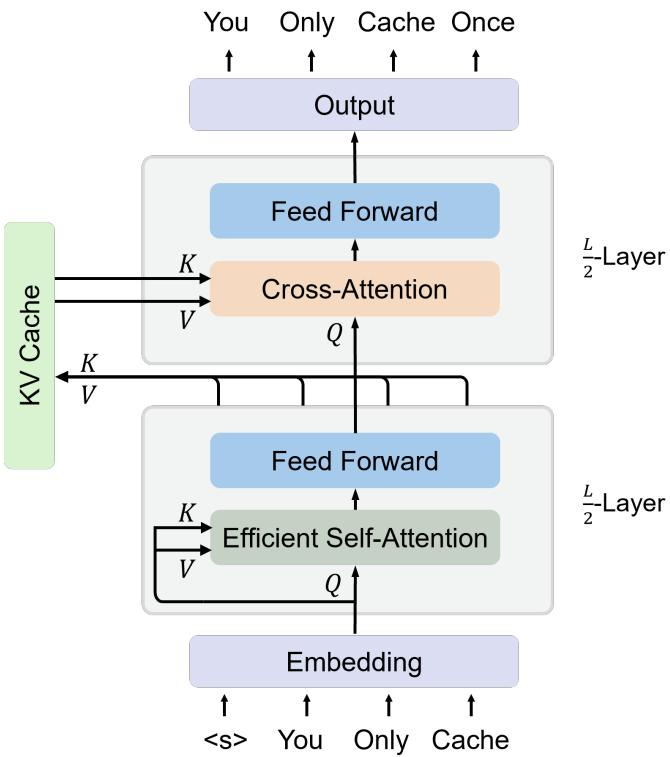
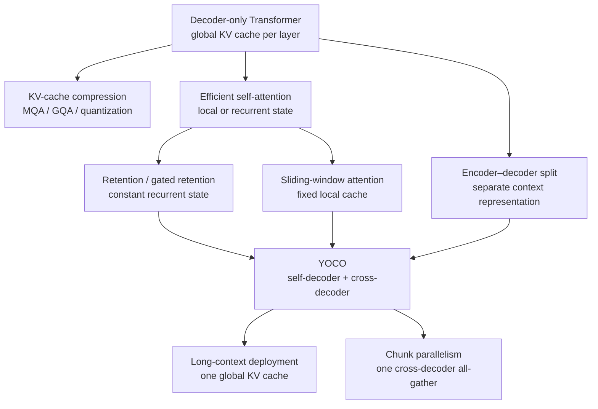
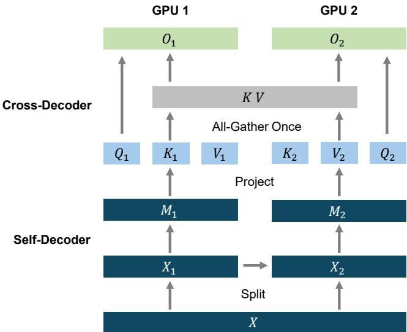
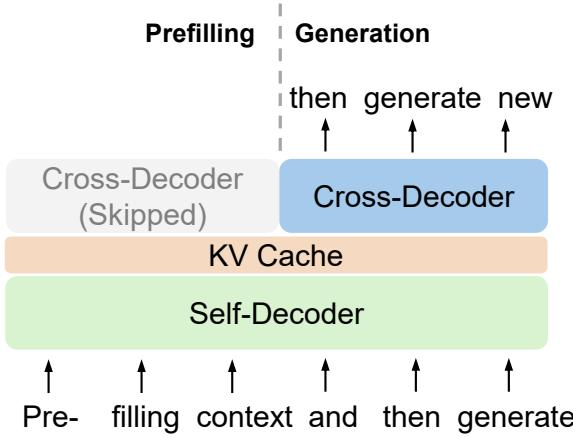
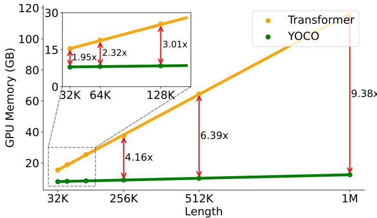
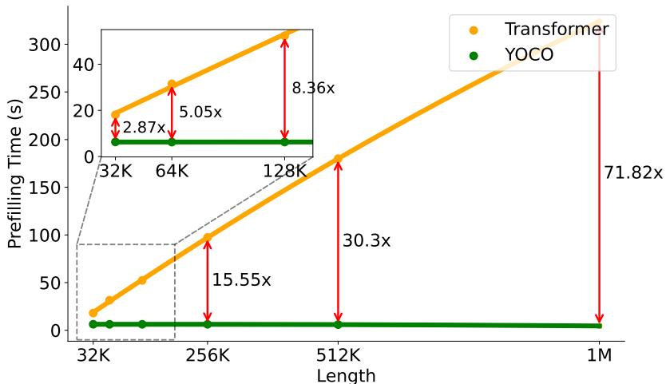
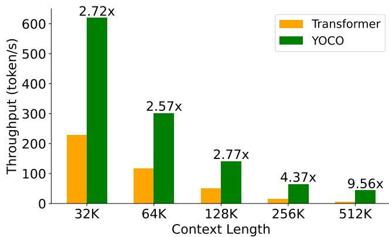

# YOCO: You Only Cache Once

**Paper:** [You Only Cache Once: Decoder-Decoder Architectures for Language Models](https://arxiv.org/abs/2405.05254)  
**Authors:** Yutao Sun, Li Dong, Yi Zhu, Shaohan Huang, Wenhui Wang, Shuming Ma, Quanlu Zhang, Jianyong Wang, Furu Wei  
**arXiv:** [2405.05254v2](https://arxiv.org/abs/2405.05254) (May 2024)

**Related pages:** [Efficient Attention Training](../index.md), [Universal YOCO](universal-yoco.md), [Gated Delta Networks](../gated-delta-networks/index.md), [SWAT](../swat-sliding-window-attention/index.md), [Linear Attention](../../../algorithms/linear-attention/index.md), [KV Cache](../../../terms/kv-cache.md)

## TL;DR

**What:** YOCO is a decoder-decoder language-model architecture that stores one global key/value representation instead of a separate full-length [KV cache](../../../terms/kv-cache.md) in every layer.

**How:** The first half of the network is a causal self-decoder with constant-state efficient attention; the second half is a stack of causal cross-decoders that all read the same global keys and values.

**The number:** In the paper's H100-80GB profiling, YOCO-3B uses 12.4 GB at a 1M-token context (the Transformer uses about 9.4× as much total inference memory), cuts 512K prefill from about 180 seconds to under 6 seconds, and reaches 43.1 versus 4.5 tokens/s at 512K.

## The Big Picture

*Source: [YOCO, Figure 2](https://arxiv.org/abs/2405.05254). ① The self-decoder causally encodes tokens with an efficient attention mechanism. ② Its output is projected once into the shared global $\hat K,\hat V$ cache. ③ Every cross-decoder layer uses causal cross-attention over that same cache, so the outside behavior remains decoder-only autoregressive generation.*

The split changes what is cached, not the model's interface: a caller still supplies a prefix and receives the next-token distribution one token at a time.

## Why This Exists

Consider a 65B model serving a 512K-token prompt. Even with [grouped-query attention](../../../terms/grouped-query-attention.md) and 8-bit cache values, the paper estimates about 86 GB for the per-layer keys and values—more than one H100-80GB can hold. A conventional decoder also performs expensive global attention during prefill, before the first generated token is available.

The important distinction is between **remembering the prefix** and **recomputing every layer's view of the prefix**. A normal decoder stores a full-length cache at every layer. YOCO computes a single contextual prefix memory in its self-decoder, then lets all cross-decoder layers query that memory. The same separation also lets prefill stop after the self-decoder; cross-decoder work is needed only when generation starts.

## The Landscape

This is a cross-paper synthesis: cache compression reduces each layer's footprint, while local or recurrent attention bounds the self-decoder's state. YOCO combines those ideas with an encoder-like/cross-attention split, retaining a decoder-only causal interface. The editable source is [yoco-landscape.mmd](assets/yoco-landscape.mmd).

## The Core Idea

**Compute the prefix once, then make every later layer read that shared prefix memory.** YOCO uses a cheap causal memory-forming half and a globally expressive readout half. Because the readout half never creates another length-growing cache, the cache scales with context length once rather than once per layer; because prefill only needs the memory-forming half, prompt processing becomes much cheaper too.

## Symbol Map

The paper uses $N$ for sequence length, $L$ for total layers, and $D$ for hidden/cache width. A hat marks the one global cache produced between the two decoder halves; $n$ indexes a token and $[i]$ indexes a training chunk.

| Symbol | Human name | Shape / scope | Plain meaning |
|---|---|---|---|
| $X^0, X^l$ | hidden states | $N \times D$, layer $l$ | Token representations entering and leaving each block. |
| $M=X^{L/2}$ | self-decoder output | $N \times D$ | The contextual representation used to build the shared cache. |
| $\hat K,\hat V$ | global keys and values | $N \times D$ (per KV head) | The only length-growing cache; reused by every cross-decoder layer. |
| $N$ | sequence length | tokens | Prompt/context length, from 32K to 1M in profiling. |
| $L$ | layer count | model-wide | Half the layers are self-decoder and half cross-decoder in the default design. |
| $C$ | sliding window | tokens | Fixed local-history size when SWA is used in the self-decoder. |
| $S_n$ | gated-retention state | fixed matrix per head | Recurrent summary carried from token $n-1$ to token $n$. |
| $\gamma_n$ | data-dependent decay | scalar per head/token | How much of the previous retention state survives at step $n$. |

## Deep Dive

### 1. The Self-Decoder Builds One Global Memory

**What it does:** The first $L/2$ causal layers transform the input and produce $M=X^{L/2}$, from which YOCO projects $\hat K=M W_K$ and $\hat V=M W_V$ once.

**Why it matters:** The 65B/512K example fails because a normal model repeats a long cache for every layer. YOCO needs one global length-growing cache plus small constant-state caches in the self-decoder.

**How it works:** The self-decoder keeps the normal residual-plus-feed-forward block shape, but replaces full self-attention with an efficient option such as [gated retention](../../../terms/gated-retention.md) or [sliding-window attention](../../../terms/sliding-window-attention.md). The resulting cache complexity is approximately $\mathcal O((N+CL)D)$ for YOCO instead of $\mathcal O(LND)$ for a Transformer; when $N \gg CL$, this is effectively one $N$-length cache.

**The intuition:** Use a bounded-memory prefix encoder before exposing the prefix to the expensive global readout layers.

**A concrete example:** For the 512K prompt, the self-decoder carries a constant-size recurrent state (or a fixed window) through its layers and emits one 512K-token $\hat K,\hat V$ pair rather than 26 full layer caches.

**Remember:** **The cache is created at the boundary between the two halves, not inside every layer.**

### 2. Cross-Decoder Layers Reuse the Same Cache

**What it does:** Each of the remaining $L/2$ layers computes a fresh query from its current hidden state but reads the same $\hat K,\hat V$ through causal cross-attention.

**Why it matters:** A single memory must still support the global token-to-token interactions that make decoder-only Transformers strong; otherwise a fixed-window or recurrent prefix would lose distant information.

**How it works:** For layer $l$, YOCO forms $\hat Q^l=X^lW_Q^l$ and applies standard attention to $(\hat Q^l,\hat K,\hat V)$. The cross-attention mask is causal: position $n$ can read cache entries through $n$, but not future entries. The key/value projections are shared, while each layer keeps its own query and feed-forward parameters. This is why YOCO remains autoregressive externally even though its layout resembles an encoder followed by a decoder.

**The intuition:** Many specialist readers can ask different questions of one shared document memory without each specialist storing a second copy of the document.

**A concrete example:** When generating the next token after a 512K prompt, every cross-decoder layer asks a different query of the same 512K cache; no new $N$-length K/V tensor is appended for that layer.

**Remember:** **Queries are layer-specific; the global keys and values are not.**

### 3. Gated Retention Makes the Self-Decoder Constant-State

**What it does:** The default self-decoder attention, gRet, learns a head-wise decay and maintains a recurrent matrix state instead of storing every past token.

**Why it matters:** YOCO's cache saving depends on the self-decoder not reintroducing a long cache in each of its layers.

**How it works:** The paper gives three mathematically equivalent forms:

| Form | Best use | State behavior |
|---|---|---|
| Parallel | training on moderate sequences | Forms a causal, decay-weighted attention matrix. |
| Recurrent | token-by-token generation | Updates $S_n=\gamma_nS_{n-1}+K_n^\top V_n$ and reads $Q_nS_n$. |
| Chunkwise recurrent | long prefill/training | Uses dense matrix work inside a chunk and carries only a boundary state between chunks. |

The learned $\gamma_n$ is head-wise rather than element-wise so the kernel can use GPU tensor cores. In the reported profile, chunk size 256 is used for prefill and the recurrent form for generation.

**The intuition:** Forget smoothly over time, but batch the arithmetic wherever the accelerator can do it in parallel.

**A concrete example:** While reading the 512K prompt, chunks process local token interactions in parallel and pass one $S$ matrix forward; during generation, each new token updates that matrix instead of appending a full token row to every self-decoder cache.

**Remember:** **The same retention rule has a parallel training view and a constant-state inference view.**

### 4. Sliding-Window Attention Is the Simpler Alternative

**What it does:** YOCO can replace gRet with causal [sliding-window attention](../../../terms/sliding-window-attention.md), limiting each query to the previous $C$ tokens.

**Why it matters:** A fixed window is easier to reason about and still bounds self-decoder memory, but it tests whether the cross-decoder's global cache can recover information outside the local window.

**How it works:** A causal mask sets attention scores outside the window to $-\infty$. The self-decoder's cache then scales as $\mathcal O(C)$ per layer rather than $\mathcal O(N)$. In the paper's scaling study, YOCO-SWA is competitive but generally below YOCO-gRet; the authors attribute the gap to complementary inductive biases from retention plus attention.

**The intuition:** Let the prefix encoder keep only a moving local view, while the one global cache preserves the full-context record for the cross-decoder.

**A concrete example:** A token at the end of the 512K prompt cannot attend directly to all earlier tokens in an SWA self-decoder layer, but the resulting global $\hat K,\hat V$ can still be read by every cross-decoder layer.

**Remember:** **SWA bounds the prefix encoder's state; it does not remove YOCO's one global cache.**

### 5. Chunk Parallelism Reduces Distributed Training Communication

**What it does:** Appendix A partitions a long sequence across GPUs, keeps self-decoder dependencies local or adjacent, and performs one [all-gather](../../../terms/all-gather.md) of the cross-decoder keys and values.

**Why it matters:** At million-token training lengths, repeatedly communicating a full context through every cross-decoder layer can erase the architectural memory savings.

**How it works:** Each device computes its sequence chunk through the self-decoder and produces the intermediate $M$. Because gRet only carries a recurrent boundary state and SWA only needs a bounded neighborhood, self-decoder communication is limited. The devices then gather the projected $K,V$ once; all cross-decoder layers reuse the gathered result locally.

**The intuition:** Move the long sequence once across the network, then spend the rest of the layers reusing the moved representation.

**A concrete example:** With two GPUs holding adjacent chunks, GPU 2 receives the boundary state needed by the self-decoder, then both GPUs participate in one global K/V gather before their cross-decoder stacks.

**Remember:** **YOCO turns per-layer long-context communication into one cache exchange.**

*Source: [YOCO, Figure 11](https://arxiv.org/abs/2405.05254). Sequence chunks are processed locally through the self-decoder, then the cross-decoder keys and values are gathered once.*

## Putting It Together

The following trace follows one request with a 512K-token prompt and then 1,024 generated tokens.

| Step | Actor | Input state | Action | Output state |
|---:|---|---|---|---|
| 1 | Self-decoder | 512K embeddings | Run causal gRet (or SWA) through the first $L/2$ layers; carry bounded states/chunks. | Contextual $M=X^{L/2}$ plus no per-layer global cache. |
| 2 | Cache projection | $M$ | Project $M$ once with $W_K,W_V$. | One global $\hat K,\hat V$ covering the 512K prompt. |
| 3 | Prefill scheduler | $\hat K,\hat V$ | Stop before the cross-decoder because the first generated token is not needed yet. | First-token prefill completes after roughly half the layers. |
| 4 | Cross-decoder | Current hidden state and $\hat K,\hat V$ | Each cross layer forms its own query and performs causal cross-attention over the shared cache. | Next-token logits. |
| 5 | Generation loop | Previous token, recurrent self-decoder states, shared cache | Append the new token through the self-decoder state, project and append one new row to the global cache, query that cache in all cross layers, and sample one token. | One new token; still no per-layer copies of the $N$-length cache. |
| 6 | Distributed long-context training | Sequence chunks on multiple GPUs | Exchange adjacent self-decoder state, then all-gather $K,V$ once for the cross-decoder. | Layer reuse without repeating a full-context collective. |

*Source: [YOCO, Figure 3](https://arxiv.org/abs/2405.05254). Prefill can exit after the self-decoder; generation reuses the shared cache through the cross-decoder.*

## What This Buys You

### The headline claim

YOCO preserves competitive language modeling quality while making long-context inference primarily a one-cache problem instead of an $L$-cache problem.

### How we know: quality, context, and deployment

| Evidence | Paper-reported result | What it answers |
|---|---|---|
| 3B language modeling | Average downstream accuracy 0.634 after 1T tokens and 0.636 after 1.6T; YOCO-3B-1M reaches 0.645. | Does the architecture scale with training tokens and length? |
| Model-size scaling | YOCO-gRet is competitive with a Llama-optimized Transformer from 160M to 13B and beats YOCO-SWA in the reported curves. | Is the result only a small-model effect? |
| Needle retrieval | YOCO-3B-1M scores 0.98/0.98/0.84/0.56 for 1/2/4/8 needles at 128K. | Can one global cache retain distant facts? |
| Memory | At 1M context, YOCO-3B uses 12.4 GB; the Transformer baseline uses about 9.4× more total inference memory. | Does one cache change serving capacity? |
| Prefill | At 512K, Transformer is about 180 s versus YOCO under 6 s; the reported speedup is 71.82× at 1M and 2.87× at 32K. | Does early exit help prompts, not just decoding? |
| Throughput | At 512K, Transformer reaches 4.5 token/s versus YOCO's 43.1 token/s (about 9.6×). | Does memory savings translate into serving throughput? |

*Source: [YOCO, Figure 7](https://arxiv.org/abs/2405.05254). The source-reported memory ratios rise from about 1.95× at 32K to 9.38× at 1M.*

*Source: [YOCO, Figure 9](https://arxiv.org/abs/2405.05254). Transformer prefill grows quadratically in the paper's comparison, while YOCO's early-exit path grows approximately linearly.*

*Source: [YOCO, Figure 10](https://arxiv.org/abs/2405.05254). The reported throughput advantage grows with context length, reaching about 9.6× at 512K.*

### The mechanism behind the numbers

The gains compound rather than come from one kernel trick. The single global cache removes the layer multiplier from persistent memory; the self-decoder's efficient attention keeps its own state bounded; prefill bypasses every cross-decoder block; and the freed memory permits larger serving batches. The paper's Transformer baseline is already strengthened with GQA, Flash-Decoding, and kernel fusion, so the comparison is about architecture plus implementation, not an unoptimized baseline.

### ⚠️ How to read these numbers

These are source-reported measurements on H100-80GB cards with a 3B model, a 1,024-token generation suffix, chunk size 256, and a Triton gRet kernel. The ratios should be treated as evidence for the scaling trend, not as hardware-independent guarantees. The 65B “128K tokens in 1 GB cache” example is a cache-capacity calculation in the paper, not a complete end-to-end serving benchmark.

## Where It Breaks

| Failure mode | When it happens | Impact |
|---|---|---|
| Multi-needle interference | The 128K test rises from 0.98 for one/two needles to 0.56 for eight. | A single global cache does not guarantee perfect retrieval when many facts compete. |
| Self-decoder information bottleneck | gRet or SWA must summarize the prefix before cross-decoder access. | Poorly chosen decay/window settings can discard detail that no later layer can reconstruct. |
| Long-context training cost | The 1M model is progressively trained at 64K, 256K, and 1M with 6B, 4B, and 1.5B tokens. | Reaching the deployment length still needs substantial data, compute, and length-extension tuning. |
| Communication boundary | Distributed training requires a global K/V gather once per sequence partition. | The architecture reduces communication frequency, but does not make cross-device bandwidth free. |
| Kernel and hardware dependence | The reported profile uses head-wise gRet, chunk size 256, Triton, and H100-80GB. | Different accelerators or kernels may change the practical crossover point. |
| Baseline and workload sensitivity | The speed study fixes model size, context lengths, generation suffix, and an optimized Transformer baseline. | Do not extrapolate the exact speedup to arbitrary batch sizes, model sizes, or decoding workloads. |
| Evidence maturity | This page records the 2024 paper and its extracted source; no independent reproduction is included here. | Treat quality and efficiency claims as paper evidence rather than a validated production guarantee. |

## One Thing to Remember

**YOCO changes the cache topology:** a bounded-memory causal half writes one global prefix memory, and a globally expressive causal half reads it repeatedly. That single boundary removes the Transformer layer multiplier from the growing cache and lets prefill stop before the readout half, which is why the paper's biggest wins appear exactly where context length makes ordinary decoding memory-bound.

## Go Deeper

- **Read:** [YOCO paper (arXiv 2405.05254)](https://arxiv.org/abs/2405.05254); [extracted Markdown](../../../../derived/pdf-markdown/training/yoco-you-only-cache-once/yoco-you-only-cache-once.md)
- **Build on:** [Retentive Network](https://arxiv.org/abs/2307.08621), [Gated Linear Attention Transformers](https://arxiv.org/abs/2312.06635), and [Transformers are RNNs: Linear Attention](../../../algorithms/linear-attention/index.md)
- **Understand the context:** [KV Cache](../../../terms/kv-cache.md), [Gated Retention](../../../terms/gated-retention.md), [Sliding-Window Attention](../../../terms/sliding-window-attention.md), and [Chunk Parallelism context](../../parallelism/sequence-parallelism/index.md)
- **Follow up:** [Universal YOCO for Efficient Depth Scaling](universal-yoco.md) applies parameter-shared recursion inside the self-decoder, turning the cache-once design into a depth-scaling recipe.
- **Reproduce:** The paper links to [the YOCO code](https://aka.ms/YOCO); this repository has not run an independent reproduction.
