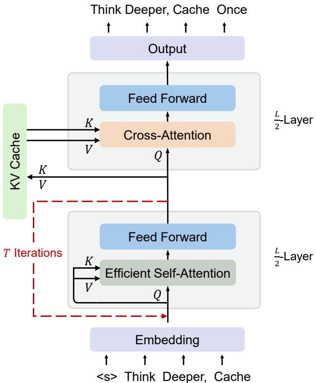
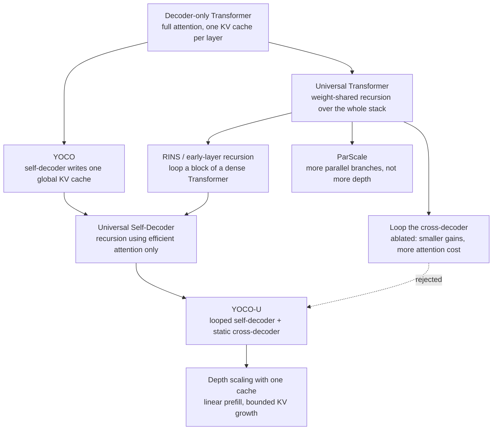
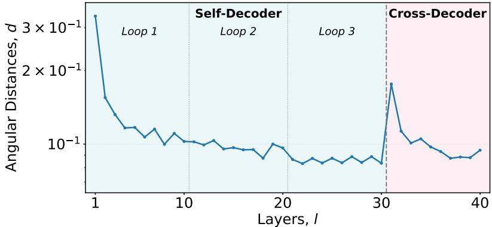
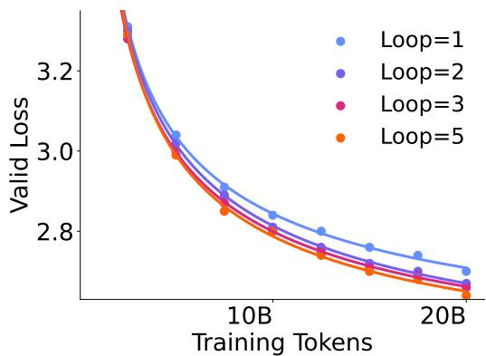
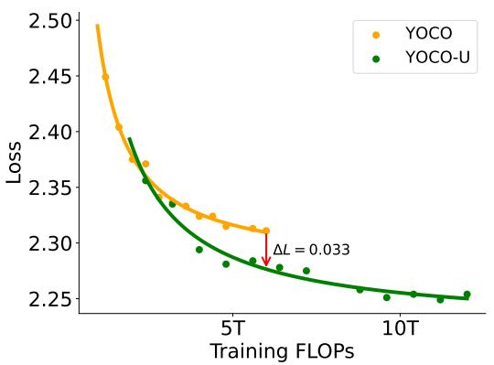
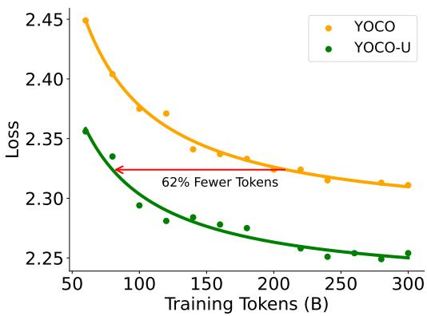
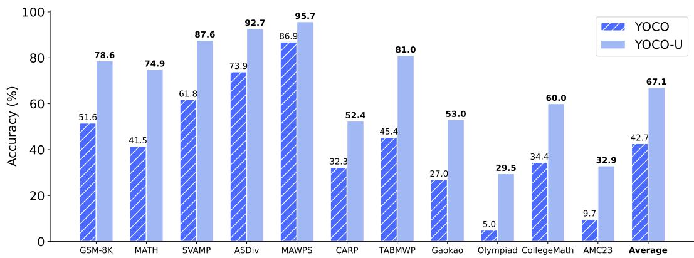
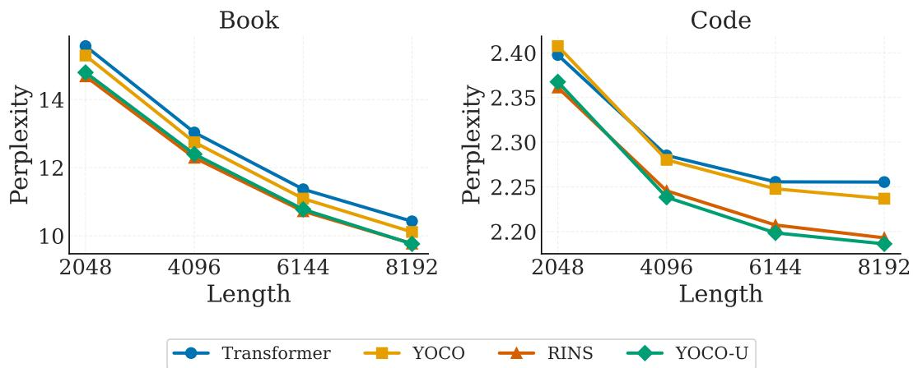
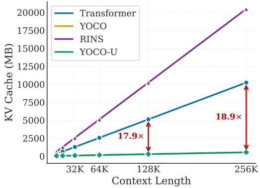

# Universal YOCO for Efficient Depth Scaling

**Paper:** [Universal YOCO for Efficient Depth Scaling](https://arxiv.org/abs/2604.01220)  
**Authors:** Yutao Sun, Li Dong, Tianzhu Ye, Shaohan Huang, Jianyong Wang, Furu Wei (Microsoft Research; Tsinghua University)  
**arXiv:** [2604.01220v1](https://arxiv.org/abs/2604.01220) (April 2026)

**Related pages:** [YOCO: You Only Cache Once](index.md), [Efficient Attention Training](../index.md), [Looped Transformers for Length Generalization](../../../algorithms/looped-transformers-length-generalization/index.md), [KV Cache](../../../terms/kv-cache.md), [Sliding-Window Attention](../../../terms/sliding-window-attention.md)

## TL;DR

**What:** YOCO-U combines the YOCO decoder-decoder layout with parameter-shared recursion, so extra training and inference compute buys *effective depth* without new parameters or a second KV cache.

**How:** It replaces the static self-decoder with a **Universal Self-Decoder** that loops the same shallow efficient-attention block $T$ times, then projects the one global $\hat K,\hat V$ cache that every cross-decoder layer reuses unchanged.

**The number:** In the 10B-parameter (1.3B activated) MoE run, three self-decoder loops raise the average downstream score from 41.78 (YOCO) to 47.08 with equal training steps, and 46.23 even when training FLOPs are equalized.

## The Big Picture

*Source: [Universal YOCO, Figure 1](https://arxiv.org/abs/2604.01220). ① Embeddings enter the Universal Self-Decoder, whose $\frac{L}{2}$ efficient-attention layers are applied repeatedly along the red dashed path ($T$ iterations) — the paper's "Think Deeper" half. ② The global KV cache is projected from the self-decoder output **once** and is independent of $T$. ③ The unchanged cross-decoder half reads that shared cache through cross-attention for autoregressive prediction — the "Cache Once" half.*

The figure contains the entire design argument: the recursion sits in the bottom half where attention state is bounded, so the top half never sees more than one global cache.

## Why This Exists

Take the paper's own training configuration: a 20-layer MoE model with 10B total and 1.3B activated parameters, trained on 300B tokens with a [sliding-window attention](../../../terms/sliding-window-attention.md) self-decoder. Suppose the loss curve lands short of target and you want more sequential depth. Three routes exist, and all three historically charge for it:

| Route | What you get | What it costs |
|---|---|---|
| Add layers | Genuinely more depth | More parameters, and more per-layer caches in a standard decoder |
| Loop the whole network (Universal Transformer, RINS) | More depth with shared weights | Every loop re-runs global attention and re-creates cache entries, because the loop includes the attention layers |
| Parallel scaling (ParScale etc.) | More FLOPs, small latency increase | No added modeling depth, and the paper's comparison shows weaker gains |

The concrete pain in this paper's setting: looping a dense Transformer into RINS-style early-layer recursion costs roughly **20,480 MB of KV cache per sequence at 256K context** versus **542 MB** for YOCO-U in the same inference stack, while its decoding throughput falls to roughly a fifth of the YOCO family (56 vs 303–318 tokens/s at 256K). Depth, memory, and attention cost are entangled in all prior options — the paper's question is whether they can be separated.

> **Intuition:** Compute may be cheaper than parameters, but a *looped attention layer* is not cheap: it pays memory and quadratic attention again on every iteration.

## The Landscape

This is a cross-paper synthesis: recursive computation descends from the Universal Transformer, cache-once topology from YOCO, and the paper's move is to fuse them by confining recursion to the efficient-attention half. The editable source is [universal-yoco-landscape.mmd](assets/universal-yoco-landscape.mmd).

## The Core Idea

**Put the recursion where the state is already constant.** YOCO's original bargain was to write the prefix memory once in a cheap half and read it many times in an expressive half. YOCO-U observes that the cheap half is also the right place to spend extra sequential compute: looping shallow efficient-attention blocks deepens the representation that *feeds* the cache, while the global cache itself stays a write-once, length-scaling-once object. The paper's summary phrase is that YOCO supplies "constant global KV cache and linear pre-filling," while partial recursion adds "representational depth with limited overhead."

## Symbol Map

The paper writes $L$ for total layers (split evenly into the two decoder halves), $N$ for sequence length, $D$ for hidden size, $T$ for the number of self-decoder loop iterations, and $W$ for the local attention window. Hats mark the shared global cache, and superscripts index per-layer quantities.

| Symbol | Human name | Shape / scope | Plain meaning |
|---|---|---|---|
| $X^0$ | input embeddings | $N \times D$ | The packed token embeddings entering the model. |
| $L$ | total layer count | model-wide | 20 in the main experiments, 10 self-decoder + 10 cross-decoder layers. |
| $T$ | loop iterations | model-wide | Times the self-decoder block is re-applied with shared parameters; $T=3$ by default. |
| $\mathrm{USD}(X)$ | universal self-decoder output | $N \times D$ | The running representation after $T$ passes through the same $\frac{L}{2}$ efficient-attention layers. |
| $\hat K,\hat V$ | global keys and values | one length-growing cache | Projected once from $\mathrm{LN}(\mathrm{USD}(X))$; **independent of $T$**. |
| $\hat Q^l$ | per-layer query | layer $l$ | Computed fresh in each cross-decoder layer from its own hidden state. |
| $N$ | sequence length | tokens | Prompt/context length; throughput is measured from 8K to 256K. |
| $W$ | local attention window | tokens | Sliding-window size for the self-decoder, 512 in all experiments. |
| $\mathrm{ESA}$ | efficient self-attention | module | The subquadratic, state-efficient attention used inside the looped block. |

Two task-specific conventions matter when reading the tables:

| Object | Training | Inference |
|---|---|---|
| Global cache $\hat K,\hat V$ | Produced once per forward pass from $\mathrm{USD}(X)$. | Extended by one row per generated token; never multiplied by $T$. |
| Local caches | Held inside each looped efficient-attention layer for the window $W$. | The only part of the cache footprint that scales with $T$ — hence the $WTL$ term. |

## Deep Dive

### 1. The Universal Self-Decoder: Recursion Where the State Is Cheap

**What it does:** The first $\frac{L}{2}$ layers become a *universal* module: the same parameters are applied $T$ times in sequence, so $\mathrm{USD}(X)$ is a composition of $T$ self-decoder passes rather than one.

**Why it matters:** The "more depth" route in "Why This Exists" normally drags global attention and its cache along. Here, recursion is applied only to layers that use efficient attention, so the extra depth never touches the one object that grows with context length.

**How it works:** Each self-decoder layer keeps the standard residual shape with efficient self-attention:

$$Y^l = \mathrm{ESA}(\mathrm{LN}(X^l)) + X^l, \qquad X^{l+1} = \mathrm{SwiGLU}(\mathrm{LN}(Y^l)) + Y^l$$

with RM-SNorm normalization, and the whole $\frac{L}{2}$-layer block is re-applied $T$ times. This is the [looped Transformer](../../../terms/looped-transformers.md) pattern — shared parameters applied across depth — restricted here to one attention-bounded module. [Sliding-window attention](../../../terms/sliding-window-attention.md) with $W = 512$ is the default $\mathrm{ESA}$ choice; the paper notes that RetNet, Mamba, and gated DeltaNet variants are compatible but perform similarly *inside this hybrid layout*, so it keeps the simplest one.

**The intuition:** Add more *passes over the same computation*, not more distinct computation, and place those passes where the state cost is already bounded.

**A concrete example:** At 256K context, the 20-layer model's self-decoder is 10 layers deep in parameters but performs 30 effective layer-applications ($T=3$) before the cache is projected.

**Remember:** **YOCO-U's depth lives inside the module whose memory does not grow with depth—only with the local window.**

### 2. One Cache, Written Once — Independent of T

**What it does:** The global cache is still created exactly once, from $\mathrm{LN}(\mathrm{USD}(X))$, and all cross-decoder layers keep reading that single cache.

**Why it matters:** This is the property that separates YOCO-U from looping a normal Transformer. If the loop touched the cross-decoder, each iteration would regenerate global keys and values.

**How it works:** The cache and cost accounting from the paper's Table 1:

| Architecture | KV cache memory | Prefill | Decode (per step) |
|---|---|---|---|
| Transformer | $\mathcal{O}(LND)$ | $\mathcal{O}(LN^2D)$ | $\mathcal{O}(LND)$ |
| YOCO | $\mathcal{O}((N + WL)D)$ | $\mathcal{O}(\frac{L}{2}ND)$ | $\mathcal{O}(\frac{L}{2}(N+W)D)$ |
| Loop / Universal Transformer | $\mathcal{O}(LTND)$ | $\mathcal{O}(LTN^2D)$ | $\mathcal{O}(LTND)$ |
| **YOCO-U** | $\mathcal{O}((N + WTL)D)$ | $\mathcal{O}(\frac{L}{2}TND)$ | $\mathcal{O}(\frac{L}{2}(N+WT)D)$ |

Read the YOCO-U column carefully: the global term $\mathcal{O}(ND)$ has no $T$ factor. Only the local window cache carries $T$, and because $W \ll N$ (512 versus potentially hundreds of thousands of tokens), that overhead is negligible at long context. Compare with the Universal Transformer row, where every term carries both $L$ and $T$.

**The intuition:** The loop buys depth in the *representation*, not in the *history*: what grows with context is written once regardless of how many times the cheap half runs.

**A concrete example:** In the paper's inference benchmark at 256K, YOCO-U holds 542 MB of KV cache versus 522 MB for non-recursive YOCO and 10,240 MB for a Transformer — the recursion adds ~4% over YOCO, while the Transformer baseline is about 18.9× larger.

**Remember:** **The $T$ factor is confined to the $\mathcal{O}(WTLD)$ local term; the global cache stays $\mathcal{O}(ND)$.**

### 3. The Cross-Decoder Does Not Change

**What it does:** Every cross-decoder layer forms its own query and attends causally to the shared $\hat K,\hat V$, exactly as in YOCO.

**Why it matters:** The paper's claim that the gains are "greater than either technique alone" depends on leaving the expensive half untouched. Recursion deepens what feeds the cache; the retrieval half then spends that depth on better answers.

**How it works:** For layer $l$, $\hat Q^l = \mathrm{LN}(X^l)W_Q^l$ and $Y^l = \mathrm{Attention}(\hat Q^l,\hat K,\hat V) + X^l$, followed by the same SwiGLU block. The global cache is not recomputed, and the paper uses NoPE in the cross-decoder and RoPE in the self-decoder, mirroring the retrieval-versus-local split introduced in recent hybrid position-encoding work.

**The intuition:** Recursion improves the *writer* of the memory; the *reader* stays a fixed, standard attention stack so nothing about its cost profile changes.

**A concrete example:** In an ablation, looping the cross-decoder instead of the self-decoder ("Upper Loop") drops the average score to 47.34, and removing the shared cache from that loop drops it further to 46.41 — both below the 48.25 of the standard YOCO-U layout.

**Remember:** **Recursion helps where the representation is built, not where retrieval happens.**

### 4. Choosing the Loop Position — and Why It Converges

**What it does:** The paper justifies "loop the shallow half" with ablations on loop position and a representation analysis over layers.

**Why it matters:** "Partial recursion" is the whole design. Looping the wrong block, or looping without weight sharing's implicit regularization, gives smaller or negative returns.

**How it works:** From the design-choice ablation:

| Variant | Average score | What it shows |
|---|---|---|
| YOCO (non-recursive) | 46.95 | Baseline cache-once model. |
| **YOCO-U (self-decoder loop, $T=3$)** | **48.25** | Recursion in the shallow efficient half. |
| Deeper instead of wide (40 layers, $D=1792$) | 48.59 | Layout (depth vs width) is roughly neutral for the same parameter budget. |
| Upper loop (cross-decoder) | 47.34 | Deeper recursion in the readout half gives diminishing gains. |
| Upper loop without shared KV | 46.41 | Removing cache sharing during recursion is worse again. |

The representation analysis explains the diminishing returns: measuring the angular distance between consecutive layers, the paper finds the same pattern repeating in each loop, with the mean distance shrinking as iterations accumulate — representations approach a fixed point — while a sharp spike appears exactly at the self-decoder/cross-decoder boundary, evidence that the two halves perform different jobs.

*Source: [Universal YOCO, Figure 8](https://arxiv.org/abs/2604.01220). Layer-to-layer angular distance for a $T=3$ model: loops 1–3 of the self-decoder repeat a similar decaying pattern, and the boundary at layer 30 shows a sharp jump before the cross-decoder settles into its own regime.*

**The intuition:** A looped block converges toward a stable iterative refinement; stacking that refinement in the half that only *prepares* the cache pays off, while looping the half that already does global retrieval does not.

**A concrete example:** With $T$ scaling from 1 to 5 on a 1.3B model, validation loss keeps improving — but the loop-scaling curve flattens, consistent with the fixed-point reading.

*Source: [Universal YOCO, Figure 6](https://arxiv.org/abs/2604.01220). Validation loss against training tokens for loop counts 1, 2, 3, and 5; each added loop lowers the curve, with visibly smaller gaps between higher loop counts.*

**Remember:** **The gain comes from iterating the representation-builder, and each extra iteration buys less than the previous one.**

### 5. Scaling Behavior and Training Stability

**What it does:** The paper shows the recipe scales in tokens, parameters, and loop count without instabilities.

**Why it matters:** Recursive networks have a reputation for optimization difficulty; the paper's practical claim is that confining recurrence to a shallow efficient module keeps training smooth.

**How it works:** Models from 300M to 10.8B parameters are trained for 20k steps at 1M tokens per batch, and the main 10B/1.3B MoE run trains 75k steps (300B tokens). Reported outcomes: loss at the same FLOPs improves by $\Delta L = 0.033$; YOCO-U needs ~62% fewer training tokens to match the non-recursive YOCO loss; and at equal training steps it reaches comparable quality with roughly half the parameters. The loss trajectory is reported as smooth and spike-free throughout, and the MoE run uses 8 of 64 experts plus one shared expert.

**The intuition:** Weight-shared recursion acts like an implicit ensemble of depths over the same parameters, and keeping the looped module shallow keeps the backward graph manageable.

**A concrete example:** The 80B-token YOCO-U checkpoint matches the 210B-token non-recursive YOCO checkpoint — a token-efficiency claim that also quantifies the compute you still spend.

**Remember:** **Recursive depth pays back in token efficiency, and the paper's evidence is stability across a 300M→10.8B range.**

## Putting It Together

Trace one request through the paper's own inference setup: the 1.3B model, a 256K-token prompt, batch 32, and 128 generated tokens per sequence, in BF16 on H100-80GB with a Nano-vLLM-based stack.

| Step | Actor | Input state | Action | Output state |
|---:|---|---|---|---|
| 1 | Embedding | 256K tokens | Pack the prompt into $X^0$. | One $256\text{K} \times D$ activation tensor. |
| 2 | Universal Self-Decoder, loop 1 | $X^0$ | Apply the 10-layer sliding-window block ($W=512$) with shared parameters. | $X^{1} = \text{Self-Decoder}^{L/2}(X^0)$. |
| 3 | Universal Self-Decoder, loops 2–3 | $X^{1}$, then $X^{2}$ | Re-apply the *same* 10-layer block twice more. | $\mathrm{USD}(X) = X^{3}$; local caches bounded by $W$ per loop. |
| 4 | Cache projection | $\mathrm{USD}(X)$ | $\hat K = \mathrm{LN}(\mathrm{USD}(X))W_K$, $\hat V = \mathrm{LN}(\mathrm{USD}(X))W_V$. | One global 256K-entry cache; **no $T$ factor**. |
| 5 | Prefill scheduler | $\hat K,\hat V$ | Stop before the cross-decoder, as in YOCO; report prefill throughput. | ~76,000 tokens/s versus ~7,500 for the Transformer baseline at 256K. |
| 6 | Decode step (repeated 128×) | New token, loop state, shared cache | Run the token through the 3-iteration self-decoder, append its row to the global cache, let all 10 cross-decoder layers query the shared cache, sample. | One new token per step at ~303 tokens/s; cache grows by one row, not by $T$ rows. |
| 7 | Reporting | Finished sequence | Compare persistent KV occupancy. | 542 MB per sequence (YOCO-U) versus 522 MB (YOCO), 10,240 MB (Transformer), 20,480 MB (RINS) — all source Table 10 values at 256K. |

> **Evidence:** Prefill for YOCO-U flattens near 76,000 tokens/s from 8K to 256K because prefill only executes the linear-complexity self-decoder, while the Transformer baseline degrades from ~85,700 to ~7,500 tokens/s over the same range.

## What This Buys You

### The headline claim

Recursive depth inside an efficient-attention self-decoder improves quality per parameter and per token while preserving the cache-once inference profile of the non-recursive YOCO baseline.

### How we know: language modeling and reasoning

| Evidence | Paper-reported result | What it answers |
|---|---|---|
| FLOP-aligned loss (Figure 2, left) | $\Delta L = 0.033$ lower loss than YOCO at the same training FLOPs | Do the gains come only from spending more compute? |
| Token-aligned loss (Figure 2, right) | ~62% fewer tokens to match YOCO's loss (80B vs 210B tokens) | Is recursion also data-efficient? |
| Downstream average, 300B tokens (Table 2) | YOCO 41.78 → YOCO-U 46.23 (equal FLOPs) → 47.08 (equal steps) | Does it transfer across tasks? |
| Thinking SFT on 11 math benchmarks (Figure 3) | Average 42.7 → 67.1 (paper: +24.4), all benchmarks improved | Is latent recursion orthogonal to explicit test-time scaling? |
| NIAH retrieval (Table 4) | S-NIAH-1: 1.00 (tied best); S-NIAH-2: 0.95 (best) | Does one-cache retrieval survive the loop? |

*Source: [Universal YOCO, Figure 2 (left)](https://arxiv.org/abs/2604.01220). The reported gap at 6T training FLOPs is $\Delta L = 0.033$ in YOCO-U's favor.*

*Source: [Universal YOCO, Figure 2 (right)](https://arxiv.org/abs/2604.01220). The annotation marks ~62% fewer tokens for comparable loss (~80B versus ~210B).*

*Source: [Universal YOCO, Figure 3](https://arxiv.org/abs/2604.01220). Accuracy per benchmark for YOCO (striped) versus YOCO-U (solid); the average moves from 42.7 to 67.1.*

### How we know: architecture comparison and long context

| Model (1.3B dense, 20B tokens, ~2× FLOPs budget) | Average accuracy | Notes |
|---|---|---|
| Transformer | 47.1 | Standard dense baseline with RoPE. |
| YOCO | 47.0 | Cache-once, no recursion. |
| Loop / Universal Transformer | 47.8 | Whole-stack loop, 2× passes. |
| ParScale | 46.8 | Parallel scaling instead of depth. |
| RINS | 48.3 | Early-layer recursion in a dense Transformer. |
| **YOCO-U** | **48.3** | Ties RINS at far lower cache cost. |

The paper's three stated takeaways from this comparison: scaling FLOPs in the *bottom* blocks beats scaling all blocks; recursive scaling beats parallel scaling at equal FLOPs; and scaling *efficient-attention* blocks is as effective as scaling full-attention ones.

*Source: [Universal YOCO, Figure 4](https://arxiv.org/abs/2604.01220). Last-512-token perplexity over book and code data from 2K to 8K prefixes: YOCO-U is below both non-recursive baselines and matches RINS.*

### How we know: inference efficiency

| Sequence length | Transformer prefill | RINS prefill | YOCO-U prefill | Transformer decode | RINS decode | YOCO-U decode | Transformer KV | RINS KV | YOCO-U KV |
|---:|---:|---:|---:|---:|---:|---:|---:|---:|---:|
| 16K | 66,342 | 33,276 | 75,694 | 1,795 | 580 | 1,966 | 640 | 1,280 | 62 |
| 64K | 27,276 | 13,630 | 76,148 | 450 | 118 | 865 | 2,560 | 5,120 | 158 |
| 256K | 7,475 | 3,739 | 76,301 | 137 | 56 | 303 | 10,240 | 20,480 | 542 |

Values are the paper's Tables 8–10 (tokens/s for throughput, MB per sequence for KV cache) for the 1.3B models; YOCO (non-recursive) is omitted from this table but is included in the figure below.

*Source: [Universal YOCO, Figure 7c](https://arxiv.org/abs/2604.01220). YOCO and YOCO-U overlap near the bottom of the plot while Transformer and RINS grow linearly with a much larger constant; the paper annotates the Transformer-to-YOCO-U gap at 256K as 18.9×.*

### The mechanism behind the numbers

Every reported advantage traces back to one separation of concerns. Prefill throughput is flat because prefill never executes the cross-decoder — only the linear-complexity looped self-decoder runs, and looping it three times still costs less than quadratic attention over long prompts. Decode throughput stays within a few percent of non-recursive YOCO at 256K because the extra work per token is a bounded amount of local attention, not extra global attention. KV memory stays near YOCO's curve because the 512-token window terms that carry $T$ are microscopic next to a length-scaling cache. And the quality gains come from the same place: the representation that feeds the cache is refined three times, so the readout half receives a better memory to retrieve from.

### ⚠️ How to read these numbers

These are source-reported measurements from a single paper. Quality results come from models up to 1.3B activated parameters trained on 300B tokens; the architecture-comparison table uses 1.3B dense models trained for only 20B tokens, where differences of a few tenths of a point are within noise. Long-context *quality* evidence (Figure 4, NIAH) is measured on contexts up to 8K, matching the 8K pretraining length — the 256K numbers are throughput and memory benchmarks, not evidence of 256K-quality retrieval. Inference numbers use BF16 on H100-80GB with a Nano-vLLM-based stack, Paged Attention (block size 256), and batch size 32; training used AMD MI300X GPUs. None of this has been independently reproduced in this repository.

## Where It Breaks

| Failure mode | When it happens | Impact |
|---|---|---|
| Recursion is not free at short context | $T=3$ triples self-decoder passes; at 8K the paper's own table shows YOCO-U prefill (75,637 tokens/s) below plain Transformer (85,707) | The efficiency argument is length-dependent; short prompts favor the non-recursive baseline. |
| Decode latency from serial loops | Each generated token must traverse the looped block $T$ times | Reported decode stays near YOCO at long context but drops at short context (2,410 vs 3,356 tokens/s at 8K). |
| Diminishing loop returns | Loop count scaling (1→5) flattens; angular distances imply convergence to a fixed point | Extra loops cost FLOPs with shrinking quality gains. |
| Layout sensitivity | Looping the cross-decoder, or removing shared-cache behavior during recursion, performs worse in the ablation | The recipe depends on where the loop is placed; the gains are not a generic property of recursion. |
| Infrastructure dependence | All measurements use specific window sizes ($W=512$), NoPE/RoPE split, MoE configuration, and a Nano-vLLM-based inference stack | Absolute throughput and memory numbers are stack-specific, not architectural constants. |
| Limited quality-scaling evidence | Parameter scaling is reported to 10.8B total / ~1.3B activated, with long-context quality only to 8K | Treat claims at frontier scale and frontier context as extrapolation. |
| MoE coupling | The headline gains use a fine-grained MoE (8 of 64 experts + 1 shared) | Sparse expert models may respond differently than dense models to added representation depth. |

> **Inference:** The ablation row "Upper loop without shared KV" is the clearest evidence that the result is a *combination* effect: recursion alone, placed in the wrong half or detached from the one-cache rule, does not reproduce the YOCO-U numbers.

## One Thing to Remember

**Loop the half you can afford to loop.** YOCO-U's contribution is not "recursion improves language models" — the Universal Transformer already claimed that — but a precise placement rule: recursion belongs in the module whose state does not grow with context. Because the global cache is written once from the recursive half and read by an unchanged attention half, YOCO-U gets deeper representations and better token efficiency while keeping linear prefill and a one-piece cache. The moment you loop the part that owns the growing state, the economics of the whole design collapse.

## Go Deeper

- **Read:** [Universal YOCO for Efficient Depth Scaling](https://arxiv.org/abs/2604.01220); [extracted Markdown](../../../../derived/pdf-markdown/training/universal-yoco-efficient-depth-scaling/universal-yoco-efficient-depth-scaling.md)
- **Build on:** [YOCO: You Only Cache Once](index.md), the Universal Transformer ([arXiv 1807.03819](https://arxiv.org/abs/1807.03819)), RINS ([arXiv 2502.07503](https://arxiv.org/abs/2502.07503)), and ParScale ([arXiv 2505.10475](https://arxiv.org/abs/2505.10475))
- **Understand the context:** [Looped Transformers for Length Generalization](../../../algorithms/looped-transformers-length-generalization/index.md) for the other face of shared-depth recurrence, [KV Cache](../../../terms/kv-cache.md), [Sliding-Window Attention](../../../terms/sliding-window-attention.md), and [Mixture-of-Experts](../../../terms/mixture-of-experts.md) for the components of the training recipe
- **Reproduce:** No official release found at the time of writing; the paper's inference benchmark is built on [Nano-vLLM](https://github.com/GeeeekExplorer/nano-vllm)
