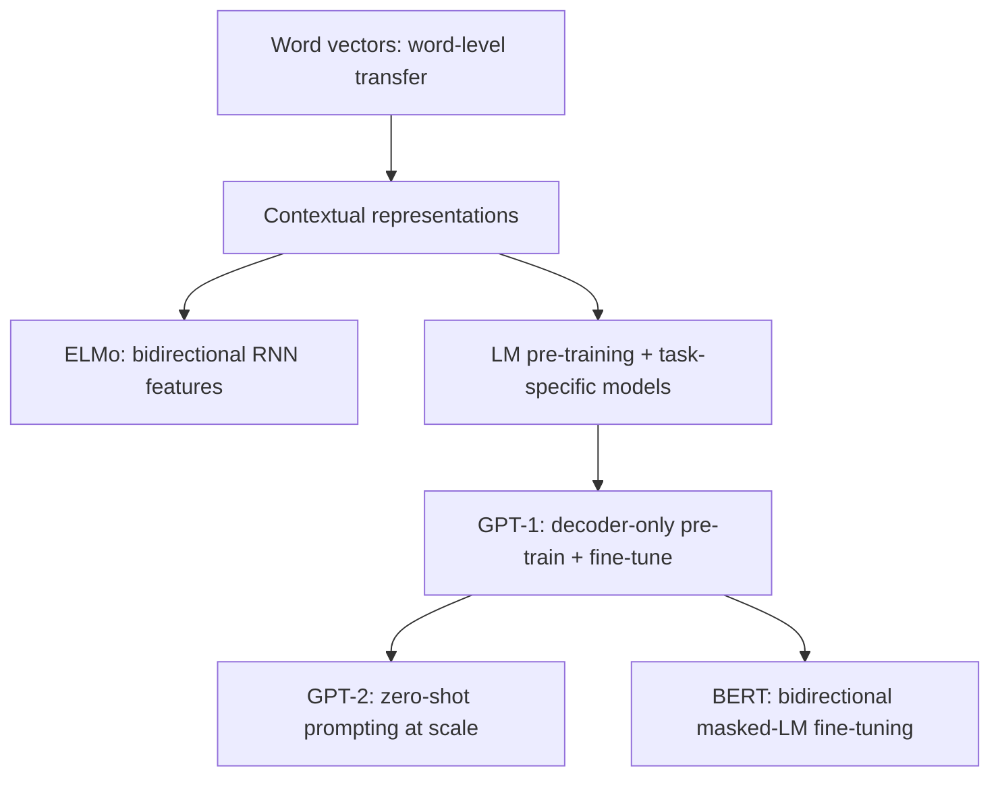

# GPT-1: Improving Language Understanding by Generative Pre-Training

**Paper:** Improving Language Understanding by Generative Pre-Training
**Authors:** Alec Radford, Karthik Narasimhan, Tim Salimans, Ilya Sutskever (OpenAI)
**Year:** 2018

**Related pages:** [The Transformer](../../algorithms/foundations/transformer.md) · [GPT-2](gpt-2.md) · [GPT-3](gpt-3.md) · [Training Index](../index.md)

## TL;DR

**What:** GPT-1 introduces the **decoder-only Transformer** for language — dropping the encoder and cross-attention entirely, pretraining on raw text with a next-token prediction objective, then fine-tuning on supervised tasks with minimal architecture changes.

**How:** A 12-layer decoder-only Transformer (117M params) is pretrained on the BooksCorpus (7000 unpublished books) with a standard language modeling objective, then fine-tuned on downstream tasks by converting structured inputs (sentence pairs, question-answer triples) into contiguous token sequences with delimiter tokens.

**The number:** State-of-the-art on 9 of 12 benchmarks studied: +8.9% on Story Cloze, +5.7% on RACE, +1.5% on MultiNLI, GLUE score of 72.8 (previous best: 68.9). Ablation: without pre-training, average score drops 14.8 points.

## The Big Picture

*1. Long-form books supply discourse-level signal. 2. Causal language modeling teaches reusable representations. 3. Structured tasks are rewritten as token sequences so the same Transformer can be fine-tuned with minimal new parameters.*

## Why This Exists

Before GPT-1, NLP models faced two problems:

1. **Labeled data is scarce.** Most NLP tasks have small supervised datasets — a few thousand labeled examples at best. Deep models overfit on these.
2. **Unlabeled text is everywhere, but nobody knew how to use it well.** Word embeddings (word2vec, GloVe) captured word-level semantics but couldn't transfer phrase-level or sentence-level knowledge. Models like ELMo used bidirectional RNNs for contextual embeddings but still required task-specific architectures.

The core insight: **train the model to do one thing extremely well on vast unlabeled text — predict the next token — and that skill turns out to transfer to almost every NLP task.** The Transformer's decoder (with causal masking) is the perfect architecture for this because it's naturally a left-to-right language model. No need for an encoder. No need for cross-attention. Just stack decoder layers and predict the next word.

## The Landscape

**GPT-1 sits at the point where representation transfer becomes architecture transfer.** Earlier systems reused embeddings or hidden features; GPT-1 reused the whole Transformer stack and changed mostly the input formatting plus output head.

## The Core Idea

A **two-stage paradigm**: (1) unsupervised pre-training — train a large decoder-only Transformer to predict the next token on a diverse text corpus, and (2) supervised fine-tuning — adapt the pretrained model to each downstream task by adding a minimal classification head and converting structured inputs into contiguous token sequences. The model architecture stays the same across all tasks; only the input format and output layer change.

## Deep Dive

### Architecture: The First Decoder-Only Transformer

GPT-1 is a 12-layer decoder-only Transformer. This is the defining architectural choice that separates GPT from the original encoder-decoder Transformer:

| Component | Original Transformer | GPT-1 |
|---|---|---|
| Encoder | 6 layers, self-attention | **None — removed entirely** |
| Decoder | 6 layers, masked self-attn + cross-attn + FFN | 12 layers, masked self-attn + FFN |
| Cross-attention | Yes (decoder attends to encoder) | **None — no encoder to attend to** |
| Position encoding | Sinusoidal (fixed) | Learned position embeddings |
| Activation | ReLU | GELU (Gaussian Error Linear Unit) |
| Parameters | 65M (base) | 117M |
| Layers | 6+6 | 12 |
| $d_{model}$ | 512 | 768 |
| Attention heads | 8 | 12 |
| FFN inner dim | 2048 | 3072 |
| Context window | Not specified (trained on sentence pairs) | 512 tokens |
| Vocabulary | BPE, 37K tokens | BPE, 40K tokens |

$$\begin{aligned} h_0 &= U W_e + W_p \\ h_l &= \text{transformer\_block}(h_{l-1}) \quad \forall l \in [1, n] \\ P(u) &= \operatorname{softmax}(h_n W_e^\top) \end{aligned}$$

**The intuition:** The original Transformer needed an encoder to process the source and a decoder to generate the target. GPT-1 realized that for language modeling, there is no "source" — just a stream of text. The causal self-attention in the decoder is all you need: each token predicts the next one by attending to everything before it. Dropping the encoder and cross-attention simplifies the architecture while keeping the key innovation (parallel self-attention over long contexts).

### Stage 1: Unsupervised Pre-Training

The model is trained on BooksCorpus (7,000+ unpublished books across genres) with a standard language modeling objective — maximize the probability of each token given its preceding context:

$$L_1(\mathcal{U}) = \sum_i \log P(u_i \mid u_{i-k}, \ldots, u_{i-1}; \Theta)$$

BooksCorpus was chosen deliberately: it contains **long stretches of contiguous text**, unlike sentence-shuffled corpora (e.g., 1B Word Benchmark). This forces the model to learn long-range dependencies — discourse coherence, narrative structure, anaphora resolution.

| Training detail | Setting |
|---|---|
| Optimizer | Adam, max LR 2.5e-4 |
| Schedule | Linear warmup (2000 steps) + cosine decay |
| Epochs | 100 |
| Batch size | 64 sequences of 512 tokens |
| Regularization | Dropout 0.1, modified L2 (w=0.01) |
| [Perplexity](../../terms/perplexity.md) on BooksCorpus | 18.4 |

### Stage 2: Task-Specific Input Transformations

The key design choice: **no task-specific architecture changes.** All tasks are converted into a single format — a sequence of tokens — so the same Transformer processes everything. Structured inputs are linearized using delimiter tokens:

| Task type | Input format | How it works |
|---|---|---|
| **Text classification** | `[text]` | Direct: final token's hidden state -> linear -> softmax |
| **Entailment** | `[premise] $ [hypothesis]` | Concatenate with delimiter |
| **Similarity** | `[text1] $ [text2]` + `[text2] $ [text1]` | Both orderings processed independently, representations summed element-wise |
| **Multiple choice QA** | `[context] $ [question] $ [answer_k]` | Each answer processed separately, softmax over scores |

This traversal-style approach means the same pretrained Transformer processes everything — no new encoders, attention mechanisms, or pooling layers per task.

**Remember:** **GPT-1 introduced the "all tasks are token sequences" philosophy.** By converting every NLP task into a contiguous text sequence with delimiter tokens, the model architecture never changes — only the input format does.

### Why Contiguous Text Matters

**What it does:** BooksCorpus gives the model long stretches of ordered narrative text rather than shuffled sentence fragments.

**Why it matters:** The source paper contrasts BooksCorpus with the 1B Word Benchmark because sentence-level shuffling destroys the long-range structure needed for discourse, coreference, and story understanding.

**How it works:** GPT-1 trains on randomly sampled 512-token contiguous sequences for 100 epochs, reaching token-level perplexity 18.4 on BooksCorpus. Those sequences expose the model to references that span paragraphs, character or entity continuity, and causal story progressions.

**The intuition:** If the model only sees isolated sentences, it learns local syntax; if it sees chapters, it has to track who did what and why.

**A concrete example:** In Story Cloze, the model must choose a plausible ending for a short story. BooksCorpus-style pre-training makes that less like memorizing labels and more like continuing a narrative.

**Remember:** **The data format is part of the method.** GPT-1's gains come from pairing a causal Transformer with text that actually rewards long-range prediction.

### Auxiliary Language Modeling Objective

During fine-tuning, GPT-1 adds the LM objective as an auxiliary loss:

$$L_3(\mathcal{C}) = L_2(\mathcal{C}) + \lambda \cdot L_1(\mathcal{C})$$

with $\lambda = 0.5$. This helps in two ways: faster convergence during fine-tuning and better generalization. The auxiliary objective was most beneficial on larger datasets (NLI, QQP) and less important on small ones.

### Ablation: The Pre-Training Matters Enormously

| Variant | Avg score | Δ |
|---|---|---|
| Full GPT (pretrained + fine-tuned) | 74.7 | — |
| No pre-training (Transformer from scratch) | 59.9 | **−14.8** |
| No auxiliary LM objective | 75.0 | +0.3 (marginal) |
| LSTM instead of Transformer | 69.1 | −5.6 |

The 14.8-point drop without pre-training is the headline: **unsupervised pre-training transfers an enormous amount of linguistic knowledge.** The Transformer's inductive bias (attention over RNN recurrence) accounts for 5.6 points. The auxiliary LM objective is a minor contributor.

### Zero-Shot Behaviors

Even without any fine-tuning, the pretrained language model shows emerging task abilities. GPT-1 designed heuristic evaluations:

- **Sentiment (SST-2):** Append "very" to the text, compare LM probability of "positive" vs. "negative"
- **Linguistic acceptability (CoLA):** Score sentence by average token log-probability, threshold
- **QA (RACE):** Pick answer with highest average token log-probability given passage + question
- **Coreference (DPRD):** Substitute pronoun with each candidate, pick higher-probability continuation

Performance on these zero-shot heuristics **steadily improved** over the course of LM pre-training, showing the model was implicitly learning task-relevant capabilities from next-token prediction alone.

## Putting It Together

1. Start with a long book sequence and train the decoder-only Transformer to predict each next token from the previous 512-token context.
2. Keep the pretrained Transformer weights as the shared language-understanding engine.
3. Convert each supervised task into a contiguous sequence with delimiter tokens: premise/hypothesis, context/question/answer, or both sentence orderings for similarity.
4. Add only the task classifier parameters and delimiter embeddings during transfer.
5. Fine-tune for a few epochs with the supervised loss plus the auxiliary LM loss.
6. At evaluation time, the model uses the same causal representation path for every task, which is why the ablation without pre-training loses 14.8 average points.

## What This Buys You

### The headline claim

GPT-1 proves that **generative pre-training can be a general-purpose initialization for discriminative language understanding**, not just a way to make better text generators.

### How we know: headline supervised transfer results

| Task | Previous SOTA | GPT-1 | Δ |
|---|---|---|---|
| **Story Cloze** (commonsense) | 77.6 | **86.5** | +8.9 |
| **RACE** (QA, overall) | 53.3 | **59.0** | +5.7 |
| **MultiNLI** (matched) | 80.6 | **82.1** | +1.5 |
| **SciTail** (NLI) | 83.3 | **88.3** | +5.0 |
| **QNLI** | 82.3 | **88.1** | +5.8 |
| **CoLA** (linguistic acceptability) | 35.0 | **45.4** | +10.4 |
| **STS-B** (semantic similarity) | 81.0 | **82.0** | +1.0 |
| **QQP** (paraphrase) | 66.1 | **70.3** | +4.2 |
| **GLUE** (overall) | 68.9 | **72.8** | +3.9 |

9 out of 12 datasets achieved SOTA.

### The mechanism behind the numbers

Each additional pretrained layer transferred to fine-tuning provides further benefit — up to 9% on MultiNLI going from embedding-only to full 12-layer transfer. Every layer in the pretrained model captures useful linguistic knowledge.

### How to read these numbers

The strongest interpretation is not that GPT-1 solved all language understanding. The stronger lesson is that **the same pretrained stack becomes useful across unrelated task formats** once those formats are expressed as text sequences.

## Where It Breaks

| Failure mode | When it happens | Impact |
|---|---|---|
| Small datasets without auxiliary LM help | Fine-tuning on very small tasks (RTE: 2490 examples) | GPT-1 underperforms multi-task BiLSTM (56.0 vs 61.7 on RTE) — pre-training alone can't compensate for extreme data scarcity |
| BooksCorpus domain limitation | Tasks requiring knowledge outside the book domain | Pretraining data quality matters; the model only knows what's in its training corpus |
| Unidirectional limitation | Tasks requiring bidirectional context (later solved by BERT) | Causal masking means token $i$ can't see tokens $i+1$; BERT's masked LM objective provides bidirectional context |
| Fixed context window (512) | Documents longer than 512 tokens | Longer documents truncated; modern models use much larger windows (GPT-3: 2048, GPT-4: 128K+) |
| No cross-attention for structured generation | Tasks like translation or summarization that benefit from explicit source-target alignment | The original encoder-decoder Transformer handles these more naturally; GPT models handle them via prompting |

## One Thing to Remember

**GPT-1 proved that a decoder-only Transformer trained to simply predict the next token on a large text corpus acquires general-purpose linguistic knowledge that transfers to virtually any NLP task — the model architecture never changes, only the input format does.** This eliminated the need for task-specific architectures and established the pre-train + fine-tune paradigm: spend compute once on unsupervised pre-training, then adapt cheaply to any downstream task. The 14.8-point ablation gap between pretrained and from-scratch models tells the whole story.

## Go Deeper

- **Read:** [GPT-1 paper](https://cdn.openai.com/research-covers/language-unsupervised/language_understanding_paper.pdf)
- **Build on:** [GPT-2](gpt-2.md) (zero-shot multitask learning at scale) · [GPT-3](gpt-3.md) (175B params, in-context few-shot learning)
- **Understand the context:** [The Transformer](../../algorithms/foundations/transformer.md) (the original encoder-decoder architecture) · BERT (bidirectional masked LM, the other branch of pre-training) · ELMo (contextual RNN embeddings, the approach GPT-1 superseded)
