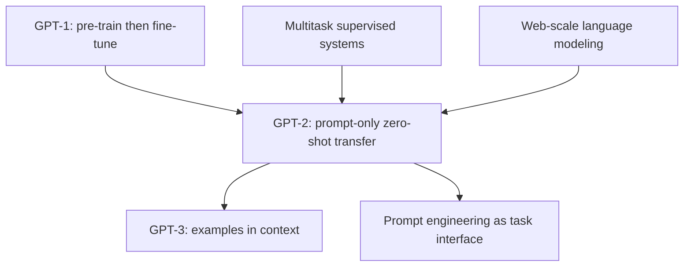

# GPT-2: Language Models are Unsupervised Multitask Learners

**Paper:** Language Models are Unsupervised Multitask Learners
**Authors:** Alec Radford, Jeffrey Wu, Rewon Child, David Luan, Dario Amodei, Ilya Sutskever (OpenAI)
**Year:** 2019

**Related pages:** [The Transformer](../../algorithms/foundations/transformer.md) · [GPT-1](gpt-1.md) · [GPT-3](gpt-3.md) · [Training Index](../index.md)

## TL;DR

**What:** GPT-2 scales GPT-1's decoder-only Transformer to **1.5 billion parameters** (10× larger) trained on **WebText** (8M web pages curated from Reddit outbound links), and discovers that a sufficiently large language model performs downstream tasks **zero-shot** — without any fine-tuning or architecture changes.

**How:** The key conceptual shift is framing all NLP tasks as language modeling: `(task description, input) → output`. A translation example becomes the sequence `"translate to french, english text, french text"` — the model learns to infer the task from the prompt alone. Task conditioning is done entirely through natural language in the input, not through architectural mechanisms.

**The number:** Zero-shot SOTA on 7 of 8 language modeling benchmarks. 55 F1 on CoQA reading comprehension (matching 3 of 4 supervised baselines, using **zero** training examples). 70.7% on Winograd Schema Challenge (+7% over previous SOTA). 63.24% on LAMBADA accuracy (+4% over SOTA).

## The Big Picture

*1. Human-curated web links make a broader corpus than books. 2. Byte-level BPE lets the LM score arbitrary datasets without unknown tokens. 3. Natural-language prompts select a task without gradient updates.*

## Why This Exists

GPT-1 proved that pre-training + fine-tuning works. But fine-tuning still requires a labeled dataset for every new task. GPT-2 asks: **can we skip fine-tuning entirely?**

The motivation comes from two observations:

1. **Multitask learning needs scale.** Current multitask systems train on 10–17 (dataset, objective) pairs. But from a meta-learning perspective, each pair is just one "training example" of task learning. To generalize across tasks, you'd need thousands of such pairs — impractical to manually create.
2. **Language naturally encodes tasks.** Translation teaching examples already appear on the web: `"In French: Je ne suis pas un imbécile [I'm not a fool]"`. Summarization: news articles followed by TL;DR. QA: forum posts with questions and answers. If you train a language model on diverse enough web text, it should **implicitly learn these task patterns** just by trying to predict the next token.

The core bet: **a language model with sufficient capacity, trained on a sufficiently diverse corpus, will learn to infer and perform tasks from the natural language demonstrations embedded in the training data — without explicit supervision of which tokens are inputs vs. outputs.**

## The Landscape

**GPT-2 turns task adaptation from a training step into an inference-time formatting problem.** It inherits GPT-1's architecture but replaces labeled task datasets with naturally occurring demonstrations found in diverse web text.

## The Core Idea

Language modeling is already a multitask learning objective in disguise. When the training data contains examples of translation, summarization, QA, and other tasks written in natural language, the model learns to perform these tasks just by maximizing $P(\text{next token} \mid \text{context})$. At inference time, you specify the task through the prompt: add `"TL;DR:"` after an article to trigger summarization, or `"translate to french, "` before English text to trigger translation. No weight updates. No architecture changes. Just prompt engineering.

## Deep Dive

### WebText: The Dataset That Made It Work

GPT-1 was trained on BooksCorpus (7K books, single domain). GPT-2 needed something much larger and more diverse. The solution: **WebText**, created by scraping all outbound links from Reddit posts with ≥3 karma — a heuristic for "humans found this interesting."

| Property | BooksCorpus (GPT-1) | WebText (GPT-2) |
|---|---|---|
| Size | ~1 GB | 40 GB (8M documents, after dedup) |
| Domains | Books only | News, blogs, forums, Wikipedia, tutorials, code, etc. |
| Quality filter | None needed (published books) | Reddit karma ≥ 3 (crowd-curated) |
| Long-range structure | Yes (book chapters) | Yes (web articles) |
| Wikipedia included? | N/A | **Removed** (to avoid test set contamination) |

The key insight: Reddit karma acts as a **scalable quality filter**. Links that humans upvote tend to contain coherent, informative text — exactly what you want in a language modeling corpus.

### Architecture Changes from GPT-1

GPT-2 is a scaled-up GPT-1 with several improvements:

| Change | GPT-1 | GPT-2 | Why |
|---|---|---|---|
| **Layer normalization** | Post-norm (add then norm) | **Pre-norm** (norm then add) | Better training stability in deep networks |
| **Extra LayerNorm** | None | Added after final self-attention block | Stabilizes final representations |
| **Weight initialization** | $N(0, 0.02)$ | Scaled by $1/\sqrt{N}$ (N = residual layers) | Prevents activation growth with depth |
| **Context window** | 512 | **1024** | Longer documents |
| **Vocabulary** | 40,000 BPE | **50,257** byte-level BPE | Handles any Unicode string |
| **Batch size** | 64 | **512** | Better GPU utilization at scale |

**Four model sizes were trained**, log-uniformly spaced:

| Model | Parameters | Layers | $d_{model}$ |
|---|---|---|---|
| GPT-2 Small | 117M | 12 | 768 |
| GPT-2 Medium | 345M | 24 | 1024 |
| GPT-2 Large | 762M | 36 | 1280 |
| GPT-2 XL | 1542M | 48 | 1600 |

The 117M model is equivalent to GPT-1. The 345M model is equivalent to BERT-Large. GPT-2 (1542M) is an order of magnitude larger than both.

### Byte-Level BPE: Handling Any Text

A key engineering contribution: GPT-2 uses a **byte-level BPE** tokenizer that can represent any Unicode string. Standard BPE operates on Unicode code points (~130K base vocabulary — too large). GPT-2 operates on raw bytes (base vocabulary = 256), then applies BPE merges. To prevent BPE from creating redundant tokens like `dog`, `dog!`, `dog?`, GPT-2 prevents merges across character categories (letters, digits, punctuation) except for spaces.

This means GPT-2 can be evaluated on **any dataset regardless of preprocessing** — no special `<UNK>` tokens, no case-folding, no tokenization artifacts.

**The intuition:** Byte-level BPE makes the language model's interface universal: if a task is text, the model can assign it a probability without a custom tokenizer.

**Remember:** **The tokenizer is what makes zero-shot evaluation clean.** GPT-2 does not need dataset-specific preprocessing to read PTB, WikiText, CoQA, or web text.

### Zero-Shot Task Transfer: The Headline Discovery

GPT-2 is **not fine-tuned** on any downstream task. All results below are from prompting alone:

| Task | GPT-2 Result | Context | Comparison |
|---|---|---|---|
| **CoQA** (reading comprehension) | 55 F1 | Conditioned on `"A:"` prompt | Matches 3 of 4 supervised baselines (using 0 of 127K training examples) |
| **LAMBADA** (long-range prediction) | 63.24% acc | + stop-word filter | +4% over previous SOTA |
| **Winograd Schema** | 70.70% | Full scoring | +7% over previous SOTA |
| **CBT** (Children's Book Test) | 93.3% CN, 89.1% NE | LM probability | SOTA on common nouns and named entities |
| **Summarization** (CNN/DM) | 21.4 ROUGE-avg | `"TL;DR:"` prompt | Barely above random-3 baseline |
| **Translation** (WMT14 Fr→En) | 11.5 BLEU | Example pairs in context | Outperforms some unsupervised MT baselines |
| **Translation** (WMT14 En→Fr) | 5 BLEU | Example pairs in context | Worse than trivial lexicon baseline |
| **Natural Questions** | 4.1% exact match | Question-answer pairs as prompt | 5.3× better than smallest model (0.77%) |
| **Natural Questions** (top 1% confidence) | 63.1% | Calibrated confidence | Shows the model knows when it knows |

### The Scaling Trend: Bigger Is Better, Smoothly

Across all tasks, performance improves **log-linearly** with model size — double the parameters, get a consistent accuracy gain. GPT-2 still **underfits** WebText (held-out perplexity keeps improving with more training). This suggested that even bigger models on even more data would continue improving — a prediction confirmed by GPT-3.

### Data Contamination Analysis

GPT-2 was the first paper to systematically study train-test overlap for web-scale LMs. Using Bloom filters on 8-grams:

| Dataset | Overlap with WebText train | Overlap with own train |
|---|---|---|
| PTB | 0.88% | 2.67% |
| WikiText-2 | 1.63% | 0.66% |
| WikiText-103 | 2.42% | 9.09% |
| 1B Word Benchmark | 3.75% | 13.19% |

The average overlap with WebText (3.2%) is actually **lower** than the average overlap within datasets' own train-test splits (5.9%). Removing overlapping examples from LAMBADA shifts results from 63.2% to 62.9% — negligible. For CoQA, domain overlap adds ~0.5–1.0 F1.

## Putting It Together

1. Build WebText by scraping outbound Reddit links that passed a simple human-interest filter, then remove duplicates and Wikipedia.
2. Tokenize text with byte-level BPE so the same model can read arbitrary benchmark text.
3. Train increasingly large decoder-only Transformers on next-token prediction.
4. At evaluation time, express a task as a prefix such as `TL;DR:`, `A:`, or a translation-style prompt.
5. Let the model continue the sequence and score candidate completions by language-model probability.
6. Interpret success as evidence that web-scale next-token prediction has learned task patterns implicitly, and interpret failure as evidence that the prompt/corpus/scale combination is still insufficient.

## What This Buys You

### The headline claim

A 1.5B-parameter language model trained on diverse web text performs a wide range of NLP tasks **without any supervised training or fine-tuning** — just by reading the task description and input as a text prompt.

### The mechanism

The pre-training corpus naturally contains demonstrations of many tasks. When a language model tries to predict the next token on web text, it encounters sequences like:

- `"In French, 'Je ne suis pas un imbécile' means 'I'm not a fool'"` → learns translation
- `"TL;DR: ..."` → learns summarization
- `"Q: What is the capital of France? A: Paris"` → learns QA

At sufficient scale, the model learns to **recognize task patterns from the prompt** and continue appropriately — zero-shot task transfer emerges from language modeling alone.

### How to read these numbers

GPT-2's strongest results are not uniformly distributed across tasks. The paper shows impressive zero-shot language modeling, cloze, and some reading-comprehension behavior, while summarization and some translation directions remain weak. **The result is an emergence claim, not a claim of production-ready generality.**

## Where It Breaks

| Failure mode | When it happens | Impact |
|---|---|---|
| Abstractive summarization is poor | CNN/Daily Mail summarization | Only slightly above random-3 baseline; model focuses on recent content, confuses details |
| Low-resource translation is weak | Translating into non-English | En→Fr BLEU of 5 vs. Fr→En BLEU of 11.5 — the model's English language model is much stronger |
| Factual accuracy is unreliable | Natural Questions, factoid QA | 4.1% overall exact match; only 63.1% on the top 1% most confident answers |
| Repetition and degeneration | Long-form greedy decoding | Beam search and top-k sampling needed to avoid repetitive loops |
| Still far from usable zero-shot | Most tasks | Competitive with supervised baselines on some tasks, but far from SOTA on others |

## One Thing to Remember

**GPT-2 showed that "more parameters + more diverse data = emergent zero-shot capabilities."** A language model trained only to predict the next token, when scaled to 1.5B parameters on 40GB of web text, spontaneously learns to translate, summarize, answer questions, and resolve pronouns — without a single labeled example. **The task is specified in the prompt, not in the weights.** This reframed NLP from "build a model for each task" to "build one model and prompt it differently."

## Go Deeper

- **Read:** [GPT-2 paper](https://cdn.openai.com/better-language-models/language_models_are_unsupervised_multitask_learners.pdf)
- **Build on:** [GPT-1](gpt-1.md) (the pre-train + fine-tune paradigm) · [GPT-3](gpt-3.md) (175B, in-context few-shot learning)
- **Understand the context:** [The Transformer](../../algorithms/foundations/transformer.md) (the original architecture) · BERT (bidirectional pre-training, the competing paradigm) · Scaling Laws (Kaplan et al., the theoretical foundation for "bigger is better")
