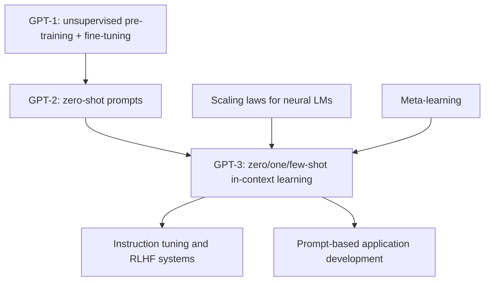

# GPT-3: Language Models are Few-Shot Learners

**Paper:** Language Models are Few-Shot Learners
**Authors:** Tom B. Brown, Benjamin Mann, Nick Ryder, Melanie Subbiah, Jared Kaplan, ... (31 authors, OpenAI)
**Year:** 2020 (NeurIPS)

**Related pages:** [The Transformer](../../algorithms/foundations/transformer.md) · [GPT-1](gpt-1.md) · [GPT-2](gpt-2.md) · [Megatron-LM](../parallelism/megatron-lm/) · [Training Index](../index.md)

## TL;DR

**What:** GPT-3 scales the decoder-only Transformer to **175 billion parameters** (100× GPT-2) and demonstrates **in-context few-shot learning** — the model learns new tasks from just a few examples provided in the prompt, without any weight updates.

**How:** The model is trained on a filtered Common Crawl dataset (410B tokens) mixed with higher-quality corpora (WebText2, books, Wikipedia) totaling ~500B tokens. At inference time, tasks are specified by prepending $K$ examples (typically 10–100) of `(input, output)` pairs, followed by the test input. The model "learns" the task pattern from context alone, with no gradient updates.

**The number:** 71.2% on TriviaQA (few-shot, SOTA in closed-book setting). 85.0 F1 on CoQA (few-shot). Strong performance on translation, arithmetic, word unscrambling, and commonsense reasoning — all without fine-tuning. Can generate news articles indistinguishable from human-written ones.

## The Big Picture

*1. A large mixed corpus builds broad latent skills. 2. Scaling strengthens the model's ability to use context. 3. Examples in the prompt act like a temporary task specification rather than a fine-tuning dataset.*

## Why This Exists

GPT-2 showed zero-shot task transfer works, but results were far behind supervised fine-tuning (4% on Natural Questions, 55 F1 on CoQA vs. 89 SOTA). The question: **does scaling solve this gap?**

GPT-3's bet: if zero-shot ability emerged at 1.5B parameters, maybe at 175B parameters the model could match fine-tuned performance — or at least come close enough to be practically useful. More importantly, GPT-3 distinguishes between three settings that form a spectrum of task specification:

| Setting | Description | Closest to human experience |
|---|---|---|
| **Zero-shot** | Natural language instruction only, no examples | "Translate this to French" |
| **One-shot** | Instruction + one demonstration | "Translate: hello → bonjour. Now translate: goodbye → ?" |
| **Few-shot** | Instruction + K demonstrations (10–100) | "Here are 50 English-French pairs. Translate: book → ?" |

Humans learn most tasks from a combination of instruction and a small number of examples. GPT-3 aims to match this fluidity — no dataset collection, no training, just tell the model what you want and show a few examples.

## The Landscape

**GPT-3 joins two lines of work: scaling laws and meta-learning.** The architecture is still GPT-style next-token prediction, but the evaluation asks whether the model can adapt inside the context window rather than through fine-tuning.

## The Core Idea

**In-context learning** — the model uses its forward pass to "learn" from the examples in its context window. The attention mechanism reads the provided demonstrations, identifies the pattern (input → output mapping), and applies it to the new input. No weights change. Everything happens within a single forward pass. The key finding: this in-context learning ability improves **dramatically** with model scale — while small models barely benefit from additional examples, large models show steep "in-context learning curves" (Figure 1.2 in the paper).

## Deep Dive

### The Training Data Pipeline

GPT-3 trains on a carefully curated mix of web data and high-quality reference corpora:

| Dataset | Tokens | Weight in mix | Quality strategy |
|---|---|---|---|
| Common Crawl (filtered) | 410B | 60% | Filtered by similarity to high-quality reference corpora |
| WebText2 | 19B | 22% | Expanded Reddit-link scraping |
| Books1 | 12B | 8% | Internet books corpus |
| Books2 | 55B | 8% | Additional books corpus |
| Wikipedia | 3B | 3% | English Wikipedia |

The key innovation: Common Crawl is filtered through a **classifier trained to distinguish high-quality text** (Wikipedia, books, WebText) from low-quality text. Documents most similar to the reference corpora are retained. This produces 570GB of filtered text from 45TB of raw Common Crawl. Additionally, the training mix overweights high-quality sources — Wikipedia is seen 3.4 times during training, while Common Crawl is seen only 0.44 times.

### Model Architecture: GPT-2, Scaled Up

GPT-3 uses the same decoder-only architecture as GPT-2 with two additions: **alternating dense and sparse attention** (Sparse Transformer), and **model parallelism** across both depth and width. Eight model sizes were trained:

| Model | Params | Layers | $d_{model}$ | Heads | Batch (tokens) |
|---|---|---|---|---|---|
| GPT-3 Small | 125M | 12 | 768 | 12 | 0.5M |
| GPT-3 Medium | 350M | 24 | 1024 | 16 | 0.5M |
| GPT-3 Large | 760M | 24 | 1536 | 16 | 0.5M |
| GPT-3 XL | 1.3B | 24 | 2048 | 24 | 1M |
| GPT-3 2.7B | 2.7B | 32 | 2560 | 32 | 1M |
| GPT-3 6.7B | 6.7B | 32 | 4096 | 32 | 2M |
| GPT-3 13B | 13.0B | 40 | 5140 | 40 | 2M |
| **GPT-3 175B** | **175B** | **96** | **12288** | **96** | **3.2M** |

All models use $n_{ctx} = 2048$ tokens and are trained for 300B tokens total. The largest model (175B) is 10× bigger than any previous non-sparse language model.

### Validation Loss Follows a Power Law

GPT-3's training curves confirm the scaling law hypothesis: cross-entropy loss follows a smooth power-law trend with compute across **six orders of magnitude**, from 100K-parameter models to 175B. There is no sign of diminishing returns — the curve continues smoothly. This was strong evidence that further scaling would continue to improve performance.

### Few-Shot Learning: How It Works

For few-shot evaluation, GPT-3 receives $K$ examples drawn from the training set, formatted as a sequence of context-completion pairs followed by the test context for the model to complete.

The model then generates the completion. For multiple-choice tasks, GPT-3 scores each option by its likelihood given the context and picks the highest. For free-form generation, beam search (width 4, length penalty 0.6) is used.

Key implementation detail: $K$ is chosen per task to maximize the number of examples that fit in the 2048-token context window — typically 10 to 100 examples. More examples almost always help, especially for larger models.

**The intuition:** Few-shot prompting converts a tiny labeled dataset into temporary context; the model does pattern matching and task inference in activations instead of storing new knowledge in weights.

**Remember:** **No gradient update is allowed.** GPT-3's few-shot setting is still a pure inference-time setting.

### The Scaling of In-Context Learning

The most important finding: **the gap between zero-shot, one-shot, and few-shot performance grows with model size.** Small models (125M–1.3B) benefit modestly from more examples. Large models (13B–175B) benefit dramatically. This suggests that in-context learning is an **emergent meta-learning capability** that only activates at sufficient scale.

| Task | GPT-3 0-shot | GPT-3 1-shot | GPT-3 Few-shot | Fine-tuned SOTA |
|---|---|---|---|---|
| **TriviaQA** | 64.3% | 68.0% | **71.2%** | ~71% (closed-book) |
| **CoQA** | 81.5 F1 | 84.0 F1 | 85.0 F1 | 90.7 F1 |
| **LAMBADA** (zero-shot) | 76.2% acc | — | — | 68% (previous LM SOTA) |
| **LAMBADA** (few-shot) | — | — | 86.4% | — |
| **SuperGLUE** | — | — | 71.8 | 89.0 (fine-tuned) |
| **ANLI** (round 3) | 43.6% | — | 43.6% | ~50% |
| **Arithmetic** (3-digit) | 36.0% | — | 63.0% | 100% (calculator) |
| **Word unscrambling** | 25.2% | 38.6% | 45.9% | — |
| **News generation** | — | — | Human eval: 52% detection rate | — |

### Synthetic Tasks: On-the-Fly Reasoning

GPT-3 was tested on tasks specifically designed to require reasoning or adaptation, not retrieval:

- **Arithmetic (3-digit addition/subtraction):** 36% zero-shot, 63% few-shot. The model wasn't trained to do math — it had to infer the algorithm from examples.
- **Word unscrambling:** Given scrambled letters, produce the word. 26% → 46% with more examples. Requires understanding letter patterns in English, not memorization.
- **SAT analogy problems:** "audacious is to boldness as..." — 65.2% few-shot, competitive with average college applicant.
- **Using a novel word in a sentence:** Define a made-up word, then use it correctly. GPT-3 can do this — understanding word categories and syntactic slots from definition alone.

These results suggest GPT-3 is doing something beyond pattern matching — it can infer rules and apply them to novel inputs, at least for simple tasks.

### Training Compute

GPT-3 175B required approximately $3.14 \times 10^{23}$ FLOPs for training — roughly 3,640 petaflop/s-days. All models were trained on V100 GPUs on Microsoft's high-bandwidth cluster. For the systems question of how GPT-scale dense models fit and run efficiently on multi-node GPU clusters, see [Megatron-LM](../parallelism/megatron-lm/), which explains tensor, pipeline, and data parallel composition.

## Putting It Together

1. Filter Common Crawl against higher-quality corpora, then mix it with WebText2, books, and Wikipedia.
2. Train a family of decoder-only Transformers from 125M to 175B parameters for 300B tokens.
3. Define the evaluation condition: zero-shot instruction, one-shot instruction plus one example, or few-shot instruction plus as many examples as fit.
4. Format the prompt as repeated context-completion pairs followed by a final test context.
5. For classification or multiple choice, score each candidate by likelihood; for generation, sample or decode the completion.
6. Compare curves across model sizes. The key observation is that larger models use extra in-context examples much more efficiently than smaller models.

## What This Buys You

### The headline claim

GPT-3 demonstrates that **in-context few-shot learning is a viable alternative to fine-tuning** — the model can perform dozens of NLP tasks at competitive levels without any parameter updates, using only examples in the prompt.

### Scaling behavior

The consistent finding across all tasks: **performance improves smoothly and predictably with model size**, in both zero-shot and few-shot settings. Larger models make more efficient use of in-context examples — the few-shot learning curve gets steeper with scale.

### The paradigm shift

GPT-3 fundamentally changed how people build NLP applications: instead of collecting a dataset → fine-tuning a model → deploying, you can now write a prompt with a few examples → call an API → get results. This "prompt engineering" paradigm powers virtually all modern LLM applications.

### How to read these numbers

Few-shot does not mean the model has learned a durable new skill. **The learned task lives only in the current context window**, so performance depends heavily on prompt format, example choice, context length, and whether the benchmark resembles patterns absorbed during pre-training.

## Where It Breaks

| Failure mode | When it happens | Impact |
|---|---|---|
| **Natural language inference** | ANLI, adversarial NLI | GPT-3 few-shot is only slightly above random on ANLI round 3 (~44%); struggles with deliberately constructed counter-examples |
| **Reading comprehension (RACE, QuAC)** | Long-passage, multi-hop QA | GPT-3 performs poorly compared to fine-tuned models; long contexts may exceed attention resolution |
| **Text synthesis degeneration** | Long-form generation with greedy decoding | Repetition, contradiction, and factual errors accumulate over long generations |
| **Data contamination** | Test sets that appear in training data (Common Crawl) | Some benchmark results may be inflated; GPT-3's paper quantifies this with n-gram overlap analysis |
| **Bias and toxicity** | Training on unfiltered web text | GPT-3 reflects biases present in internet text; can generate toxic, stereotyped, or harmful content |
| **Cost and latency** | 175B parameter model, 2048-token context | Requires specialized hardware; inference is expensive and slow for real-time applications |
| **No weight updates from feedback** | Tasks requiring continual learning or personalization | The model can't learn from its mistakes at inference time; same prompt always produces same distribution |
| **Limited context window (2048 tokens)** | Tasks requiring more than ~1500 words of context | Few-shot examples + task description + input must all fit; longer documents are truncated |

## One Thing to Remember

**GPT-3 proved that "scale is a form of meta-learning."** With enough parameters and diverse enough training data, a language model develops the ability to **learn new tasks from examples in its context window** — without any weight updates. This in-context few-shot learning is emergent: small models barely benefit from additional examples, but at 175B parameters the learning curve becomes steep and the gap between zero-shot and few-shot performance widens dramatically. **The model architecture never changed from GPT-1 — only the scale did.** This established the scaling hypothesis as the dominant approach in AI: build bigger models on more data, and qualitatively new capabilities will emerge.

## Go Deeper

- **Read:** [arXiv:2005.14165](https://arxiv.org/abs/2005.14165) (72 pages — but Sections 1–3 cover the core results)
- **Build on:** InstructGPT / ChatGPT (RLHF alignment) · GPT-4 (multimodal scaling) · Chinchilla (compute-optimal scaling laws)
- **Understand the context:** [GPT-1](gpt-1.md) (the pre-train + fine-tune paradigm) · [GPT-2](gpt-2.md) (zero-shot transfer, WebText) · [The Transformer](../../algorithms/foundations/transformer.md) (the architecture that made it possible) · Scaling Laws (Kaplan et al., the theoretical prediction GPT-3 confirmed)
