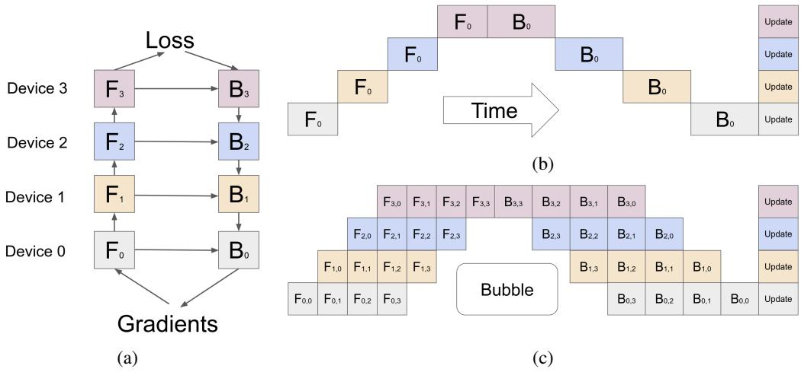
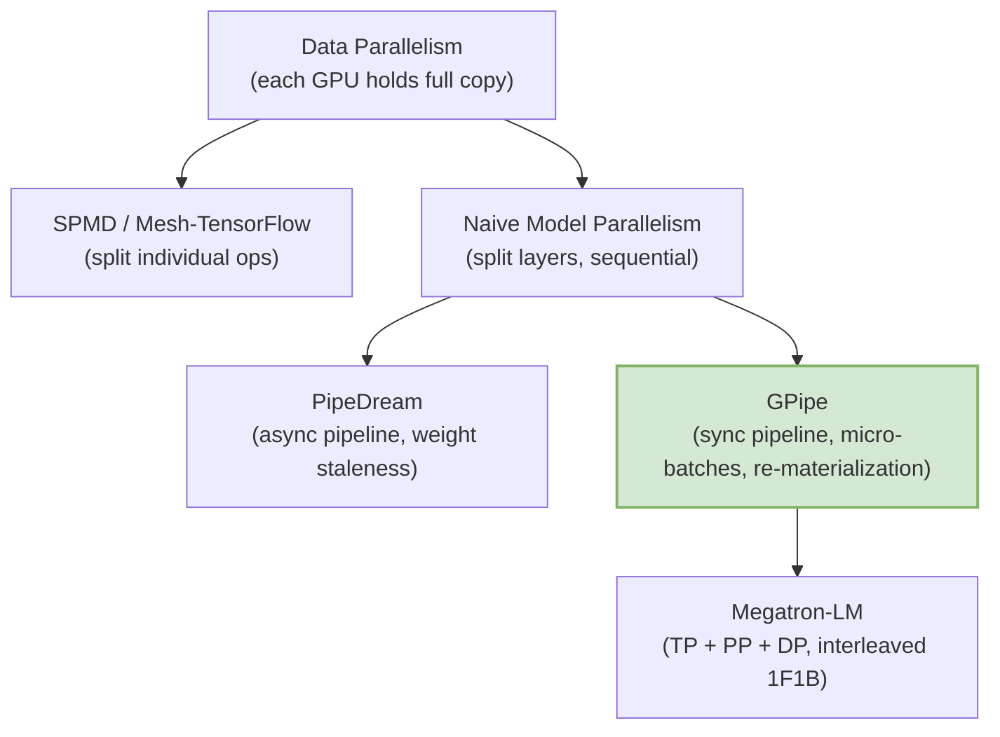
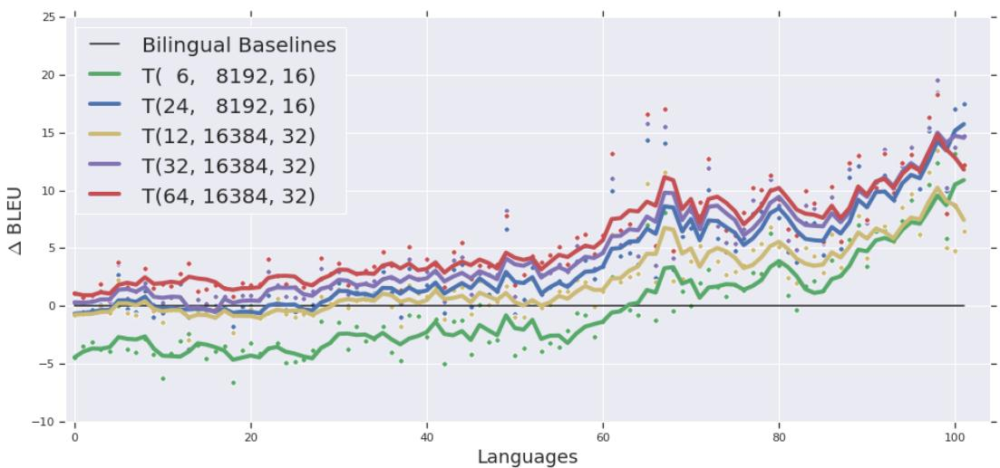

# GPipe: Micro-Batch Pipeline Parallelism

**Paper:** GPipe: Easy Scaling with Micro-Batch Pipeline Parallelism  
**Authors:** Yanping Huang, Youlong Cheng, Ankur Bapna, Orhan Firat, Mia Xu Chen, Dehao Chen, HyoukJoong Lee, Jiquan Ngiam, Quoc V. Le, Yonghui Wu, Zhifeng Chen (Google)  
**arXiv:** [1811.06965v5](https://arxiv.org/abs/1811.06965) (Jul 2019)

**Related pages:** [Megatron-LM: GPU-Cluster Training Parallelism](../megatron-lm/index.md), [Transformer](../../algorithms/transformer.md)

## TL;DR

**What:** GPipe is a pipeline parallelism library that lets you train models larger than a single accelerator's memory by splitting layers across devices and streaming [microbatches](../../terms/microbatch.md) through them — with synchronous gradient updates that guarantee correctness regardless of the number of partitions.

**How:** Partition the model into K sequential cells on K accelerators; split each mini-batch into M micro-batches; pipeline forward/backward passes so all accelerators stay busy; accumulate gradients across micro-batches and apply synchronously at the end of each mini-batch; use activation recomputation to slash memory.

**The number:** With $M \ge 4K$, the pipeline bubble overhead becomes negligible and throughput scales near-linearly — a 6.3× speedup on 8 TPUs for Transformer models, and 298× larger models (83.9B params) on 128 accelerators versus a single device.

## The Big Picture

*① A neural network is partitioned into K cells ($F_k$ = forward, $B_k$ = backward), each placed on a separate accelerator. ② Naive model parallelism leaves all but one accelerator idle at any moment. ③ GPipe splits the mini-batch into M micro-batches and pipelines them: as micro-batch 1's forward pass finishes on device 1, device 2 starts its forward pass while device 1 begins micro-batch 2. During the backward pass, gradients flow in reverse. All gradients are accumulated and applied synchronously at mini-batch end.*

## Why This Exists

Imagine you want to train a 6-billion-parameter Transformer on 103 languages. A single GPU has 16 GB of memory. The model parameters alone consume ~72 GB (12 bytes each with optimizer state). You cannot even load the model, let alone compute activations.

Before GPipe, your options were:

- **Data parallelism:** Each GPU holds a full model copy. Requires the model to fit on a single device. Useless for giant models.
- **Naive model parallelism:** Split layers across GPUs. GPU 0 computes layer 0→1, sends activations to GPU 1, then sits idle while GPU 1 computes layer 2→3. At any moment, only one GPU works. 75% idle on 4 GPUs.
- **Mesh-TensorFlow (SPMD):** Split individual matrix multiplications across devices. Works but floods the interconnect with AllReduce traffic. Requires high-speed links. Architecture-specific.
- **PipeDream:** Pipelines forward and backward passes asynchronously. Higher utilization, but weight staleness means you need multiple parameter versions, eating memory and risking optimization issues.

GPipe solves this with **synchronous** pipeline parallelism: you get the utilization of pipelining without the correctness risks of async.

## The Landscape

*GPipe sits between naive model parallelism and Megatron-LM. It pioneered synchronous micro-batch pipeline parallelism. Megatron-LM later extended this with interleaved scheduling (1F1B) to further reduce the pipeline bubble.*

## The Core Idea

Instead of sending one giant batch through a pipeline and wasting GPUs at the head and tail, **chop the batch into many small [microbatches](../../terms/microbatch.md) and stream them through like an assembly line**. Make all gradient updates synchronous at mini-batch boundaries so the math is identical to single-device training. Add activation recomputation so you don't need to cache intermediate activations — just recompute them during the backward pass.

The only cost is a "pipeline bubble" — the warmup and drain phases at the start and end of each mini-batch where not all accelerators are busy. Make the number of micro-batches M large enough (≥ 4K), and this bubble becomes negligible.

## Symbol Map

| Symbol | Human name | Meaning |
|---|---|---|
| $K$ | number of partitions | How many accelerators the model is split across |
| $M$ | number of micro-batches | How many pieces each mini-batch is divided into |
| $L$ | number of layers | Total layers in the model |
| $N$ | mini-batch size | Total training examples per gradient update |
| $F_k$ | forward function of cell k | Composite forward computation for partition k |
| $B_k$ | backward function of cell k | Gradient computation for partition k |
| $C_k$ | cost estimator | Estimated FLOPs for partition k |

## Deep Dive

### Partitioning and Cell Placement

**What it does:** Divides a sequence of L layers into K cells, placing one cell per accelerator.

**Why it matters:** The partitioning quality directly determines pipeline efficiency. Imbalanced cells create stragglers.

**How it works:** GPipe uses a cost estimator $c_i$ per layer to balance total estimated cost $C_k = \sum_{l=i}^{j} c_l$ across cells. Communication primitives are auto-inserted at partition boundaries — the user only specifies K, M, and the layer sequence.

**The intuition:** Think of it as load-balancing an assembly line. Each station should take roughly the same time.

**Remember:** Perfectly balanced cells give linear speedup; imbalanced cells (like AmoebaNet's variable-width layers) give sub-linear scaling.

### Micro-Batch Pipelining

**What it does:** Splits a mini-batch of size N into M equal micro-batches and pipelines them through K accelerators.

**Why it matters:** This is the mechanism that keeps all accelerators busy simultaneously, converting the naive sequential execution into a streaming pipeline.

**How it works:** During forward: accelerator k computes $F_k$ on micro-batch $m$, then sends output to accelerator $k+1$ and starts $F_k$ on micro-batch $m+1$. During backward: the process reverses, with $B_k$ depending on both the incoming gradient $B_{k+1}$ and the recomputed $F_k$. Gradients for all M micro-batches are accumulated and applied synchronously at mini-batch end.

**The intuition:** It's an assembly line: each station works on a different unit simultaneously, and the final product (gradient update) only ships after all units pass through.

**A concrete example:** With K=4 accelerators and M=8 micro-batches, at steady state all 4 accelerators are computing simultaneously — accelerator 0 on micro-batch 8's forward, accelerator 1 on micro-batch 7's forward, accelerator 2 on micro-batch 5's backward, accelerator 3 on micro-batch 3's backward.

**Remember:** The pipeline bubble overhead is $O(\frac{K-1}{M+K-1})$. When $M \ge 4K$, it's negligible.

### Re-materialization (Activation Recomputation)

**What it does:** Each accelerator only stores output activations at partition boundaries; intermediate activations are recomputed during backward.

**Why it matters:** Without it, peak activation memory is $O(N \times L)$ — all activations for all layers. With it, memory drops to $O(N + \frac{L}{K} \times \frac{N}{M})$, enabling much larger models.

**How it works:** During forward, only the output of $F_k$ (the cell boundary activation) is saved. During backward, $F_k$ is recomputed from scratch to regenerate intermediate activations needed for $B_k$.

**The intuition:** Trade compute for memory. Activations are cheap to recompute but expensive to store.

**A concrete example:** On a single 8 GB GPU, the naive approach fits 82M parameters. With re-materialization alone, GPipe fits 318M parameters — a 3.9× improvement without adding devices.

**Remember:** Re-materialization works even on a single accelerator (K=1), cutting activation memory significantly.

### Low Communication Overhead

**What it does:** Only transfers activation tensors at partition boundaries — no AllReduce, no parameter broadcasting.

**Why it matters:** Unlike SPMD approaches that need high-speed interconnects, GPipe achieves near-linear speedup even on PCI-E connected GPUs without NVLink.

**How it works:** Each cell boundary sends one activation tensor per micro-batch. That's it. No gradient synchronization during the pipeline (gradients are local until mini-batch end).

**The intuition:** Pipeline parallelism trades more communication for more idle time when done poorly. GPipe minimizes both by only communicating at cell boundaries.

**Remember:** On 8 P100 GPUs without NVLink, GPipe still achieves 3.3× speedup for Transformer models — the communication bandwidth is not the bottleneck.

## Putting It Together

A complete training step with GPipe:

1. **Partition:** Model is divided into K=4 cells. Each cell placed on one TPU.
2. **Split:** Mini-batch of N=128 examples split into M=32 micro-batches of 4 examples each.
3. **Warmup (forward):** Micro-batch 1 flows through cells 1→2→3→4. Micro-batch 2 follows, then 3, etc. After 3 steps (K-1), all 4 accelerators are busy simultaneously.
4. **Steady state:** All accelerators compute different micro-batches at different stages. Forward and backward overlap: cell 4 might be on micro-batch 3's backward while cell 1 is on micro-batch 8's forward.
5. **Drain (backward):** After the last micro-batch's forward completes, backward passes cascade through cells 4→3→2→1.
6. **Sync:** Gradients from all 32 micro-batches accumulated. One synchronous parameter update applied across all accelerators. Identical to what single-device training would produce.

## What This Buys You

### Near-Linear Throughput Scaling

With M=32 micro-batches on 8 TPUs, Transformer training throughput scales 6.3× — close to the theoretical 8× maximum. AmoebaNet achieves 3.48× due to imbalanced layer costs.

| K= | 2 | 4 | 8 |
|---|---|---|---|
| M=1 (no pipelining) | 1× | 1.07× | 1.3× |
| M=4 | 1.7× | 3.2× | 4.8× |
| M=32 | 1.8× | 3.4× | 6.3× |

*Normalized Transformer training throughput on TPUs. When M ≫ K, the bubble shrinks and throughput approaches linear.*

### Massive Model Scaling

| Configuration | Max Transformer Layers | Max Parameters |
|---|---|---|
| Single TPUv3 (16GB) | 3 | 282M |
| GPipe, K=128 | 1663 | 83.9B |

*298× larger model on 128× more accelerators — near-perfect linear scaling for uniform architectures like Transformers.*

### Empirical Validation

- **557M AmoebaNet:** 84.4% top-1 ImageNet accuracy (state-of-the-art at publication), with strong transfer to CIFAR-10 (99.0%), CIFAR-100 (91.3%), and 5 other datasets.
- **6B Multilingual Transformer:** 128 layers, 102 languages → English. Outperforms bilingual baselines on 100 language pairs. Deeper models (24 layers, 8192 FFN dim) outperform wider models (12 layers, 16384 FFN dim) on low-resource languages, suggesting depth aids cross-lingual transfer.

*Translation quality (BLEU improvement over bilingual baseline) across 102 languages. Languages are arranged left-to-right by decreasing training data size. The 6B T(64, 16384, 32) model (red) consistently outperforms the 400M baseline (blue), with especially large gains for low-resource languages (right side).*

- **Large batch training:** Scaling to 4M tokens per batch improves BLEU from 30.92 → 32.71 on German-English translation.
- **Trainability fix for deep models:** Logit clipping + layer-scaled initialization prevents the sharp-activation instability that kills deep Transformer training.

## Design Trade-Offs vs. Alternatives

| Approach | Gradient Correctness | Comm Overhead | Max Model Size | Architecture Flexibility |
|---|---|---|---|---|
| **GPipe** | ✅ Synchronous | Low (boundary only) | ~85B (128 TPUv3) | ✅ Any sequential net |
| PipeDream | ❌ Async (staleness) | Low | Limited by parameter versions | ✅ Flexible |
| Mesh-TensorFlow (SPMD) | ✅ | High (AllReduce) | High (split individual ops) | ❌ Architecture-specific |
| Data Parallelism | ✅ | High (gradient sync) | ❌ Must fit on 1 device | ✅ Flexible |

## Limitations

- **Single layer must fit on one accelerator.** If one layer's memory exceeds device capacity, GPipe cannot help without further splitting.
- **BatchNorm complications.** Micro-batch statistics differ from mini-batch statistics. GPipe tracks per-micro-batch stats during training and accumulates mini-batch stats for evaluation.
- **Partitioning quality matters.** The cost estimation heuristic may produce imbalanced cells for irregular architectures like AmoebaNet, leading to sub-linear speedup.
