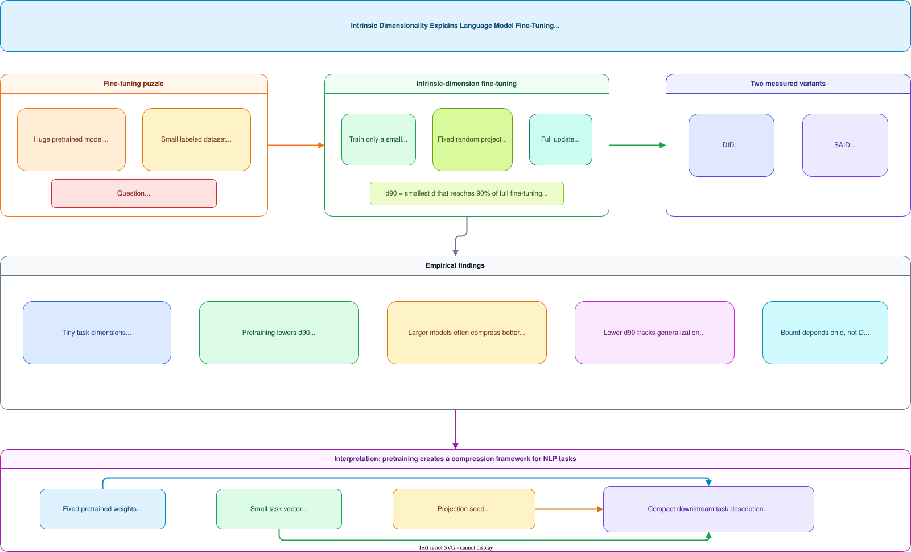

# Intrinsic Dimensionality and Language Model Fine-Tuning

**Paper:** Intrinsic Dimensionality Explains the Effectiveness of Language Model Fine-Tuning  
**Authors:** Armen Aghajanyan, Luke Zettlemoyer, Sonal Gupta  
**arXiv:** 2012.13255v1 - 22 Dec 2020

**Related pages:** [FlatQuant: Fast Learnable Affine Quantization](../../hardware/flatquant.md), [SGLang: Structured Language Model Programs](../../frameworks/sglang-framework.md)

## Summary

This paper argues that the surprising effectiveness of fine-tuning huge pretrained language models on small labeled datasets can be partly explained by **intrinsic dimensionality**. Instead of asking how many parameters the pretrained model has, the paper asks how many task-specific degrees of freedom are needed to reach a good fine-tuned solution.

The main empirical claim is that many NLP fine-tuning tasks have intrinsic dimensions that are orders of magnitude smaller than the full model parameter count. For example, the paper reports that RoBERTa-Large can reach 90% of full fine-tuning performance on MRPC by optimizing only about 200 parameters projected back into the full model space.

The broader interpretation is that pretraining creates a representation framework in which downstream tasks can be described compactly. Under that view, a fine-tuned task is not described by all model weights, but by a small intrinsic vector plus the fixed pretrained model and a random projection seed.

## Visual Explainer

The image below summarizes the paper's mechanism and interpretation.



## Intrinsic Dimension Setup

Let `theta_D` be the full `D`-dimensional model parameter vector. Standard fine-tuning directly optimizes all or many of those parameters. Intrinsic-dimension fine-tuning instead optimizes a much smaller vector `theta_d`, then projects it into the full space:

```text
theta_D = theta_D0 + P(theta_d)
```

Here:

- `theta_D0` is the pretrained initialization.
- `theta_d` is the only trainable vector.
- `P` is a fixed random projection from `d` dimensions to `D` dimensions.

The paper follows the earlier intrinsic-dimension method of searching for the smallest `d` that reaches a satisfactory target. It uses `d90`, meaning the smallest subspace dimension that reaches 90% of the full fine-tuning score.

## DID and SAID

The paper evaluates two projection variants:

| Method | Meaning | Key idea |
|---|---|---|
| DID | Direct Intrinsic Dimension | Use a structure-unaware Fastfood random projection into the full parameter space. |
| SAID | Structure-Aware Intrinsic Dimension | Add learned layer-wise scaling factors so the low-dimensional update can allocate more capacity to useful layers. |

Fastfood projections are used because dense random projection matrices would be too large for models with hundreds of millions of parameters. The Fastfood transform approximates a dense random projection with structured matrices, random signs, a permutation, and Hadamard transforms, giving a feasible `O(D log d)` computation path.

SAID modifies the full-space update by adding a learned scale per layer:

```text
theta_D_i = theta_D0_i + lambda_i P(theta_d-m)_i
```

This lets the method learn which layers should receive larger projected updates.

## Sentence-Pair Results

The paper studies MRPC and QQP with BERT and RoBERTa variants. The striking result is that good fine-tuning can happen in very small subspaces:

| Model | MRPC SAID `d90` | QQP SAID `d90` | MRPC DID `d90` | QQP DID `d90` |
|---|---:|---:|---:|---:|
| BERT-Base | 1,608 | 8,030 | 1,861 | 9,295 |
| BERT-Large | 1,037 | 1,200 | 2,493 | 1,389 |
| RoBERTa-Base | 896 | 896 | 1,000 | 1,389 |
| RoBERTa-Large | 207 | 774 | 322 | 774 |

Three patterns matter:

- The effective task dimension is tiny relative to the full model.
- RoBERTa generally has lower intrinsic dimension than comparable BERT models.
- SAID usually improves over DID, suggesting that layer structure matters.

## Pretraining as Task Compression

The paper interprets `theta_d` as a compact task representation relative to the pretrained model. A conventional fine-tuned classifier must store the task head and changed representation weights. Under SAID or DID, the task can be represented by:

- the fixed pretrained weights,
- the low-dimensional task vector,
- a random seed for the projection,
- and, for SAID, layer-wise scaling values.

The authors argue that pretraining lowers the average description length of downstream NLP tasks. They support this by retraining RoBERTa-Base from scratch and measuring `d90` at checkpoints every 10,000 updates across MRPC, QQP, Yelp Polarity, SST-2, MNLI, and ANLI. The reported trend is that downstream intrinsic dimension decreases as pretraining proceeds, even though pretraining never sees those supervised datasets.

## Model Size Trend

The paper also compares many publicly available pretrained model families, including BERT, RoBERTa, BART, ELECTRA, ALBERT, XLNet, T5, and XLM-R. On MRPC, larger pretrained models tend to have lower intrinsic dimension.

The authors do not claim that parameter count alone explains everything. Within similar size bands, pretraining method still matters. However, the broad trend supports the interpretation that larger pretrained models can provide richer frameworks that need fewer task-specific degrees of freedom.

## Generalization Argument

The empirical generalization link has two parts:

- Lower `d90` correlates with higher evaluation accuracy across RoBERTa pretraining checkpoints.
- Lower `d90` correlates with a smaller relative generalization gap.

The paper then applies compression-based generalization bounds. If a model is trained through a `d`-dimensional intrinsic parameter vector on `m` samples, the asymptotic bound is:

```text
L0(f) <= Lhat0(f) + O(sqrt(d / m))
```

The important point is that the bound depends on the intrinsic dimension `d`, not the full pretrained parameter count `D`. This only directly applies to models trained with the intrinsic subspace method, and the paper leaves open the theoretical question of why ordinary SGD fine-tuning appears to find similarly low-dimensional solutions.

## Where It Breaks

| Failure mode | When it happens | Impact |
|---|---|---|
| Upper bound, not exact | Intrinsic dimension estimates via random projection heuristics | True intrinsic dimension may be lower; estimates are conservative |
| Measurement cost | Repeated subspace training and search over $d$ | Expensive to estimate for new tasks or models |
| Generalization bound scope | Bound applies to SAID/DID-style training, not standard fine-tuning | Results are suggestive but not directly causal for all fine-tuning methods |
| Task era limited | NLP classification tasks available at the time | Modern instruction tuning, RLHF, LoRA, and long-context workloads not covered |

## One Thing to Remember

The central finding is that **pretraining compresses tasks into low-dimensional manifolds** — larger pretrained models need fewer task-specific degrees of freedom, which explains why fine-tuning works with surprisingly few parameters.

## Go Deeper

- **Read:** [Intrinsic Dimensionality paper (arXiv:2012.13255)](https://arxiv.org/abs/2012.13255)
- **Build on:** LoRA, adapters, and other parameter-efficient fine-tuning methods
- **Understand the context:** Training dynamics and generalization in large models
- **Reproduce:** Check paper for code repository

## Key Takeaways

- Fine-tuning success is better explained by **task-specific effective dimension** than by raw model parameter count alone.
- Pretrained language models can make downstream tasks describable with surprisingly small intrinsic vectors.
- Pretraining appears to reduce downstream intrinsic dimension over time.
- Larger pretrained models often require fewer task-specific degrees of freedom.
- The compression view offers a route to generalization bounds that scale with intrinsic dimension instead of full model size.
