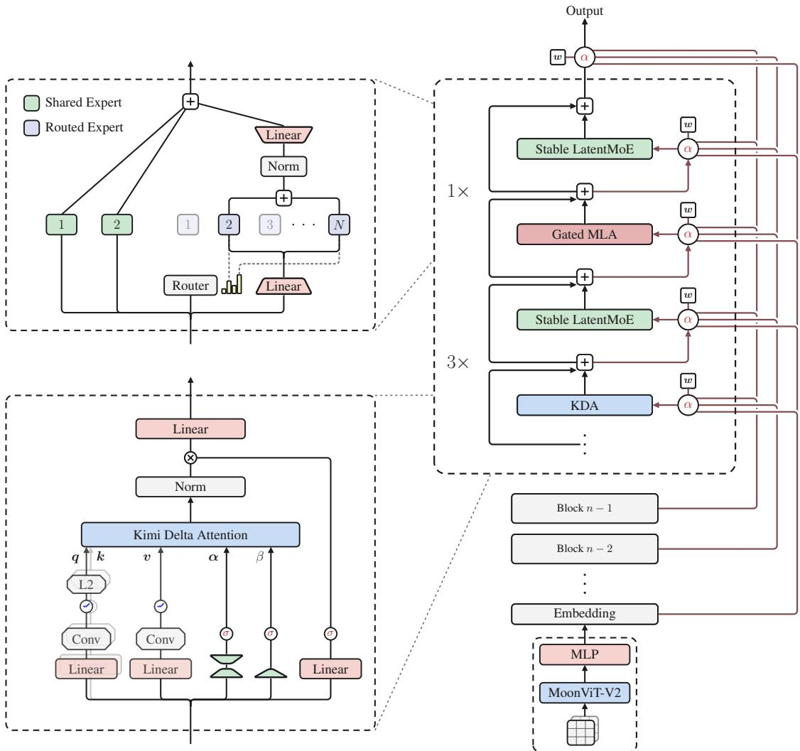
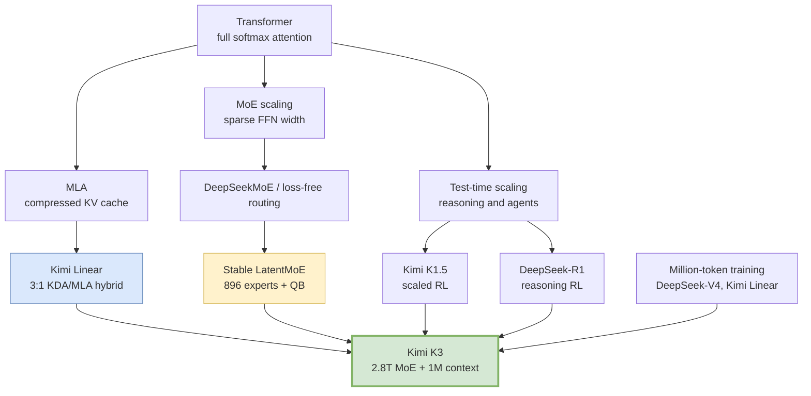
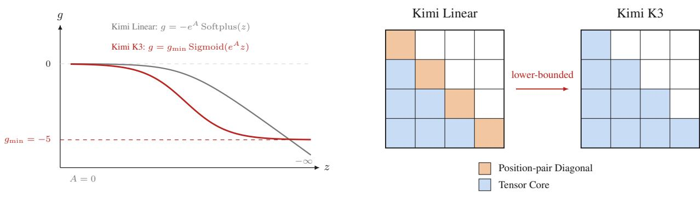
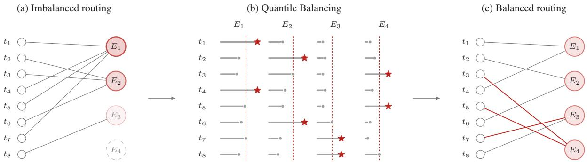
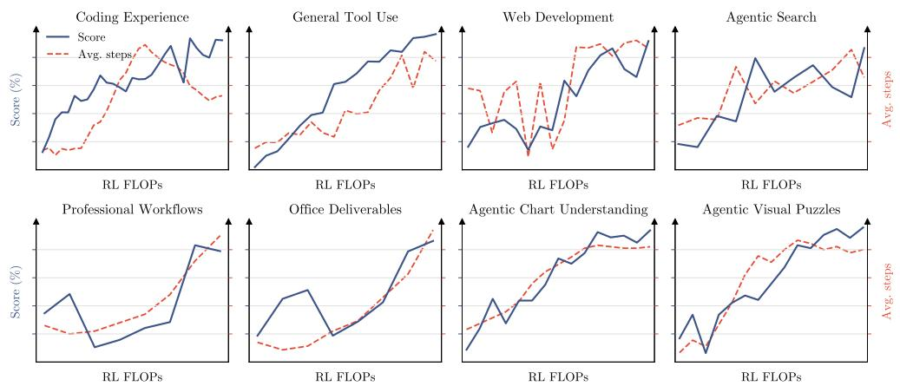
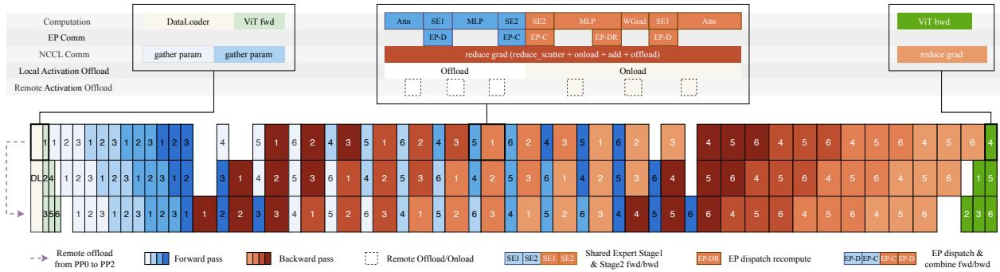
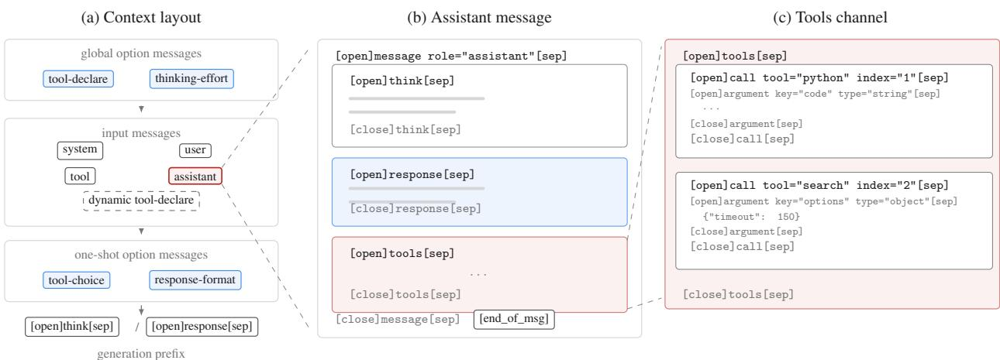
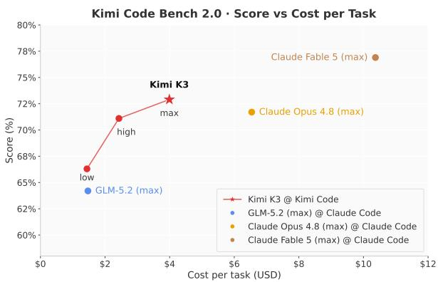

# Kimi K3: Open 3T-Class Frontier Model

**Paper:** Kimi K3: Open Frontier Intelligence — Technical Report of Kimi K3
**Authors:** Kimi Team
**Published:** July 2026

**Related pages:** [Kimi Linear](../kimi-linear/index.md), [DeepSeek-V4](../deepseek-v4/index.md), [DeepSeek-V3.2](../../algorithms/deepseek-v3.2/index.md), [MiniMax Sparse Attention](../minimax-sparse-attention/index.md), [Megatron-LM](../megatron-lm/index.md)

## TL;DR

**What:** Kimi K3 scales an open native multimodal [Mixture of Experts](../../terms/mixture-of-experts.md) model to 2.8T total parameters, 104B activated parameters, 896 routed experts, 16 active routed experts per token, and a 1M-token context window.

**How:** It combines [Kimi Delta Attention](../../terms/kimi-delta-attention.md) with periodic Gated MLA, Attention Residuals, Stable LatentMoE, multi-effort RL across general/coding/agentic domains, and infrastructure for balanced expert-parallel training plus persistent million-token rollout state.

**The number:** The report claims roughly **2.5× scaling-efficiency improvement** over Kimi K2, ranks Kimi K3 fourth on Artificial Analysis Intelligence Index v4.1 at 57.1, second on Vals Index at 74.7%, and first on WebDev Arena at 1,678 Elo as of July 23, 2026.

## The Big Picture

*① Native vision inputs are encoded by MoonViT-V2 and projected into the shared token stream. ② Each backbone block repeats three KDA layers and one Gated MLA layer, so most token mixing uses fixed-state recurrent computation while periodic global layers preserve exact long-range access. ③ Attention Residuals let modules retrieve earlier block representations instead of relying only on sequential residual accumulation. ④ Stable LatentMoE expands width to 896 routed experts with 16 active per token, using normalization, bounded activation, and quantile load balancing.*

## Why This Exists

Consider a long-horizon coding agent working inside a repository for hours. The conversation, file excerpts, terminal outputs, screenshots, and tool observations can climb toward a million tokens. A 1T-class dense or weakly sparse model may have enough post-training to behave like an agent, but it still faces three compounding bottlenecks: attention state grows with context, MoE routing becomes hard to balance at extreme expert counts, and RL rollouts become too long to keep every model and sandbox state resident on GPU.

Kimi K3 attacks all three bottlenecks together. The architecture makes long-context mixing cheaper through mostly recurrent KDA layers; Stable LatentMoE raises total capacity while keeping active compute sparse; and the training/serving stack treats prefix caches, KDA states, rollout sandboxes, and expert placement as first-class distributed systems problems.

**Concrete scenario:** A model must debug a large codebase, inspect screenshots, run kernels, and resume unfinished tool trajectories. Without Kimi K3's design, the [KV cache](../../terms/kv-cache.md) and sandbox state churn dominate. With Kimi K3's design, KDA states and MLA cache blocks can be retained externally, rollouts can pause and resume, and expert-parallel execution stays balanced even when 896 experts receive skewed token assignments.

## The Landscape

Kimi K3 is best read as a **frontier-model integration report**, not a single-method paper. Kimi Linear proves the KDA/MLA hybrid can compete with full attention at 48B scale; DeepSeek-V4 shows another path to million-token efficiency; Megatron-style work establishes pipeline/tensor/data/expert parallel infrastructure; Kimi K3 combines these threads at 3T-class scale and adds agentic RL plus deployment-aware post-training.

## The Core Idea

Kimi K3 treats frontier performance as a three-axis scaling problem: scale the pretrained foundation, scale test-time reasoning/acting, and scale the infrastructure that keeps those two affordable. Its central bet is that open models cannot close the gap by RL alone if the pretrained base remains near 1T-class. The model therefore raises total capacity to 2.8T parameters while using sparse activation, mostly recurrent long-context attention, and systems mechanisms that keep the model trainable and serviceable at million-token trajectory lengths.

## Symbol Map

Kimi K3 notation mixes architecture, MoE routing, RL, and distributed-training symbols. The table lists only symbols used in this page or needed to decode the core mechanisms.

| Symbol | Human name | Shape / scope | Plain meaning |
|---|---|---|---|
| $S_t$ | KDA recurrent state | $d_k \times d_v$ per head | Fixed-size memory updated token by token. |
| $\alpha_t$ | KDA retention vector | $d_k$ per head | Per-channel keep/forget factor. |
| $\beta_t$ | KDA write strength | scalar per head | Controls the delta-rule update magnitude. |
| $g_{\min}$ | lower log-decay bound | scalar, fixed at -5 | Prevents cumulative decay reciprocals from overflowing. |
| $E$ | routed experts | per MoE layer, 896 in K3 | Number of sparse routed experts. |
| $K$ | selected experts | per token, 16 in K3 | Number of routed experts activated for one token. |
| $R$ | expert-parallel size | distributed training group | Number of ranks sharing experts. |
| $b_j$ | expert routing bias | per expert | Load-balancing bias added to router scores for Top-k selection. |
| $\lambda$ | partial-rollout completion fraction | RL rollout scheduler | Fraction of trajectories that must finish before policy optimization proceeds. |

## Deep Dive

### Hybrid KDA/MLA Attention

**What it does:** Uses three KDA layers followed by one Gated MLA layer per block, plus one final global MLA layer.

**Why it matters:** Million-token contexts make full-attention cache and read costs expensive. Pure [linear attention](../../terms/linear-attention.md) is cheaper but can lose exact token-level retrieval. Kimi K3 keeps most layers fixed-state while preserving periodic global content access.

**How it works:** KDA updates a recurrent state with channel-wise decay and a [delta rule](../../terms/delta-rule.md) correction. MLA layers cache compressed token-level latent keys/values for unrestricted global attention. K3 also removes explicit positional encoding from MLA layers and relies on KDA's data-dependent recurrence for positional information, avoiding RoPE retuning for context extension.

*The KDA change from unbounded negative-Softplus decay to lower-bounded scaled-sigmoid decay keeps reciprocal cumulative decay inside BF16 range, allowing causal tiles to run as dense Tensor Core matrix multiplications.*

**The intuition:** KDA is the compressed running notebook; MLA is the occasional exact lookup.

**A concrete example:** In a million-token code task, most layers carry function and file context through recurrent states. Periodic MLA layers can still perform global content lookup when a precise earlier token matters.

**Remember:** K3 inherits Kimi Linear's 3:1 hybrid, then modifies KDA numerics so the long-context kernel stays hardware-friendly at frontier scale.

### Stable LatentMoE

**What it does:** Expands sparse width to 896 routed experts per layer with 16 activated per token, plus two shared experts.

**Why it matters:** The paper's open-frontier claim depends on total model capacity, but activating all 2.8T parameters per token would be infeasible. Sparse MoE gives width without proportional inference compute, but only if routing remains stable and balanced.

**How it works:**

| Component | Failure it targets | Mechanism |
|---|---|---|
| Normalized LatentMoE | Routed-branch scale variation | Inserts RMSNorm before the up-projection. |
| SiTU-GLU | SwiGLU activation outliers | Soft-caps gate and up branches with scaled tanh. |
| Quantile Balancing | Expert load skew across 896 experts | Sets expert routing biases from score quantiles matching target load. |

*SiTU-GLU keeps SwiGLU-like local behavior but bounds large activations, reducing low-precision overflow risk in the routed branch.*

**The intuition:** MoE scaling fails if experts become hot spots or activation outliers. Stable LatentMoE adds guardrails so width behaves like capacity rather than instability.

**A concrete example:** If token Top-k routing sends too many tokens to a few experts, those ranks lag and some experts undertrain. Quantile Balancing moves expert-specific score thresholds so each expert receives its target share without adding an auxiliary loss to the mixture weights.

**Remember:** K3's MoE contribution is not just "more experts"; it is the combination of latent expert width, bounded activations, and load-balancing that makes 896 routed experts usable.

### Multi-Effort Agentic RL

**What it does:** Trains domain-specialized policies for general tasks, general agents, and coding agents at low, high, and max reasoning effort, then consolidates them through Multi-Teacher On-Policy Distillation.

**Why it matters:** The report frames frontier models as systems that can reason, act, observe, verify, and resume over hundreds or thousands of tool calls. A single SFT policy is not enough for that regime.

**How it works:** Kimi K3 starts with SFT for cold-start agent behavior, runs RL across broad task families, and controls token budgets per problem to derive different effort levels. Partial rollouts let optimization proceed after a fraction $\lambda$ of trajectories finish; unfinished long trajectories are resumed later. MOPD uses the matching domain/effort expert as a teacher and supplies dense per-token reward signals to the unified model.

*The report shows capability and average assistant steps increasing as RL FLOPs scale, which is the empirical motivation for treating tool-call depth as a trained behavior rather than a prompt-only artifact.*

**The intuition:** Instead of asking one model to discover every behavior at one budget, train specialized behaviors at multiple budgets and distill them back into one controllable model.

**A concrete example:** A kernel-optimization task may need max effort and many tool calls; a normal chat reply should not. K3's effort-conditioned training gives the serving interface a way to request different behavior without swapping models.

**Remember:** The post-training unit is no longer just a prompt/answer pair; it is a long-lived trajectory with tools, state, budget, and resumption.

### Infrastructure for 3T Pretraining and 1M RL

**What it does:** Adds KDA Context Parallelism, MoonEP balanced expert-parallel training, memory/offload policies, and persistent rollout infrastructure.

**Why it matters:** K3's architecture would be mostly theoretical without systems work: KDA is recurrent across context shards, MoE routing creates imbalanced expert loads, 2.8T parameters exceed device memory, and 1M-token rollouts create severe cache pressure.

**How it works:**

| Infrastructure piece | Core mechanism | Why it matters |
|---|---|---|
| KDA Context Parallelism | All-gather fixed-size recurrent fragments and reconstruct states with prefix-scan composition. | Makes KDA train over sequence shards with linear compute scaling. |
| MoonEP | Online redundant-expert planning with at most $E/R$ redundant experts per rank. | Gives perfectly balanced expert-parallel token loads and static shapes. |
| Unified activation manager | Tensor-level recompute, quantize, offload, and remote-offload policies. | Keeps activation memory bounded without entangling model code. |
| External KV cache pool | Write back evicted idle prefixes to CPU DRAM and prefetch them before reuse. | Preserves long rollout prefixes without requiring all cache blocks on GPU. |
| AgentENV microVMs | Resumable Firecracker-based sandboxes. | Lets long-horizon agentic RL pause and resume realistic environments. |

*The pretraining schedule overlaps computation, communication, and offloading across pipeline phases so memory movement does not fully serialize the 3T-class training loop.*

**The intuition:** At this scale, "model architecture" and "runtime architecture" are one design problem.

**A concrete example:** A partial rollout pauses halfway through a repository debugging task. The next iteration must reuse the prefix cache and restore the sandbox filesystem/process state; otherwise, the model pays another million-token prefill and loses environmental continuity.

**Remember:** MoonEP and external cache retention are the hidden enablers behind the headline model scale and million-token RL.

### XTML Chat Template and Deployment-Aware Post-Training

**What it does:** Serializes messages, tool calls, options, and reasoning-effort instructions in an XML-like token markup format; applies MXFP4/MXFP8 quantization-aware post-training and EAGLE-3-style draft model fine-tuning.

**Why it matters:** Frontier agent models need stable tool schemas and controllable options without high alignment tax. Serving a 2.8T MoE also needs quantization and speculative decoding to control cost.

*XTML separates global options, one-shot options, input messages, assistant channels, and typed parallel tool calls so new options can be represented in-context without changing the whole template.*

**How it works:** The template keeps structural boundaries as special tokens, supports preserved thinking mode, indexes parallel tool calls for result matching, and represents reasoning effort as a natural-language global option. Post-training uses MXFP4 expert weights with MXFP8 activations from SFT through RL, reducing train–inference mismatch. A pretrained MTP layer is fine-tuned into a speculative draft model with an acceptance-rate-oriented LK loss.

**The intuition:** Make the interaction protocol boring and explicit, then spend learning capacity on tasks rather than format recovery.

**A concrete example:** Loading new tools mid-session can be represented as an input option message without rebuilding the entire history cache.

**Remember:** The serving format is part of the model contract; K3 optimizes it alongside RL and quantization.

## Putting It Together

① **Pretrain a larger base:** K3 trains a 2.8T/104B-active native multimodal MoE model with hybrid KDA/MLA attention, 896 routed experts, 16 active routed experts, Attention Residuals, and from-scratch MoonViT-V2 vision.

② **Extend context economically:** Training moves from 8K to 64K during pretraining and from 256K to 1M during cooldown. KDA's NoPE recurrence avoids positional-encoding surgery.

③ **Keep training balanced:** MoonEP makes expert-parallel token loads identical across ranks, while activation/offload policies keep memory bounded.

④ **Train agents at multiple budgets:** SFT supplies a cold start; RL scales across general, agentic, and coding environments; low/high/max specialists are distilled into one policy.

⑤ **Serve with state retention:** External KV/KDA-state pools, auto-throttling, quantized experts, speculative decoding, and cache-aware scheduling translate the model into lower-cost long-horizon serving.

## What This Buys You

### The headline claim

Kimi K3 is presented as the first open 3T-class frontier model: it still trails the strongest proprietary systems overall, but the report claims it is ahead of the other open and proprietary models in its suite and sits near the cost-efficiency frontier for coding and agentic tasks.

### How we know: selected reported results

| Evidence category | Kimi K3 result | Main contrast |
|---|---:|---|
| Scaling law | ~2.5× overall scaling-efficiency improvement over Kimi K2 | Same family baseline |
| Artificial Analysis Intelligence Index v4.1 | 57.1, #4/580 | Claude Fable 5 59.9, GPT-5.6 Sol 58.9 |
| Vals Index | 74.7%, #2/39 | Claude Fable 5 75.1%, GPT-5.6 Sol 73.1% |
| WebDev Arena | 1,678 Elo, #1/99 | Claude Fable 5 1,634 |
| Kimi Code Bench 2.0 | 73.7 via Claude Code harness | Claude Fable 5 76.9, Claude Opus 4.8 71.7 |
| Swarm Bench | 76.3 | GPT-5.6 Sol 73.2, Claude Opus 4.8 72.6 |
| Deep Research Bench | 90.0 | GPT-5.6 Sol 85.3, Claude Opus 4.8 87.2 |
| Cyber exploit suite | 14/36 solved | GLM-5.2 8/36 |

*On Kimi Code Bench 2.0, the report positions Kimi K3 close to the top score at substantially lower per-task cost than the strongest proprietary baseline.*

### The mechanism behind the numbers

K3's strongest results line up with the training and infrastructure emphasis: long-horizon coding, research, web development, swarm-style decomposition, and agentic tool use. These are exactly the settings where 1M context, persistent rollout state, native vision, and multi-effort RL should matter more than single-turn benchmark memorization.

### ⚠️ How to read these numbers

Many benchmark rows are in-house, harness-dependent, effort-dependent, or use refusals/fallbacks for proprietary systems. Treat them as evidence for Kimi K3's design direction, not as a universal ranking. The third-party rows are more comparable, but leaderboard scores and Elo values drift over time; the page records the report's July 23, 2026 snapshot.

## Where It Breaks

| Failure mode | When it happens | Impact |
|---|---|---|
| Still behind top proprietary models overall | Aggregate frontier evaluations such as Artificial Analysis and Agent Arena | K3 is open-frontier, not absolute-frontier, in the report's own framing. |
| In-house benchmark comparability | Different models use different harnesses, effort modes, refusals, or fallbacks | Raw scores can mix model capability with tooling and evaluation-policy effects. |
| Exact long-range retrieval remains partly dependent on MLA | Information is too specific or rare for KDA's fixed state | Periodic MLA layers preserve access, but 75% KDA layers are still lossy summaries. |
| MoE routing/system complexity | Expert counts, context lengths, or hardware topology differ from K3 assumptions | MoonEP/QB benefits may not transfer without comparable infrastructure. |
| Cyber capability remains incomplete | Hardened kernel exploit tasks and final exploit-chain completion | The report says K3 solves 14/36 exploit tasks and has recurring strategy/debugging/verification failures. |
| External-state serving costs | Very long trajectories with many paused rollouts and large prefixes | CPU DRAM/NVMe bandwidth and cache scheduling become first-order bottlenecks. |

## One Thing to Remember

**Kimi K3 is not just a bigger Kimi Linear.** It is a full-stack attempt to make open frontier intelligence work at three scales simultaneously: trillion-parameter pretrained capacity, million-token reasoning trajectories, and production systems that can keep sparse experts, recurrent states, caches, tools, and sandboxes coherent.

## Go Deeper

- **Read:** `raw/training/k3-technical-report--paper.pdf`
- **Inspect extraction:** `derived/pdf-markdown/training/k3-technical-report.md`
- **Build on:** [Kimi Linear](../kimi-linear/index.md) for the underlying KDA/MLA hybrid; [Megatron-LM](../megatron-lm/index.md) for large-scale training parallelism.
- **Understand the context:** [DeepSeek-V4](../deepseek-v4/index.md) for a contrasting million-token architecture; [DeepSeek-V3.2](../../algorithms/deepseek-v3.2/index.md) for sparse attention plus scaled RL; [MiniMax Sparse Attention](../minimax-sparse-attention/index.md) for another long-context efficiency route.
- **Reproduce:** The report describes architecture and systems but full training/reproduction requires large-scale proprietary infrastructure; model weights are reported as released by the authors.
