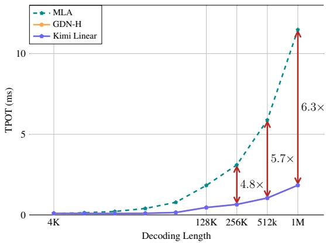
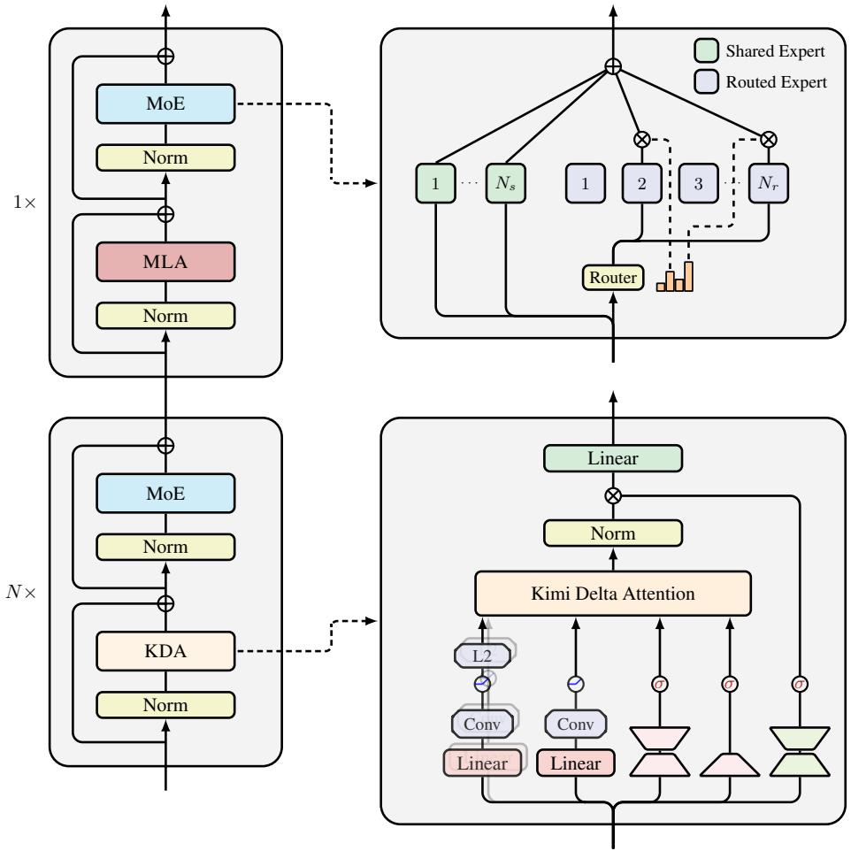
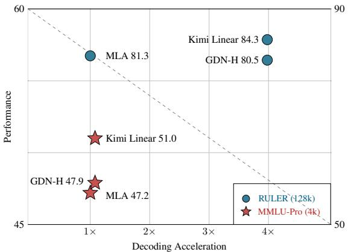
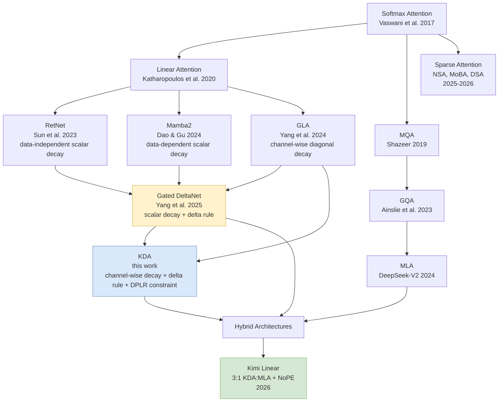
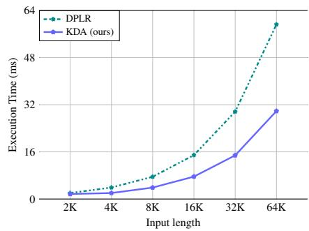
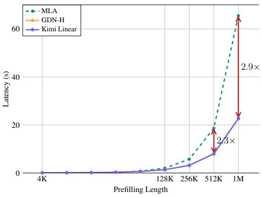
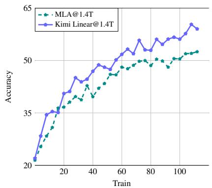
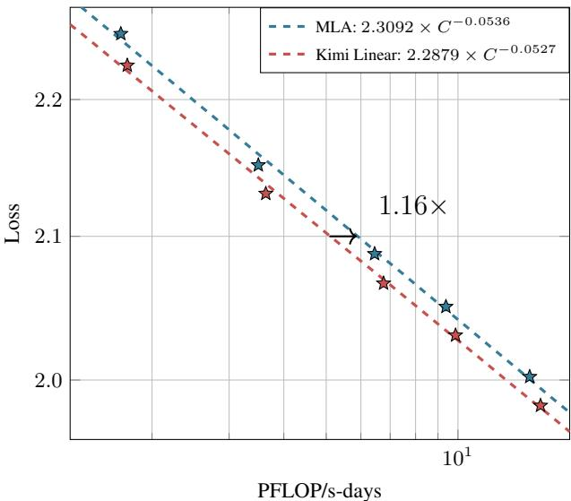

# Kimi Linear: An Expressive, Efficient Attention Architecture

**Paper:** Kimi Linear: An Expressive, Efficient Attention Architecture (Technical Report)
**Authors:** Kimi Team (Moonshot AI)
**Source:** [github.com/MoonshotAI/Kimi-Linear](https://github.com/MoonshotAI/Kimi-Linear)

**Related pages:** [Kimi K3](../kimi-k3/index.md), [DeepSeek-V2 Multi-Head Latent Attention](../../../algorithms/attention-variants/deepseek-v2-mla.md), [Multi-Query Attention](../../../algorithms/attention-variants/multi-query-attention.md), [DeepSeek-V4](../../deepseek/deepseek-v4/index.md), [SWAT: Sliding Window Attention Training](../../efficient-attention/swat-sliding-window-attention/index.md), [MiniMax Sparse Attention (MSA)](../../efficient-attention/minimax-sparse-attention/index.md)

## TL;DR

**What:** A hybrid linear attention architecture (Kimi Linear) that combines channel-wise gated delta attention (KDA) with periodic full MLA layers in a 3:1 ratio, outperforming full attention for the first time on short-context, long-context, and RL tasks.

**How:** [KDA](../../../terms/kimi-delta-attention.md) extends Gated DeltaNet's scalar forget gate to per-channel diagonal gating, constrained to a hardware-efficient DPLR variant that runs at ~2× the speed of general DPLR; the hybrid design delegates positional encoding entirely to KDA layers via NoPE on MLA layers.

**The number:** 51.0 on MMLU-Pro (vs. 47.2 for MLA), 84.3 on RULER (128k, vs. 81.3 for MLA), 6.3× faster decoding at 1M context — all from a 48B [MoE](../../../terms/mixture-of-experts.md) model with 3B active parameters trained on 1.4T tokens.

*Time per output token (TPOT) vs. decoding length: Kimi Linear maintains near-constant TPOT while MLA's grows linearly. At 1M tokens, Kimi Linear achieves 1.84 ms vs. 11.48 ms for MLA — a 6.3× speedup.*

## The Big Picture

*① Input token flows through stacked blocks of token-mixing + MoE channel-mixing. ② Three KDA layers interleaved with one MLA layer in a repeating 3:1 pattern. ③ KDA layers: ShortConv → Swish → L2Norm (q,k) + Swish (v) produce q,k,v; low-rank projection produces channel-wise gates α; scalar sigmoid produces β. ④ KDA state update: $(I - \beta_t k_t k_t^\top)\text{Diag}(\alpha_t) S_{t-1} + \beta_t k_t v_t^\top$ — fine-grained decay followed by Householder-style correction. ⑤ Output: sigmoid-gated RMSNorm via low-rank output gate. ⑥ MLA layers use NoPE, delegating all positional encoding to KDA.*

*⑦ Pareto frontier: on MMLU-Pro (4k, red stars), Kimi Linear leads performance (51.0) at similar speed; on RULER (128k, blue circles), it's Pareto-optimal at 84.3 with 3.98× acceleration.*

## Why This Exists

Imagine training a 48B MoE model with standard [MLA](../../../algorithms/attention-variants/deepseek-v2-mla.md) attention. At 1.4T tokens, the model works fine on short contexts — but the moment you need 128k-token retrieval or long-horizon RL reasoning, you hit a wall: the [KV cache](../../../terms/kv-cache.md) grows linearly with sequence length, eating GPU memory and making decoding painfully slow. At 1M tokens, each token takes 11.48 ms to decode.

Pure [linear attention](../../../terms/linear-attention.md) approaches (Mamba2, GLA, Gated DeltaNet) have tried to fix this with fixed-size recurrent states, but they historically underperform full attention — even on short sequences — because their coarse, scalar-level forget gates can't selectively retain the right memories. GDN uses one scalar α per head; KDA gives every one of the 128 key dimensions its own independent α.

The question: can you get *better* quality than full attention while using *less* memory and being *faster*? Kimi Linear answers yes — by making the forget gate fine-grained enough to actually work.

**Concrete scenario:** A 48B model processing a 1M-token code repository. With full MLA, the KV cache is enormous and decoding runs at 11.48 ms/token. With Kimi Linear's 3:1 hybrid, three-quarters of the layers maintain a fixed $128 \times 128$ state per head regardless of sequence length. Decoding drops to 1.84 ms/token — a 6.3× speedup.

## The Landscape

## The Core Idea

Standard attention is expensive because it stores every past token. DeltaNet makes it cheaper by using a fixed-size recurrent memory, corrected online via gradient descent — but it uses a single scalar forget gate per head, which is too coarse to decide *which dimensions* of the 128-dimensional key state to keep or discard. KDA gives every dimension its own learnable forget rate: $\text{Diag}(\alpha_t)$ instead of just $\alpha_t$. This fine-grained control lets the model selectively erase irrelevant information while preserving crucial memories. To make this practical at GPU scale, KDA constrains the general DPLR transition matrix by binding both low-rank vectors to the key $k_t$, cutting secondary chunking steps from 4 to 2 and eliminating 3 extra matrix multiplications — yielding ~2× kernel speedup over general DPLR. The hybrid 3:1 interleaving with full MLA layers handles the remaining hard-retrieval cases that pure linear attention struggles with, while NoPE on MLA layers delegates all positional encoding to the KDA layers (which naturally encode position through their cumulative data-dependent decay).

## Symbol Map

KDA notation follows and extends the DeltaNet/GDN convention. Superscripts $^C$, $^{KV}$, $^{DKV}$ denote content, key–value, and decoupled-key–value roles.

| Symbol | Human name | Shape / scope | Plain meaning |
|---|---|---|---|
| $S_t$ | memory state | $d_k \times d_v$ per head | Matrix-valued recurrent state accumulating key–value associations. |
| $\alpha_t$ | forget gate vector | $d_k$ per head | Channel-wise decay rates in $[0,1]$, one per key dimension. Predecessors: scalar in GDN/Mamba2, diagonal in GLA. |
| $\beta_t$ | learning rate | scalar per head | Step size for the delta-rule correction, sigmoid-activated. |
| $d_k, d_v$ | head dimensions | constants | Key and value dimensions per head, both set to 128. |
| $C$ | chunk size | constant | Number of tokens per chunk in chunkwise-parallel computation (64). |
| $\gamma_{[t]}^{i \to r}$ | cumulative decay | per-chunk, $C \times d_k$ | Product of $\alpha$ values from position $i$ to $r$ within chunk $t$. |
| $\Gamma_{[t]}^{i \to r}$ | stacked cumulative decay | $C \times d_k$ | Matrix stacking $\gamma$ vectors for all intra-chunk positions. |
| $w_t, u_t$ | auxiliary vectors | $d_k$, $d_v$ | WY-representation auxiliary vectors for compressing rank-1 updates. |

| Cached vs. computed | Dimension | Location |
|---|---|---|
| $S_t$ (state) | $d_k \times d_v$ per head | Persistent across chunks — the only recurrent state. |
| $q_t, k_t, v_t$ | $d_k, d_k, d_v$ | Computed per token from input via ShortConv + Swish + L2Norm/Swish. |
| $\alpha_t, \beta_t$ | $d_k$, scalar | Computed per token via low-rank projection + sigmoid. |

## Deep Dive

### Kimi Delta Attention: Channel-Wise Forget Gates

**What it does:** Replaces GDN's scalar forget gate $\alpha_t$ with a per-dimension diagonal gate $\text{Diag}(\alpha_t)$, so each of the 128 key dimensions decides independently how much to forget.

**Why it matters:** This is the mechanism that closes the remaining quality gap between linear attention and full softmax attention. A scalar gate forces all dimensions to share the same memory horizon — you can't simultaneously remember a key from 50k tokens ago (slow decay) while rapidly forgetting an irrelevant one (fast decay). Channel-wise gating unlocks this.

**How it works:** The state update is:
$$S_t = (I - \beta_t k_t k_t^\top) \text{Diag}(\alpha_t) S_{t-1} + \beta_t k_t v_t^\top$$

Read right-to-left: (1) decay the old state with per-dimension $\alpha_t$; (2) apply a rank-1 Householder-style correction via $\beta_t k_t k_t^\top$; (3) add the new key–value association $\beta_t k_t v_t^\top$. The [delta rule](../../../terms/delta-rule.md) correction ensures the state actively moves toward representing the mapping $k_t \mapsto v_t$.

**The intuition:** Think of each dimension as a separate memory slot with its own adjustable "stickiness." When the model encounters a token that's important for future retrieval (like a function definition), the corresponding $\alpha$ values stay near 1.0 (keep). When it encounters noise, $\alpha$ drops near 0 (discard). The delta rule then corrects whatever remains.

**A concrete example:** In a 1M-token code repository, the model encounters `def authenticate(user):` at position 10,000. KDA's per-dimension gates can set high $\alpha$ values for the dimensions encoding this function signature, while aggressively forgetting dimensions encoding earlier boilerplate text. At position 900,000, when the model needs to recall how `authenticate` works, those preserved dimensions still hold the relevant information.

**Remember:** Channel-wise gating is what makes linear attention competitive — it's the difference between a single stiff forgetting rate and 128 independently adjustable ones.

### Hardware-Efficient Chunkwise DPLR Constraint

**What it does:** Constrains the general DPLR transition matrix $(D - a_t b_t^\top)$ by binding both low-rank vectors to the key: $a_t = \beta_t k_t$, $b_t = k_t \odot \alpha_t$.

**Why it matters:** General DPLR requires secondary chunking in full precision to avoid numerical instability from division by cumulative decay $\Gamma$, which prevents half-precision [matmul](../../../terms/gemm.md) and adds significant overhead. KDA's constraint eliminates the need for secondary chunking on two of four terms and removes three extra matrix multiplications — making the kernel ~2× faster.

**How it works:** The general DPLR chunkwise algorithm computes four attention-like matrices — $A_{ab}$, $A_{ak}$, $A_{qb}$, $A_{qk}$ — each requiring reciprocal $\Gamma$ terms. By setting $a = b = k$, KDA collapses this to just two matrices ($A_{qk}$ and $A_{kk}$), and the remaining reciprocal terms are handled by the UT transform (forward substitution on a triangular system), which is numerically stable in half precision.

**The intuition:** DPLR is like having four separate accountants tracking your expenses — redundant and expensive. KDA realizes that since $a$ and $b$ are both derived from $k$, you only need two accountants, and you can use a cheaper bookkeeping method (UT transform instead of explicit inversion).

**A concrete example:** At chunk size 64 and head dim 128, general DPLR computes four $64 \times 64$ attention matrices, then inverts one of them. KDA computes only two $64 \times 64$ matrices and avoids explicit inversion entirely via forward substitution — cutting FLOPs roughly in half for the intra-chunk computation.

**Remember:** The DPLR constraint is not a theoretical simplification — it's a 2× practical speedup that makes fine-grained gating viable at training scale.

*KDA kernel achieves ~2× speedup over general DPLR across sequence lengths up to 64k (batch size 1, 16 heads).*

### Hybrid Architecture: 3:1 KDA-to-MLA Ratio

**What it does:** Stacks 3 KDA layers followed by 1 full MLA layer in a repeating pattern, with MLA layers using NoPE (no positional encoding).

**Why it matters:** Pure linear attention still struggles with exact retrieval and copying over very long contexts — its fixed-size state is fundamentally lossy. Full MLA layers act as "cleanup" passes that can attend precisely to any past token, while KDA layers handle the bulk of computation efficiently. The 3:1 ratio minimizes this overhead while preserving global information flow.

**How it works:** Each KDA layer maintains a $d_k \times d_v$ (128×128) state per head regardless of sequence length. The MLA layers store a full KV cache but appear only once every 4 layers. During decoding at 1M tokens, 75% of layers skip the KV cache entirely, reducing memory by up to 75% and enabling 6.3× larger batch sizes.

**The intuition:** Think of KDA layers as "compressors" that maintain a running summary, and MLA layers as "librarians" that can go back and look up exact details when needed. You don't need a librarian for every single word — once every 4 words is enough.

**A concrete example:** Processing a 1M-token document: KDA layers 1-3 compress the text into their 128×128 states. Layer 4 (MLA) can attend to any token in the full 1M-token history. Then KDA layers 5-7 continue compressing, informed by what layer 4 just retrieved. This alternation prevents error accumulation in the compressed state.

**Remember:** The hybrid ratio was empirically optimized — 3:1 beats 1:1 (too much overhead), 7:1 (worse validation loss), and 15:1 (significantly worse).

### NoPE for MLA: Delegating Position to KDA

**What it does:** Removes RoPE from all MLA layers, relying entirely on KDA layers to encode positional information through their data-dependent cumulative decay.

**Why it matters:** It solves a known fragility in hybrid models: when linear and softmax layers use different positional encoding strengths, the model overfits to short-range order and struggles to extrapolate to longer contexts. NoPE eliminates this mismatch and also enables converting MLA to pure MQA at inference time (no RoPE = simpler kernel).

**How it works:** KDA's cumulative decay $\gamma_{[t]}^{i \to r} = \prod_{k=i}^r \alpha_{[t]}^k$ acts as a multiplicative positional encoding analogous to RoPE's rotation matrices. The difference: KDA's encoding is data-dependent (what the token *is* matters, not just *where* it is), and it's not constrained to be orthogonal, allowing richer positional representations.

**The intuition:** RoPE says "these two tokens are 50 positions apart." KDA says "these two tokens are related by a cumulative decay factor that depends on what happened between them." The latter is more informative but also harder to compute — which is why only 25% of layers (MLA) need the crutch of explicit RoPE.

**A concrete example:** With RoPE on all layers, the model learns a fixed frequency bias that works at 4k context but breaks at 128k. Kimi Linear (NoPE) achieves 84.3 on RULER at 128k vs. 78.8 for Kimi Linear (RoPE) — the positional mismatch was costing nearly 6 points.

**Remember:** NoPE on MLA isn't laziness — it's a deliberate design choice that makes KDA the sole position-aware operator, producing cleaner long-context extrapolation.

### Output Gate and Neural Parameterization

**What it does:** Applies a sigmoid output gate (low-rank, data-dependent) followed by head-wise RMSNorm before the output projection.

**Why it matters:** The sigmoid gate mitigates the [attention sink](../../../terms/index.md) phenomenon found in linear models — where early tokens dominate the recurrent state — and outperforms the swish gate used in GDN. The low-rank parameterization (rank = head dim) matches full-rank gating quality at lower parameter cost.

**How it works:** The output is computed as:
$$o_t = W_o \big(\text{Sigmoid}(W_g^\uparrow W_g^\downarrow x_t) \odot \text{RMSNorm}(\text{KDA}(q_t, k_t, v_t, \alpha_t, \beta_t))\big)$$

The gate $W_g^\uparrow W_g^\downarrow$ is a low-rank bottleneck that projects to and from the head dimension.

**The intuition:** Without the output gate, the KDA output can have wildly varying magnitudes depending on the state. The sigmoid gate normalizes this — it's like an automatic volume knob that prevents any one token's output from drowning out the rest.

**A concrete example:** Ablation shows: no output gate → training PPL 9.25, swish gate → 9.43, sigmoid gate (default) → 9.23. The gap may look small, but it widens on out-of-distribution validation data.

**Remember:** Sigmoid > Swish for output gating in linear attention. This is consistent across multiple architectures.

## Putting It Together

A full forward pass through Kimi Linear at a 1M-token context:

① **Token embedding** flows into block 1 (KDA). ShortConv applies a depthwise convolution (kernel size 4) for local context. Swish + L2Norm produce normalized $q, k$; Swish produces $v$. Low-rank projections produce channel-wise $\alpha_t$ (128-dim) and scalar $\beta_t$. KDA updates the 128×128 state via chunkwise-parallel computation (C=64).

② **Blocks 2–3** repeat the KDA computation, each maintaining its own independent state.

③ **Block 4 (MLA)** performs full multi-head latent attention with NoPE — attending to all 1M tokens in its KV cache. This is the "librarian" pass that can retrieve exact details KDA layers may have compressed away.

④ **Blocks 5–7** (KDA again) continue compressing, now informed by block 4's retrieval.

⑤ **Pattern repeats.** Every 4th layer is MLA; the other 3 are KDA.

⑥ **At decode time,** KDA layers switch to the efficient recurrent kernel (Eq. 1), updating their 128×128 state with O(1) cost per token. MLA layers still attend to the full KV cache. With 75% of layers using O(1) decoding, the overall TPOT drops from 11.48 ms (all MLA) to 1.84 ms at 1M context.

⑦ **Output:** Each layer's output passes through sigmoid gating + RMSNorm, then through the MoE FFN (8 of 256 experts activated), then to the next layer.

*Prefill time vs. sequence length: Kimi Linear and GDN-H are virtually indistinguishable, both significantly faster than MLA beyond 32k tokens. At 1M tokens, the hybrid model is 2.9× faster than full MLA.*

## What This Buys You

### The headline claim

Kimi Linear (3B active / 48B total, 1.4T tokens) **outperforms full MLA** on short-context, long-context, and RL benchmarks — while being up to 6.3× faster at 1M context decoding.

### How we know: pretraining results (1.4T tokens)

| Benchmark | MLA | GDN-H | Kimi Linear |
|---|---|---|---|
| MMLU | 71.6 | 72.2 | **73.8** |
| MMLU-Pro | 47.2 | 47.9 | **51.0** |
| BBH | 71.6 | 70.6 | **72.9** |
| GSM8K | 83.7 | 81.7 | **83.9** |
| HellaSwag | 81.7 | 82.2 | **82.9** |

### How we know: long-context (128k)

| Benchmark | MLA | GDN-H | Kimi Linear |
|---|---|---|---|
| RULER | 81.3 | 80.5 | **84.3** |
| MRCR | 22.6 | 23.9 | **29.6** |
| HELMET-ICL | 88.0 | 85.5 | **90.0** |
| RepoQA | 63.0 | 63.0 | **68.5** |
| **Avg.** | 52.2 | 51.2 | **54.5** |

### How we know: RL scaling

*Kimi Linear (blue) consistently outperforms full MLA (gray) during RL training. The gap widens with more training steps.*

### The mechanism behind the numbers

The quality win isn't from doing more computation — it's from doing *smarter* computation. KDA's channel-wise gating gives the model a more expressive memory: it can simultaneously maintain both long-range (slow-decay dimensions) and short-range (fast-decay dimensions) information in the same 128×128 state. Full MLA wastes capacity storing every token even when most are irrelevant; KDA actively *chooses* what to keep.

The efficiency win comes from the 3:1 hybrid: 75% of layers use O(1) recurrent states instead of O(n) KV caches. At 1M tokens, that's the difference between storing ~1M floats per head (MLA) and storing 128×128 = 16,384 floats per head (KDA).

### ⚠️ How to read these numbers

- The 6.3× decoding speedup is at 1M tokens with large batch sizes. At 4k tokens, KDA and MLA are comparable.
- Kimi Linear (RoPE) matches KDA on short-context but loses ~6 points on RULER at 128k — RoPE on MLA layers creates a positional encoding mismatch.
- The 1.4T-token results use the same hyperparameters as MLA. The paper notes that KDA's scaling law suggests ~1.16× compute efficiency, meaning hyperparameter tuning could widen the gap further.

*Scaling law comparison: Kimi Linear achieves ~1.16× compute efficiency over MLA — at equivalent compute budgets, it produces lower validation loss.*

## Where It Breaks

| Failure mode | When it happens | Impact |
|---|---|---|
| Exact copying over extreme lengths | >1M tokens with high-precision retrieval needed | Fixed-size state (128×128) is fundamentally lossy; the 3:1 MLA ratio may need adjustment for >1M. |
| NoPE extrapolation beyond training | Training context was 4k with 128k extension via annealing | Performance at >128k contexts not validated; KDA's positional encoding may not extrapolate indefinitely. |
| DPLR constraint limits expressivity | Tasks requiring general DPLR's unconstrained interactions | KDA binds $a = b = k$, which may lose expressivity compared to full DPLR on some associative recall tasks. |
| MLA dependency for hard retrieval | Tasks requiring precise multi-hop retrieval | If MLA layers are the only "exact lookup" mechanism, performance degrades if the 3:1 ratio is insufficient. |
| Sigmoid gate saturation | Very long sequences without state reset | Sigmoid gates can saturate at 0 or 1, degrading the model's ability to modulate output. |
| RL distribution shift | RL prompts differ significantly from pretraining distribution | KDA's compressed state may have encoded pretraining-specific patterns that don't transfer as cleanly as MLA's full attention. |

## One Thing to Remember

**Kimi Linear proves that linear attention can beat full attention at scale** — not by approximating softmax better, but by replacing scalar forget gates with per-dimension channel-wise gating (KDA), constraining the DPLR transition for 2× hardware speedup, and interleaving with sparse NoPE full-attention layers (3:1) to handle the retrieval cases that linear attention still struggles with. The result is a model that is simultaneously higher quality *and* up to 6× faster.

## Go Deeper

- [Kimi Linear GitHub repository](https://github.com/MoonshotAI/Kimi-Linear) — open-source KDA kernels, vLLM integration, and model checkpoints
- [Gated DeltaNet (GDN)](https://arxiv.org/abs/2412.06464) — the immediate predecessor to KDA
- [Gated Linear Attention (GLA)](https://arxiv.org/abs/2312.06635) — introduced channel-wise diagonal gating
- [Mamba2 / Transformers are SSMs](https://arxiv.org/abs/2405.21060) — the structured state space duality framework
- [DeepSeek-V3 Technical Report](https://arxiv.org/abs/2412.19437) — MLA design and MoE architecture that Kimi Linear builds upon
- [DeepSeek-V4: Million-Token Hybrid Compressed Attention](../../deepseek/deepseek-v4/index.md) — another recent hybrid approach using CSA+HCA
- [SWAT: Sliding Window Attention Training](../../efficient-attention/swat-sliding-window-attention/index.md) — sigmoid-based sliding window alternative
- [MiniMax Sparse Attention](../../efficient-attention/minimax-sparse-attention/index.md) — block-sparse attention co-designed with GQA
