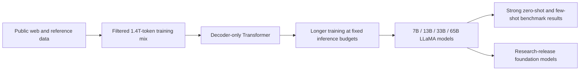
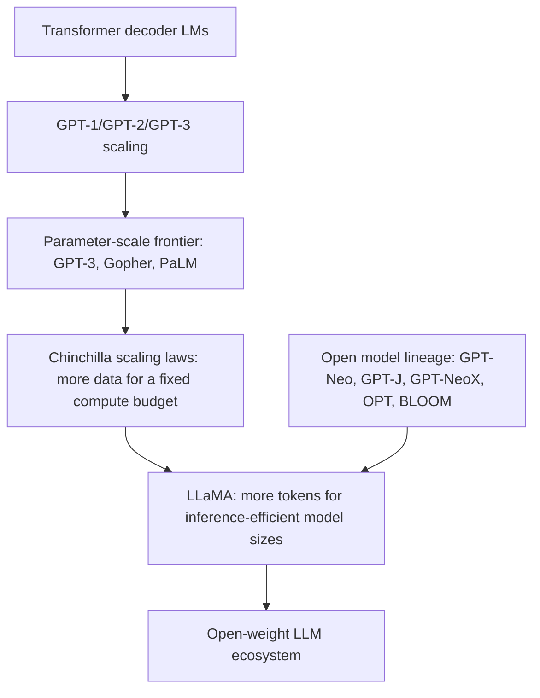

# LLaMA: Open and Efficient Foundation Language Models

**Paper:** LLaMA: Open and Efficient Foundation Language Models
**Authors:** Hugo Touvron, Thibaut Lavril, Gautier Izacard, Xavier Martinet, Marie-Anne Lachaux, Timothée Lacroix, Baptiste Rozière, Naman Goyal, Eric Hambro, Faisal Azhar, Aurelien Rodriguez, Armand Joulin, Edouard Grave, Guillaume Lample
**arXiv:** 2302.13971, 2023

**Related pages:** [The Transformer](../algorithms/transformer.md) · [GPT-1](gpt-1.md) · [GPT-2](gpt-2.md) · [GPT-3](gpt-3.md) · [Training Index](index.md)

## TL;DR

**What:** LLaMA is a family of **7B, 13B, 33B, and 65B decoder-only foundation models** trained to maximize performance under practical inference budgets rather than simply maximize parameter count.

**How:** Meta trains standard Transformer language models on **1.0T-1.4T tokens from public datasets only**, using GPT-3/PaLM-era architecture improvements, Chinchilla-inspired data scaling, and training-system optimizations from xFormers and model/sequence parallelism.

**The number:** **LLaMA-13B outperforms GPT-3 175B on most reported benchmarks despite being more than 10x smaller**, while LLaMA-65B is competitive with Chinchilla-70B and PaLM-540B.

## The Big Picture

*1. Public data is filtered into a broad pretraining mixture. 2. Smaller models are trained on far more tokens than older compute-optimal recipes would suggest. 3. The result shifts the frontier from "largest model wins" toward "inference-efficient model trained long enough."*

## Why This Exists

Imagine you want to serve a GPT-3-like assistant inside a lab or product team. A 175B-parameter model is expensive to host, hard to share, and tied to private data and infrastructure. Even if it is cheaper to train one giant model than many smaller models, every user request pays the inference bill forever.

LLaMA attacks that pain point directly: **given a target quality level, prefer the model that is cheapest to run**. The paper argues that smaller models trained on more tokens may be a better end-to-end tradeoff than larger models trained only to minimize training compute.

## The Landscape

**LLaMA inherits GPT-style language modeling and Chinchilla-style data scaling, but optimizes for inference affordability and public-data release.** Its closest siblings are OPT and BLOOM because they are open-release models, but the paper positions LLaMA as substantially more competitive with closed frontier models.

## The Core Idea

**Train smaller models longer than the training-compute-only recipe would suggest.** LLaMA treats inference cost as a first-class constraint: a 13B model that reaches GPT-3-level quality is more useful to many researchers and operators than a 175B model with similar quality but much higher serving cost. The architecture is not exotic; the contribution is the combination of public data, aggressive token scaling, efficient training implementation, and careful benchmark comparison.

## Deep Dive

### Public-Only Training Data

**What it does:** Builds a large pretraining corpus from public sources that can support model release.

**Why it matters:** In the serving scenario from "Why This Exists," a model is much easier to study, reproduce, and distribute when its recipe does not depend on undocumented private corpora.

**How it works:**

| Dataset | Sampling share | Role in the mix |
|---|---:|---|
| CommonCrawl via CCNet | 67.0% | Broad web coverage with language ID, deduplication, and quality filtering |
| C4 | 15.0% | Alternative cleaned CommonCrawl pipeline for diversity |
| GitHub | 4.5% | Public Apache/BSD/MIT code corpus |
| Wikipedia | 4.5% | Multilingual encyclopedic reference text |
| Gutenberg and Books3 | 4.5% | Long-form book text |
| ArXiv | 2.5% | Scientific and mathematical text |
| StackExchange | 2.0% | High-signal question-answer text |

The total corpus contains roughly **1.4T tokens after tokenization**. Most tokens are seen once; Wikipedia and books are repeated for about two epochs in the 1.4T-token runs.

**The intuition:** Public data makes the model easier to release; heavy filtering keeps that openness from collapsing into low-quality web noise.

**A concrete example:** Instead of serving an opaque 175B model trained on unknown books and web data, the lab can inspect the LLaMA recipe and understand that the 13B model's behavior comes mainly from filtered CommonCrawl plus smaller public reference sources.

**Remember:** **The "open" in LLaMA is mostly about the data and release posture, not a new architecture.**

### Token Scaling for Inference Budgets

**What it does:** Trains each model size on far more tokens than earlier parameter-heavy scaling choices.

**Why it matters:** The serving cost of the lab assistant depends mostly on parameter count at inference time, so squeezing more quality out of a smaller model is economically valuable.

**How it works:**

| Model | Hidden size | Layers | Heads | Batch tokens | Training tokens |
|---|---:|---:|---:|---:|---:|
| LLaMA-7B | 4096 | 32 | 32 | 4M | 1.0T |
| LLaMA-13B | 5120 | 40 | 40 | 4M | 1.0T |
| LLaMA-33B | 6656 | 60 | 52 | 4M | 1.4T |
| LLaMA-65B | 8192 | 80 | 64 | 4M | 1.4T |

The paper explicitly notes that although Chinchilla-style compute-optimal rules might suggest a 10B model on about 200B tokens for a fixed training budget, LLaMA-7B continues improving beyond 1T tokens.

**The intuition:** If inference is the bottleneck, "overtraining" a smaller model can be the right move.

**A concrete example:** The lab can run a 13B model on much cheaper hardware than GPT-3 175B, yet the extra 1T-token training budget lets that 13B model close much of the quality gap.

**Remember:** **LLaMA is compute-heavy during training so it can be lighter during inference.**

### Architecture Choices

**What it does:** Uses a decoder-only Transformer with established stability and quality improvements.

**Why it matters:** The paper's claim depends on data and training scale, so the architecture stays close enough to prior models that benchmark improvements are easier to interpret.

**How it works:**

| Component | Choice | Borrowed intuition |
|---|---|---|
| Normalization | Pre-normalization with RMSNorm | Stabilize deep training by normalizing inputs to each sublayer |
| Feed-forward activation | SwiGLU | Improve Transformer block quality over ReLU-style activations |
| Position encoding | RoPE | Encode relative position behavior without learned absolute embeddings |
| Tokenizer | SentencePiece BPE with byte fallback | Handle arbitrary UTF-8 text and split numbers into digits |

Training uses AdamW, cosine learning-rate decay to 10% of the maximum rate, weight decay 0.1, gradient clipping 1.0, and 2,000 warmup steps.

**The intuition:** LLaMA wins by disciplined modern defaults, not by a fragile custom block.

**A concrete example:** The lab can treat LLaMA as a GPT-style model operationally: decoder-only next-token prediction, but with RoPE, RMSNorm, and SwiGLU as the newer defaults.

**Remember:** **The architecture is conservative; the training recipe is the real lever.**

### Efficient Training Implementation

**What it does:** Reduces attention memory, activation recomputation, and communication overhead so the long-token training recipe is feasible.

**Why it matters:** Training 65B on 1.4T tokens would be impractical if the system wasted memory on masked attention scores or recomputed too many activations.

**How it works:**

| Optimization | Purpose |
|---|---|
| xFormers causal attention | Avoid storing attention weights and avoid masked key/query scores |
| FlashAttention-inspired backward | Reduce memory pressure in attention training |
| Selective activation checkpointing | Save expensive activations such as linear outputs |
| Manual backward for Transformer layers | Control recomputation more precisely than default autograd |
| Model and sequence parallelism | Fit large models and long sequences across GPUs |
| Communication overlap | Hide all-reduce communication behind computation |

For the 65B model, the paper reports about **380 tokens/sec/GPU on 2048 A100 80GB GPUs**, making a 1.4T-token run take about **21 days**.

**The intuition:** Long training only pays off if the cluster spends most of its time doing useful math.

**A concrete example:** The lab does not need to reproduce 2048-GPU training, but the resulting 13B or 65B checkpoint exists because the original run carefully managed memory and communication.

**Remember:** **The system work is what turns a scaling argument into an actual model family.**

## Putting It Together

1. Filter public web, code, books, scientific, encyclopedic, and Q&A sources into a 1.4T-token corpus.
2. Tokenize with SentencePiece BPE, digit-splitting, and byte fallback.
3. Train GPT-style decoder-only Transformers with RMSNorm, SwiGLU, and RoPE.
4. Push token counts high for each model size: 1T tokens for 7B/13B and 1.4T tokens for 33B/65B.
5. Use efficient causal attention, selective activation checkpointing, parallelism, and communication overlap to make the runs practical.
6. Evaluate in zero-shot and few-shot settings against GPT-3, Gopher, Chinchilla, PaLM, OPT, GPT-J, GPT-Neo, and instruction-tuned baselines.
7. Release the model family to researchers so strong foundation models are no longer limited to very large closed systems.

## What This Buys You

### The headline claim

LLaMA shows that **public-data, inference-efficient foundation models can compete with much larger closed models** when trained on enough tokens.

### How we know: benchmark evidence

| Question | Evidence from the paper |
|---|---|
| Can a smaller model beat GPT-3? | LLaMA-13B outperforms GPT-3 175B on most reported commonsense, QA, and reading benchmarks. |
| Can the largest LLaMA compete with frontier models? | LLaMA-65B is competitive with Chinchilla-70B and PaLM-540B, and beats Chinchilla on most reported commonsense tasks except BoolQ. |
| Does public data hurt specialized tasks? | LLaMA-65B reaches 50.9 on GSM8k without math fine-tuning and 23.7 pass@1 on HumanEval without code-specific fine-tuning. |
| Does instruction tuning help? | A simple instruction-tuned LLaMA-I 65B reaches 68.9 on MMLU versus 63.4 for the base 65B model. |

### The mechanism behind the numbers

The result pattern makes sense if you separate **model capacity** from **token budget**. GPT-3 is much larger, but LLaMA's smaller models consume far more training tokens per parameter. That extra token exposure improves broad task performance while preserving a much cheaper inference footprint.

### How to read these numbers

Do not read LLaMA as proving that parameter count no longer matters. **The 65B model still beats the 13B model on most benchmarks.** The narrower claim is that, for a given quality target, a smaller model trained longer can be a better product and research artifact than a much larger model trained less relative to its size.

## Where It Breaks

| Failure mode | When it happens | Impact |
|---|---|---|
| MMLU knowledge gap | Tasks requiring broad academic/book knowledge | LLaMA-65B trails Chinchilla-70B and PaLM-540B; the paper suggests limited book and academic-paper volume as one reason. |
| Safety and toxicity | Web-heavy prompts and larger model sizes | RealToxicityPrompts scores increase with model size, especially for respectful prompts at 65B. |
| Social bias | Stereotype-sensitive or gender-coreference settings | CrowS-Pairs and WinoGender show persistent bias, including worse gotcha performance for gendered pronouns. |
| Hallucination | TruthfulQA-style adversarial factual questions | LLaMA beats GPT-3 in the reported setup but still has a low absolute truthful-and-informative rate. |
| Training reproducibility | Teams without massive GPU clusters | The 65B run uses 2048 A100 80GB GPUs for about 21 days; the released model lowers inference cost but not original training cost. |
| License and release constraints | Product use requiring fully permissive terms | The paper's "open" claim is about research release and public data, not necessarily unrestricted commercial deployment. |
| Benchmark comparability | Comparing against numbers from different papers | Several baselines are copied from prior work, so prompt format, data contamination, and evaluation details can differ. |

## One Thing to Remember

**LLaMA made "small but long-trained" the practical open-model recipe.** GPT-3 proved that scale unlocks few-shot behavior, and Chinchilla argued that many large models were undertrained; LLaMA turned that lesson into a family of public-data decoder models where a 13B model can rival a 175B predecessor on many tasks. The enduring idea is not a new block or loss function: it is the economic shift from optimizing only training compute to optimizing the lifetime cost of inference.

## Go Deeper

- **Read:** [arXiv:2302.13971](https://arxiv.org/abs/2302.13971)
- **Build on:** LLaMA 2, Code Llama, later open-weight instruction-tuned model families
- **Understand the context:** [GPT-3](gpt-3.md) for in-context learning at 175B parameters · [The Transformer](../algorithms/transformer.md) for the base architecture · [GPT-2](gpt-2.md) for zero-shot prompt transfer
- **Reproduce:** The paper describes the data mixture, architecture, optimizer, and benchmark settings; full original training at 65B scale requires a large multi-node A100 cluster.
