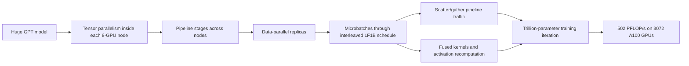
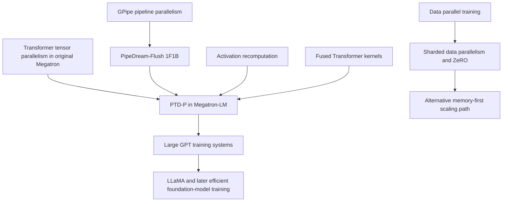
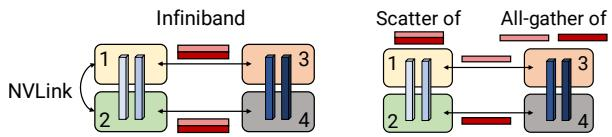
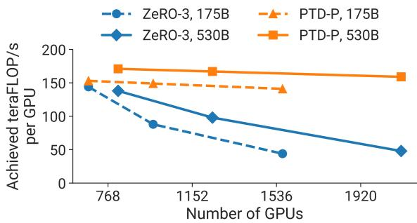
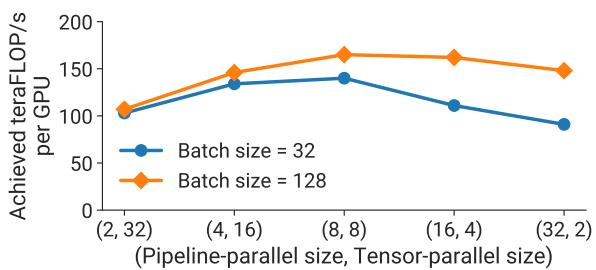
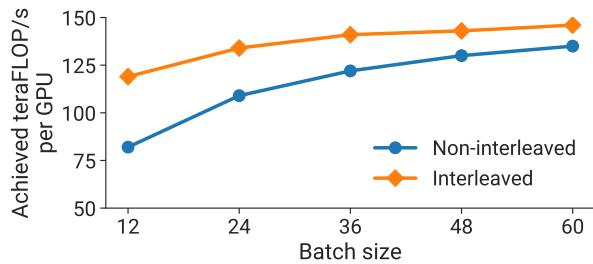

# Megatron-LM: GPU-Cluster Training Parallelism

**Paper:** Efficient Large-Scale Language Model Training on GPU Clusters Using Megatron-LM
**Authors:** Deepak Narayanan, Mohammad Shoeybi, Jared Casper, Patrick LeGresley, Mostofa Patwary, Vijay Korthikanti, Dmitri Vainbrand, Prethvi Kashinkunti, Julie Bernauer, Bryan Catanzaro, Amar Phanishayee, Matei Zaharia
**arXiv:** 2104.04473, 2021

**Related pages:** [GPT-3](../gpt-3.md) · [LLaMA](../llama.md) · [The Transformer](../../algorithms/transformer.md) · [Training Index](../index.md)

## TL;DR

**What:** Megatron-LM shows how to train very large Transformer language models by composing **pipeline, tensor, and data parallelism** instead of relying on any one scaling axis alone.

**How:** It uses tensor parallelism inside an 8-GPU DGX A100 node, pipeline parallelism across nodes, data parallelism across model replicas, an interleaved 1F1B pipeline schedule, [scatter/gather](../../terms/scatter-gather.md) cross-node communication, activation recomputation, and fused Transformer kernels.

**The number:** The paper reports **502 petaFLOP/s aggregate throughput** for a 1.008T-parameter GPT model on 3072 A100 GPUs, or 163 teraFLOP/s per GPU, about 52% of theoretical peak.

## The Big Picture

*1. Tensor parallelism splits each Transformer layer where fast intra-node NVLink can carry all-reduces. 2. Pipeline parallelism splits layer groups across nodes where point-to-point traffic is cheaper than tensor all-reduce. 3. Data parallelism scales replicas once the model-parallel shard fits. 4. The interleaved schedule shrinks idle pipeline bubbles, while scatter/gather avoids redundant inter-node activation sends.*

## Why This Exists

Imagine training a GPT-3-class model after reading the [GPT-3](../gpt-3.md) page. The 175B model is too large for one GPU, and even if host-device swapping made it fit, a single V100 would take centuries. Plain data parallelism does not solve the problem because every worker still needs a full copy of the model, and the usable worker count is constrained by batch size.

The tempting fix is "just split the model," but each split has a cost. **Tensor parallelism** creates frequent all-reduces and becomes painful across slow inter-node links. **Pipeline parallelism** avoids those all-reduces but creates idle pipeline bubbles. **ZeRO-style sharding** reduces memory but can introduce heavy cross-node parameter traffic. Megatron-LM exists because trillion-parameter training is not a single parallelism trick; it is a placement problem across compute, memory, network topology, and optimizer semantics.

## The Landscape

**Megatron-LM is the systems bridge between GPT-style scaling and practical cluster training.** It inherits the Transformer workload, prior tensor-model parallelism, pipeline scheduling ideas, and memory-saving recomputation, then makes their interaction explicit.

## The Core Idea

**Match each parallelism mode to the hardware link where it is cheapest.** Tensor parallelism is powerful but chatty, so keep it within a node. Pipeline parallelism communicates less often and can cross nodes. Data parallelism is best used after the model shard fits, because gradient synchronization happens once per batch rather than every layer and [microbatch](../../terms/microbatch.md).

## Symbol Map

The paper describes a parallel configuration as `(p, t, d)`: `p` is pipeline-model-parallel size, `t` is tensor-model-parallel size, and `d` is data-parallel size. These multiply to the total GPU count `n`.

| Symbol | Human name | Shape / scope | Plain meaning |
|---|---|---|---|
| $p$ | pipeline size | stages per model replica | Number of layer partitions in the pipeline. |
| $t$ | tensor size | ranks per pipeline stage | Number of GPUs splitting an individual Transformer layer. |
| $d$ | data size | replicas | Number of model-parallel replicas training on different data shards. |
| $n$ | total GPUs | cluster | Must satisfy $p \cdot t \cdot d = n$. |
| $B$ | global batch size | samples per optimizer step | Full training batch across all data-parallel replicas. |
| $b$ | microbatch size | samples per pipeline slot | Unit injected into the pipeline. |
| $m$ | microbatches per pipeline | per pipeline per batch | $m = B / (b \cdot d)$; larger $m$ amortizes pipeline bubbles. |
| $v$ | virtual pipeline chunks | chunks per device | Number of layer chunks assigned to each physical pipeline device in the interleaved schedule. |

## Deep Dive

### PTD-P Parallelism

**What it does:** Splits the model with pipeline parallelism (`p`) and tensor parallelism (`t`), then replicates those model-parallel shards with data parallelism (`d`).

**Why it matters:** In the GPT-scale training scenario, the model must fit in memory and finish in practical time; any single parallelism dimension either runs out of memory, saturates the network, or leaves devices idle.

**How it works:**

| Parallelism | Best use in Megatron-LM | Main cost | Placement rule |
|---|---|---|---|
| Tensor | Split attention and MLP matrix multiplications within a layer | Frequent all-reduces | Keep within an 8-GPU DGX A100 node. |
| Pipeline | Split Transformer layers into stages | Pipeline bubbles and activation sends | Use across nodes after tensor degree reaches node size. |
| Data | Replicate the model-parallel shard | Gradient all-reduce once per batch | Use remaining GPUs once the model shard fits. |

**The intuition:** Use the noisy communication pattern on the fast local fabric, and use the quieter communication pattern across the slower cluster fabric.

**A concrete example:** For a GPT-3-class run, Megatron-LM can split each layer across 8 GPUs inside a node, pipeline layer groups across nodes, and then add data-parallel replicas instead of trying to all-reduce tensor-parallel activations across many nodes.

**Remember:** **Tensor inside nodes, pipeline across nodes, data parallel outside the model shard** is the core placement heuristic.

### Interleaved 1F1B Pipeline Schedule

**What it does:** Assigns multiple smaller model chunks to each pipeline device so the schedule can flush earlier and reduce idle time.

**Why it matters:** Pipeline parallelism makes trillion-parameter models fit, but a deep pipeline wastes time at the start and end of every synchronized batch unless enough microbatches are in flight.

**How it works:** In the default 1F1B schedule, each physical stage owns one contiguous layer block. In the interleaved schedule, each stage owns multiple chunks. If each device has `v` chunks, each chunk has about `1/v` of the forward/backward work, so the bubble fraction drops from approximately `(p - 1) / m` to `(1 / v) * (p - 1) / m`.

*The top schedule is ordinary 1F1B. The bottom schedule gives each device multiple virtual chunks, which shortens the visible flush region at similar activation memory cost.*

**The intuition:** Interleaving turns one long stage into several shorter stage visits, so the pipeline drains sooner.

**A concrete example:** If the GPT-3-class run has too few microbatches relative to pipeline depth, the default schedule leaves late stages idle during warmup and early stages idle during drain; interleaving reduces that idle region without changing optimizer semantics.

**Remember:** **Interleaving buys less bubble at the price of more pipeline communication.**

### Scatter/Gather Pipeline Communication

**What it does:** Sends only tensor-parallel chunks across InfiniBand, then all-gathers within the receiving node over faster NVLink.

**Why it matters:** The interleaved schedule increases communication. Without reducing redundant cross-node sends, the communication cost can erase the bubble savings.

**How it works:** Tensor-parallel ranks often hold replicated activation tensors at pipeline boundaries. The naive pipeline send transmits the same tensor from each rank to the next stage. Scatter/gather splits that tensor into `t` chunks before the cross-node send, sends one chunk per rank, and reconstructs the full tensor with an intra-node all-gather on the receiver.

*Instead of sending the same full activation tensor repeatedly over InfiniBand, each rank sends a smaller shard and the receiver rebuilds the tensor over local NVLink.*

**The intuition:** Spend scarce inter-node bandwidth once, then use cheap local bandwidth to reconstruct what each rank needs.

**A concrete example:** With tensor parallel size 8 on DGX A100 nodes, naive pipeline communication can send the same boundary tensor 8 times across nodes; scatter/gather cuts the cross-node payload to one shard per rank.

**Remember:** **Scatter/gather is what makes the more communication-heavy interleaved schedule practical.**

### Microbatch and Activation Memory Tradeoff

**What it does:** Chooses the microbatch size and activation recomputation policy that balance GPU arithmetic efficiency, pipeline bubble size, and memory footprint.

**Why it matters:** In the GPT-scale training scenario, bigger microbatches improve GEMM efficiency but reduce `m`, which increases the pipeline bubble; smaller microbatches improve pipeline occupancy but can underutilize GPU kernels.

**How it works:**

| Lever | Helps | Hurts |
|---|---|---|
| Larger microbatch `b` | Bigger GEMMs and better arithmetic intensity | Fewer microbatches per pipeline, larger bubble, more memory pressure |
| Smaller microbatch `b` | More pipeline slots and smaller bubble | Smaller GEMMs and lower GPU utilization |
| Activation recomputation | Fits larger models and larger batch sizes | Adds an extra forward pass during backward |
| Selective checkpointing | Reduces activation memory | Requires careful model-specific measurement |

**The intuition:** The best microbatch is not the largest one that fits; it is the one where GPU utilization and pipeline occupancy meet.

**A concrete example:** The paper reports an optimal microbatch size of 2 for one 91B-parameter `(t, p) = (8, 8)` configuration, while another smaller GPT model in the analytical example peaks around microbatch size 4.

**Remember:** **Microbatch size is a systems hyperparameter, not just a training hyperparameter.**

### Fused Transformer Kernels

**What it does:** Removes memory-bound overhead from the Transformer block with layout changes and fused kernels.

**Why it matters:** Once communication is controlled, the cluster still needs each GPU to spend most time on high-throughput matrix multiplies instead of transposes, elementwise chains, and softmax bookkeeping.

**How it works:** The implementation changes attention data layout to avoid expensive transposes and enable strided batched GEMMs; fuses bias + GeLU and bias + dropout + residual add with PyTorch JIT; and uses custom scale-mask-softmax kernels for general and causal masks.

**The intuition:** Parallelism decides whether the work reaches the GPU; fusion decides whether the GPU executes it efficiently.

**A concrete example:** In the GPT-3-class run, fused operators raise per-GPU throughput from 113 to 135 teraFLOP/s; for the 530B model, they raise throughput from 133 to 148 teraFLOP/s.

**Remember:** **At thousand-GPU scale, small per-layer memory overheads become cluster-scale throughput losses.**

## Putting It Together

1. Start with a GPT model whose parameters and activations exceed one GPU or one node.
2. Pick a tensor-parallel degree up to the node GPU count, typically 8 on DGX A100, to split layer matrix multiplications over fast NVLink.
3. Add pipeline-parallel stages across nodes until the model-parallel shard fits in memory.
4. Add data-parallel replicas with remaining GPUs, keeping the global batch and microbatch choices compatible with pipeline occupancy.
5. Run interleaved 1F1B so each physical stage owns multiple chunks and the synchronized batch drains sooner.
6. Use scatter/gather at pipeline boundaries so interleaving does not multiply redundant cross-node activation traffic.
7. Use activation recomputation and fused kernels so memory footprint stays feasible and each GPU reaches high arithmetic throughput.
8. Step the optimizer only after the pipeline flush, preserving strict synchronous optimizer semantics.

## What This Buys You

### The headline claim

Megatron-LM makes **trillion-parameter dense GPT training a practical cluster job** rather than a memory experiment or an impractically slow single-device run.

### How we know: scaling and comparison evidence

| Question | Evidence from the paper |
|---|---:|
| Can PTD-P scale to a trillion parameters? | 1.008T GPT, 3072 A100 GPUs, 502 aggregate PFLOP/s, 52% of peak. |
| What is the estimated training time? | 84 days for a 1T model on 450B tokens; 34 days for a GPT-3-sized 175B model on 300B tokens with 1024 A100s. |
| Does PTD-P beat ZeRO-3 alone? | Up to 70% higher throughput for 175B and 530B models when doubling GPUs at fixed global batch size. |
| Does scatter/gather matter? | Up to 11% throughput improvement for communication-heavy interleaved schedules. |
| Do fused kernels matter? | 19% throughput improvement on 175B and 11% on 530B in the paper's reported settings. |

*PTD-P scales more gracefully than ZeRO-3 without model parallelism in the paper's 175B and 530B GPT comparisons, mainly because it avoids excessive cross-node parameter traffic.*

*The 162B-model configuration sweep shows why tensor-only or pipeline-only choices are weaker than matching tensor parallelism to node boundaries and pipeline parallelism to cross-node scaling.*

*Interleaving helps most when default 1F1B still has visible pipeline bubbles; the advantage narrows as batch size grows and communication dominates more of the difference.*

### The mechanism behind the numbers

The throughput numbers come from **aligning communication frequency with network hierarchy**. Tensor parallelism communicates every layer and microbatch, so it stays on NVLink. Pipeline communication crosses nodes but is point-to-point and can be compressed with scatter/gather. Data parallelism synchronizes once per batch, so it scales replicas after the model-parallel shard fits. Kernel fusion then keeps the remaining compute dense enough for A100 tensor cores.

### How to read these numbers

Do not read the paper as proving that PTD-P is always better than ZeRO-style sharding. The comparison is against ZeRO-3 without model parallelism, and the paper explicitly notes ZeRO-3 can be combined with model parallelism. The stronger lesson is that **memory sharding alone is not enough when cross-node communication becomes the bottleneck**.

## Where It Breaks

| Failure mode | When it happens | Impact |
|---|---|---|
| Weak network topology | Inter-node links are much slower or less balanced than Selene's DGX A100 fat-tree cluster | Pipeline and data-parallel communication can dominate, invalidating the reported scaling. |
| Tensor parallelism crosses nodes | `t` exceeds the fast local GPU group | Frequent all-reduces move onto slower links and throughput can collapse. |
| Too many pipeline stages for the batch | `p` is large while `m = B / (b * d)` is small | Pipeline bubbles waste devices unless interleaving and larger batch sizes compensate. |
| Microbatch chosen only for memory | `b` is set to the smallest value that fits without measuring GEMM efficiency | Pipeline occupancy improves but kernels can become too small to use GPUs well. |
| Irregular model architecture | Layers differ substantially in cost or memory | Equal layer striping becomes load-imbalanced; the paper does not solve automatic graph partitioning. |
| Strict optimizer semantics required at tiny batch sizes | The run cannot increase `B` or `m` enough to amortize flushes | Synchronous pipeline flushing can be expensive compared with relaxed-staleness methods. |
| Checkpoint I/O bottleneck | Trillion-parameter checkpoints are loaded or saved on weaker storage | Multi-terabyte checkpoint operations can dominate operational time outside steady-state training. |

## One Thing to Remember

**Megatron-LM's durable idea is topology-aware parallelism.** Tensor parallelism, pipeline parallelism, and data parallelism are not interchangeable knobs; they communicate at different frequencies and should be mapped to the hardware links that can carry them. The paper's trillion-parameter result comes from that mapping plus schedule, communication, memory, and kernel work that keeps the whole cluster doing useful Transformer math.

## Go Deeper

- **Read:** [arXiv:2104.04473](https://arxiv.org/abs/2104.04473)
- **Build on:** Megatron-Core, DeepSpeed 3D parallelism, ZeRO combined with model parallelism, sequence parallelism, later large-model training stacks
- **Understand the context:** [GPT-3](../gpt-3.md) for the 175B model target · [LLaMA](../llama.md) for later efficient model-family training · [The Transformer](../../algorithms/transformer.md) for the layer structure being split
- **Reproduce:** Code is linked by the paper at `https://github.com/nvidia/megatron-lm`; full trillion-scale reproduction requires a large multi-node GPU cluster with high-bandwidth local and inter-node networking.
