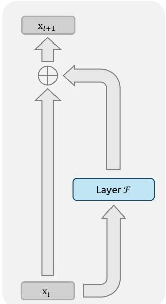
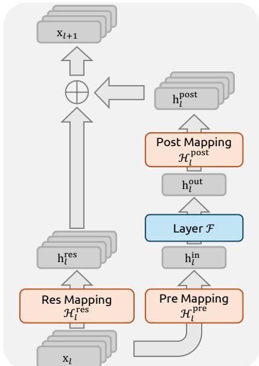
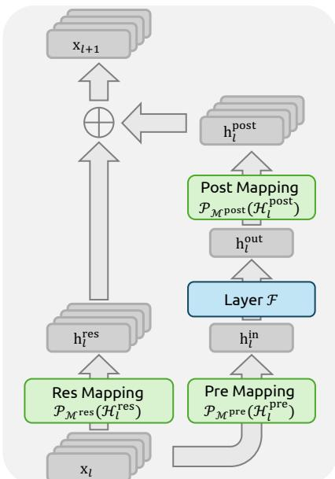
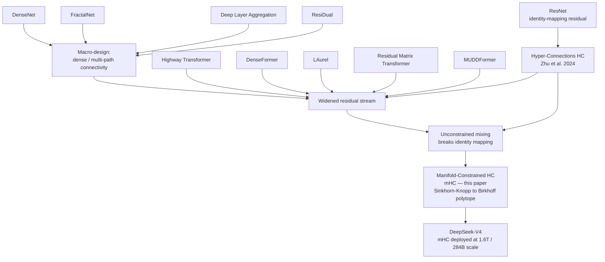
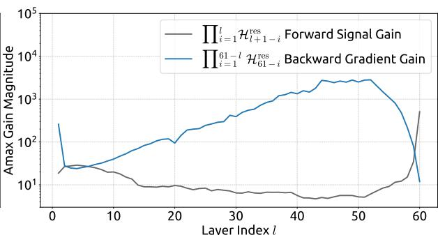
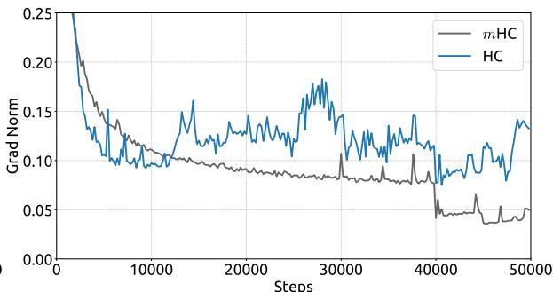
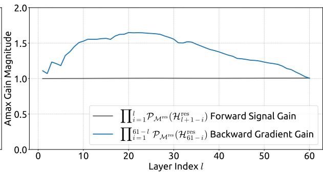
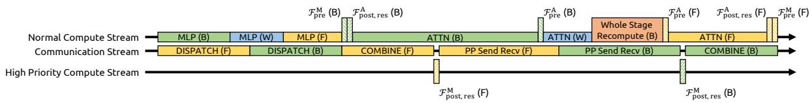

# mHC: Manifold-Constrained Hyper-Connections

**Paper:** mHC: Manifold-Constrained Hyper-Connections
**Authors:** Zhenda Xie, Yixuan Wei, Huanqi Cao, Chenggang Zhao, Chengqi Deng, et al. (DeepSeek-AI)
**arXiv:** [2512.24880](https://arxiv.org/abs/2512.24880)

**Related pages:** [DeepSeek-V4](../deepseek/deepseek-v4/index.md) · [Hyper-Connections (term)](../../terms/hyper-connections.md)

## TL;DR

**What:** mHC keeps the performance gains of Hyper-Connections (HC) while restoring the identity-mapping property that unconstrained HC destroys, by constraining the residual mixing matrix to be doubly stochastic.
**How:** The Sinkhorn-Knopp algorithm entropically projects each residual mapping onto the [Birkhoff polytope](../../terms/hyper-connections.md) of doubly stochastic matrices; because such matrices are non-expansive and closed under multiplication, composite signal gain stays bounded — and fused kernels, selective recomputation, and DualPipe overlap keep the added cost at 6.7%.
**The number:** On a 27B [MoE](../../terms/mixture-of-experts.md), mHC reaches a final loss 0.021 lower than the residual baseline and cuts HC's composite signal gain from ~3000 down to ≤1.6.

## The Big Picture

*Source: Figure 1(a) of the paper. ① One $C$-wide stream carries the state. ② The layer function $\mathcal{F}$ writes its output back onto the same stream as an addition. ③ The identity path $\mathbf{x}_l \to \mathbf{x}_{l+1}$ is unimpeded — the property that keeps deep nets trainable.*

*Source: Figure 1(b) of the paper. ① The stream is widened to $n \times C$. ② $\mathcal{H}^{\text{res}}$ mixes streams with a learned $n \times n$ matrix. ③ $\mathcal{H}^{\text{pre}}$ aggregates streams into the layer input; $\mathcal{H}^{\text{post}}$ writes the output back. Nothing constrains these mappings, so repeated application can amplify or shrink signal.*

*Source: Figure 1(c) of the paper. ① Identical $n$-stream topology to HC. ② The difference: $\mathcal{H}^{\text{res}}$ is projected onto the doubly stochastic manifold (Birkhoff polytope), so mixing is always a convex combination of streams. ③ This restores bounded signal propagation while keeping cross-stream information exchange.*

The message of the figure is that the topology is unchanged from HC to mHC — only the constraint on the residual mapping differs, and that one change is what makes deep stacks stable.

## Why This Exists

Imagine you are DeepSeek training a 27B-parameter MoE (DeepSeek-V3-style architecture). You adopt Hyper-Connections because the ablation in Table 1 of the paper shows the residual mixing mapping alone lowers loss by 0.022. Training starts fine — then, around step 12,000, the loss suddenly surges and the gradient norm spikes out of control. You check the residual stream and find that the *composite* mapping across 30 layers (60 sub-layers if you unroll attention and FFN separately) has a worst-case gain of **~3000×**: some path is amplifying signal by three orders of magnitude. The identity-mapping property — the reason residuals are trainable at all — has silently vanished.

That is the pain mHC fixes: HC's unconstrained residual matrices give better loss but break stability at scale. mHC is the fix that keeps the gain without the explosion.

## The Landscape

*Editable source: [mhc-landscape.mmd](./assets/mhc-landscape.mmd). The residual-connection lineage (ResNet → macro-design → widened streams) is the parent branch; HC is the direct parent; sibling widened-stream designs (Highway Transformer, DenseFormer, LAurel, RMT, MUDDFormer) share the instability problem; mHC is the constrained descendant that restores identity mapping and is deployed at scale in [DeepSeek-V4](../deepseek/deepseek-v4/index.md).*

## The Core Idea

Hyper-Connections improve training by giving the residual stream more lanes and letting the network learn how to merge them — but an unconstrained mixing matrix, applied over dozens of layers, is a random signal amplifier. mHC keeps the lanes but *locks the mixing to the set of doubly stochastic matrices*: every stream's signal is always a weighted average of the others. Averages can't blow up, and a product of averages is still an average, so the identity-mapping property — the thing that made ResNet trainable — is restored at any depth. The entire paper is: widen the stream (HC's idea), then constrain the mixer (mHC's idea), then engineer away the extra memory and I/O cost so it's nearly free.

## Symbol Map

`C` (or $d$) = width of one residual stream / layer input; `n` = expansion rate (number of streams, 4 in the experiments); superscripts `res` / `pre` / `post` distinguish the three learnable mappings (residual mixer, read-out, write-back).

| Symbol | Human name | Shape / scope | Plain meaning |
|---|---|---|---|
| $\mathbf{x}_l$ | residual stream state | $n \times C$, per layer | The widened hidden state carried between layers. |
| $\mathcal{H}_l^{\text{res}}$ | residual mixing matrix | $n \times n$, per layer | Mixes the $n$ streams; the matrix mHC constrains. |
| $\mathcal{H}_l^{\text{pre}}$ | read-out mapping | $1 \times n$, per layer | Aggregates streams into the layer input $\mathbb{R}^{1 \times C}$. |
| $\mathcal{H}_l^{\text{post}}$ | write-back mapping | $1 \times n$, per layer | Spreads the layer output back onto the $n$ streams. |
| $\mathcal{F}(\cdot, \mathcal{W}_l)$ | layer function | $\mathbb{R}^{1\times C}\to\mathbb{R}^{1\times C}$ | Attention or FFN block; unchanged by HC/mHC. |
| Birkhoff polytope | doubly stochastic manifold | subset of $\mathbb{R}^{n\times n}$ | Non-negative matrices with rows and columns summing to 1. |
| Sinkhorn-Knopp(·) | projection operator | $\mathbb{R}^{n\times n}\to$ polytope | Iteratively rescales rows/columns until doubly stochastic. |
| Amax Gain Magnitude | instability metric | scalar per layer | Max abs row sum (forward signal) or column sum (backward gradient) of the composite mapping. |

**Cached vs. computed:** the mapping *coefficients* ($\mathcal{H}^{\text{pre}}, \mathcal{H}^{\text{post}}, \mathcal{H}^{\text{res}}$) are cheap, input-dependent, and recomputed in the backward pass; the layer-function activations are the expensive part and are stored per layer.

## Deep Dive

### Hyper-Connections: the widened residual stream

**What it does:** HC replaces the single residual stream with $n$ parallel streams and three learnable mappings:

$$
\mathbf{x}_{l+1} = \mathcal{H}_l^{\text{res}} \mathbf{x}_l + \mathcal{H}_l^{\text{post}^\top} \mathcal{F}(\mathcal{H}_l^{\text{pre}} \mathbf{x}_l, \mathcal{W}_l).
$$

**Why it matters:** the residual stream's information capacity is no longer tied to the layer width $C$ that drives FLOPs — you can scale the stream independently of compute.

**How it works:** each mapping is a dynamic (input-dependent) part plus a static bias, e.g. $\mathcal{H}_l^{\text{res}} = \alpha_l^{\text{res}} \cdot \tanh(\theta_l^{\text{res}} \tilde{\mathbf{x}}_l^\top) + \mathbf{b}_l^{\text{res}}$ with small-initialized gating $\alpha$. Since $n \ll C$, computing these costs negligible FLOPs.

**The intuition:** more lanes, learnable merges — the network decides how much of each stream feeds each block.

**A concrete example:** back to the 27B MoE: with $n=4$, the stream is 4× wider than the layer input, and the ablation (Table 1) shows the *mixer* $\mathcal{H}^{\text{res}}$ alone delivers −0.022 loss — the other two mappings add only −0.005 more.

**Remember:** HC's gain comes mostly from the residual mixer, which is exactly the component that later turns out to be unstable.

### Why unconstrained HC explodes

**What it does:** over $L$ layers, the effective signal path is the *composite* mapping $\prod_{i=1}^{L-l} \mathcal{H}_{L-i}^{\text{res}}$.

**Why it matters:** a product of unconstrained matrices need not preserve signal energy — it amplifies or shrinks it, exactly the failure mode from "Why This Exists."

**How it works:** the paper measures Amax Gain Magnitude — the max absolute row sum (forward) and column sum (backward) of the composite mapping. For HC it reaches **peaks of ~3000**, three orders of magnitude away from the ideal value of 1.

*Source: Figure 3(b) of the paper. The composite mapping's Amax gain (y-axis) across sub-layers of the 27B model. ① The unconstrained composite grows to ~3000× worst-case amplification. ② Layer index unrolls each Transformer block into Attention and FFN sub-layers.*

**The intuition:** unconstrained residuals are like pipes whose diameter changes unpredictably at every joint — after 30 joints the flow rate is anyone's guess.

**A concrete example:** the 12k-step loss surge and gradient-norm spikes in Figure 2 of the paper are the observable symptom of this composite gain. The gradient norm graph shows HC (orange) spiking far above the stable mHC/baseline profiles.

*Source: Figure 2(b) of the paper. Gradient norm vs. training steps on the 27B model — unconstrained HC's gradient norm explodes while mHC stays flat and baseline-like.*

**Remember:** HC's instability is a *property of the composite*, not of any single layer — that is why constraining each layer's mixer is the right fix.

### The doubly stochastic manifold: mHC's core

**What it does:** mHC constrains $$\mathcal{H}_l^{\text{res}}$$ to the set of doubly stochastic matrices: non-negative entries with every row and column summing to 1, i.e. the Birkhoff polytope $$\mathcal{P}_{\mathcal{M}^{\text{res}}}$$.

**Why it matters:** this single constraint restores the identity-mapping property while keeping cross-stream mixing.

**How it works:** three formal properties do the heavy lifting:

| Property | Statement | Consequence |
|---|---|---|
| Norm preservation | $\|\mathcal{H}^{\text{res}}\|_2 \le 1$ | The mapping is non-expansive — no gradient explosion. |
| Compositional closure | product of doubly stochastic matrices is doubly stochastic | $\prod \mathcal{H}^{\text{res}}$ stays bounded over all depths. |
| Geometry | Birkhoff polytope = convex hull of permutation matrices | Mixing is a convex combination of streams; repeated application monotonically mixes information. |

When $n=1$, the constraint degenerates to the scalar 1 — mHC exactly recovers the plain identity mapping. And because each $\mathcal{H}^{\text{res}}\mathbf{x}_l$ is a convex combination of the streams, the feature mean is conserved and the signal norm is strictly regularized.

**The intuition:** a doubly stochastic matrix is a "weighted shuffle" — it can redistribute energy between streams but can never create or destroy it.

**A concrete example:** in the 27B MoE, the composite gain for mHC peaks at ~1.6 instead of ~3000 — three orders of magnitude tighter, and the gradient norm stays flat and baseline-like.

*Source: Figure 7(b) of the paper. Same metric and model as Figure 3(b), but for mHC. ① The composite gain is bounded near ~1.6 (vs ~3000 for HC). ② The small residual deviation from 1.0 comes from the finite Sinkhorn-Knopp iterations.*

**Remember:** doubly stochastic = non-expansive + composition-closed = the identity-mapping property, restored for free.

### Sinkhorn-Knopp projection and parameterization

**What it does:** turns the raw learned mixer into a doubly stochastic matrix every forward pass.

**Why it matters:** the projection is what enforces the manifold; its efficiency decides whether mHC is practical.

**How it works:** mHC first flattens the stream state, computes dynamic + static parts (Eq. 7), then projects:

$$
\mathcal{H}_l^{\text{res}} = \text{Sinkhorn-Knopp}(\tilde{\mathcal{H}}_l^{\text{res}}), \qquad M^{(0)} = \exp(\tilde{\mathcal{H}}_l^{\text{res}}), \qquad M^{(t)} = \mathcal{T}_r(\mathcal{T}_c(M^{(t-1)}))
$$

with $t_{\max} = 20$ row/column normalization iterations ($\mathcal{T}_r$ = normalize rows to sum 1, $\mathcal{T}_c$ = normalize columns). The forward is a single fused kernel; the backward pass recomputes intermediates on-chip and traverses the whole iteration.

**The intuition:** exponentiate (make everything positive), then ping-pong row/column normalization until the matrix is doubly stochastic.

**A concrete example:** in the 27B model, the 20-iteration approximation leaves the backward (column-sum) gain slightly above 1 — the reason Figure 7(b) shows ~1.6 rather than exactly 1.0.

**Remember:** finite iterations buy speed at the cost of a tiny, bounded deviation from perfect conservation.

### Non-negative pre/post mappings

**What it does:** mHC also constrains $\mathcal{H}^{\text{pre}}$ and $\mathcal{H}^{\text{post}}$ to be non-negative (sigmoid, and $2\sigma$ for post).

**Why it matters:** unconstrained pre/post coefficients can be negative and *cancel* signal when composed with the residual mixer.

**How it works:** the pre/post mappings use $\mathcal{H}^{\text{pre}} = \sigma(\tilde{\mathcal{H}}^{\text{pre}})$ and $\mathcal{H}^{\text{post}} = 2\sigma(\tilde{\mathcal{H}}^{\text{post}})$, guaranteeing all coefficients are positive.

**The intuition:** no negative weights means no destructive interference — every stream contributes constructively.

**A concrete example:** without this constraint, a negative write-back coefficient on one stream could subtract exactly what another stream added, silently wasting the stream's capacity.

**Remember:** non-negativity on the gates is a second, cheaper manifold projection that removes signal cancellation.

### Kernel fusion: making the wide stream cheap

**What it does:** mHC reorders and fuses the mapping computations so the $n \times C$ stream doesn't multiply memory traffic.

**Why it matters:** the widened stream raises per-token I/O by roughly $n\times$ (Table 2 of the paper: HC's total I/O goes from $2C$ read / $C$ write for residuals to $(5n+1)C$ read / $(3n+1)C$ write) — enough to kill training throughput without fused kernels.

**How it works:** three groups of fused kernels (implemented mostly in TileLang): ① fused scans computing $\tilde{\mathcal{H}}^{\text{pre}}, \tilde{\mathcal{H}}^{\text{post}}, \tilde{\mathcal{H}}^{\text{res}}$ plus the RMSNorm-scale in one pass over $\vec{\mathbf{x}}_l$, ② a single lightweight kernel for the small coefficient operations, ③ one kernel for the Sinkhorn-Knopp iteration with a custom recomputing backward. Fusing post/res with residual merging cuts the merge kernel's reads from $(3n+1)C$ to $(n+1)C$ and writes from $3nC$ to $nC$. RMSNorm is reordered to divide by the norm *after* the [matmul](../../terms/gemm.md), preserving math while cutting latency on the $nC$-wide state.

**The intuition:** read the wide stream from memory once, do everything with it on-chip, write it back once.

**A concrete example:** on the 27B model the fused pipeline (load → cast → compute → store, mixed-precision: bf16 activations, tf32 projections, fp32 coefficients) is what brings total mHC overhead down to the headline 6.7%.

**Remember:** the 6.7% figure is *not* free — it is bought with kernel fusion, mixed precision, and careful scheduling.

### Recomputing: trading memory for the transient

**What it does:** mHC discards the mHC kernels' intermediate activations after the forward pass and recomputes them in the backward pass without re-running the heavy layer function $\mathcal{F}$.

**Why it matters:** the $n$-stream design multiplies activation memory; storing everything would force aggressive checkpointing.

**How it works:** for a block of $L_r$ consecutive layers, only the block input $\mathbf{x}_{l_0}$ is stored (every $L_r$ layers), plus each layer's $\mathcal{F}$ output (per layer). The transient recompute memory is $(n+2)C \times L_r$, giving the optimal block size

$$
L_r^{\star} = \arg\min_{L_r}\left[nC \left\lceil \tfrac{L}{L_r}\right\rceil + (n+2)C\,L_r\right] \approx \sqrt{\frac{nL}{n+2}},
$$

which conveniently aligns with the layers-per-pipeline-stage.

**The intuition:** recompute the cheap mixer, keep the expensive layer output — memory drops without redoing $\mathcal{F}$.

**A concrete example:** with $n=4$ and the 27B's 30 layers, recompute blocks line up with pipeline stages so the backward pass re-derives only the small mapping coefficients.

**Remember:** mHC recomputation is selective — it never re-runs attention or FFN, only the lightweight mixers.

### Overlapping communication in DualPipe

**What it does:** mHC extends the DualPipe schedule so the extra cross-stage communication and stage-boundary recomputation overlap with compute instead of delaying it.

**Why it matters:** [pipeline parallelism](../../terms/pipeline-parallelism.md) already moves activations between stages; an $n$-fold wider stream means $n$-fold more communication, and stage-boundary recomputation adds compute — both would enlarge pipeline bubbles.

**How it works:** ① the $$\mathcal{F}_{\text{post,res}}$$ kernels of FFN layers run on a dedicated high-priority compute stream so the communication stream is never blocked; ② attention layers avoid persistent kernels so long-running attention can be preempted and flexibly scheduled; ③ recomputation is decoupled from pipeline communication because each stage's initial activation $$\mathbf{x}_{l_0}$$ is already cached locally.

*Source: Figure 4 of the paper. F / B / W = forward, backward, weight-gradient computation. ① Attention (A) and MLP (M) kernel blocks are scheduled so communication overlaps with compute. ② mHC stage-boundary recomputation is decoupled from the communication stream.*

**The intuition:** keep the network busy while the wide stream crosses stage boundaries — hide the cost instead of paying it serially.

**A concrete example:** without this, the 27B run's stage-boundary recompute would serialize with gradient communication; with the extended DualPipe the two overlap and throughput stays at the 6.7%-overhead level.

**Remember:** mHC's "only 6.7% overhead" claim depends on all three infrastructure pillars — fusion, recomputation, and DualPipe overlap — not just the math.

## Putting It Together

Here is one forward + backward training step of the 27B MoE with mHC:

1. **Stream in, mix:** the $4 \times C$ stream state $\mathbf{x}_l$ enters the layer. The fused scan kernel computes $\tilde{\mathcal{H}}^{\text{pre}}, \tilde{\mathcal{H}}^{\text{post}}, \tilde{\mathcal{H}}^{\text{res}}$ in one pass (bf16 reads, tf32 projections, fp32 coefficients).
2. **Project:** the Sinkhorn-Knopp kernel runs 20 row/column normalizations, outputting the doubly stochastic $\mathcal{H}^{\text{res}}$.
3. **Read out and compute:** $\mathcal{H}^{\text{pre}}\mathbf{x}_l$ becomes the $1\times C$ layer input; attention or FFN runs on it and produces its output — the only activations stored per layer.
4. **Merge back:** the fused $\mathcal{F}_{\text{post,res}}$ kernel computes $\mathcal{H}^{\text{res}}\mathbf{x}_l + \mathcal{H}^{\text{post}^\top}\mathcal{F}(\cdot)$ in one read/write of the stream, keeping the convex-combination guarantee.
5. **Forward all layers:** each layer repeats 1–4; every block input $\mathbf{x}_{l_0}$ is kept per recompute block, nothing else from the mixers is stored.
6. **Backward:** the custom Sinkhorn-Knopp backward recomputes the projection on-chip; the two backward matmuls run as one fused kernel; mHC kernels re-execute without re-running $\mathcal{F}$.
7. **Cross stage:** at pipeline boundaries, FFN post/res kernels run on the high-priority stream while gradient communication overlaps; stage-local recomputation never waits on the network.
8. **Result:** stable gradient norms, no 12k-step loss surge, final loss 0.021 below the residual baseline — all at ~6.7% extra wall-clock time.

## What This Buys You

### The headline claim

mHC matches or beats unconstrained HC on downstream benchmarks while being stable enough to train at 27B scale — final training loss 0.021 lower than the residual baseline, and composite signal gain bounded at ~1.6 instead of ~3000.

### How we know: 27B downstream benchmarks (Table 4)

| Benchmark | 27B Baseline | 27B w/ HC | 27B w/ mHC |
|---|---:|---:|---:|
| BBH (EM, 3-shot) | 43.8 | 48.9 | **51.0** |
| DROP (F1, 3-shot) | 47.0 | 51.6 | **53.9** |
| GSM8K (EM, 8-shot) | 46.7 | 53.2 | **53.8** |
| HellaSwag (Acc., 10-shot) | 73.7 | 74.3 | **74.7** |
| MATH (EM, 4-shot) | 22.0 | **26.4** | 26.0 |
| MMLU (Acc., 5-shot) | 59.0 | 63.0 | **63.4** |
| PIQA (Acc., 0-shot) | 78.5 | 79.9 | **80.5** |
| TriviaQA (EM, 5-shot) | 54.3 | 56.3 | **57.6** |

### The mechanism behind the numbers

mHC outperforms HC on 6 of 8 benchmarks (notably +2.1 BBH, +2.3 DROP) and beats the baseline on all 8. The reasoning-heavy gains (BBH, DROP) are where deeper, stable stacks pay off: with bounded gradient flow the optimizer can train the full depth productively instead of compensating for exploding paths. The compute-scaling curve (3B → 9B → 27B) and token-scaling curve (3B on 1T tokens) both show the advantage persisting as compute grows — the property that made it worth deploying in DeepSeek-V4.

### ⚠️ How to read these numbers

- **The 0.021 loss gap is vs. the residual baseline, not vs. HC.** mHC's stability advantage over HC shows up in *training behavior* (no loss surge, flat gradient norm), while the benchmark gap over HC is modest (+2.1/+2.3 on two tasks, −0.4 on MATH). Do not read "mHC beats HC everywhere" from the table.
- **6.7% overhead is for $n=4$ and includes the infrastructure work.** Larger expansion rates or missing kernel fusion would change the number substantially.
- **The ~3000 vs ~1.6 gain comparison is a worst-case metric**, not average signal growth — but worst case is exactly what kills training.
- **All models use DeepSeek-V3-style MoE with MLA**; results may not transfer to dense architectures or other attention variants.

## Where It Breaks

| Failure mode | When it happens | Impact |
|---|---|---|
| Approximate Sinkhorn-Knopp | Only 20 iterations (the practical setting) | Backward gain drifts from 1.0, composite up to ~1.6 — still stable, but not exactly conservative |
| Recomputation blocks cross pipeline stages | Layer counts that don't align with the optimal $L_r^{\star}$ | Suboptimal memory/throughput tradeoff; stage-boundary recompute becomes a bubble |
| Expansion rate grows beyond 4 | Wider streams need more I/O, more recompute, more communication | The 6.7% overhead does not hold; scaling may degrade |
| Unfused kernels | Any deployment skipping the TileLang fusion work | ~$n\times$ memory-access overhead dominates; throughput collapses |
| Small models / $n=1$ | Degenerate case | Recovers plain residual — no benefit, only added complexity |
| Non-MoE or non-pretraining regimes | Dense models, fine-tuning, or RL not covered by the paper | Stability claims validated for large-scale MoE pretraining only |
| In-house DeepSeek-V4 deployment | Production claims rely on the same infrastructure stack | The paper reports 6.7% on its own cluster; other clusters may differ |

## One Thing to Remember

**mHC is the same hyper-connection topology as HC, but with the residual mixing matrix locked to the doubly stochastic manifold** — a convex combination of streams that can never create or destroy signal, so composite gain stays near ~1.6 instead of exploding to ~3000. That single constraint restores the identity-mapping property that makes deep residual networks trainable, and with fused kernels, selective recomputation, and DualPipe overlap it costs only 6.7% wall-clock time — which is why DeepSeek shipped it in DeepSeek-V4.

## Go Deeper

- **Read:** [mHC: Manifold-Constrained Hyper-Connections (arXiv 2512.24880)](https://arxiv.org/abs/2512.24880)
- **Build on:** [Hyper-Connections (Zhu et al., 2024)](https://arxiv.org/abs/2409.19606) — the unconstrained parent method; [DeepSeek-V4](../deepseek/deepseek-v4/index.md) — the production deployment of mHC at 1.6T/284B scale
- **Understand the context:** [Hyper-Connections (term)](../../terms/hyper-connections.md) · [DeepSeek-V3 (DualPipe)](https://arxiv.org/abs/2412.19437) — the pipeline schedule mHC extends
- **Reproduce:** not available at time of writing
