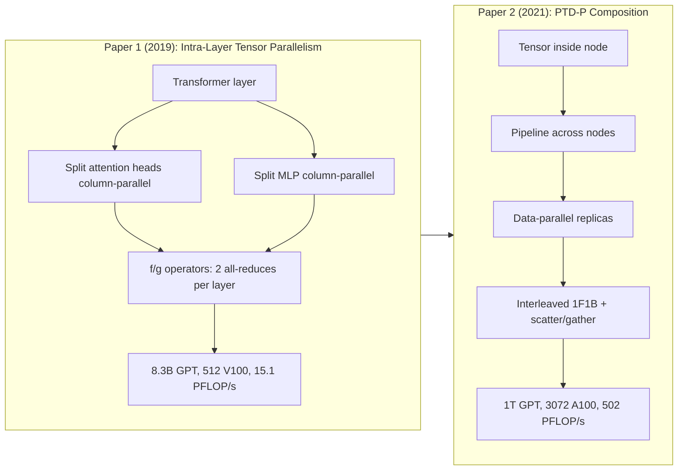
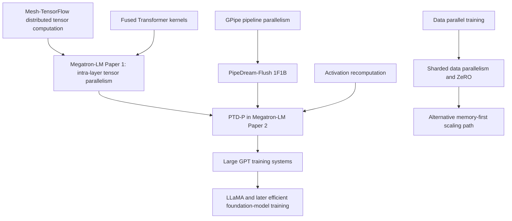
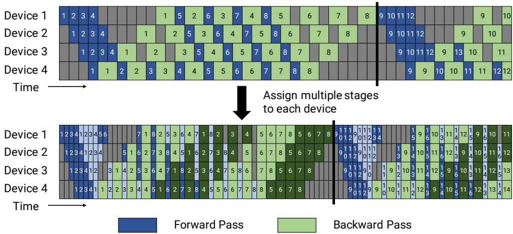

# Megatron-LM: GPU-Cluster Training Parallelism

**Megatron-LM spans two papers.** The first (2019) introduces intra-layer tensor model parallelism with `f`/`g` conjugate operators for 8.3B-parameter Transformers on V100 GPUs. The second (PTD-P, 2021) composes pipeline, tensor, and data parallelism for trillion-parameter GPT on A100. This page covers both.

**Paper 1:** Megatron-LM: Training Multi-Billion Parameter Language Models Using Model Parallelism
**Authors:** Mohammad Shoeybi, Mostofa Patwary, Raul Puri, Patrick LeGresley, Jared Casper, Bryan Catanzaro
**arXiv:** 1909.08053, 2019

**Paper 2:** Efficient Large-Scale Language Model Training on GPU Clusters Using Megatron-LM
**Authors:** Deepak Narayanan, Mohammad Shoeybi, Jared Casper, Patrick LeGresley, Mostofa Patwary, Vijay Korthikanti, Dmitri Vainbrand, Prethvi Kashinkunti, Julie Bernauer, Bryan Catanzaro, Amar Phanishayee, Matei Zaharia
**arXiv:** 2104.04473, 2021

**Related pages:** [GPT-3](../../foundation-models/gpt-3.md) · [LLaMA](../../foundation-models/llama.md) · [The Transformer](../../../algorithms/foundations/transformer.md) · [Training Index](../../index.md) · [GPipe](../gpipe/index.md)

## TL;DR

**What:** Megatron-LM introduces intra-layer tensor model parallelism using `f`/`g` conjugate operators that split Transformer attention and MLP blocks across GPUs with only two [all-reduces](../../../terms/all-reduce.md) per layer, later extended into PTD-P for trillion-parameter training.

**How:** Paper 1 splits [GEMMs](../../../terms/gemm.md) column-wise and row-wise so nonlinearities (GeLU, softmax) stay local, needing only `f` (forward identity, backward all-reduce) and `g` (forward all-reduce, backward identity). Paper 2 composes tensor, pipeline, and data parallelism with interleaved 1F1B and [scatter/gather](../../../terms/scatter-gather.md) communication.

**The number:** Paper 1 achieves **15.1 PFLOP/s** (8.3B parameters, 512 V100 GPUs, 76% scaling efficiency). Paper 2 achieves **502 PFLOP/s** (1.008T parameters, 3072 A100 GPUs, 52% of peak).

## The Big Picture



*1. Paper 1: Split GEMMs across GPUs so GeLU/softmax stay local; `f` and `g` conjugate ops handle the two all-reduces per layer. 2. Paper 2: Compose tensor (inside node), pipeline (across nodes), and data (across replicas) parallelism. 3. Interleaved 1F1B shrinks pipeline bubbles; scatter/gather avoids redundant cross-node sends. 4. Together: trillion-parameter training at 52% of A100 peak.*

## Why This Exists

Imagine training a GPT-3-class model after reading the [GPT-3](../../foundation-models/gpt-3.md) page. The 175B model is too large for one GPU, and even if host-device swapping made it fit, a single V100 would take centuries. Plain data parallelism does not solve the problem because every worker still needs a full copy of the model, and the usable worker count is constrained by batch size.

The tempting fix is "just split the model," but each split has a cost. **[Tensor parallelism](../../../terms/tensor-parallelism.md)** creates frequent [all-reduces](../../../terms/all-reduce.md) and becomes painful across slow inter-node links. **[Pipeline parallelism](../../../terms/pipeline-parallelism.md)** avoids those all-reduces but creates idle pipeline bubbles. **ZeRO-style sharding** reduces memory but can introduce heavy cross-node parameter traffic. Megatron-LM exists because trillion-parameter training is not a single parallelism trick; it is a placement problem across compute, memory, network topology, and optimizer semantics.

## The Landscape



**Megatron-LM spans two papers that together form the systems bridge between GPT-style scaling and practical cluster training.** Paper 1 (2019) inherits the Transformer workload and Mesh-TensorFlow's distributed tensor ideas, but implements them with just a few PyTorch all-reduce insertions — no compiler, no framework rewrite. Paper 2 (PTD-P, 2021) then composes this tensor parallelism with pipeline scheduling and data parallelism, making their interaction explicit.

## The Core Idea

**Split Transformer GEMMs so nonlinearities stay local, then compose parallelism modes to match hardware topology.** Paper 1's key insight: split the weight matrix along columns (not rows) so GeLU can be applied independently on each GPU without a synchronization point. The `f`/`g` conjugate operators handle the two all-reduces per layer. Paper 2's key insight: match each parallelism mode to the hardware link where it is cheapest — tensor parallelism on NVLink, pipeline across nodes, data parallelism across replicas.

## Symbol Map

The paper describes a parallel configuration as `(p, t, d)`: `p` is pipeline-model-parallel size, `t` is tensor-model-parallel size, and `d` is data-parallel size. These multiply to the total GPU count `n`.

| Symbol | Human name | Shape / scope | Plain meaning |
|---|---|---|---|
| $p$ | pipeline size | stages per model replica | Number of layer partitions in the pipeline. |
| $t$ | tensor size | ranks per pipeline stage | Number of GPUs splitting an individual Transformer layer. |
| $d$ | data size | replicas | Number of model-parallel replicas training on different data shards. |
| $n$ | total GPUs | cluster | Must satisfy $p \cdot t \cdot d = n$. |
| $B$ | global batch size | samples per optimizer step | Full training batch across all data-parallel replicas. |
| $b$ | [microbatch](../../../terms/microbatch.md) size | samples per pipeline slot | Unit injected into the pipeline. |
| $m$ | microbatches per pipeline | per pipeline per batch | $m = B / (b \cdot d)$; larger $m$ amortizes pipeline bubbles. |
| $v$ | virtual pipeline chunks | chunks per device | Number of layer chunks assigned to each physical pipeline device in the interleaved schedule. |

## Deep Dive

### Paper 1: The f/g Conjugate Operators

**What it does:** Splits Transformer GEMMs across GPUs with only two communication operations per layer — `f` (identity forward, [all-reduce](../../../terms/all-reduce.md) backward) and `g` (all-reduce forward, identity backward).

**Why it matters:** Naive row-wise GEMM splitting puts a synchronization point before every nonlinearity. This paper found that splitting along columns instead lets GeLU and softmax run independently on each GPU's shard.

**How it works:**

**MLP block:** The first GEMM ($Y = XA$) is split column-wise: $A = [A_1, A_2]$, producing $[Y_1, Y_2] = [\text{GeLU}(XA_1), \text{GeLU}(XA_2)]$ with no synchronization before GeLU. The second GEMM is split row-wise and its output is all-reduced ($g$ operator).

**Self-attention block:** The Q, K, V projections are split column-wise so each GPU owns a subset of attention heads. After local self-attention, the output projection is split row-wise and all-reduced.

**Result:** Each Transformer layer needs exactly 2 all-reduces forward + 2 all-reduces backward, regardless of the number of attention heads or hidden size.

| Operator | Forward | Backward |
|---|---|---|
| `f` | Identity (pass-through) | All-reduce gradients |
| `g` | All-reduce activations | Identity (pass-through) |

**The intuition:** Column-parallel splitting pushes the synchronization point past the nonlinearity, eliminating an extra all-reduce between the two GEMMs in each block.

**A concrete example:** For an 8.3B GPT-2 model on 8 V100 GPUs, each GPU handles 4 attention heads (out of 32 total) and 1/8 of the MLP hidden dimension. The two `f`/`g` pairs per layer are the only communication — no parameter server, no compiler, just PyTorch `all_reduce`.

**Remember:** **`f` and `g` are conjugates — one does the all-reduce forward, the other does it backward.**

### Paper 1: QKV Column-Parallel Splitting in Detail

**What it does:** Splits the fused $W^{QKV} \in \mathbb{R}^{d \times 3d}$ weight matrix column-wise using a **head-interleaved layout** so each GPU owns complete Q, K, V for exactly $H/t$ attention heads — no cross-GPU communication during the attention computation itself.

**Why it matters:** A naive contiguous column split of $[W^Q \mid W^K \mid W^V]$ would give GPU 0 some Q heads but none of their corresponding K and V, making local attention impossible. The head-interleaved layout fixes this zero-cost at initialization.

**How it works:**

**The fused QKV weight.** Megatron-LM packs Q, K, V into a single $d \times 3d$ matrix for efficiency — one big GEMM beats three separate $d \times d$ matmuls on GPU tensor cores:

$$X_{n \times d} \cdot W^{QKV}_{d \times 3d} = [Q_{n \times d} \mid K_{n \times d} \mid V_{n \times d}]_{n \times 3d}$$

**The head-interleaved layout.** Rather than grouping all Q together, all K together, all V together, Megatron-LM interleaves Q, K, V **per head**:

$$\underbrace{[Q_0, K_0, V_0]}_{\text{head 0}} \mid \underbrace{[Q_1, K_1, V_1]}_{\text{head 1}} \mid \cdots \mid \underbrace{[Q_{H-1}, K_{H-1}, V_{H-1}]}_{\text{head } H-1}$$

Each head's Q, K, V weights are contiguous as a 3-tuple. Now a column-parallel split naturally gives each GPU **self-contained** heads:

| GPU | Columns in $W^{QKV}$ | Heads owned |
|---|---:|---:|
| 0 | $[Q_0, K_0, V_0, \dots, Q_3, K_3, V_3]$ | 0–3 |
| 1 | $[Q_4, K_4, V_4, \dots, Q_7, K_7, V_7]$ | 4–7 |
| $\vdots$ | $\vdots$ | $\vdots$ |

**Forward pass, step by step:**

```text
Input X (same on all GPUs, replicated)
       │
       ▼
┌──────────────────────────────────────────────────┐
│ GPU 0:  Y₀ = X · W₀   →  [Q₀,K₀,V₀] heads 0..3  │
│ GPU 1:  Y₁ = X · W₁   →  [Q₁,K₁,V₁] heads 4..7  │
│ ...                                              │
│ GPU t-1: Yₜ₋₁ = X · Wₜ₋₁                        │
└──────────────────────────────────────────────────┘
       │
       ▼
  Each GPU runs self-attention on its own heads INDEPENDENTLY
  (no communication — Q, K, V for each GPU's heads are local)
       │
       ▼
  Output projection W^O split ROW-wise:
  each GPU produces partial result → all-reduce (g operator)
```

**Inference-time behavior.** The column split is identical to training, but the motivation shifts:

| Concern | Prefill (prompt) | Decode (generation) |
|---|---|---|
| Compute distribution | ✓ Column split helps | ✗ Single-token GEMM is tiny anyway |
| **KV cache memory** | Evenly split | Evenly split — **this is the key win** |
| Communication | 2 all-reduces/layer | 2 all-reduces/layer (tensors are small) |

During decode, each GPU appends $K_i, V_i$ to its **local [KV cache](../../../terms/kv-cache.md) shard**. The column-parallel split divides KV cache memory by $t$ — the dominant memory consumer in long-context serving — at the cost of all-reducing two small $[1, d]$ vectors per layer per token.

**The intuition:** **The QKV weight is head-interleaved at layout time, not split at runtime.** A one-time reordering at initialization ensures that any contiguous column partition gives each GPU complete, independent attention heads.

**A concrete example:** For a model with $H=32$ heads and $t=8$, each GPU owns 4 complete attention heads. GPU 0's $W^{QKV}$ shard has dimensions $d \times (4 \cdot 3 \cdot d_h) = d \times 1.5d$, containing all Q, K, V weights for heads 0–3. No GPU ever needs to communicate with another during the softmax or attention-weighted sum — the first cross-GPU sync happens at the output projection all-reduce.

**Remember:** **Head-interleaved layout is why Megatron-LM needs zero communication inside the attention block — each GPU's column shard is a self-contained multi-head attention module.**

### Paper 1: BERT LayerNorm Rearrangement

**What it does:** Moves [LayerNorm](../../../terms/layer-normalization.md) and the residual connection so that normalization is applied to the *input* of each sublayer, not the output — the "Pre-LN" pattern now standard in most Transformer implementations.

**Why it matters:** The original BERT architecture (Post-LN, Figure 7a in the paper) causes training instability as model size increases beyond BERT-Large (336M). Prior work (ALBERT) resorted to parameter sharing to work around this. Megatron-LM showed the architecture itself was the problem.

**How it works:**

```text
Post-LN (original BERT):  x → Sublayer(x) → LayerNorm → x + ...
Pre-LN (Megatron-LM):     x → LayerNorm → Sublayer(x) → x + ...
```

The Pre-LN arrangement ensures the residual path sees normalized inputs, preventing gradient explosion in deeper/wider models.

**The intuition:** LayerNorm after the residual lets unstable activations accumulate before normalization; LayerNorm before the residual keeps the signal bounded at every sublayer input.

**A concrete example:** With the original Post-LN BERT, a 752M model has *higher* training loss than a 336M model. With Pre-LN, the 3.9B BERT model trains stably and achieves SOTA on RACE (90.9% accuracy), surpassing RoBERTa, ALBERT, and XLNet.

**Remember:** **Pre-LN is not just a preference — it is the architectural requirement for scaling BERT beyond ~300M parameters.**

### Paper 2: PTD-P Parallelism

**What it does:** Splits the model with pipeline parallelism (`p`) and tensor parallelism (`t`), then replicates those model-parallel shards with data parallelism (`d`).

**Why it matters:** In the GPT-scale training scenario, the model must fit in memory and finish in practical time; any single parallelism dimension either runs out of memory, saturates the network, or leaves devices idle.

**How it works:**

| Parallelism | Best use in Megatron-LM | Main cost | Placement rule |
|---|---|---|---|
| Tensor | Split attention and MLP matrix multiplications within a layer | Frequent all-reduces | Keep within an 8-GPU DGX A100 node. |
| Pipeline | Split Transformer layers into stages | Pipeline bubbles and activation sends | Use across nodes after tensor degree reaches node size. |
| Data | Replicate the model-parallel shard | Gradient all-reduce once per batch | Use remaining GPUs once the model shard fits. |

**The intuition:** Use the noisy communication pattern on the fast local fabric, and use the quieter communication pattern across the slower cluster fabric.

**A concrete example:** For a GPT-3-class run, Megatron-LM can split each layer across 8 GPUs inside a node, pipeline layer groups across nodes, and then add data-parallel replicas instead of trying to all-reduce tensor-parallel activations across many nodes.

**Remember:** **Tensor inside nodes, pipeline across nodes, data parallel outside the model shard** is the core placement heuristic.

### Paper 2: Interleaved 1F1B Pipeline Schedule

**What it does:** Assigns multiple smaller model chunks to each pipeline device so the schedule can flush earlier and reduce idle time.

**Why it matters:** Pipeline parallelism makes trillion-parameter models fit, but a deep pipeline wastes time at the start and end of every synchronized batch unless enough microbatches are in flight.

**How it works:** In the default 1F1B schedule, each physical stage owns one contiguous layer block. In the interleaved schedule, each stage owns multiple chunks. If each device has `v` chunks, each chunk has about `1/v` of the forward/backward work, so the bubble fraction drops from approximately `(p - 1) / m` to `(1 / v) * (p - 1) / m`.



*The top schedule is ordinary 1F1B. The bottom schedule gives each device multiple virtual chunks, which shortens the visible flush region at similar activation memory cost.*

**The intuition:** Interleaving turns one long stage into several shorter stage visits, so the pipeline drains sooner.

**A concrete example:** If the GPT-3-class run has too few microbatches relative to pipeline depth, the default schedule leaves late stages idle during warmup and early stages idle during drain; interleaving reduces that idle region without changing optimizer semantics.

**Remember:** **Interleaving buys less bubble at the price of more pipeline communication.**

### Paper 2: Scatter/Gather Pipeline Communication

**What it does:** Sends only tensor-parallel chunks across InfiniBand, then [all-gathers](../../../terms/all-gather.md) within the receiving node over faster NVLink.

**Why it matters:** The interleaved schedule increases communication. Without reducing redundant cross-node sends, the communication cost can erase the bubble savings.

**How it works:** Tensor-parallel ranks often hold replicated activation tensors at pipeline boundaries. The naive pipeline send transmits the same tensor from each rank to the next stage. Scatter/gather splits that tensor into `t` chunks before the cross-node send, sends one chunk per rank, and reconstructs the full tensor with an intra-node all-gather on the receiver.


*Instead of sending the same full activation tensor repeatedly over InfiniBand, each rank sends a smaller shard and the receiver rebuilds the tensor over local NVLink.*

**The intuition:** Spend scarce inter-node bandwidth once, then use cheap local bandwidth to reconstruct what each rank needs.

**A concrete example:** With tensor parallel size 8 on DGX A100 nodes, naive pipeline communication can send the same boundary tensor 8 times across nodes; scatter/gather cuts the cross-node payload to one shard per rank.

**Remember:** **Scatter/gather is what makes the more communication-heavy interleaved schedule practical.**

### Microbatch and Activation Memory Tradeoff

**What it does:** Chooses the microbatch size and activation recomputation policy that balance GPU arithmetic efficiency, pipeline bubble size, and memory footprint.

**Why it matters:** In the GPT-scale training scenario, bigger microbatches improve GEMM efficiency but reduce `m`, which increases the pipeline bubble; smaller microbatches improve pipeline occupancy but can underutilize GPU kernels.

**How it works:**

| Lever | Helps | Hurts |
|---|---|---|
| Larger microbatch `b` | Bigger GEMMs and better arithmetic intensity | Fewer microbatches per pipeline, larger bubble, more memory pressure |
| Smaller microbatch `b` | More pipeline slots and smaller bubble | Smaller GEMMs and lower GPU utilization |
| Activation recomputation | Fits larger models and larger batch sizes | Adds an extra forward pass during backward |
| Selective checkpointing | Reduces activation memory | Requires careful model-specific measurement |

**The intuition:** The best microbatch is not the largest one that fits; it is the one where GPU utilization and pipeline occupancy meet.

**A concrete example:** The paper reports an optimal microbatch size of 2 for one 91B-parameter `(t, p) = (8, 8)` configuration, while another smaller GPT model in the analytical example peaks around microbatch size 4.

**Remember:** **Microbatch size is a systems hyperparameter, not just a training hyperparameter.**

### Fused Transformer Kernels

**What it does:** Removes memory-bound overhead from the Transformer block with layout changes and fused kernels.

**Why it matters:** Once communication is controlled, the cluster still needs each GPU to spend most time on high-throughput matrix multiplies instead of transposes, elementwise chains, and softmax bookkeeping.

**How it works:** The implementation changes attention data layout to avoid expensive transposes and enable strided batched GEMMs; fuses bias + GeLU and bias + dropout + residual add with PyTorch JIT; and uses custom scale-mask-softmax kernels for general and causal masks.

**The intuition:** Parallelism decides whether the work reaches the GPU; fusion decides whether the GPU executes it efficiently.

**A concrete example:** In the GPT-3-class run, fused operators raise per-GPU throughput from 113 to 135 teraFLOP/s; for the 530B model, they raise throughput from 133 to 148 teraFLOP/s.

**Remember:** **At thousand-GPU scale, small per-layer memory overheads become cluster-scale throughput losses.**

## Putting It Together

1. Start with a GPT model whose parameters and activations exceed one GPU or one node.
2. Pick a tensor-parallel degree up to the node GPU count, typically 8 on DGX A100, to split layer matrix multiplications over fast NVLink.
3. Add pipeline-parallel stages across nodes until the model-parallel shard fits in memory.
4. Add data-parallel replicas with remaining GPUs, keeping the global batch and microbatch choices compatible with pipeline occupancy.
5. Run interleaved 1F1B so each physical stage owns multiple chunks and the synchronized batch drains sooner.
6. Use scatter/gather at pipeline boundaries so interleaving does not multiply redundant cross-node activation traffic.
7. Use activation recomputation and fused kernels so memory footprint stays feasible and each GPU reaches high arithmetic throughput.
8. Step the optimizer only after the pipeline flush, preserving strict synchronous optimizer semantics.

## What This Buys You

### The headline claims

**Paper 1** makes multi-billion-parameter Transformer training practical on a single DGX node by splitting layers across GPUs with only two all-reduces each. **Paper 2** extends this to trillion-parameter GPT models on thousands of GPUs by composing parallelism modes.

### Paper 1: evidence from the original Megatron-LM

| Question | Evidence from the paper |
|---|---:|
| Does tensor parallelism scale? | 8-way model parallelism on 512 V100 GPUs achieves 15.1 PFLOP/s with 76% scaling efficiency versus a strong single-GPU baseline (39 TFLOP/s, 30% of peak). |
| Does model size improve accuracy? | 8.3B GPT-2 achieves WikiText103 perplexity of 10.81 (SOTA, from 15.79) and LAMBADA accuracy of 66.51% (SOTA, from 63.24%). |
| Does the LayerNorm rearrangement matter for BERT? | Yes — the original Post-LN BERT degrades beyond 336M; Pre-LN enables stable 3.9B BERT training with RACE 90.9% (SOTA). |
| Does data+model parallelism compound? | 512 GPUs (8-way model × 64-way data) achieves 74% of linear scaling from the single-GPU baseline. |

### Paper 2: evidence from PTD-P

| Question | Evidence from the paper |
|---|---:|
| Can PTD-P scale to a trillion parameters? | 1.008T GPT, 3072 A100 GPUs, 502 aggregate PFLOP/s, 52% of peak. |
| What is the estimated training time? | 84 days for a 1T model on 450B tokens; 34 days for a GPT-3-sized 175B model on 300B tokens with 1024 A100s. |
| Does PTD-P beat ZeRO-3 alone? | Up to 70% higher throughput for 175B and 530B models when doubling GPUs at fixed global batch size. |
| Does scatter/gather matter? | Up to 11% throughput improvement for communication-heavy interleaved schedules. |
| Do fused kernels matter? | 19% throughput improvement on 175B and 11% on 530B in the paper's reported settings. |


*PTD-P scales more gracefully than ZeRO-3 without model parallelism in the paper's 175B and 530B GPT comparisons, mainly because it avoids excessive cross-node parameter traffic.*


*The 162B-model configuration sweep shows why tensor-only or pipeline-only choices are weaker than matching tensor parallelism to node boundaries and pipeline parallelism to cross-node scaling.*


*Interleaving helps most when default 1F1B still has visible pipeline bubbles; the advantage narrows as batch size grows and communication dominates more of the difference.*

### The mechanisms behind the numbers

**Paper 1** achieves its scaling through column-parallel GEMM splitting that eliminates synchronization before nonlinearities. The `f`/`g` operators are the only communication needed — no parameter servers, no compiler rewrites, just PyTorch `all_reduce`. **Paper 2** achieves its scaling through **aligning communication frequency with network hierarchy**. Tensor parallelism communicates every layer and microbatch, so it stays on NVLink. Pipeline communication crosses nodes but is point-to-point and can be compressed with scatter/gather. Data parallelism synchronizes once per batch, so it scales replicas after the model-parallel shard fits. Kernel fusion then keeps the remaining compute dense enough for A100 tensor cores.

### How to read these numbers

Do not read Paper 2 as proving that PTD-P is always better than ZeRO-style sharding. The comparison is against ZeRO-3 without model parallelism, and the paper explicitly notes ZeRO-3 can be combined with model parallelism. The stronger lesson is that **memory sharding alone is not enough when cross-node communication becomes the bottleneck**. Paper 1's lesson is simpler: **column-parallel splitting is the correct split for Transformers.**

## Where It Breaks

| Failure mode | When it happens | Impact |
|---|---|---|
| Weak network topology | Inter-node links are much slower or less balanced than Selene's DGX A100 fat-tree cluster | Pipeline and data-parallel communication can dominate, invalidating the reported scaling. |
| Tensor parallelism crosses nodes | `t` exceeds the fast local GPU group | Frequent all-reduces move onto slower links and throughput can collapse. |
| Too many pipeline stages for the batch | `p` is large while `m = B / (b * d)` is small | Pipeline bubbles waste devices unless interleaving and larger batch sizes compensate. |
| Microbatch chosen only for memory | `b` is set to the smallest value that fits without measuring GEMM efficiency | Pipeline occupancy improves but kernels can become too small to use GPUs well. |
| Irregular model architecture | Layers differ substantially in cost or memory | Equal layer striping becomes load-imbalanced; the paper does not solve automatic graph partitioning. |
| Strict optimizer semantics required at tiny batch sizes | The run cannot increase `B` or `m` enough to amortize flushes | Synchronous pipeline flushing can be expensive compared with relaxed-staleness methods. |
| Checkpoint I/O bottleneck | Trillion-parameter checkpoints are loaded or saved on weaker storage | Multi-terabyte checkpoint operations can dominate operational time outside steady-state training. |
| Post-LN architecture for BERT scaling | BERT models trained with original LayerNorm placement beyond ~300M params | Training becomes unstable and downstream accuracy degrades; use Pre-LN instead. |

## One Thing to Remember

**Megatron-LM's durable ideas are column-parallel GEMM splitting and topology-aware parallelism.** Column-parallel splitting (f/g operators) is the correct way to split Transformer layers — it pushes synchronization past nonlinearities and reduces communication to two all-reduces per layer. Topology-aware parallelism (tensor inside nodes, pipeline across nodes, data outside the model shard) maps communication frequencies to hardware link speeds. Together, these two ideas span from 8 V100 GPUs to 3072 A100 GPUs.

## Go Deeper

- **Read:** [Paper 1: arXiv:1909.08053](https://arxiv.org/abs/1909.08053) · [Paper 2: arXiv:2104.04473](https://arxiv.org/abs/2104.04473)
- **Build on:** Megatron-Core, DeepSpeed 3D parallelism, ZeRO combined with model parallelism, [sequence parallelism](../../../terms/sequence-parallelism.md), later large-model training stacks
- **Understand the context:** [GPT-3](../../foundation-models/gpt-3.md) for the 175B model target · [LLaMA](../../foundation-models/llama.md) for later efficient model-family training · [The Transformer](../../../algorithms/foundations/transformer.md) for the layer structure being split · [GPipe](../gpipe/index.md) for the pipeline parallelism that PTD-P builds on
- **Reproduce:** Code is at `https://github.com/nvidia/megatron-lm`; full trillion-scale reproduction requires a large multi-node GPU cluster with high-bandwidth local and inter-node networking.
