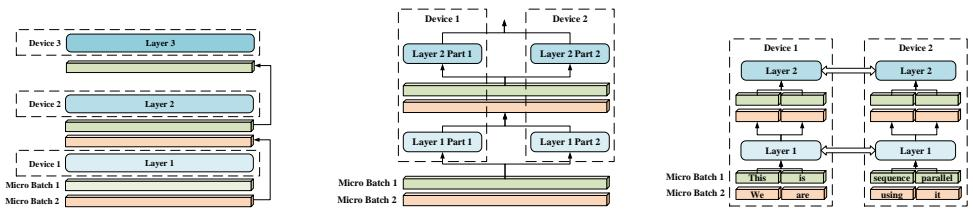
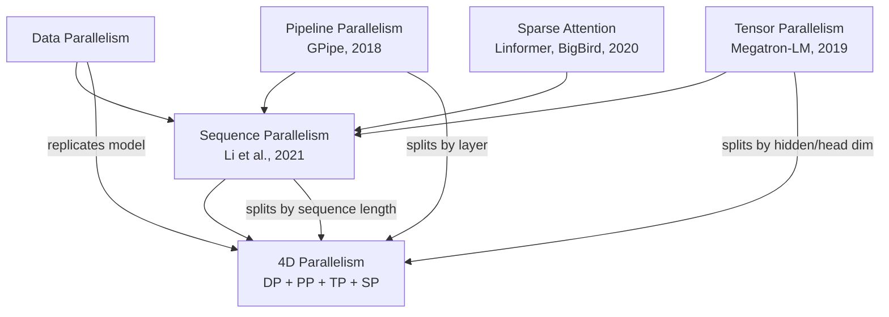
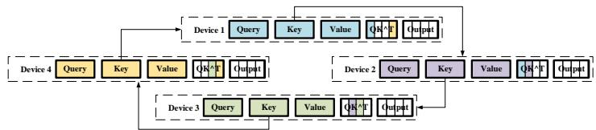
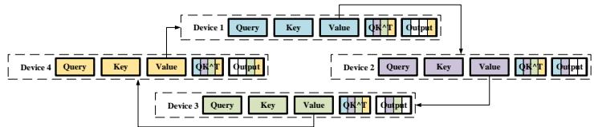
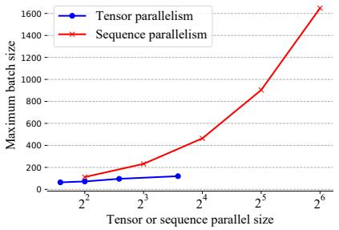
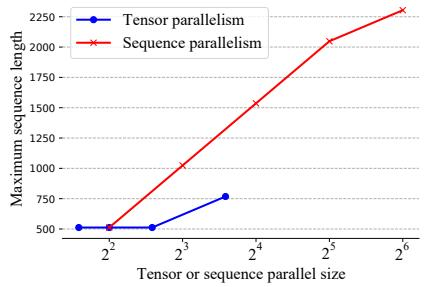
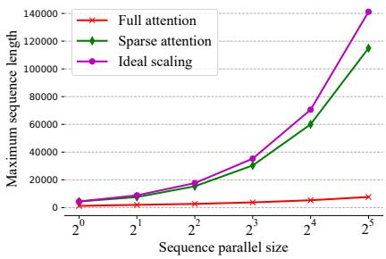

# Sequence Parallelism: Long Sequence Training from System Perspective

**Paper:** Sequence Parallelism: Long Sequence Training from System Perspective
**Authors:** Shenggui Li, Fuzhao Xue, Chaitanya Baranwal, Yongbin Li, Yang You (National University of Singapore)
**arXiv:** [2105.13120](https://arxiv.org/abs/2105.13120) (May 2021)
**Venue:** ACL 2023

**Related pages:** [Megatron-LM](../megatron-lm/index.md), [GPipe](../gpipe/index.md), [Transformer](../../../algorithms/foundations/transformer.md)

## TL;DR

**What:** Sequence parallelism splits the input sequence along the length dimension across GPUs so no single device holds the entire sequence — each GPU stores only its chunk and computes attention via ring-style P2P communication.

**How:** Ring Self-Attention (RSA) circulates key and value embeddings around a ring of GPUs in two passes: first for $QK^T$ scores, second for the weighted $AV$ output. Each GPU accumulates partial results without ever needing the full $L \times L$ attention matrix locally.

**The number:** On 64 P100 GPUs, sequence parallelism achieves **13.7× larger batch size** and **3.0× longer sequence length** than tensor parallelism; with sparse attention it handles **114K+ tokens** — 27× longer than single-device approaches.

## The Big Picture

*Pipeline parallelism (a) splits by layer, tensor parallelism (b) splits weight matrices by column/row, and sequence parallelism (c) splits the input sequence into chunks. All devices in (c) hold identical model parameters but different sub-sequences.*

Sequence parallelism fills a gap in the parallelism taxonomy. Pipeline parallelism splits the model vertically (by layers); tensor parallelism splits model weights horizontally (by hidden/head dimensions); sequence parallelism splits the **data** along a new axis — sequence length. This makes it orthogonal to the other three paradigms, enabling true **4D parallelism**: data + pipeline + tensor + sequence.

## Why This Exists

Consider training a vision Transformer on a 3D medical scan of size $512 \times 512 \times 512$. Flattened into patches, this produces over 500× more tokens than a typical $256 \times 256 \times 3$ image. A single GPU at batch size 1 would need to store:

- The $L \times L$ attention matrix: $512^3 \times 512^3$ entries — completely infeasible
- Even for $L = 2048$, the attention matrix alone is ~32 MB per head in FP16. With 12 heads, that's ~384 MB — and the MLP activations, optimizer states, and gradients push it past a 16 GB P100.

Existing parallelism (tensor, pipeline) was designed for **model size**, not **sequence length**. Tensor parallelism splits attention heads — but the number of heads (e.g., 12) is far smaller than the sequence length (e.g., 2048+). Pipeline parallelism splits layers — but each device still holds the full activation tensor for its stage. Neither helps when the sequence itself is too long for one GPU.

## The Landscape

Sequence parallelism is not a replacement but a **fourth dimension**. Tensor parallelism splits along attention heads ($Z$) and hidden size ($H$), both small hyperparameters that cap scalability (max 12-16 GPUs for BERT). Sequence parallelism splits along sequence length ($L$), which is typically much larger. Pipeline parallelism splits along depth; sequence parallelism is orthogonal, and the two compose naturally — since activations are already chunked by sequence, there's no need to [split/all-gather](../../../terms/all-gather.md) them between pipeline stages (unlike tensor parallelism, which pays this extra cost).

Sparse attention (Linformer, BigBird) reduces the algorithmic complexity of attention from $O(L^2)$ to $O(L)$. When combined with sequence parallelism, the memory per device scales as $O(L/N)$ instead of $O(L)$, meaning you can in theory train with **arbitrarily long sequences** by adding more GPUs.

## The Core Idea

Instead of storing the full $L \times L$ attention matrix on one GPU, split the sequence into $N$ chunks of length $L/N$ across $N$ GPUs. Each GPU holds its chunk's $Q$, $K$, $V$. To compute the full attention output for chunk $n$, that GPU needs dot products between its $Q^n$ and **everyone else's** $K$ and $V$. The insight: circulate $K$ and $V$ around a logical ring so each GPU sees them all, one neighbor at a time, without ever materializing the full matrix anywhere.

> **Row split, not column split.** $Q^n, K^n, V^n$ each have shape $(B, Z, \frac{L}{N}, A)$ — the sequence length $L$ is divided into $N$ equal chunks, while the head dimension $A$ and the number of heads $Z$ remain whole on every device. This is a row-wise partition of the $(L, d)$ embedding matrix: each GPU owns $\frac{L}{N}$ rows (tokens) with all $d$ feature columns. Contrast with tensor parallelism, which column-splits weight matrices — dividing heads or hidden dimensions — and with pipeline parallelism, which splits by layer depth.

## Symbol Map

| Symbol | Human name | Shape / scope | Plain meaning |
|---|---|---|---|
| $N$ | number of GPUs | scalar | Number of devices in the sequence-parallel group. |
| $L$ | sequence length | scalar | Total number of tokens in the input sequence. |
| $B$ | batch size | scalar | Number of sequences processed together. |
| $H$ | hidden size | scalar | Dimension of the Transformer's hidden states. |
| $Z$ | number of attention heads | scalar | How many parallel attention heads. |
| $A$ | attention head size | scalar | Dimension per head ($H = Z \cdot A$). |
| $Q^n, K^n, V^n$ | chunk embeddings | $(B, Z, L/N, A)$ | Query/key/value for the $n$-th sequence chunk on device $n$. |
| $S^n$ | partial attention scores | $(B, Z, L/N, L)$ | Full-row attention scores for chunk $n$, assembled incrementally. |
| $S_i^n$ | column-split scores | $(B, Z, L/N, L/N)$ | One block of $S^n$ corresponding to chunk $i$'s keys. |
| $O^n$ | chunk output | $(B, Z, L/N, A)$ | Final attention output for chunk $n$. |

## Deep Dive

### Ring Self-Attention (RSA)

RSA has two communication stages, each requiring $N-1$ ring hops:

**Stage 1: Score computation (circulate $K$).** Each device $n$ starts with its local $(Q^n, K^n)$. It computes the partial score $S_n^n = Q^n (K^n)^T$. Then it sends $K^n$ to device $(n+1) \bmod N$ and receives $K^{n-1}$ from device $(n-1) \bmod N$. It computes $S_{n-1}^n = Q^n (K^{n-1})^T$ and concatenates. This repeats $N-1$ times. At the end, each device has the full $S^n \in \mathbb{R}^{L/N \times L}$ for its chunk.

*① Each device starts with its local $K$ and computes $QK^T$ locally. ② $K$ is sent to the next device around the ring. ③ Each device computes $QK^T$ with the received $K$. ④ After $N-1$ hops, each device has the full attention score matrix for its chunk.*

**Stage 2: Output computation (circulate $V$).** Now each device has $S^n$ but needs to multiply it by all $V^1, \dots, V^N$. The same ring pattern circulates $V$ embeddings. Each device computes a partial $S_i^n V_i$ and accumulates:

$$O^n = \sum_{i=1}^{N} S_i^n V_i$$

*① Each device holds its full $S^n$ and its local $V$. ② $V$ circulates around the ring. ③ Each device computes the partial weighted sum $S_i^n V_i$ and accumulates. ④ After $N-1$ hops, each device has the final attention output $O^n$ for its chunk.*

After RSA, each device has $O^n$ — the attention output for only its chunk. The MLP blocks that follow operate trivially on each chunk independently, with **no communication needed** (unlike tensor parallelism, which requires [all-reduce](../../../terms/all-reduce.md) in both MLP layers).

### Memory Analysis: When Sequence Parallelism Wins

The memory advantage depends on the relationship between batch size, sequence length, and hidden dimensions:

- **MLP block:** Sequence parallelism wins when $BL > 32H$. For BERT Base ($H=768$), this means any $(B,L)$ pair where $B \cdot L > 24{,}576$ — almost always true.
- **Attention block:** Sequence parallelism wins when $BL > 16AZ$. For BERT Base ($A=64, Z=12$), this is $BL > 12{,}288$ — also almost always true.

The intuition: tensor parallelism splits **weight matrices** (saving parameter and optimizer memory), while sequence parallelism splits **activations** (saving the memory that scales with $B$ and $L$). For long sequences, activation memory dominates, making sequence parallelism the right choice.

### Communication Cost

Surprisingly, sequence parallelism has the **same total communication volume** as tensor parallelism: both transfer $8(N-1) \cdot B \cdot Z \cdot (L/N) \cdot A$ bytes per Transformer layer (forward + backward). However:

- Tensor parallelism needs all-reduce in **both MLP and attention** blocks
- Sequence parallelism needs ring P2P **only in attention** — MLP has zero communication
- When combined with pipeline parallelism, tensor parallelism must split-then-all-gather activations between pipeline stages; sequence parallelism skips this because activations are already chunked

This gives sequence parallelism a throughput advantage when composed with pipeline parallelism (see Figure 4b in the paper).

### Empirical Results

**Maximum batch size (BERT Base, 64 GPUs):** 13.7× larger than tensor parallelism. Tensor parallelism is capped at 12 GPUs (limited by attention heads); sequence parallelism scales to 64 GPUs because $L$ is much larger than $Z$.

*Sequence parallelism (orange) continues scaling past tensor parallelism's head-count limit (12 GPUs), reaching 13.7× larger batch size at 64 GPUs.*

**Maximum sequence length (BERT Base, 64 GPUs):** 3.0× longer than tensor parallelism. Even at the same GPU count (16 GPUs), sequence parallelism handles 1.4× longer sequences.

*Sequence parallelism handles longer sequences than tensor parallelism across all GPU counts. The gap widens with more GPUs — sequence parallelism is not bottlenecked by small hyperparameters like attention head count.*

**With sparse attention (Linformer, 32 GPUs):** Handles sequences of **114K tokens** — 27× longer than single-device sparse attention approaches. The memory for sparse attention with sequence parallelism scales as $O(L/N)$, enabling theoretically infinite-length training.

*With sparse attention, sequence parallelism achieves near-ideal scaling — linear growth in maximum sequence length with GPU count, breaking past 100K tokens at 32 GPUs.*

### Weak Scaling

In weak scaling experiments (batch size proportional to GPU count), sequence parallelism maintains nearly **constant memory per GPU** as the global batch size grows — tensor parallelism memory grows and eventually OOMs. For sequence-length weak scaling (longer sequences on more GPUs), memory per GPU grows sub-linearly with sequence length.

### Convergence

The authors verified that sequence parallelism produces equivalent training dynamics to tensor parallelism on BERT Large, with similar MLM and SOP loss curves over 50K iterations. This is expected — sequence parallelism is a **system-level** optimization that computes exactly the same forward pass as a single-GPU model (just distributed), so there should be no accuracy difference beyond floating-point non-determinism.

## Integration with 4D Parallelism

Sequence parallelism composes with the three existing dimensions:

| Dimension | What it splits | Bottleneck |
|---|---|---|
| Data parallelism | Batch | Communication bandwidth |
| Pipeline parallelism | Layers | Pipeline bubble |
| Tensor parallelism | Hidden/head dims | Small $Z, H$ cap scalability |
| **Sequence parallelism** | **Sequence length** | Ring communication overhead |

Since sequence parallelism splits along $L$ (typically the largest dimension), it has the **highest scalability ceiling**. The paper envisions combining all four into 4D parallelism for training extremely large models on very long sequences — a vision later realized by systems like [Megatron-LM](../megatron-lm/index.md) (which adopted sequence parallelism in later versions).

## Limitations

- **Ring communication overhead:** RSA requires $2(N-1)$ P2P messages per forward pass, which can become a bottleneck at very large $N$ or when inter-node bandwidth is limited.
- **Only for bidirectional attention:** The paper focuses on bidirectional (BERT-style) self-attention. Causal (GPT-style) attention requires adaptation — the ring pattern still works but can be optimized since each token only attends to previous tokens.
- **Evaluated on BERT only:** All experiments use encoder-only models. Scaling behavior on decoder-only or encoder-decoder architectures is not characterized.
- **P100-era benchmarks:** Experiments ran on 16 GB P100 GPUs. Modern GPUs (80 GB A100/H100) would shift the memory crossover points, potentially favoring tensor parallelism at moderate sequence lengths.
- **No 4D integration results:** The paper proposes 4D parallelism but only evaluates SP + PP and SP standalone. Full DP+PP+TP+SP integration is left as future work.

## References

- Shoeybi et al., "Megatron-LM: Training Multi-Billion Parameter Language Models Using Model Parallelism," arXiv:1909.08053, 2019. — Tensor parallelism baseline.
- Huang et al., "GPipe: Efficient Training of Giant Neural Networks Using Pipeline Parallelism," NeurIPS 2019. — Pipeline parallelism framework.
- Wang et al., "Linformer: Self-Attention with Linear Complexity," arXiv:2006.04768, 2020. — Sparse attention used in the 114K-token experiment.
- Zaheer et al., "Big Bird: Transformers for Longer Sequences," NeurIPS 2020. — Alternative sparse attention baseline.
- Narayanan et al., "Efficient Large-Scale Language Model Training on GPU Clusters," arXiv:2104.04473, 2021. — Megatron-LM v2 with PTD-P parallelism.
