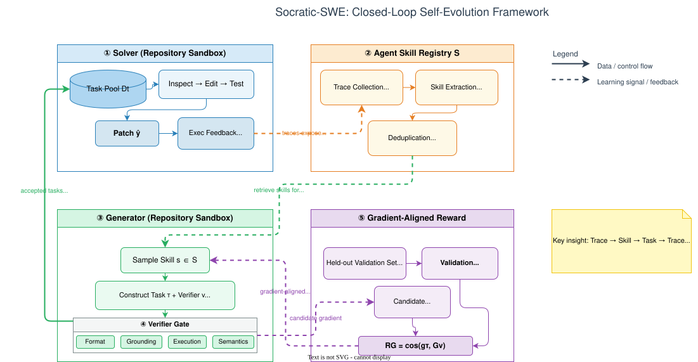
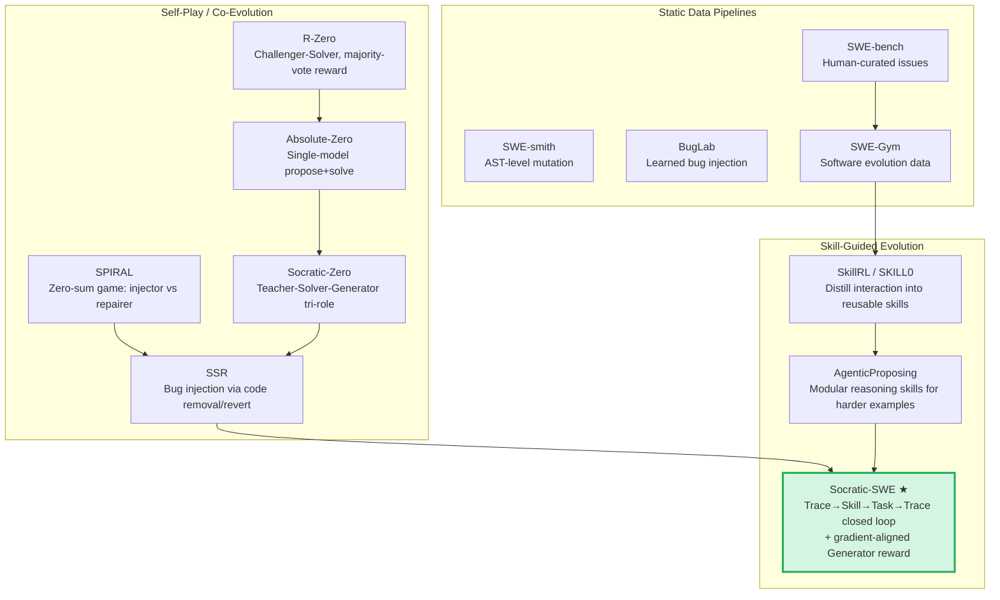

# Socratic-SWE: Self-Evolving Coding Agents via Trace-Derived Skills

**Paper:** Socratic-SWE: Self-Evolving Coding Agents via Trace-Derived Agent Skills  
**Authors:** Chuan Xiao, Zhengbo Jiao, Shaobo Wang, Wei Wang, Bing Zhao, HU WEI, Linfeng Zhang, Lin Qu  
**arXiv:** 2606.07412v1 — June 8, 2026

**Related pages:** [Intrinsic Dimensionality Fine-Tuning](../intrinsic-dimensionality-fine-tuning/index.md)

## TL;DR

**What:** A closed-loop self-play framework where a single SWE agent alternates between generating repair tasks and solving them, with the curriculum adapting to the agent's own weaknesses across iterations.

**How:** Historical solving traces are distilled into an Agent Skill Registry — structured documents that capture recurring failures and repair patterns. These skills guide a Generator to create targeted tasks; tasks are filtered through a four-stage verifier gate and scored by gradient alignment with a held-out validation set.

**The number:** 50.40% on SWE-bench Verified after 3 iterations (12k validated instances each), outperforming five self-evolving baselines (SPIRAL, R-Zero, Absolute-Zero, Socratic-Zero, SSR) under identical compute budgets.

## The Big Picture

*① The Solver consumes tasks from the curriculum pool, interacts with real repository sandboxes, and produces patches evaluated by executable verifiers. ② Successful and failed traces are distilled into the Agent Skill Registry — structured skills capturing recurring failures, repair patterns, and verifier designs. ③ The Generator samples skills from the registry and constructs targeted repair tasks conditioned on the Solver's current evidence (weaknesses). ④ A four-stage Verifier Gate (format → grounding → execution → semantics) filters candidate tasks so only executable, reproducible, and solvable ones enter the curriculum. ⑤ Accepted tasks receive a gradient-aligned Generator reward: cosine similarity between the candidate task's policy gradient and the aggregated validation gradient, favoring tasks whose learning direction aligns with improving on trusted held-out tasks.*

## Why This Exists

Imagine you are training a coding agent that can fix bugs in real repositories. You have a handful of high-quality SWE tasks (like SWE-bench issues), but not nearly enough to drive reinforcement learning at scale. Existing approaches try to fix this by synthetically generating more tasks — a mutation engine randomly injects bugs, or an LLM rewrites existing issues. But these synthetic pipelines are **open-loop**: they produce tasks independently of what the agent actually struggles with. You end up with a curriculum full of tasks the agent either trivially solves or fails at for irrelevant reasons (obscure domain knowledge, broken environments), neither of which improves real-world capability.

**Concrete failure example:** Suppose your Solver agent consistently fails on multi-file refactors that require coordinating edits across three modules. A static mutation pipeline keeps generating single-function bug injections because that's what its AST rules produce. The agent trains on these, gets good at single-function fixes, but still fails the multi-file case. After three rounds of training, the Solver has wasted compute on tasks that don't address its actual capability gap.

Socratic-SWE closes this loop: the agent's own failure traces become the signal for what to generate next. If the Solver struggles with multi-file refactors, the Skill Registry captures that pattern, and the Generator produces tasks targeting exactly that weakness.

## The Landscape

The evolutionary path shows three generations:

1. **Static pipelines** produce tasks once, independently of training. They scale well but produce irrelevant or trivial tasks.
2. **Self-play methods** introduce co-evolution between task proposers and solvers, but reward design is coarse (binary pass/fail, majority vote) and doesn't capture whether a task is *useful* for learning.
3. **Skill-guided evolution** (Socratic-SWE's contribution) adds structured skill extraction from traces and gradient-aligned task quality scoring, making the curriculum both adaptive and quality-aware.

## The Core Idea

Socratic-SWE treats the agent's own solving traces — both successes and failures — as the primary source of training signal. Rather than just using traces for binary reward (pass/fail), the framework distills them into a structured **Agent Skill Registry**: programmable documents that capture *what went wrong*, *what repair strategy worked*, and *how to design a verifier*. These skills then guide a Generator to produce targeted tasks in real repositories. The quality of each generated task is measured not just by executability, but by **gradient alignment**: would training on this task move the Solver's parameters in a direction that also improves performance on trusted held-out validation tasks? This closes the loop from trace → skill → task → trace.

## Deep Dive

### Agent Skill Registry

**What it does:** Distills raw interaction traces from the Solver into a structured, retrievable set of reusable skills that the Generator can condition on.

**Why it matters:** Without structured skills, the Generator must generate tasks from scratch using only free-form text prompts, making it hard to target specific Solver weaknesses consistently.

**How it works:** A three-stage pipeline:

1. **Trace Collection:** Deploy the current Solver checkpoint on seed tasks. Collect both successful traces $T^+$ (showing effective strategies) and failed traces $T^-$ (exposing capability gaps).
2. **Skill Extraction:** A distillation model $M_{\text{distill}}$ (Qwen3.6-27B) processes the trace corpus and extracts recurring behavioral patterns. Success traces yield generalizable repair strategies; failure traces yield corrective principles.
3. **Registry Construction:** Candidate skills are deduplicated by semantic similarity and filtered by trace coverage: $S = \text{Dedup}(\hat{S}, \delta_{\text{sim}}) = \{s_1, \ldots, s_M\}$.

Each skill has four fields: **name**, **natural-language description**, **applicability conditions**, and an **ordered list of operations** — enabling programmatic retrieval rather than free-form prompting.

**The intuition:** Instead of saying "generate a hard task," skills tell the Generator: "the Solver fails on multi-file refactors where function signatures change — here's a template for constructing such tasks."

**A concrete example:** From the failure scenario above, the Skill Registry might capture a skill called `multi-file-signature-refactor`: conditions = "task involves >2 files with interdependent API changes," operations = [identify call sites across modules, update imports, verify all callers compile]. The Generator uses this to construct a task specifically exercising multi-file coordination.

**Remember:** Skills are distilled from the agent's own behavior, not hand-designed — they evolve with the agent's capability.

---

### Skill-Guided Task Generator

**What it does:** Constructs executable SWE repair tasks in real repositories, conditioned on skills from the registry and current Solver evidence.

**Why it matters:** This is where the "skill" becomes a "task" — turning abstract behavioral patterns into concrete, executable training instances.

**How it works:** Given a repository $r$ and a skill $s$, the Generator samples:
$$(\tau, v) \sim \pi_\theta(\cdot \mid r, s, E_t, \text{role}=G)$$

where $\tau$ is the repair objective, $v$ is the executable verifier, and $E_t$ is Solver-side evidence collected from the current curriculum $D_t$.

**The intuition:** The Generator doesn't just inject random bugs — it constructs tasks that specifically exercise the behavioral pattern described by the skill, in a real repository where the verifier is guaranteed to be executable.

**Remember:** Generator output is a $(task, verifier)$ pair — both are needed for training.

---

### Four-Stage Verifier Gate

**What it does:** Filters generated tasks before they enter the curriculum, ensuring only executable, reproducible, and solvable tasks survive.

**Why it matters:** Without filtering, the curriculum fills with broken environments, unsolvable tasks, or tasks where the verifier doesn't meaningfully separate correct from incorrect patches.

**How it works:** Four sequential checks in the repository sandbox $r$:

| Stage | Name | What it checks | Failure means |
|-------|------|---------------|---------------|
| 1 | **Format** ($f_1$) | $\tau$ and $v$ are well-formed, parseable, syntactically valid | Task can't even be loaded |
| 2 | **Grounding** ($f_2$) | $\tau$ references artifacts that actually exist in $r$ | Task points to non-existent files/functions |
| 3 | **Execution** ($f_3$) | $v$ runs without infrastructure errors, stable across repeated runs | Verifier is flaky or broken |
| 4 | **Semantics** ($f_4$) | $v$ separates failing from repaired states; at least one valid repair exists | Task is either always-passing or impossible |

Each stage is evaluated only if all preceding stages pass (short-circuit evaluation). The overall validation function is:

$$V_{\text{alid}}(\tau, v, r) = \prod_{l=1}^{4} f_l(\tau, v, r) \in \{0, 1\}$$

**The intuition:** Think of this as a CI pipeline for training data — format/lint, then dependency check, then integration test, then semantic correctness. Only green builds enter the curriculum.

**A concrete example:** A Generator produces a task claiming to fix a `calculate_tax` function in `billing.py`. The gate checks: (1) is the task JSON well-formed? (2) does `billing.py` and `calculate_tax` actually exist? (3) does the test suite run without crashing? (4) does the test actually fail before the fix and pass after?

**Remember:** Validation is about executability, not usefulness — that's the reward's job.

---

### Gradient-Aligned Generator Reward

**What it does:** Scores generated tasks by how well training on them would align the Solver's parameter updates with improving on trusted held-out validation tasks.

**Why it matters:** Validation (the gate) ensures a task is *runnable*. This reward ensures it's *useful*. A task that's trivially easy or impossibly hard may pass validation but provides zero learning signal.

**How it works:**

1. Maintain a held-out validation set $V_{\text{val}}$ of trusted SWE tasks.
2. For each validation task, roll out $K$ Solver trajectories and compute the per-task policy gradient $g^v_j$ using GRPO. Average across all validation tasks to get the target gradient direction $G_v = \frac{1}{|V_{\text{val}}|} \sum_j g^v_j$.
3. For each candidate Generator task, similarly compute its Solver policy gradient $g_\tau$ from $K$ rollouts.
4. The Generator reward is:

$$R_G(\tau, v, r) = V_{\text{alid}}(\tau, v, r) \cdot \cos(g_\tau, G_v)$$

The validation factor zeros out invalid tasks, and the cosine term measures directional alignment.

**Why cosine (not inner product):** A first-order Taylor expansion shows the validation improvement from one gradient step on a candidate task is $\Delta J_{\text{val}} \approx \eta \|g_\tau\| \|G_v\| \cos(g_\tau, G_v)$. Cosine normalizes out $\|g_\tau\|$, which can be confounded by task length and patch complexity — a long task with a large gradient magnitude isn't necessarily more useful than a short one.

**The intuition:** Imagine you have a set of trusted benchmark tasks you care about. Before adding a generated task to training, ask: "If I train the Solver on this task, will the parameter update also push performance up on my trusted tasks?" The cosine similarity answers this by measuring whether the gradient directions point the same way.

**A concrete example:** The Generator produces two candidate tasks. Task A (multi-file refactor) has $g_\tau$ strongly aligned with $G_v$ ($\cos \approx 0.85$). Task B (obscure numerical edge case) has $g_\tau$ nearly orthogonal to $G_v$ ($\cos \approx 0.05$). Both pass validation, but only Task A gets a high reward and contributes meaningfully to the curriculum.

**Ablation result (Table 3):**

| Generator Reward | SWE-bench Verified (%) | $\Delta$ |
|---|---|---|
| Hardness ($1 - p$) | 47.40 | ↓3.00 |
| Uncertainty ($1 - 2\|p - 0.5\|$) | 48.20 | ↓2.20 |
| Variance (Gaussian) | 48.80 | ↓1.60 |
| **Gradient-aligned (Ours)** | **50.40** | – |
| Gradient + Difficulty hybrid | 50.60 | ↑0.20 |

**Remember:** Gradient alignment decouples task difficulty from task usefulness — a moderate-difficulty task teaching transferable patterns beats a near-impossible one every time.

---

### Repository Repair Solver

**What it does:** The Solver consumes accepted tasks from the curriculum, interacts with real repository sandboxes, and produces patches evaluated by executable verifiers.

**Why it matters:** The Solver is both the consumer of the curriculum and the producer of traces that feed back into skill extraction — it drives the self-evolution loop.

**How it works:** Given a task $(\tau, v)$ and repository $r$, the Solver samples a trajectory $y \sim \pi_\theta(\cdot \mid \tau, r, v, \text{role}=S)$ that may include inspection, code localization, file edits, and validation attempts.

The Solver reward has three components ($\lambda_1, \lambda_2, \lambda_3$ are weighting coefficients):

$$r_S = \lambda_1 \mathbf{1}[F^\checkmark = F \land P^\checkmark = P] + \lambda_2 \frac{|F^\checkmark|}{|F|} + \lambda_3 \frac{|P^\checkmark|}{|P|}$$

| Term | Meaning | Penalizes |
|------|---------|-----------|
| Full-suite pass | All originally failing tests pass AND all originally passing tests still pass | – |
| Partial repair rate | Fraction of originally failing tests now passing | Incomplete fixes |
| Regression avoidance | Fraction of originally passing tests still passing | Breaking existing functionality |

These three heterogeneous components are normalized via GDPO (Group-wise Dimension-wise Preference Optimization), which normalizes each component within its own group before aggregation — preventing any single component from dominating the gradient.

**The intuition:** A perfect fix gets full credit. A patch that fixes 3/5 failing tests but introduces no regressions gets partial credit. A patch that fixes everything but breaks 2 existing tests gets penalized for regressions.

**Remember:** The Solver never sees the reference solution or verifier internals — it learns purely from executable feedback.

---

### Role-Specific Training

**What it does:** Jointly optimizes both Generator and Solver roles with shared weights, using role-specific advantage estimation.

**Why it matters:** Sharing weights allows skill knowledge from the Generator and repair capability from the Solver to cross-pollinate within a single model.

**How it works:** The joint objective is:

$$J(\theta) = \mathbb{E}_{r,s}\big[\mathbb{E}_{(\tau,v) \sim \pi_G}[R_G(\tau,v,r)]\big] + \mathbb{E}_{\tau,r,v}\big[\mathbb{E}_{y \sim \pi_S}[r_S(y,\tau,v,r)]\big]$$

The Generator uses GRPO with the scalar gradient-aligned reward $R_G$. The Solver uses GDPO — normalizing each of the three reward components (pass, repair, regression) independently within its group before aggregation:

$$\hat{A}^{(m)}_i = \frac{r_S^{(m,i)} - \text{mean}(\{r_S^{(m,j)}\}_{j=1}^K)}{\text{std}(\{r_S^{(m,j)}\}_{j=1}^K) + \delta}, \quad m \in \{1,2,3\}$$

$$\hat{A}^S_i = \text{BatchNorm}\!\left(\sum_{m=1}^{3} \hat{A}^{(m)}_i\right)$$

Both roles use the same clipped surrogate objective with KL regularization toward a reference policy.

**The intuition:** The Generator learns which tasks are worth creating (gradient-aligned), and the Solver learns how to fix them (multi-component reward). Sharing weights means the model develops an internal understanding of both what makes a good training task and how to solve one.

**Remember:** The roles are distinguished by a `role` token in the input, not by separate models — a single Qwen3.5-9B handles both.

---

## Results Summary

All self-evolving methods used identical Solver architecture (Qwen3.5-9B), agent harness (mini-swe-agent), and training budget (12k instances × 3 iterations = 36k total).

| Method | SWE-bench Verified | SWE-bench Lite | SWE-bench Pro | TB2 | Overall |
|---|---|---|---|---|---|
| Base Agent | 44.40 | 46.00 | 41.60 | 29.20 | 40.30 |
| SPIRAL | 46.80 | 49.33 | 45.60 | 32.00 | 43.43 |
| R-Zero | 47.00 | 49.67 | 44.40 | 31.60 | 43.17 |
| Absolute-Zero | 46.60 | 49.00 | 44.00 | 32.80 | 43.10 |
| Socratic-Zero | 48.60 | 51.00 | 46.40 | 34.40 | 45.10 |
| SSR | 47.80 | 50.33 | 45.20 | 33.60 | 44.23 |
| **Socratic-SWE** | **50.40** | **52.33** | **47.20** | **35.60** | **46.38** |

Key takeaways:

- Socratic-SWE beats all baselines across all four benchmarks.
- The improvement over the strongest baseline (Socratic-Zero) is +1.8pp on Verified, +1.33pp on Lite, +0.8pp on Pro, and +1.2pp on TB2.
- The skill-guided approach particularly helps on Terminal-Bench 2.0 (+6.4pp over Base), suggesting that skill-derived task designs transfer well to terminal-native environments.

## Self-Test

- [ ] Can I explain why trace-derived skills beat static mutation pipelines?
- [ ] Can I describe each of the four verifier gate stages and what they prevent?
- [ ] Can I articulate why cosine similarity (not inner product) is the right Generator reward?
- [ ] Can I explain how GDPO normalizes the Solver's three-component reward?
- [ ] Can I name the five self-evolving baselines and Socratic-SWE's advantage over each?
